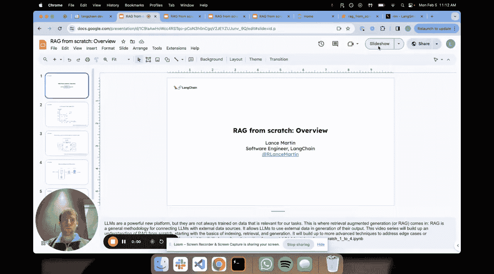
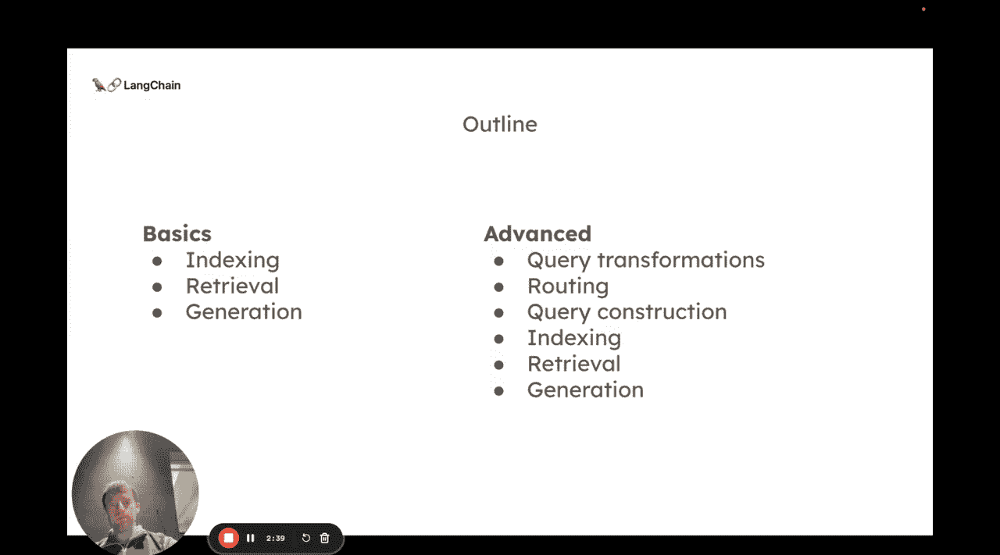
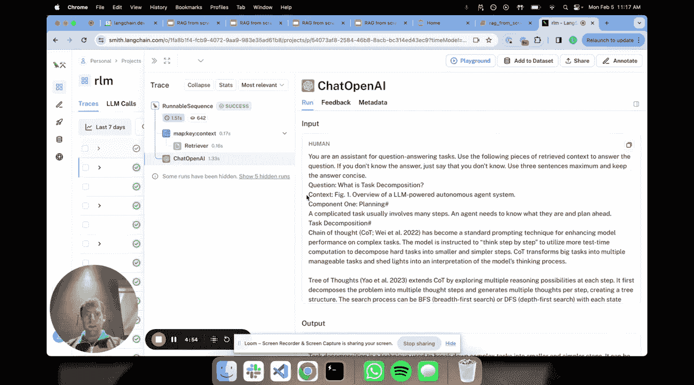
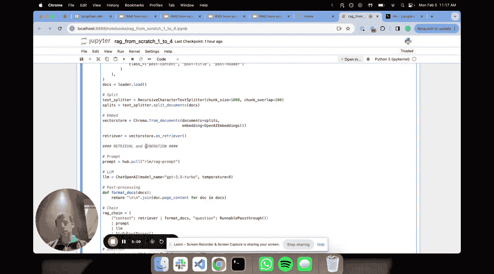

# 001：RAG系统概述 🚀

在本节课中，我们将从零开始学习检索增强生成（RAG）系统的基本原理。我们将了解RAG为何重要，其核心的三个阶段，并通过一个简单的代码示例来直观感受其工作流程。

## 为什么需要RAG？

大型语言模型（LLM）并未包含所有你可能关心的数据。例如，私有数据或非常新的数据通常不会包含在这些模型的预训练数据集中。从图表上看，X轴代表模型预训练所用的令牌数量，虽然这个数字非常庞大，但相对于你关心的私有数据或近期数据，它始终是有限的。

另一个重要的考虑因素是，LLM的上下文窗口正在变得越来越大，从数千个令牌发展到数万个令牌，这相当于可以容纳数十页到数百页的信息。这使得我们可以将来自外部源的信息输入到模型中。

我们可以将LLM视为一种新型操作系统的内核。将它们连接到外部数据，是构建这种新兴操作系统的核心能力。

## RAG的核心范式

检索增强生成（RAG）是实现这一目标的流行通用范式，通常涉及三个阶段。

以下是RAG的三个基本阶段：

1.  **索引**：处理外部文档，使其能够根据输入查询被轻松检索。例如，我们提出一个问题，然后检索与该问题相关的文档。
2.  **检索**：基于用户查询，从索引中找出最相关的文档片段。
3.  **生成**：将检索到的文档输入给LLM，生成一个基于这些检索文档的答案。

我们正在从零开始构建。但我们的目标是从这三个基本组件（索引、检索、生成）出发，逐步扩展到更广阔的RAG视野。从这三个核心组件可以衍生出许多有趣的方法和技巧，未来的视频将详细讲解这些内容。我们会尽量将每个视频控制在五分钟左右，但会在一些更高级的主题上花费较多时间。

首先，在接下来的三个视频中，我将分别阐述索引、检索和生成背后的基本概念，然后在此基础上，深入探讨更高级的主题。

## 代码快速演示

现在，我想通过一个快速的代码演示来让这些概念更具体，因为这些视频也需要一些互动性。

这里有一个公开的代码仓库。我打开了一个笔记本，基本上安装了几个必要的包，并为我的LangSmith密钥设置了一些环境变量。我个人非常推荐使用LangSmith，它在追踪和可观测性方面非常有用，尤其是在构建RAG管道时。

接下来我将展示我们的RAG快速入门代码。我将运行这段代码，并逐步解释其中发生的每一件事。

回顾我们的示意图，这里所做的就是：
1.  加载文档（本例中是一篇博客文章）。
2.  分割文档（我们将在未来的短视频中讨论为什么分割很重要。目前只需知道，我们设定了1000个字符的块大小，将文档分割成多个片段）。
3.  每个分割后的片段都被**嵌入**并**索引**到这个向量存储中（这里使用OpenAI的嵌入模型和本地的Chroma向量数据库）。
4.  定义检索器。
5.  定义用于RAG的提示模板。
6.  定义我们的LLM。
7.  进行一些简单的文档处理后，我们建立了一个链。

这个链基本上会：接收我们的输入问题 -> 运行检索器以找到相关文档 -> 将检索到的文档和我们的问题放入提示模板 -> 传递给LLM -> 将输出格式化为字符串。

运行后，我们可以看到输出结果。我们还可以打开LangSmith，查看这个流程是如何运行的：这是我们的问题，这是输出。我们可以查看检索器的工作情况以及检索到的文档。这非常直观。

最终，传递给LLM的提示模板是：“你是一个用于问答任务的助手。请使用以下检索到的内容来回答问题。” 后面跟着我们的问题和所有检索到的内容，这些内容最终形成了我们的答案。

## 总结

本节课我们一起学习了RAG系统的基本概述。我们了解了RAG的必要性，其核心的索引、检索、生成三阶段范式，并通过一个实际的代码演示直观地看到了RAG的工作流程。在未来的短视频中，我们将更详细地分解其中的每一个环节。