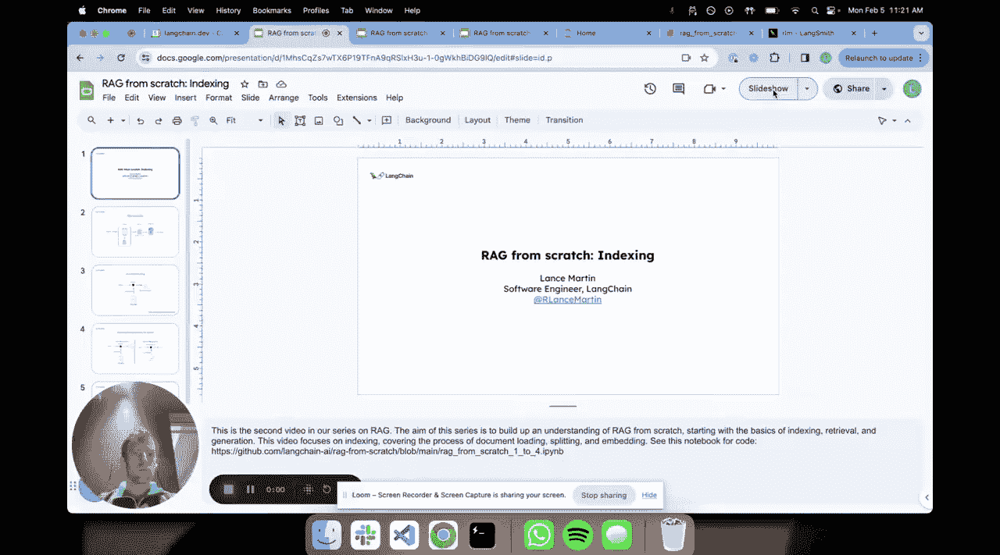
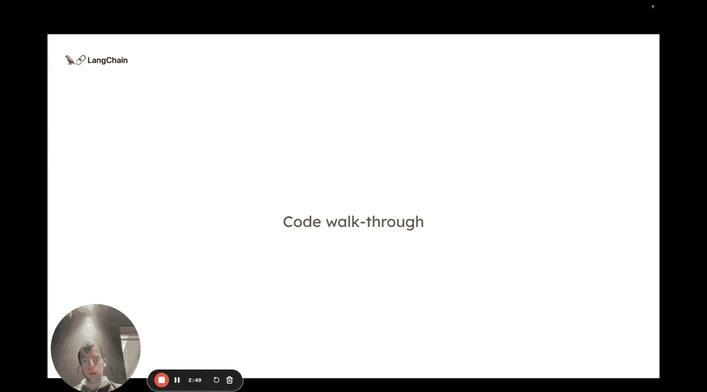
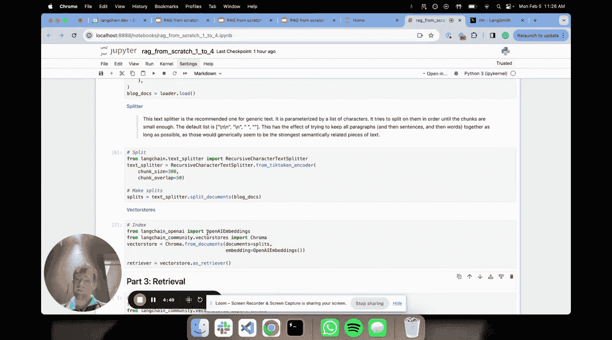

# 002：索引



## 概述
在本节课中，我们将深入学习RAG（检索增强生成）系统中的索引环节。我们将探讨如何将外部文档转换为便于检索的格式，特别是通过向量嵌入技术来实现。我们将通过代码示例，展示如何计算文本的令牌数量、生成嵌入向量，并最终构建一个向量索引。

## 从文档到向量
上一节我们介绍了RAG管道的整体组件。本节中，我们来看看索引环节的具体实现。索引的第一步是加载外部文档，并将其转换为检索器可以理解的形式。检索器的目标很简单：给定一个问题，它能找出与该问题相关的文档。

建立这种相关性或相似性的方法，通常是为文档创建某种数值表示。因为相比于原始文本，比较向量（例如数字）要容易得多。多年来，人们开发了许多方法将文本文档压缩成数值表示，以便于搜索。

以下是几种主要方法：
*   **稀疏向量**：谷歌等公司提出了许多有趣的统计方法。其核心是分析文档中单词的频率，构建所谓的稀疏向量。向量的维度对应一个庞大的词汇表，每个位置的值代表该单词在文档中出现的次数。之所以称为“稀疏”，是因为相对于词汇表，文档中实际出现的单词很少，向量中会有大量零值。针对这种数值表示，有非常高效的搜索方法。
*   **嵌入向量**：近年来，基于机器学习的嵌入方法得到了发展。这种方法将文档压缩成一个固定长度的向量表示。相应地，也发展出了针对嵌入向量的强大搜索方法。

## 嵌入向量的工作原理
其核心思想是：我们获取文档，并通常将其分割成块。这是因为嵌入模型有有限的上下文窗口（通常在512到8000个令牌或更多，但不是无限大）。每个文档块被压缩成一个向量，这个向量捕捉了该文档块的语义信息。然后，这些向量被索引起来。问题可以用完全相同的方式被嵌入成向量。最后，通过某种形式的数值比较（使用不同类型的方法），可以在这些向量中找出与我的问题相关的文档。

## 代码实践
让我们通过代码来具体看看这些步骤。以下是我的笔记本环境，我已经安装了必要的库并设置了LangSmith的API密钥（这对追踪非常有用，我们稍后会看到）。

首先，我将计算一个问题的令牌数量。这很有趣，因为嵌入模型和大多数模型都基于令牌进行操作，了解输入文档的大小很有帮助。在这个例子中，问题显然很短。

```python
# 计算问题的令牌数
question = "What is the capital of France?"
token_count = len(question.split()) # 简化示例，实际应使用分词器
print(f"Token count: {token_count}")
```



接下来，我将指定使用OpenAI的嵌入模型。我在这里指定一个嵌入模型，然后调用`embed_query`方法，传入我的问题或文档。运行后，你会看到它被映射为一个长度为1536的向量。这个固定长度的向量表示将对所有文档进行计算，它编码了你所传入文本的语义。

```python
from langchain.embeddings import OpenAIEmbeddings

# 指定嵌入模型
embeddings = OpenAIEmbeddings()
# 为问题生成嵌入向量
question_embedding = embeddings.embed_query("What is the capital of France?")
print(f"Embedding vector length: {len(question_embedding)}")
```

我可以使用余弦相似度等方法比较向量。接下来，我们可以加载一些文档，就像之前看到的那样，对它们进行分割，然后建立索引。

```python
from langchain.document_loaders import TextLoader
from langchain.text_splitter import CharacterTextSplitter
from langchain.vectorstores import Chroma

# 加载文档
loader = TextLoader("example.txt")
documents = loader.load()
# 分割文档
text_splitter = CharacterTextSplitter(chunk_size=1000, chunk_overlap=0)
docs = text_splitter.split_documents(documents)
# 创建向量存储（索引）
vectorstore = Chroma.from_documents(documents=docs, embedding=embeddings)
```

本质上，我们正在做的是：获取每个分割后的文档块，使用OpenAI嵌入模型将其转换为向量表示，然后将该向量与原始文档的链接一起存储在我们的向量存储中。下一节，我们将看到如何实际使用这个向量存储进行检索。



## 总结
本节课中，我们一起学习了RAG系统中索引环节的核心概念。我们了解了将文档转换为数值表示（特别是稀疏向量和嵌入向量）的重要性，并通过代码实践了如何计算令牌、生成嵌入向量以及构建向量索引。索引是为高效检索奠定基础的关键步骤。下一节，我们将深入探讨如何利用已构建的索引进行文档检索。