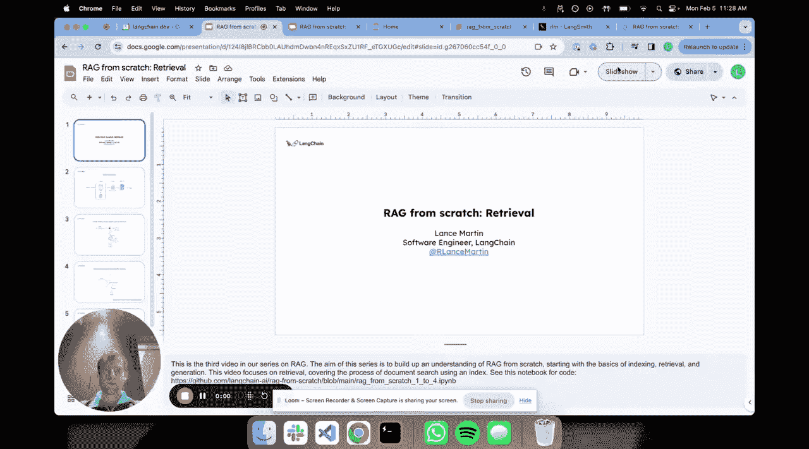
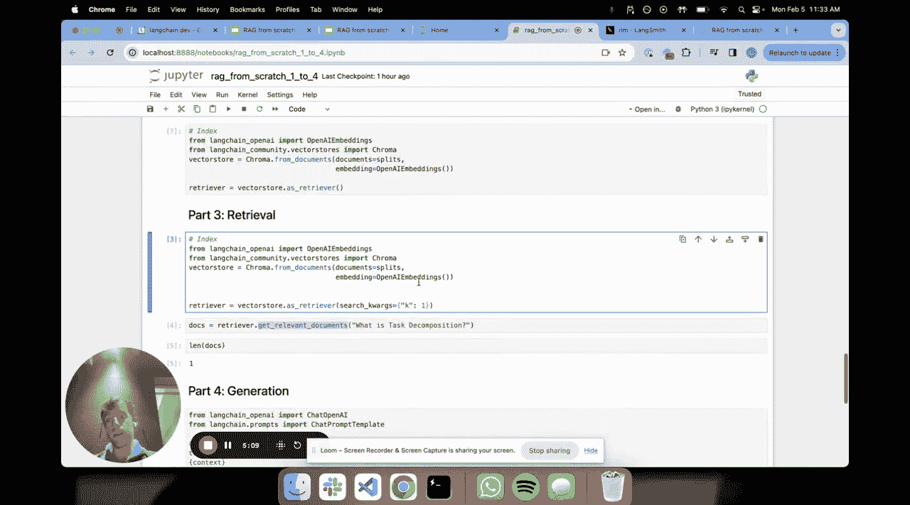

# 003：从零构建RAG系统 - 检索篇 🔍



在本节课中，我们将学习RAG（检索增强生成）系统中的核心环节——**检索**。我们将深入探讨如何将文档和问题转化为可搜索的向量，并通过相似性搜索找到最相关的信息片段。

---

在上一节中，我们介绍了**索引**过程，它将原始文档处理成易于检索的形式。本节中，我们来看看如何利用已建立的索引，根据用户的问题**检索**出最相关的文档片段。

索引过程的核心是**嵌入**。简单来说，嵌入是将文本（如文档或问题）转换为一系列数字（即向量）的过程。这些数字代表了文本的语义含义。

我们可以用一个简化的三维空间来理解：
*   每个文档经过嵌入后，成为这个空间中的一个点。
*   语义相似的文档，其对应的点在空间中的位置也相近。
*   当用户提出一个问题时，我们同样将其嵌入，投射到同一个空间中。
*   **检索**的本质，就是在这个高维空间中，寻找距离问题点最近的几个文档点。

以下是实现这一过程的核心步骤：

1.  **嵌入文档与问题**：使用相同的嵌入模型，将文档块和用户问题转换为向量。
    ```python
    # 伪代码示例：使用嵌入模型
    document_vectors = embed_model.encode(document_chunks)
    question_vector = embed_model.encode(user_question)
    ```
2.  **执行相似性搜索**：在向量空间中，计算问题向量与所有文档向量之间的距离（如余弦相似度），并返回距离最近的K个文档。
    ```python
    # 伪代码示例：K近邻搜索
    nearest_indices = find_k_nearest_neighbors(question_vector, document_vectors, k=3)
    retrieved_docs = [document_chunks[i] for i in nearest_indices]
    ```

---

现在，让我们通过代码来具体实现。我们继续使用之前的笔记本环境。

首先，我们重新加载文档并进行分割，这与索引环节的操作一致。


接下来，构建检索器时，一个关键参数是 **`k`**。它决定了在执行检索时，我们想要返回多少个最相似的文档片段（即K个最近邻）。例如，`k=1`表示只返回最相关的一个片段。

以下是构建检索器并执行查询的示例：
```python
# 假设已加载文档并分割为 `splits`
# 构建向量存储（索引）
vectorstore = Chroma.from_documents(documents=splits, embedding=embedding_model)

# 创建检索器，设置 k=1
retriever = vectorstore.as_retriever(search_kwargs={"k": 1})

# 提出一个问题
question = "什么是任务分解？"

# 执行检索
relevant_docs = retriever.get_relevant_documents(question)
print(f"检索到 {len(relevant_docs)} 个相关文档。")
print(relevant_docs[0].page_content[:200]) # 打印片段开头部分
```
运行后，我们将得到与问题最相关的一个文档片段。通过LangChain等工具集成的可视化界面（如LangSmith），我们可以清晰地看到提出的问题和被检索到的文档内容，验证其相关性。

这直观地展示了如何用几行代码轻松实现K近邻搜索，完成RAG的检索步骤。

---

本节课中，我们一起学习了RAG系统的**检索**环节。我们理解了通过嵌入技术将文本映射到向量空间的核心思想，并掌握了使用`k`参数控制返回结果数量的方法，最终通过代码实践完成了从问题到相关文档片段的检索过程。



下一节，我们将进入最后一个环节——**生成**，学习如何利用检索到的文档来生成最终的回答。