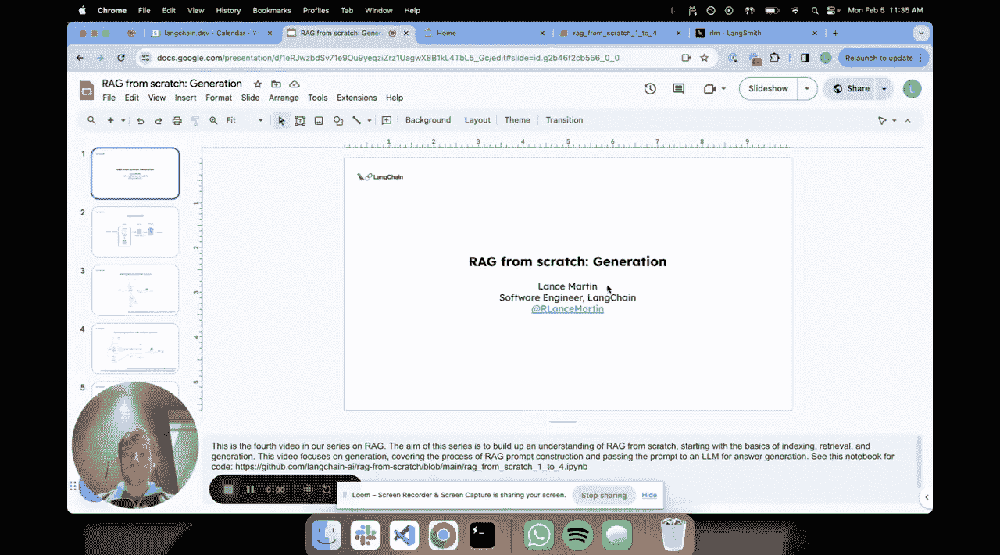
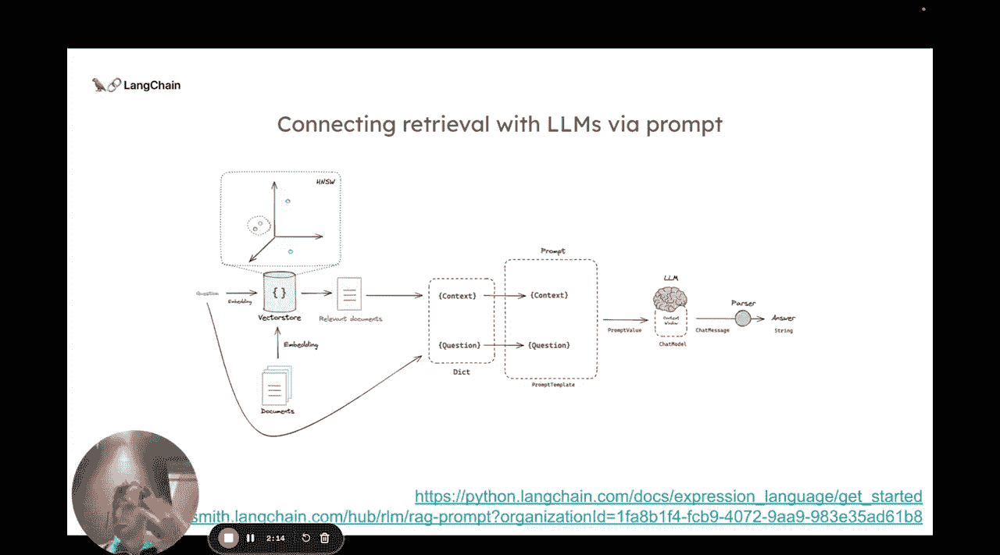
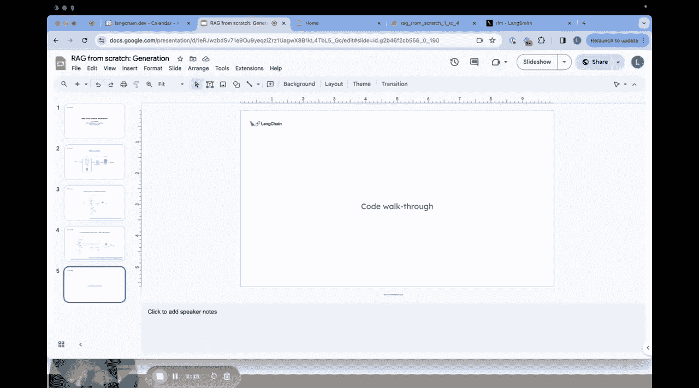
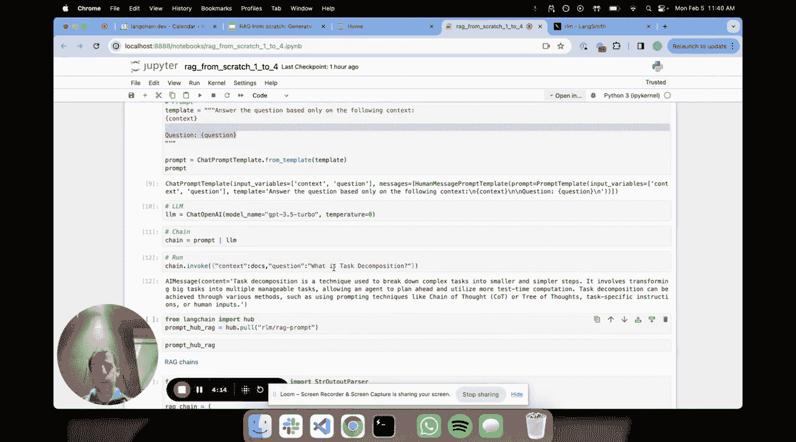
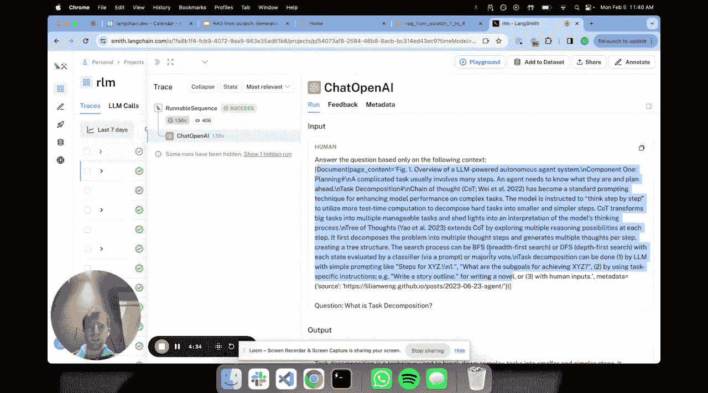
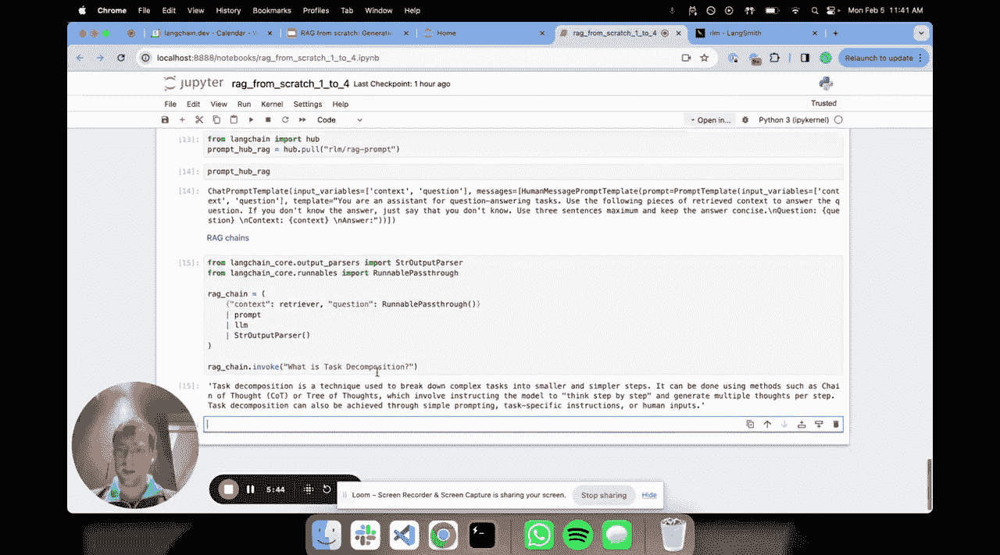
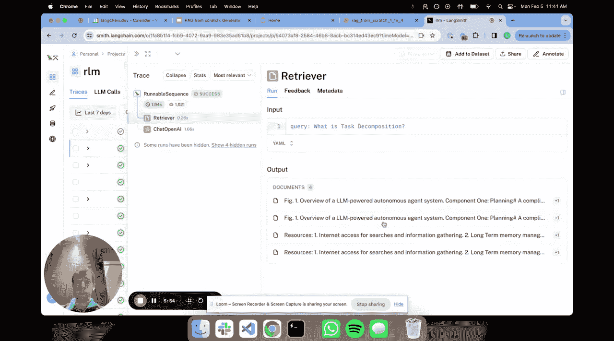
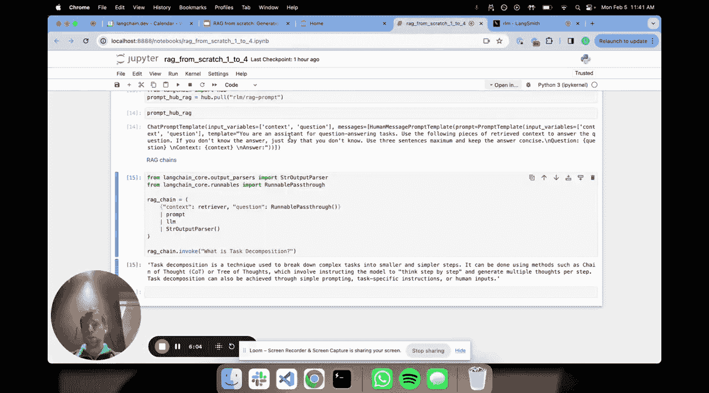
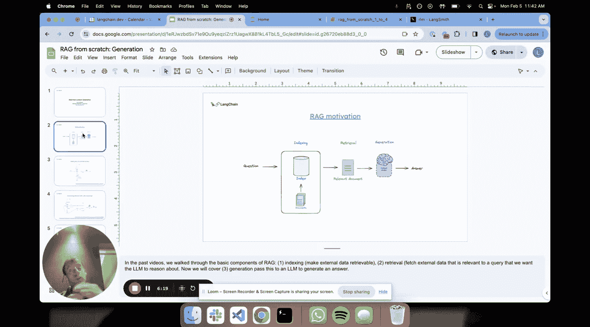

# 004：生成环节 🧠



在本节课中，我们将要学习 RAG（检索增强生成）流程中的最后一个关键环节：**生成**。我们将了解如何将检索到的文档与用户问题结合，通过大语言模型生成最终答案，并使用 LangChain 的组件来简化这一过程。

上一节我们介绍了如何从向量数据库中检索相关文档，本节中我们来看看如何利用这些文档来生成答案。

## 生成环节的核心流程

生成环节的核心在于将检索到的文档“填充”到大语言模型的上下文窗口中。回顾整个 RAG 流程：
1.  对文档进行分割和嵌入，存入向量数据库。
2.  将用户问题嵌入，并在向量空间中搜索相似的文档片段。
3.  将检索到的相关文档片段与原始问题一起，构建成一个完整的提示（Prompt），发送给大语言模型以生成答案。

这个过程引入了一个关键概念：**提示模板**。提示模板是一个包含占位符（如 `{context}` 和 `{question}`）的字符串。我们将检索到的文档和用户问题填入这些占位符，形成一个具体的提示，然后交给大语言模型处理。

以下是构建提示并生成答案的基本代码流程示意：
```python
# 1. 定义提示模板
template = “基于以下上下文回答问题：\n\n{context}\n\n问题：{question}”
prompt = PromptTemplate.from_template(template)

# 2. 连接提示模板与大语言模型，形成处理链
chain = prompt | llm

# 3. 传入数据并调用链
result = chain.invoke({“context”: retrieved_docs, “question”: user_question})
```

接下来，让我们通过代码快速实践，以获得更直观的理解。

## 动手实践：构建生成链

我们将延续之前章节的代码，首先构建一个检索器，然后专注于生成部分。

以下是构建检索器的步骤（快速回顾）：
```python
# 加载文档
from langchain.document_loaders import TextLoader
loader = TextLoader(“state_of_the_union.txt”)
documents = loader.load()



# 分割文档
from langchain.text_splitter import CharacterTextSplitter
text_splitter = CharacterTextSplitter(chunk_size=500, chunk_overlap=50)
docs = text_splitter.split_documents(documents)



# 嵌入并存储到向量索引
from langchain.embeddings import OpenAIEmbeddings
from langchain.vectorstores import Chroma
embeddings = OpenAIEmbeddings()
vectorstore = Chroma.from_documents(docs, embeddings)
retriever = vectorstore.as_retriever()
```

现在，我们进入生成环节。首先定义一个简单的提示模板：

```python
from langchain.prompts import PromptTemplate

# 定义提示模板
template = “””请根据提供的上下文信息回答问题。

上下文：
{context}

问题：{question}

答案：”””
prompt = PromptTemplate.from_template(template)
```

接着，选择一个大语言模型，并将提示模板和模型组合成一个处理链：

```python
from langchain.chat_models import ChatOpenAI

# 定义大语言模型
llm = ChatOpenAI(model_name=“gpt-3.5-turbo”)

# 使用 LCEL（LangChain 表达式语言）组合链
chain = prompt | llm
```

现在，我们可以手动传入检索到的文档和问题来调用这个链：

```python
# 假设我们有一个问题和检索到的文档
question = “总统在国情咨文中主要谈了哪些内容？”
retrieved_docs = retriever.get_relevant_documents(question) # 检索相关文档
context = “\n\n”.join([doc.page_content for doc in retrieved_docs]) # 合并文档内容



# 调用链
response = chain.invoke({“context”: context, “question”: question})
print(response.content)
```



运行上述代码后，我们可以在 LangSmith 中观察到完整的执行轨迹，包括传入的上下文、问题以及模型生成的答案。

## 使用内置的 RAG 链

LangChain 提供了更便捷的 `RAGChain`，它能自动完成检索和填充上下文的过程。我们只需提供检索器和问题即可。

以下是使用 `RAGChain` 的方法：
```python
from langchain.chains import RetrievalQA

# 创建 RAG 链，自动处理检索和生成
rag_chain = RetrievalQA.from_chain_type(
    llm=llm,
    chain_type=“stuff”, # 简单的“填充”式链
    retriever=retriever,
    chain_type_kwargs={“prompt”: prompt} # 使用我们定义的提示模板
)

# 直接传入问题
result = rag_chain.run(question)
print(result)
```

当调用 `rag_chain.run(question)` 时，它会自动执行以下步骤：
1.  使用 `retriever` 获取与问题相关的文档。
2.  将文档填入提示模板的 `{context}` 占位符。
3.  将问题填入 `{question}` 占位符。
4.  将构建好的提示发送给大语言模型 `llm`。
5.  返回模型生成的答案。



我们同样可以在 LangSmith 中查看这个自动化流程的详细追踪，包括检索步骤和生成步骤。



## 总结与展望

本节课中我们一起学习了 RAG 系统的生成环节。我们了解了如何将检索到的文档与用户问题通过提示模板结合，并利用大语言模型生成最终答案。我们实践了两种方法：手动构建调用链和使用 LangChain 提供的便捷 `RAGChain`。



至此，我们已经完成了 RAG 基础流程的三大核心环节：索引、检索和生成的概述。这个简单的管道是构建更复杂应用的基础。在接下来的短课程中，我们将深入探讨一些更复杂的主题和高级技术，以解决这个基础管道可能存在的局限性，例如处理长文档、提高检索精度和优化生成质量等。



感谢学习。😊