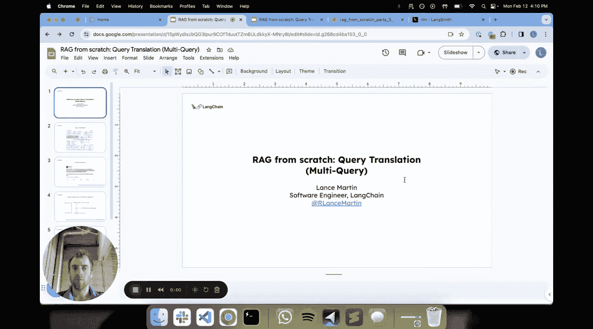
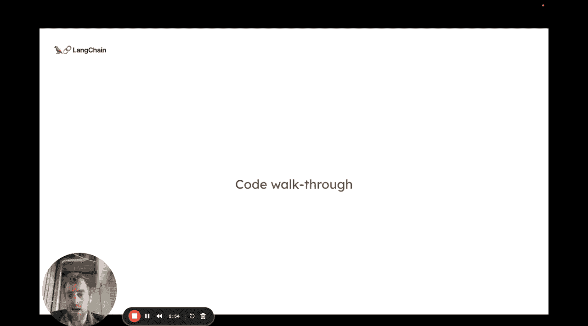
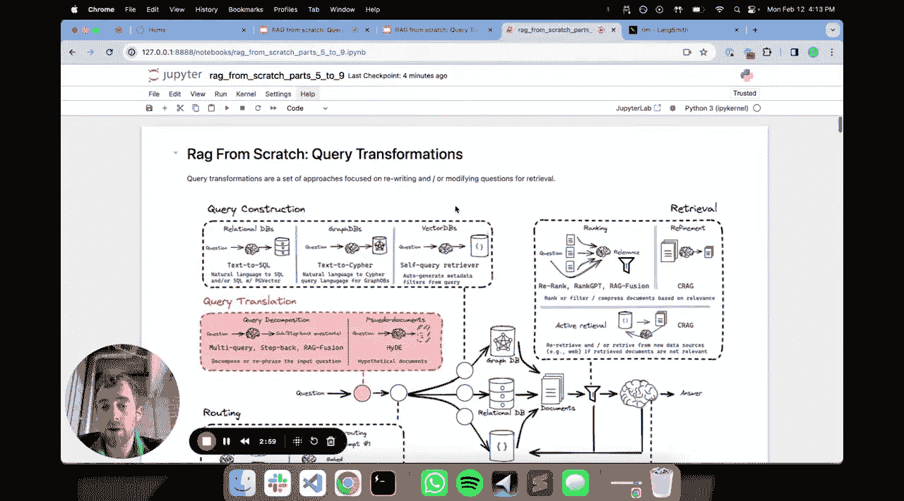
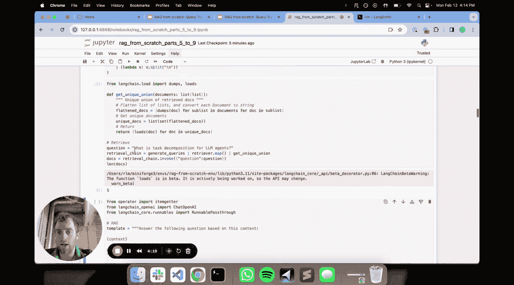
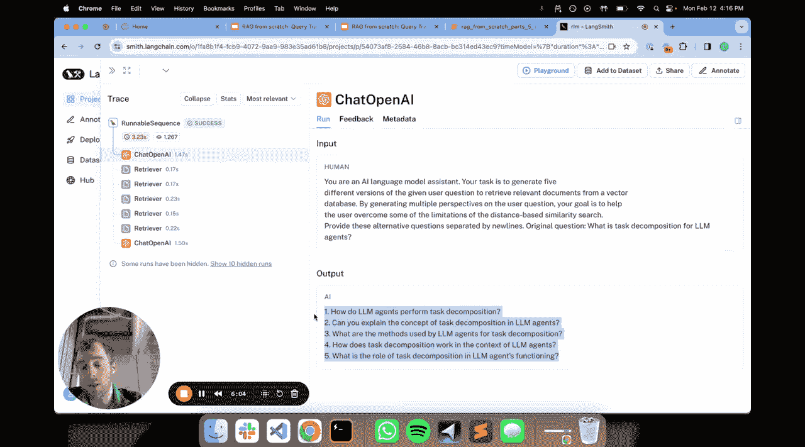

# 005：查询翻译之多查询方法 🎯



在本节课中，我们将要学习 RAG 流水线中的一个重要环节——查询翻译。具体来说，我们会深入探讨“多查询”方法，了解它如何通过重写用户问题来提升文档检索的准确性和可靠性。

## 概述

在高级 RAG 流水线中，查询翻译处于初始阶段。其核心目标是：**接收一个用户输入的问题，并通过某种方式进行“翻译”或改写，以优化后续的文档检索效果**。

问题的根源很直观：用户查询可能表述不清或存在歧义。由于我们通常基于查询与文档之间的语义相似性进行搜索，一个表述不佳的查询将导致无法从索引中检索到正确的文档。

有多种方法可以解决这个问题。其中一种思路是**查询重写**，即从不同角度重新表述同一个问题。本节课我们将重点讨论利用“多查询”方法来实现这一点。

## 多查询方法的核心思想

多查询方法的直觉是：**将一个原始问题分解成几个从不同角度措辞的问题**。

其背后的逻辑是，原始问题的表述方式在经过向量化后，可能在高维嵌入空间中与目标相关文档的距离不够近。通过用几种不同的方式重写问题，我们实际上**增加了检索到真正所需文档的可能性**。这是一种“霰弹枪”式的方法：将一个问题发散成多个不同视角的表述，从而提高检索的可靠性和覆盖面。

当然，我们可以将这种方法与检索结合：对每个重写后的问题分别进行检索，然后以某种方式合并结果，再进行最终的 RAG 生成。

## 代码实现步骤

现在，让我们通过代码来具体实现多查询方法。

### 1. 环境准备与文档索引

首先，我们安装必要的包并设置环境（例如 LangSmith 的 API 密钥，便于后续追踪和分析）。接着，我们将一篇关于智能体的博客文章加载、分割，并索引到本地的 Chroma 向量数据库中。这一步与我们之前构建 RAG 系统的基础步骤一致。

```python
# 示例：加载、分割并索引文档
from langchain.document_loaders import TextLoader
from langchain.text_splitter import RecursiveCharacterTextSplitter
from langchain.vectorstores import Chroma
from langchain.embeddings import OpenAIEmbeddings

loader = TextLoader("blog_post.txt")
documents = loader.load()
text_splitter = RecursiveCharacterTextSplitter(chunk_size=500, chunk_overlap=50)
docs = text_splitter.split_documents(documents)

vectorstore = Chroma.from_documents(documents=docs, embedding=OpenAIEmbeddings())
retriever = vectorstore.as_retriever()
```

### 2. 定义多查询生成提示

接下来，我们定义一个提示模板，指导大语言模型将原始问题重写为多个不同角度的问题。





```python
from langchain.prompts import PromptTemplate

MULTI_QUERY_PROMPT_TEMPLATE = """
你是一名AI助手。你的任务是将以下问题重新表述成几个不同的子问题，以便从向量数据库中检索相关文档。请从不同角度思考，确保问题表述多样。

原始问题：{question}

请生成的问题列表：
"""
MULTI_QUERY_PROMPT = PromptTemplate.from_template(MULTI_QUERY_PROMPT_TEMPLATE)
```

### 3. 生成多查询并执行检索

我们创建一个链，使用大语言模型根据提示生成多个问题，然后对每个生成的问题分别执行检索。

```python
from langchain.chains import LLMChain
from langchain.llms import OpenAI

llm = OpenAI(temperature=0)
generate_queries_chain = LLMChain(llm=llm, prompt=MULTI_QUERY_PROMPT)

def multi_query_retrieval(original_question):
    # 生成多个问题
    generated_output = generate_queries_chain.run(question=original_question)
    # 假设输出是以换行符分隔的问题列表
    sub_questions = generated_output.strip().split('\n')
    
    # 对每个子问题执行检索
    all_docs = []
    for q in sub_questions:
        docs = retriever.get_relevant_documents(q)
        all_docs.extend(docs)
    
    # 返回去重后的文档集合
    unique_docs = list({doc.page_content: doc for doc in all_docs}.values())
    return unique_docs
```



以下是该流程的关键步骤：
1.  **问题生成**：将原始问题输入到 `generate_queries_chain`，得到一系列重写后的问题。
2.  **并行检索**：遍历每个生成的问题，使用检索器获取相关文档。
3.  **结果合并**：收集所有检索到的文档，并去除重复内容，形成最终的上下文文档集。

### 4. 集成到 RAG 流程并验证

最后，我们将检索到的唯一文档集合作为上下文，与原始问题一起送入最终的 RAG 提示模板中，生成答案。

```python
RAG_PROMPT_TEMPLATE = """
请根据以下上下文回答问题。

上下文：
{context}

问题：{question}

答案：
"""
RAG_PROMPT = PromptTemplate.from_template(RAG_PROMPT_TEMPLATE)
rag_chain = LLMChain(llm=llm, prompt=RAG_PROMPT)

# 端到端流程
def full_multi_query_rag(question):
    context_docs = multi_query_retrieval(question)
    context = "\n\n".join([doc.page_content for doc in context_docs])
    answer = rag_chain.run(context=context, question=question)
    return answer

# 运行示例
result = full_multi_query_rag("LangChain中的智能体是如何工作的？")
print(result)
```

通过 LangSmith 这类工具，我们可以清晰地追踪整个流程：查看生成的具体子问题列表、每个子问题独立检索到的文档，以及最终合并后用于生成答案的上下文。这有助于我们理解和调试多查询方法的效果。

## 总结

本节课我们一起学习了 RAG 系统中查询翻译策略之一的**多查询方法**。我们了解到，通过将原始用户问题重写为多个不同表述的子问题，可以有效地提高文档检索的召回率和准确性。我们实现了从问题生成、并行检索到结果合并的完整流程，并将其集成到了标准的 RAG 流水线中。



在接下来的课程中，我们将继续探讨其他查询翻译技术，例如 **RAG-Fusion** 和 **Stepback Prompting**，以进一步优化 RAG 系统的性能。