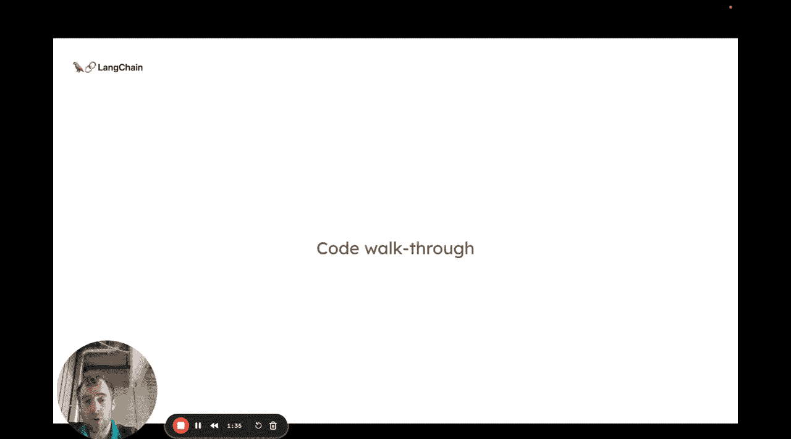
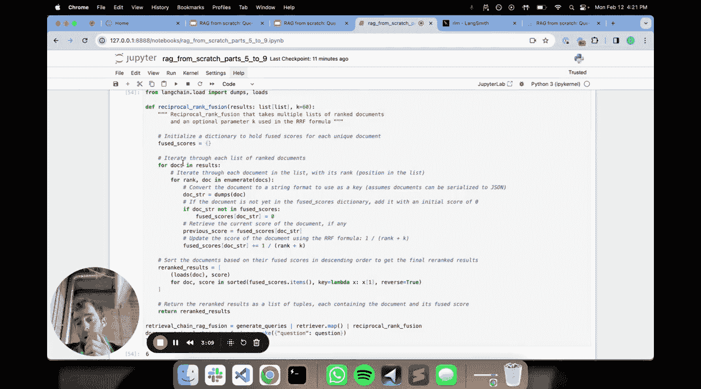
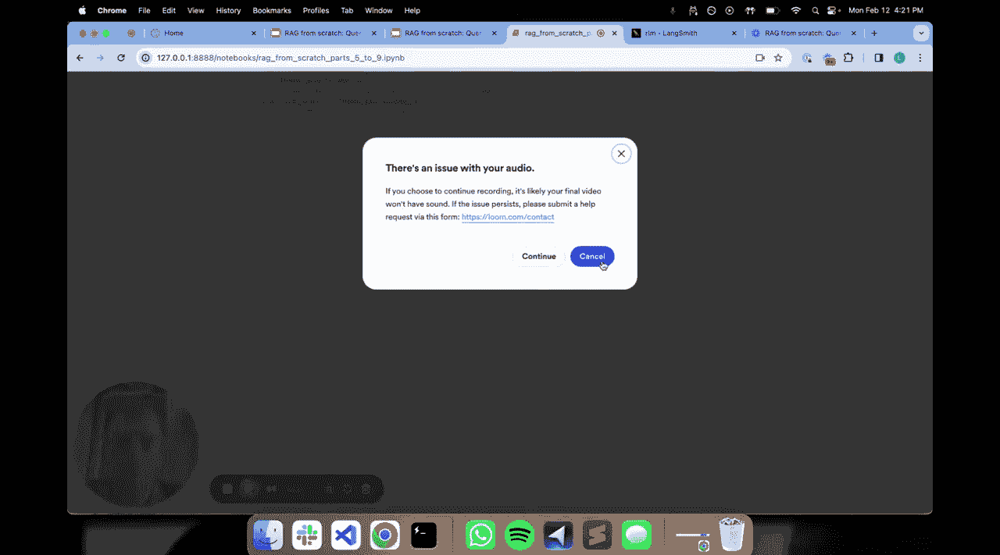
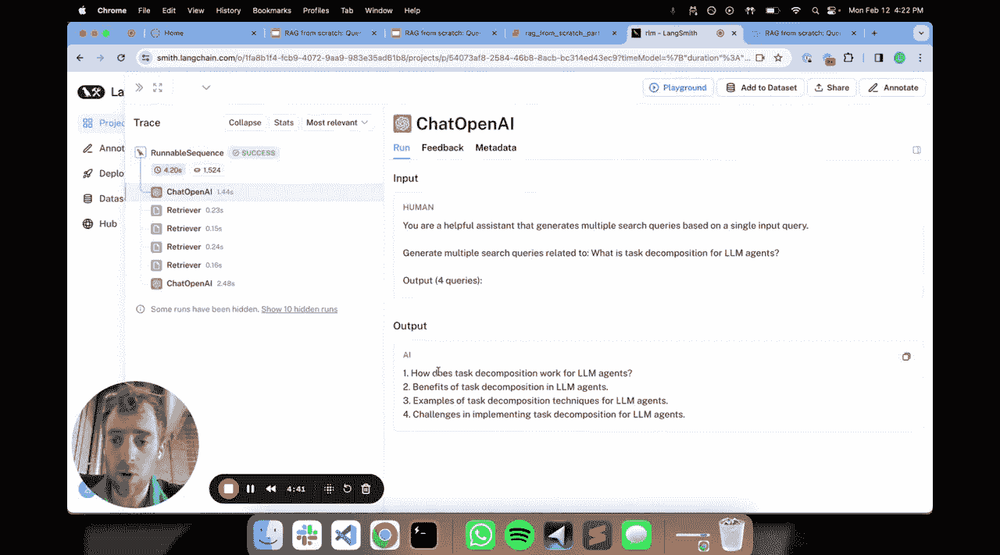

# 006：查询翻译之 RAG Fusion 🔀

在本节课中，我们将要学习高级 RAG 流水线中的查询翻译技术，并深入探讨一种名为 **RAG Fusion** 的具体方法。我们将了解其工作原理，并通过代码示例展示如何实现它。

## 概述

查询翻译可以被视为高级 RAG 流水线的第一阶段。其核心思想是：接收用户的原始问题，通过某种方式“翻译”或转换它，以提升后续检索步骤的效果。我们之前介绍过几种通用方法，例如**重写**、**子问题分解**和**逐步回溯**。本节课，我们将重点研究重写方法中的一种特定技术——RAG Fusion。

## RAG Fusion 简介

RAG Fusion 与我们之前看到的 **Multi Query** 方法非常相似。关键区别在于，RAG Fusion 在检索到文档后，会应用一个巧妙的排序步骤，称为**倒数排序融合**。除了这个排序步骤，其初始阶段——将一个问题分解成几个不同措辞的问题并对每个问题进行检索——是完全相同的。

接下来，让我们通过代码来具体看看它是如何工作的。

## 代码实现解析

以下是我们将使用的代码环境。我们已安装了必要的包，并设置了 LangSmith 的 API 密钥，这对于追踪和调试非常有用。

### 1. 定义提示词



首先，我们定义一个提示词，用于指导大语言模型根据用户输入生成多个搜索查询。这与 Multi Query 中使用的提示词非常相似。

```python
prompt = """你是一个乐于助人的助手，能够基于单一用户输入生成多个搜索查询。

问题：{question}

输出 4 个查询："""
```

### 2. 构建查询生成链

接下来，我们构建一个链，将提示词输入给大语言模型，并解析其输出，将生成的多个查询分割成一个列表。

```python
from langchain.chains import LLMChain
from langchain.llms import OpenAI

llm = OpenAI(temperature=0)
query_generation_chain = LLMChain(llm=llm, prompt=prompt)

def generate_queries(question):
    response = query_generation_chain.run(question=question)
    # 假设模型输出中每个查询占一行
    queries = response.strip().split('\n')
    return queries
```





### 3. 执行检索与倒数排序融合

这是 RAG Fusion 的新颖之处。我们对生成的每个查询分别进行检索，每个检索都会返回一个文档列表。这样我们就得到了一个“列表的列表”。

倒数排序融合算法非常适合处理这个问题。它的目标是将这个“列表的列表”合并成一个单一的、经过整合排序的最终文档列表。其核心直觉是：查看每个列表中的文档，并根据它们在各自列表中的排名进行加权聚合，从而得出一个最终的输出排名。

```python
def reciprocal_rank_fusion(all_docs_lists, k=60):
    """
    实现倒数排序融合算法。
    all_docs_lists: 列表的列表，每个子列表是一次检索的结果。
    k: 一个常数，用于平滑排名。
    """
    fused_scores = {}
    for docs_list in all_docs_lists:
        for rank, doc in enumerate(docs_list):
            doc_id = doc.metadata.get('id', str(doc)) # 使用一个唯一标识符
            if doc_id not in fused_scores:
                fused_scores[doc_id] = 0
            fused_scores[doc_id] += 1 / (rank + k + 1) # 倒数排名公式

    # 根据融合分数对文档进行排序
    reranked_docs = sorted(fused_scores.items(), key=lambda x: x[1], reverse=True)
    # 返回排序后的文档ID或文档对象（此处简化）
    return reranked_docs
```

### 4. 整合为完整 RAG 链

现在，我们将所有步骤整合到一个完整的 RAG 链中：
1.  接收用户问题。
2.  生成多个查询。
3.  对每个查询执行检索。
4.  使用倒数排序融合对检索到的所有文档进行重新排序。
5.  将排序后的文档列表和原始问题一起送入 RAG 提示词。
6.  将提示词输入给大语言模型以生成最终答案。

```python
def rag_fusion_chain(question, retriever, llm):
    # 1. 生成多个查询
    queries = generate_queries(question)

    # 2. 对每个查询进行检索
    all_retrieved_docs = []
    for query in queries:
        docs = retriever.get_relevant_documents(query)
        all_retrieved_docs.append(docs)

    # 3. 应用倒数排序融合
    final_ranked_docs_ids = reciprocal_rank_fusion(all_retrieved_docs)
    # 根据ID获取实际的文档内容（此处为简化逻辑）
    final_context = get_doc_content_by_ids(final_ranked_docs_ids)

    # 4. 构建最终提示并生成答案
    rag_prompt = f"""基于以下上下文回答问题。
    上下文：{final_context}
    问题：{question}
    答案："""
    final_answer = llm(rag_prompt)
    return final_answer
```

## 运行与验证



当我们运行这个完整的链条时，可以在 LangSmith 中追踪到整个过程：
*   可以看到生成的四个不同查询。
*   可以看到针对每个查询的独立检索结果。
*   最终，经过倒数排序融合得到的、整合了六个唯一文档的排序列表被送入 RAG 提示词。
*   大语言模型基于这个优化后的上下文生成了最终答案。

这种方法特别方便，尤其是当我们在不同的向量数据库上进行操作，或者希望对大量不同措辞的问题进行检索时。倒数排序融合步骤非常有用。例如，如果我们只想将排名前三的文档传递给大模型，那么先通过这个步骤对所有独立检索结果进行整合排序，再选取前几名，会比直接合并列表更有效。

## 总结

本节课中，我们一起学习了 **RAG Fusion** 技术。我们了解到，它通过将用户问题重写为多个不同查询来启动检索过程，然后使用**倒数排序融合**算法对所有检索结果进行智能整合与排序，最终为生成步骤提供质量更高的上下文。这是提升 RAG 系统检索效果的一种有效高级技巧。