# 007：查询翻译之问题分解 🔍

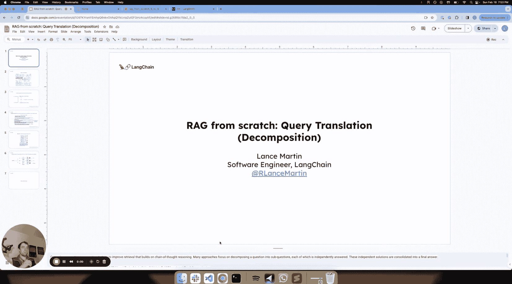

在本节课中，我们将学习查询翻译技术中的“问题分解”方法。我们将探讨如何将一个复杂的用户问题拆解成一系列子问题，并利用检索与链式思考相结合的方式，逐步构建出最终答案。

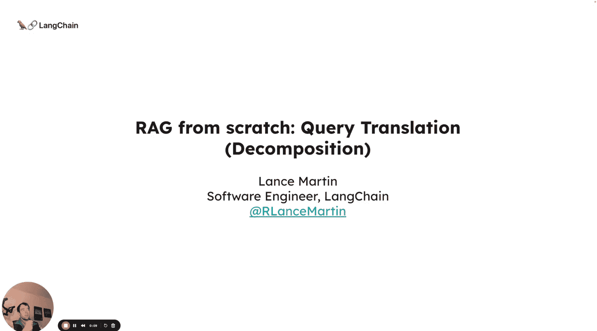

---

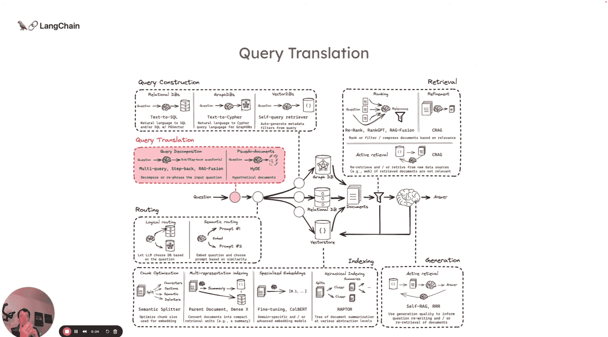

## 概述

查询翻译是RAG（检索增强生成）流程前端的一系列技术，其目标是通过修改、重写或分解用户的输入问题，以提升后续检索步骤的效果。在前几节中，我们介绍了查询改写技术，如RAG-Fusion和多查询生成。本节我们将聚焦于另一类技术：问题分解。

问题分解的核心思想是将一个复杂问题拆解为多个更易解决的子问题，然后依次或并行地解决这些子问题，最终综合得到答案。

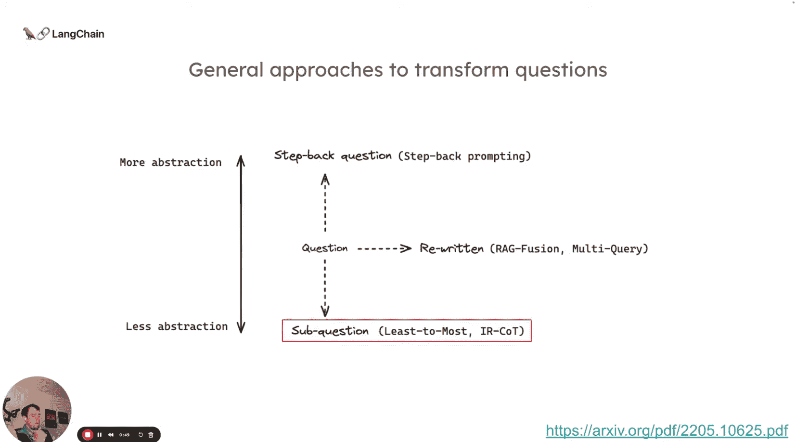

---

## 问题分解的核心概念

问题分解主要借鉴了两篇论文的思想：

1.  **来自Google的工作**：其目标是首先将输入问题分解为一组子问题。例如，对于“最后字母拼接”任务，输入“think machine learning”被分解为三个子问题，然后依次解决每个子问题，并利用前一个子问题的答案来帮助解决下一个。
2.  **ICOT（交织检索）**：这种方法将检索与链式思考推理相结合。可以将其理解为一种动态检索方法，用于解决一组子问题，检索过程与基于初始问题分解出的子问题的链式思考交织进行。

核心思路是：我们解决第一个子问题，利用其答案来帮助解决第二个子问题，依此类推，逐步构建最终解决方案。

---

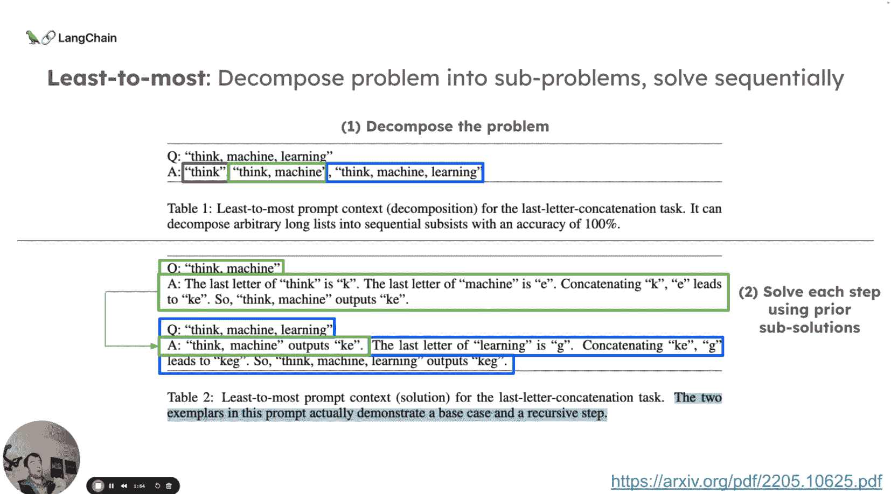

## 代码实践：顺序分解与解答

以下是我们将使用的代码示例。首先，我们定义了一个提示词，用于将输入问题分解为子问题。

```python
# 定义分解提示词
decomposition_prompt = """
给定以下输入问题，请将其分解为一组可以独立解决的子问题。

输入问题：{question}

请列出分解后的子问题：
"""
```

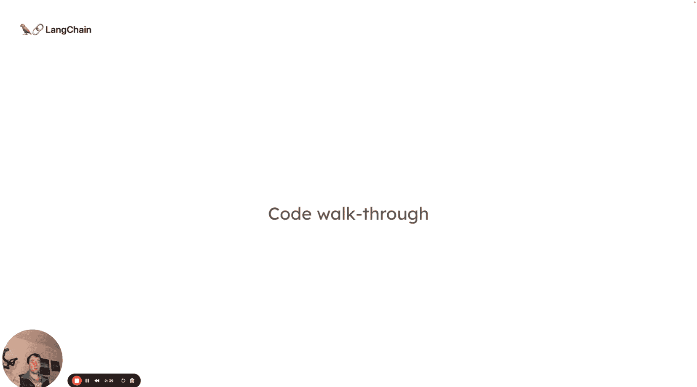

假设我们提问：“LLM驱动的自主智能体系统的主要组成部分是什么？”。运行分解后，我们可能得到如下子问题：
1.  LLM技术是什么及其工作原理？
2.  自主智能体有哪些不同的组件？
3.  这些组件如何交互？

接下来，我们定义一个简单的链来处理每个子问题。这个链会接收当前子问题、已解答的问题及其答案，并进行检索来生成答案。

```python
# 定义解答链的提示词模板
qa_prompt_template = """
请基于以下背景信息回答问题。

当前问题：{current_question}

已解答的问题及背景信息：
{prior_qa}

相关检索内容：
{retrieved_context}

答案：
"""

# 构建解答链
qa_chain = LLMChain(llm=llm, prompt=PromptTemplate.from_template(qa_prompt_template))
```

现在，我们按顺序处理每个子问题。

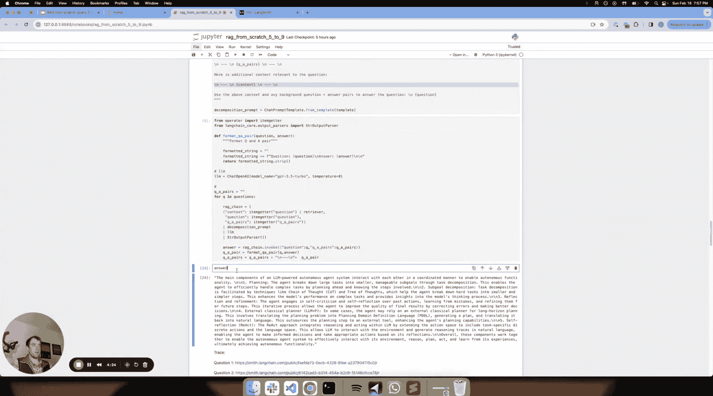

**处理第一个子问题**：
对于第一个问题“LLM技术是什么及其工作原理？”，链会直接进行检索，并利用检索到的内容生成答案。

**处理第二个子问题**：
对于第二个问题“自主智能体有哪些不同的组件？”，解答链的输入将包含第一个问题的答案作为`prior_qa`。这样，模型在回答第二个问题时，就能参考第一个问题的背景信息，并结合新的检索结果。

**处理第三个子问题**：
对于第三个问题“这些组件如何交互？”，解答链的输入将包含前两个问题的答案作为`prior_qa`。模型会综合所有已知信息和新的检索内容，生成最终答案。

通过这种方式，我们实现了答案的逐步构建，后续问题的解答可以受益于前面已解决的问题。

---

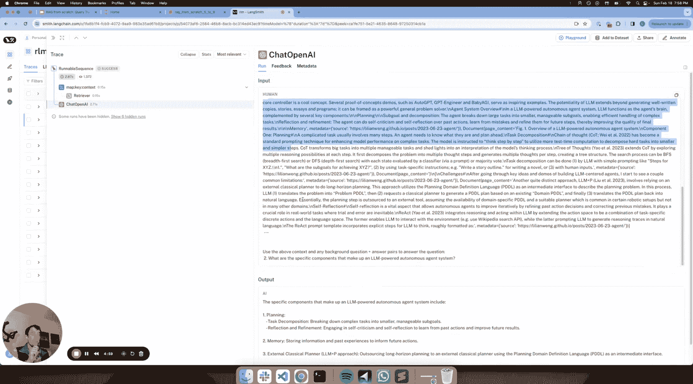

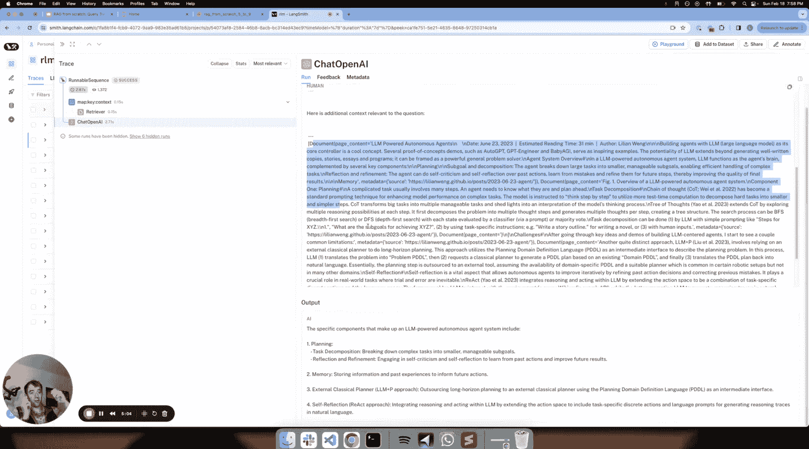

## 另一种方法：并行分解与解答

除了顺序解答，我们也可以采用并行策略。即一次性分解所有子问题，然后并行地检索和回答每个子问题，最后将所有答案拼接起来形成最终答复。

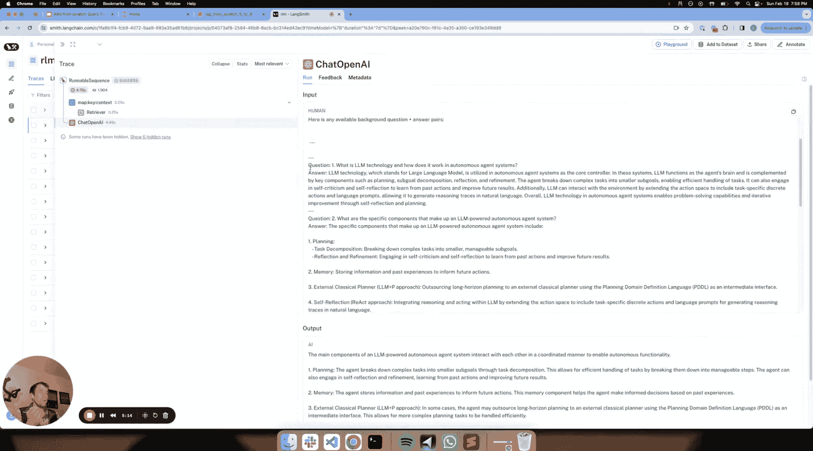

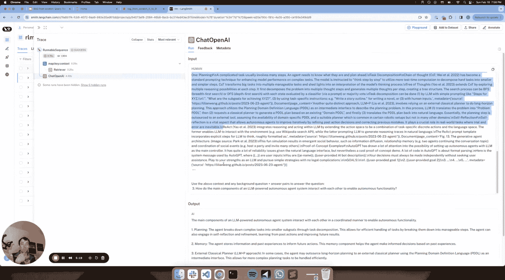

以下是并行处理的简要思路：

```python
# 并行处理所有子问题
all_answers = []
for sub_question in decomposed_questions:
    # 为每个子问题独立检索和生成答案
    answer = answer_question(sub_question, retriever)
    all_answers.append(answer)

# 合并所有答案
final_answer = "\n".join(all_answers)
```

这种方法适用于子问题之间相对独立、答案不相互依赖的场景。它的优势在于可以并行执行，可能更快，但缺少了答案间的信息传递和累积。

---

## 总结

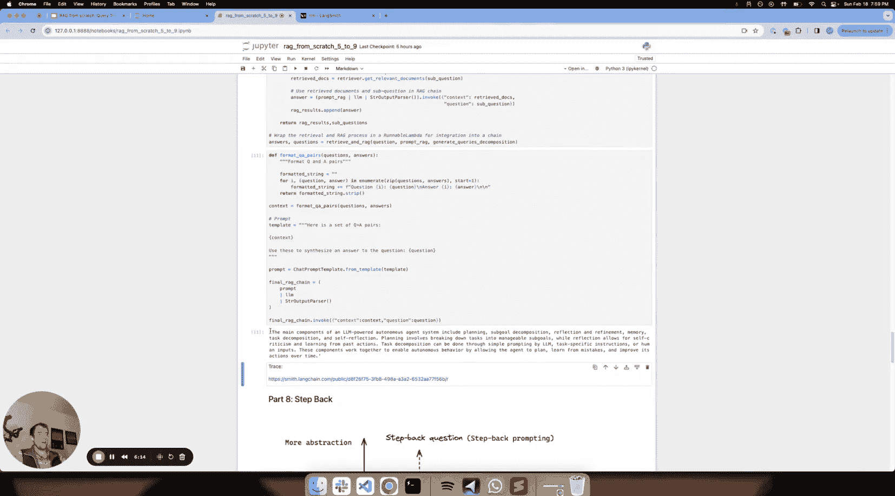

本节课我们一起学习了查询翻译中的问题分解技术。

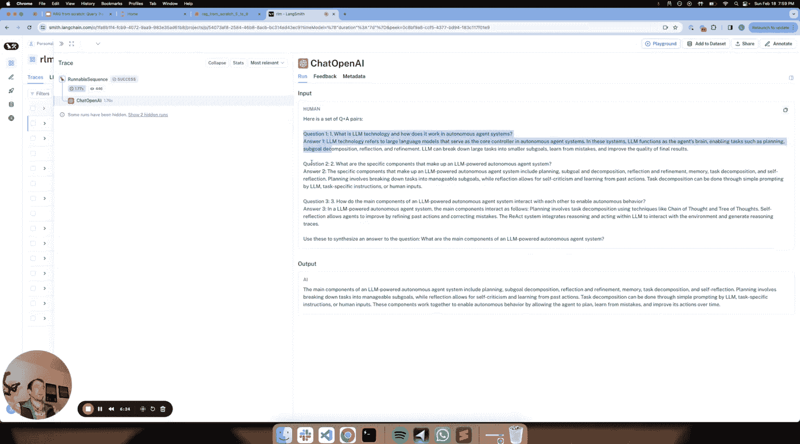

*   我们了解了问题分解的目标：将复杂问题拆解为更易处理的子问题以改善检索。
*   我们探讨了两种主要方法：**顺序分解解答**（利用前序答案辅助后续解答）和**并行分解解答**（独立解答后合并结果）。
*   我们通过代码示例，演示了如何使用LangChain实现顺序分解与解答流程，看到了如何将检索结果与链式思考相结合，逐步构建出完整的答案。

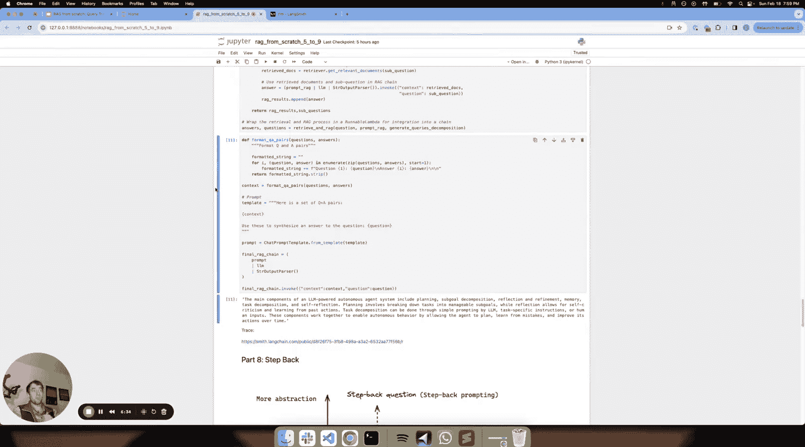

问题分解是处理复杂、多步骤查询的强大工具，能够使RAG系统更深入、更结构化的理解并响应用户的问题。你可以根据问题的性质，选择顺序或并行的策略来应用这一技术。