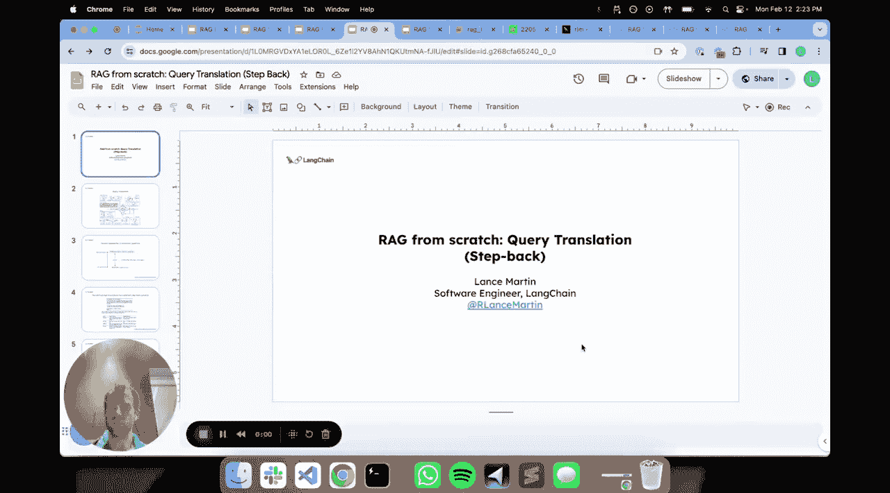
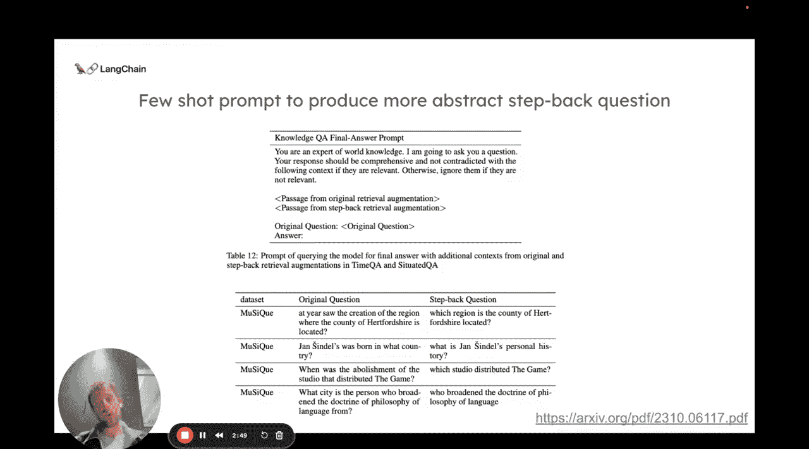
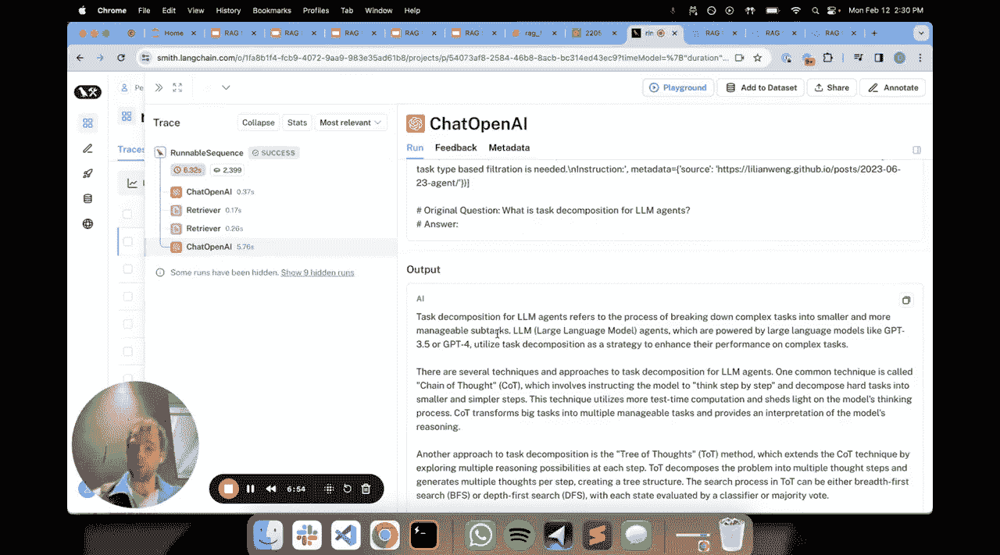

# 008：查询翻译之 Step Back 提示法




在本节课中，我们将要学习查询翻译的第四种方法：Step Back 提示法。我们将了解其核心思想，并通过一个具体示例来演示如何在实践中实现它。

## 概述

查询翻译位于 RAG 流程的初始阶段，其主要目标是接收用户输入的问题，并通过翻译或修改来优化后续的检索效果。之前我们已经探讨了几种方法，例如通过重写问题来捕获不同视角的 RAG-Fusion 和多查询方法，以及将复杂问题分解为子问题的 Least-to-Most 提示法。

本节中我们来看看另一种思路：Step Back 提示法。与前几种方法相反，它旨在将具体问题转化为更抽象、更通用的问题，从而可能检索到更基础、更概念性的背景知识，以辅助最终答案的生成。

## Step Back 提示法原理

Step Back 提示法由 Google 提出，其核心是使用**小样本提示**来生成所谓的“后退一步”或更抽象的问题。该方法通过提供一个示例列表来指导模型，每个示例都包含一个原始问题及其对应的抽象问题。

以下是论文中提到的提示模板示例：

```
你是一位知识渊博的专家。我向你提问，你的回答应当全面且不与以下内容矛盾：[此处提供示例]
```

示例格式通常如下：
*   **原始问题**：`“简妮尔出生在哪个国家？”`
*   **抽象问题**：`“简妮尔的个人历史是什么？”`

可以看到，抽象问题不再聚焦于具体的“出生国家”，而是转向询问更广泛的“个人历史”，这有助于检索到更全面的背景资料。

## 实践演练

现在，让我们通过一个具体例子来演示如何实现 Step Back 提示法。

### 1. 构建提示



首先，我们根据论文思想构建提示。这个提示包含任务说明和小样本示例，用于引导模型生成抽象问题。

```python
# 提示模板示例
step_back_prompt_template = """
你是一位世界知识专家。你的任务是“后退一步”，将一个具体问题转述为一个更通用、更抽象的“后退问题”，这通常更容易找到相关背景知识来回答。

以下是一些示例：
原始问题： “简妮尔出生在哪个国家？”
后退问题： “简妮尔的个人历史是什么？”

原始问题： “赫克舍郡位于哪个地区？”
后退问题： “该郡所在国家的地区创建历史是怎样的？”

现在，请为以下问题生成“后退问题”：
原始问题： “{original_question}”
后退问题：
"""
```

### 2. 生成抽象问题并检索

接下来，我们使用这个提示来处理一个具体问题。

*   **输入问题**：`“什么是针对LLM智能体的任务组合？”`
*   **生成的抽象问题**：`“任务组合的过程是什么？”`

生成了抽象问题后，我们将并行执行两次检索：
1.  使用**原始具体问题**进行检索。
2.  使用**生成的抽象问题**进行检索。

这样，我们就能获得两组文档：一组针对具体实现细节，另一组针对基础概念和过程。

### 3. 合成最终答案

最后，我们将两组检索到的上下文信息，连同原始问题，一起填入最终的回答提示模板中，让语言模型综合这些信息生成答案。

```python
# 最终回答提示模板
final_answer_prompt_template = """
请基于以下提供的上下文信息回答问题。

**从原始问题检索到的上下文：**
{context_from_original_question}

**从抽象问题检索到的上下文：**
{context_from_step_back_question}

**问题：**
{original_question}

**答案：**
"""
```

通过这种方式，模型不仅能看到与“LLM智能体任务组合”直接相关的资料，还能看到关于“任务组合”这一通用过程的背景知识，从而生成更全面、更有深度的回答。

## 适用场景与总结

Step Back 提示法是一种有效的技术，但其效果很大程度上取决于应用领域。在以下场景中它可能特别有用：

*   **教科书或技术文档**：这类资料通常包含独立的概念章节和具体的实现章节。通过抽象问题检索概念章节，再结合具体问题检索实现细节，能很好地构建答案。
*   **需要深厚概念背景的领域**：当用户问题背后依赖于大量基础概念知识时，这种方法能自动构建高层级的查询，以改善检索效果。



本节课中我们一起学习了 Step Back 提示法。我们了解到，与分解问题的思路不同，Step Back 通过将具体问题提升到更抽象的层面来辅助检索。我们演练了从构建提示、生成抽象问题、并行检索到合成答案的完整流程。这种方法为处理需要结合概念性知识和具体细节的复杂问题提供了一种有力的工具。