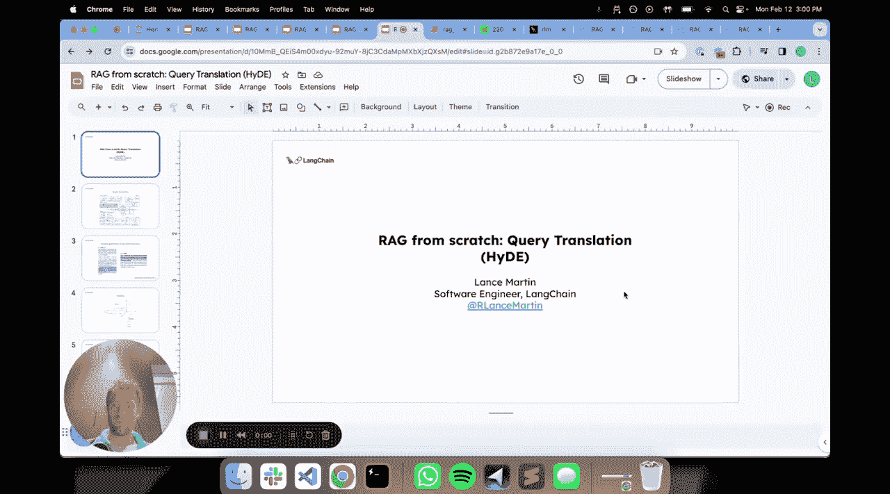
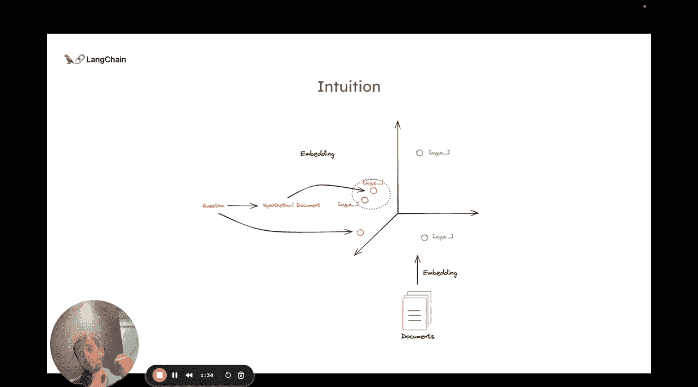
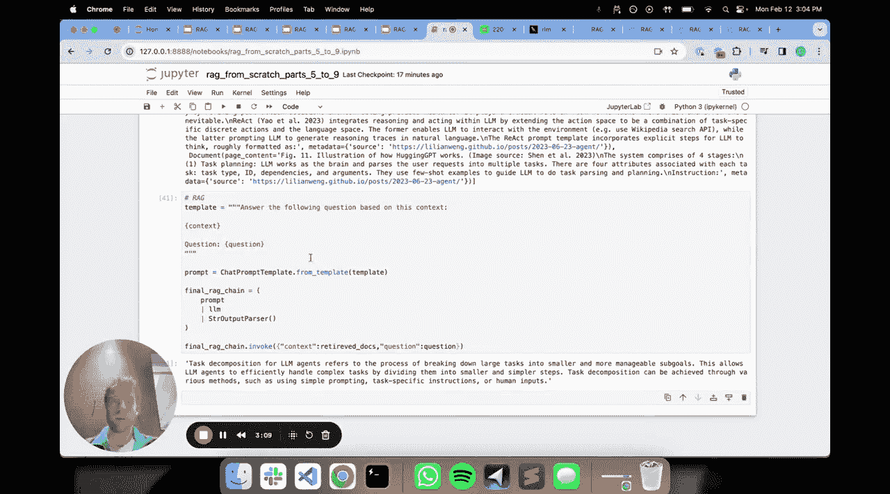
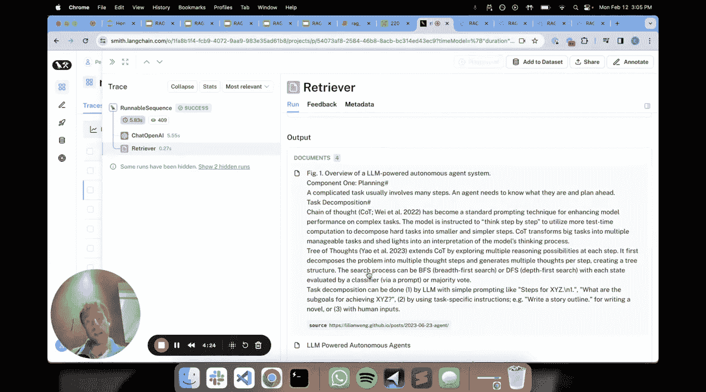
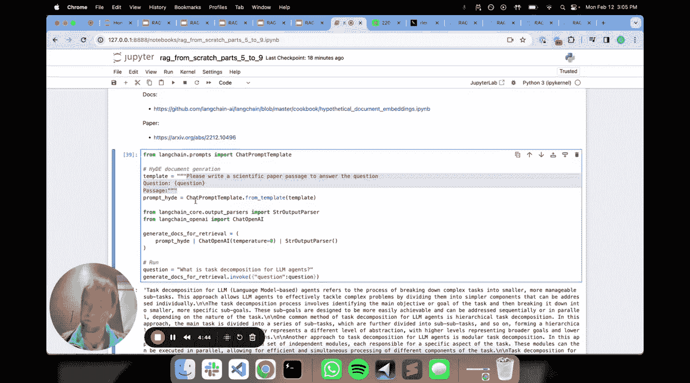

# 009：查询翻译之 HyDE 技术 🧠



在本节课中，我们将要学习一种名为 **HyDE** 的查询翻译技术。它通过将用户的问题“翻译”成一篇假设的文档，来提升检索相关文档的准确性。

## 概述

上一节我们介绍了查询翻译在 RAG 流程中的位置。本节中，我们来看看一种具体的技术——**HyDE**。它的核心思想是：用户提出的简短问题，与知识库中结构化的文档在文本形式上差异很大。HyDE 旨在通过生成一篇“假设的文档”，将问题映射到与真实文档更相似的语义空间中，从而改善检索效果。

## HyDE 的核心思想

标准的 RAG 流程会将问题和文档都转换为向量（嵌入），然后计算它们的相似度。但问题和文档是两种非常不同的文本对象。文档通常来自出版物，内容详实、结构完整；而用户问题则可能简短、措辞随意甚至不准确。

HyDE 的直觉是：**将问题映射到“文档空间”**。具体做法是，利用大语言模型，根据原始问题生成一篇假设的、可能包含答案的文档段落。然后，用这篇**假设文档**的向量去检索知识库，而不是直接用原始问题的向量。

从原理上看，在某些情况下，这篇生成的假设文档在向量空间里，可能比原始问题本身更接近我们真正想要检索的目标文档。


## 代码实现详解



理解了 HyDE 的原理后，让我们通过代码来具体看看它是如何工作的。它的实现相当简单直接。

首先，我们定义一个提示词（Prompt），用于指导大语言模型生成假设文档。我们继续使用之前视频中建立的索引（一个关于智能体的博客文章）。

```python
# 定义生成假设文档的提示词
prompt_template = “””请根据以下问题，撰写一段可能包含答案的论文式段落。
问题：{question}
假设段落：”””
```

运行这个提示词，通过大语言模型（例如 OpenAI ChatGPT）生成一段文本。这段文本就是我们的“假设文档”。

接下来，我们将这篇生成的假设文档进行向量化，并用它来检索知识库。以下是检索步骤的示意：

```python
# 生成假设文档
hypothetical_doc = llm.invoke(prompt_template.format(question=user_question))
# 使用假设文档的向量进行检索
retrieved_docs = retriever.get_relevant_documents(hypothetical_doc)
```

最后，我们将检索到的真实文档和用户的原始问题一起，输入给标准的 RAG 提示词链，生成最终答案。

```python
# 构建最终的 RAG 链
final_answer = rag_chain.invoke({“context”: retrieved_docs, “question”: user_question})
```

## 流程拆解与观察



我们可以通过 LangSmith 这样的工具来追踪整个流程。流程主要包含两个关键步骤：

1.  **假设文档生成**：大语言模型根据问题生成一篇连贯的、文档风格的段落。
2.  **基于假设文档的检索**：用上一步生成的段落作为查询，从向量数据库中检索出相关的真实文档片段。

在工具中，你可以清晰地看到生成的假设文档内容，以及系统根据它检索到了哪些具体的文档块。在某些案例中，原始问题可能已经能检索到相关文档。但对于其他领域或更复杂的问题，使用 HyDE 生成的文档进行检索，被证明能获得更好的效果。


## HyDE 的优势与实验建议

HyDE 是一个简洁而强大的方法，其优势在于：

*   **易于实现**：核心逻辑清晰，代码量少。
*   **可定制性强**：你可以根据自己领域的知识特点，任意调整生成假设文档的提示词，使其生成的文本风格更贴近你的真实文档。
*   **解决语义鸿沟**：它能部分克服因问题与文档表述方式不同而导致的检索失败问题。

因此，绝对值得你在自己的 RAG 应用中进行实验。尝试不同的提示词，观察它对检索结果质量的提升。



## 总结




本节课中，我们一起学习了 **HyDE** 这种查询翻译技术。我们了解到，它通过将用户问题转化为一篇“假设的文档”，来弥合问题与目标文档之间的语义差距，从而可能提升检索的准确性。我们还通过代码演示了其实现过程，并讨论了它的优势和应用建议。这是一种值得尝试的、用于优化 RAG 系统前端检索效果的技术。