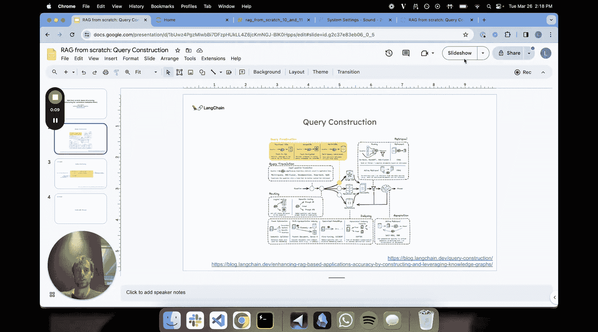
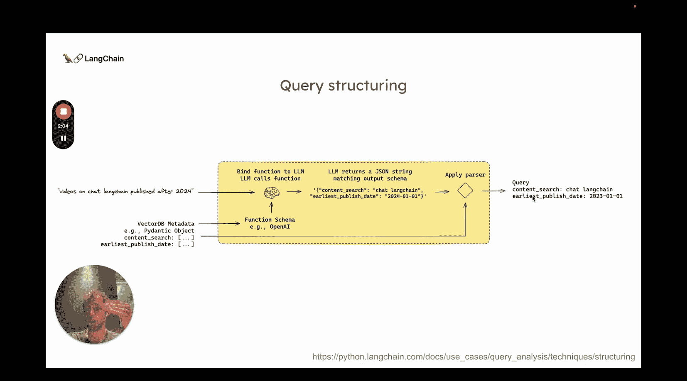
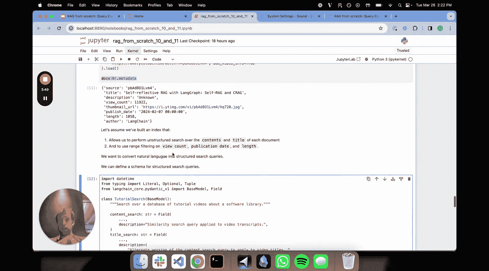
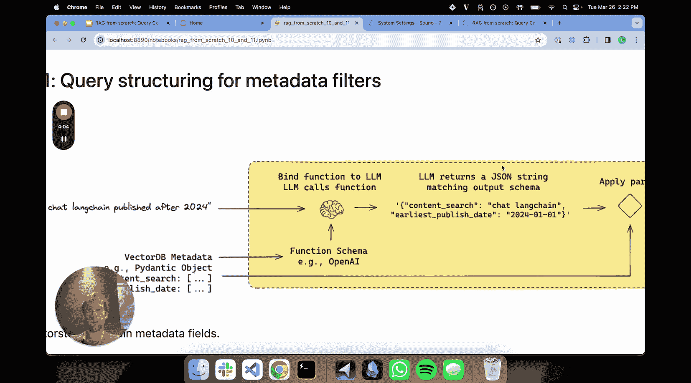
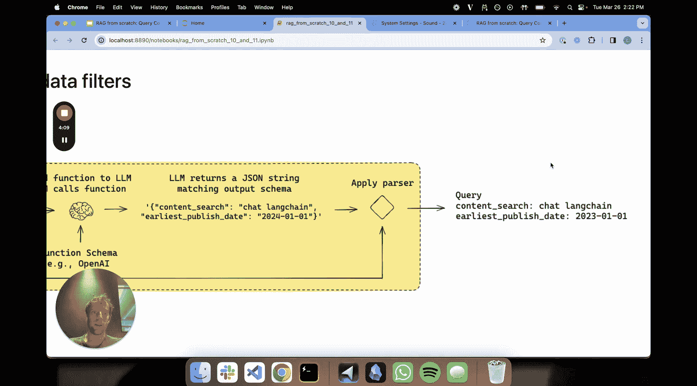
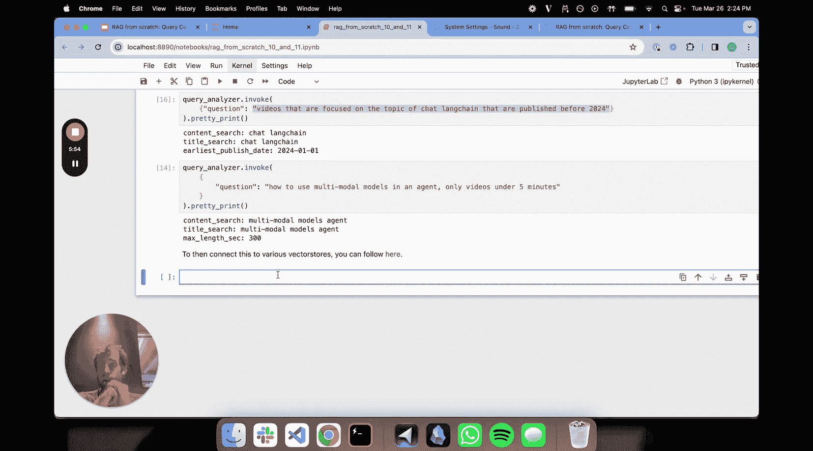

# 011：查询结构化 🧩

在本节课中，我们将要学习查询结构化。这是RAG系统中将自然语言问题转换为特定数据源（如向量数据库）能理解的结构化查询的关键步骤。

上一节我们介绍了查询路由，它负责将问题引导至正确的数据源。本节中，我们来看看如何将自然语言问题，具体地转换为适用于向量数据库元数据过滤器的结构化查询。



## 问题定义

假设我们有一个LangChain视频转录本的索引。用户可能会提出这样的问题：“给我找一些2024年后发布的关于Chat LangChain的视频”。查询结构化的过程，就是将这个自然语言问题，转换为可以应用于向量数据库元数据过滤器的结构化查询。

大多数向量数据库都支持基于索引块（chunks）的元数据过滤器进行结构化查询。例如，上述查询将检索出所有讨论“Chat LangChain”主题，且发布日期在“2024年”之后的文本块。

为了实现这个目标，我们将利用大语言模型的**函数调用**能力。

## 核心流程



以下是查询结构化的高级流程：
1.  提取向量数据库中存在的**元数据字段**。
2.  将这些字段信息提供给大语言模型。
3.  模型根据提供的**模式（Schema）**，将自然语言问题转换为符合该模式的结构化查询。
4.  我们将模型输出解析成一个结构化的对象（例如Pydantic对象）。
5.  最后，这个结构化对象可用于执行搜索。

## 代码示例与解析

让我们通过一个具体的代码示例来理解这个过程。

首先，我们需要定义我们的数据结构。以下代码创建了一个 `TutorialSearch` 对象，它封装了我们向量数据库索引中所有可用的搜索和过滤方式。

```python
# 定义可用的搜索和过滤器
class TutorialSearch(BaseModel):
    # 语义搜索字段
    content_search: Optional[str] = None
    title_search: Optional[str] = None
    # 结构化过滤字段
    min_view_count: Optional[int] = None
    max_view_count: Optional[int] = None
    earliest_publish_date: Optional[datetime] = None
    latest_publish_date: Optional[datetime] = None
    min_video_length: Optional[int] = None
    max_video_length: Optional[int] = None
```

接下来，我们设置提示词和大语言模型。关键在于，我们将上面定义的 `TutorialSearch` Pydantic对象绑定到大语言模型，使其能够输出结构化的结果。

```python
# 设置提示词
prompt = ChatPromptTemplate.from_messages([
    ("system", "你是一个专家，负责将自然语言转换为数据库查询。你有一个教程视频数据库。给定一个问题，请返回一个为优化检索而设计的数据库查询。"),
    ("human", "{question}")
])

# 创建查询分析链，并绑定结构化输出模式
query_analyzer_chain = prompt | llm.with_structured_output(TutorialSearch)
```





现在，我们可以用不同的问题来测试这个链条。



以下是测试不同查询的示例：

**测试1：纯语义搜索**
*   **输入问题**：“LangChain从零开始”
*   **输出解析**：链条主要执行 `content_search` 和 `title_search` 的语义匹配，这是我们期望的结果。

**测试2：包含日期过滤的查询**
*   **输入问题**：“查找2024年之前发布的关于Chat LangChain的视频”
*   **输出解析**：除了语义搜索，输出对象还包含了 `latest_publish_date` 字段，其值被设置为2024年之前，从而实现了日期过滤。

## 总结与拓展

本节课中我们一起学习了查询结构化。我们了解到，这是一个将非结构化自然语言输入，转换为遵循任意给定模式的结构化查询对象的通用策略。

整个 `TutorialSearch` 对象的构建是基于我们感兴趣的向量数据库的具体情况。这种方法可以与许多不同的向量数据库提供商集成，允许你直接从自然语言问题动态生成元数据过滤器，是一个非常实用且方便的技巧。



鼓励你根据自己的数据模式尝试和应用这一技术。