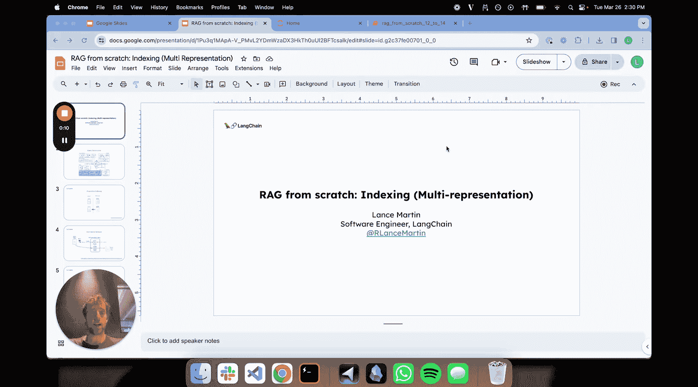
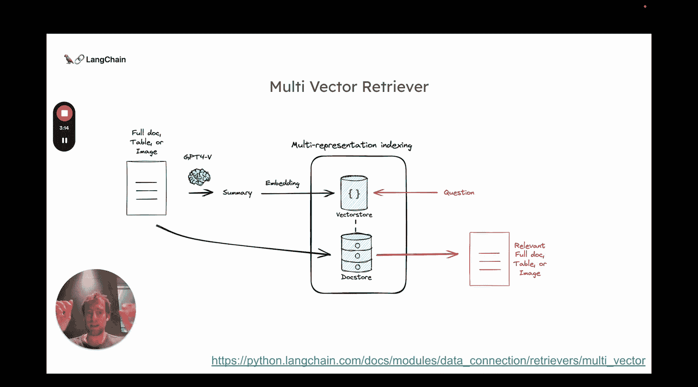
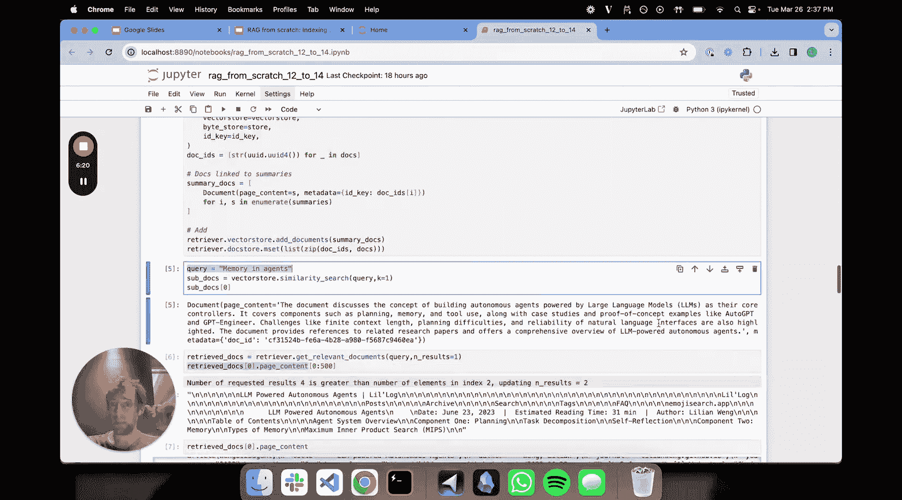

# 012：多表征索引 📚



在本节课中，我们将学习RAG系统中的索引技术，特别是**多表征索引**。这是一种将文档的“摘要”用于高效检索，同时保留完整文档用于最终生成的巧妙方法。

上一节我们深入探讨了向量存储的查询构造。本节中，我们来看看如何优化索引本身，以提高检索的准确性和生成内容的质量。

## 核心概念

多表征索引的核心思想源于一篇名为 **“Pro索引”** 的论文。其核心观察是：可以将原始文档与用于检索的单元**解耦**。

在典型情况下，我们取一个文档，以某种方式分割它，然后直接嵌入这些分割块。而这篇论文提出，可以先分割文档，然后使用大语言模型（LLM）为每个分割块生成一个 **“命题”**。你可以将其理解为对该分割块的**提炼或摘要**，使其更优化于检索。

我们基于这个想法进行了扩展，提出了一种特别适合**长上下文大语言模型**的方法。思路很简单：
1.  为文档生成一个摘要，并嵌入这个摘要。这个摘要包含了文档的关键词和核心思想，专为检索优化。
2.  将完整的原始文档独立存储在一个文档存储中。
3.  当通过向量存储检索到相关摘要时，利用关联的ID从文档存储中取出**完整的原始文档**，交给LLM进行内容生成。

这是一个非常实用的技巧。在生成阶段，长上下文LLM可以直接处理整个文档，无需担心分割问题。我们只需用高度优化的摘要来“钓出”完整的文档，确保LLM拥有回答问题的全部上下文。

## 代码实践

让我们通过代码来具体实现这个流程。

首先，我们加载两篇不同的博客文章作为示例数据，一篇关于智能体，另一篇关于数据质量。

```python
# 示例：加载两篇文档
doc1 = "文章内容：构建自主智能体..."
doc2 = "文章内容：高质量人工数据在训练中的重要性..."
```

接下来，我们为每篇文档生成摘要。这是流程的第一步，从原始文档到优化后的摘要。

```python
# 使用LLM为每篇文档生成摘要
summary1 = llm.invoke(f"为以下文档生成一个简洁的摘要，包含核心关键词：{doc1}")
summary2 = llm.invoke(f"为以下文档生成一个简洁的摘要，包含核心关键词：{doc2}")
```

现在，我们进入核心的索引与检索设置环节。



以下是构建多表征检索器的关键步骤：
1.  定义一个向量存储，用于索引生成的摘要。
2.  定义一个文档存储，用于保存完整的原始文档。
3.  创建一个多表征检索器，将两者关联起来。

```python
from langchain.vectorstores import Chroma
from langchain.storage import InMemoryStore
from langchain.retrievers import MultiVectorRetriever
from langchain.embeddings import OpenAIEmbeddings

# 1. 初始化向量存储（用于摘要）
vectorstore = Chroma(embedding_function=OpenAIEmbeddings())

# 2. 初始化文档存储（用于完整文档）
docstore = InMemoryStore()

# 3. 创建多表征检索器
retriever = MultiVectorRetriever(
    vectorstore=vectorstore,
    docstore=docstore,
)

# 为每个文档生成唯一ID
doc_ids = [f"doc_{i}" for i in range(len(full_documents))]

# 将摘要添加到向量存储，并关联ID
retriever.vectorstore.add_documents(summary_docs, ids=doc_ids)

# 将完整文档和ID存入文档存储
retriever.docstore.mset(list(zip(doc_ids, full_documents)))
```

完成设置后，我们可以进行检索。当我们查询“记忆与智能体”时：

1.  检索器会在向量存储中搜索相关的**摘要**。
2.  找到与“智能体”相关的摘要后，获取其关联的文档ID。
3.  使用这个ID从文档存储中取出**完整的原始文章**。

```python
# 执行查询
query = "记忆与智能体"
retrieved_docs = retriever.get_relevant_documents(query)

# retrieved_docs 现在包含的是完整的原始文档，而不仅仅是摘要或片段
print(retrieved_docs[0].page_content) # 输出完整的文章内容
```

通过这个简单的流程，我们实现了用优化后的摘要进行高效检索，并将完整的上下文提供给LLM进行生成，充分利用了长上下文模型的优势。

## 总结



本节课中，我们一起学习了**多表征索引**技术。我们了解到，通过将文档的摘要用于检索，并将完整文档用于生成，可以显著提升RAG系统的效果。这种方法尤其适合当今的长上下文大语言模型，因为它确保了模型在生成答案时拥有最全面、最准确的原始信息。这是一个简单而强大的技巧，能有效平衡检索效率与生成质量。