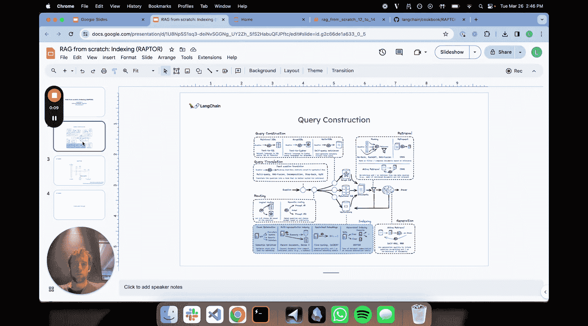
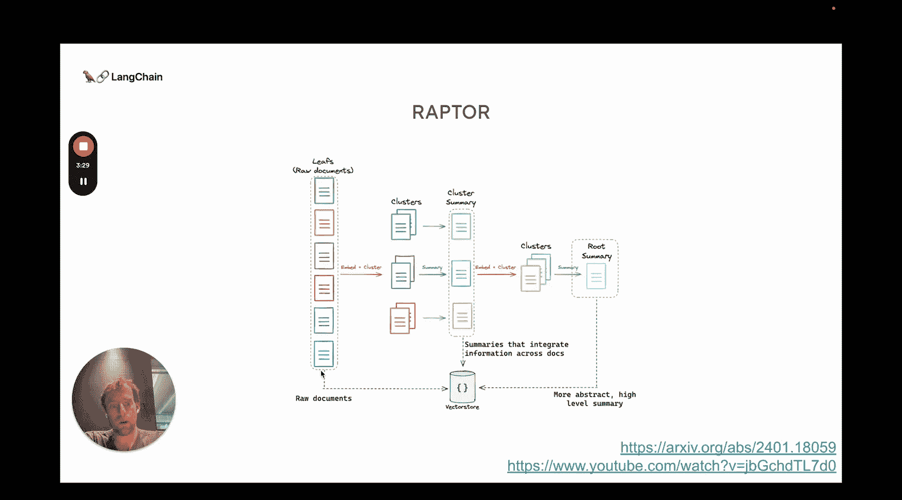
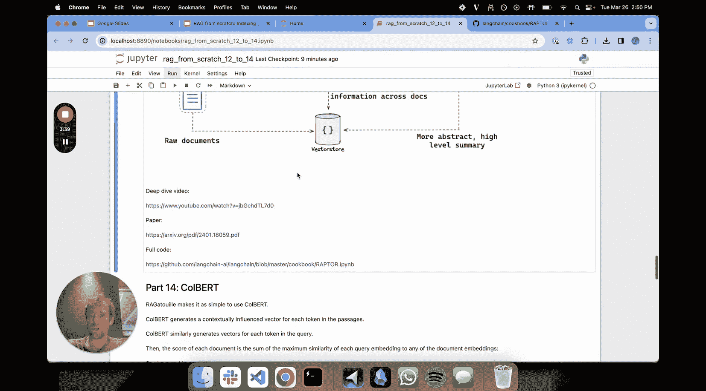
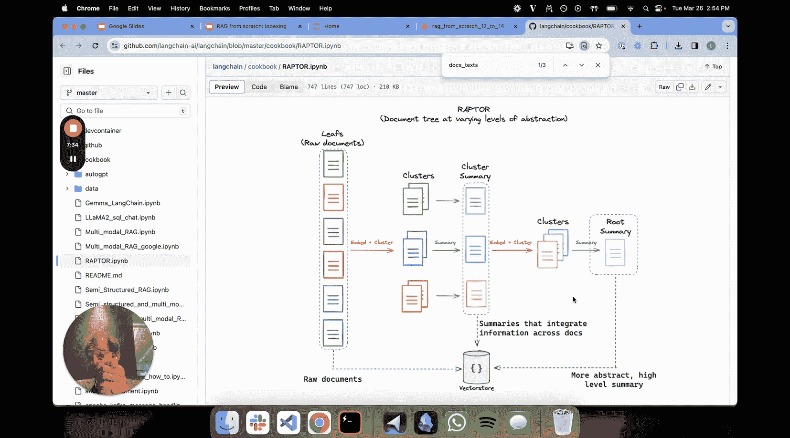

# 013：RAPTOR技术详解 🦅

在本节课中，我们将要学习一种名为RAPTOR的索引技术。RAPTOR是一种用于构建文档摘要层次化索引的方法，旨在解决检索增强生成（RAG）系统中处理不同抽象层次问题的挑战。

## 概述

上一节我们讨论了多表征索引等技术。本节中，我们来看看RAPTOR技术。RAPTOR属于一系列可应用于向量数据库的不同索引技术范畴。

## 高层次直觉

一些提问需要从语料库中获取非常详细的信息来回答，例如涉及单个文档或单个文本块的问题。我们可以称这些问题为**低层次问题**。

另一些提问则需要整合跨越文档广泛范围的信息，例如涉及多个文档或单个文档内多个文本块的问题。我们可以称这些问题为**高层次问题**。

在检索中通常存在一个挑战：我们通常进行K近邻检索，这意味着我们会从向量库中取出一定数量的文本块。但如果你有一个问题需要跨越五个、六个甚至更多不同文本块的信息，而这个数量可能超过你检索中设置的K参数，该怎么办？例如，你通常可能设置K=3，只检索三个文本块，但一个非常高层次的问题可能受益于超过三个文本块的信息。

RAPTOR技术本质上是一种构建文档摘要层次化索引的方法。其核心直觉如下：

1.  从一组作为叶节点的文档开始。
2.  将它们进行聚类。
3.  然后总结每个聚类。

每个相似文档的聚类将整合来自你上下文中的信息。你的上下文可能是一堆不同的分割文本，甚至可能跨越一堆不同的文档。你基本上是捕获相似的文档，并在一个摘要中整合它们的信息。

有趣的是，这个过程会递归进行，直到达到某个限制，或者最终得到一个单一的聚类，这个聚类是你所有文档的一个非常高层次的摘要。

论文表明，如果你基本上将所有这些东西合并，并作为一个大池一起索引，你会得到一个跨越抽象层次结构的、非常棒的文本块数组。你有一堆来自单个文档的文本块，这些是更详细的、仅与该文档相关的块；同时你也有来自这些摘要的块（或者更准确地说，是摘要本身，一种提炼）。左边的原始块代表你的叶节点，是原始形式的信息（原始块或原始文档），然后你还有这些更高层次的摘要，它们都被一起索引。

因此，如果你有更高层次的问题，它们在语义搜索中应该与这些更高层次的摘要块更相似。如果你有更低层次的问题，那么它们将检索到这些更低层次的块。这样，你就在问题类型的抽象层次结构上获得了更好的语义覆盖。这就是其直觉。论文通过一系列出色的研究证明了这种方法效果很好。

## 代码概览

接下来，我们进行一个代码概览。我已经将这个RAPTOR技术添加到了“RAG从零开始”课程笔记本中。

该技术有些详细，所以我只想在这里给你一个非常高层次的概述。如果你想深入了解，可以观看深度解析视频。

我们再次讨论这个抽象层次结构。我将此技术应用于一整套LangChain文档。这是我加载我们所有LangChain表达式语言文档的过程，大约有30个文档。你可以看到我在这里做了每个文档令牌数的直方图，有些相当大，但大多数都相当小，少于4000个令牌。

我所做的是单独索引所有这些原始文档。你可以想象所有这些原始文档都在左边。然后，我进行嵌入、聚类、摘要，并递归地执行此过程，直到达到（在这个案例中，我相信我只设置了大约三个递归层级）。然后我将它们全部保存到我的文档库中。

这就是高层次的想法：我将这个RAPTOR技术应用于一大堆具有相当多令牌数的LangChain文档。我使用了Clustering方法以及OpenAI。这里讨论了它们使用的聚类方法，这很有趣。如果你真的感兴趣，可以自己深入研究。这里引用了他们的大量代码。

这基本上实现了他们使用的聚类方法。这只是简单的文档嵌入阶段，基本上是嵌入和聚类。一些文本格式化，在这里对聚类进行摘要，然后这只是递归地运行整个过程。这就是树构建过程。

所以，基本上我有原始文档。`doc_text` 基本上就是我拉取的所有那些LangChain文档中的文本。我对它们运行这个过程。这是递归嵌入聚类的过程，基本上运行并生成那棵树。这是结果，我只是遍历结果，基本上将结果文本添加到此文本列表中。

以下是我所做的：`leaf_texts` 是所有原始文档，我将所有摘要附加到其中，这就是正在发生的事情。然后我将它们全部一起索引，这是关键点。

## 总结与优势

以上就是RAPTOR技术的全部内容。我鼓励你深入了解这项技术，它非常有趣，并且在长上下文场景中效果很好。

例如，我提出的一个论点是，这是一种很好的方法来整合跨越大型文档范围的信息。在这个特定案例中，我的单个文档是LangChain表达式语言文档，每个文档的令牌数大约在（大多数少于4000个令牌，有些相当大）这个量级。我在没有任何分割的情况下索引了它们全部，对它们进行嵌入、聚类，构建这棵树，然后继续。这一切都有效，因为我们现在拥有可以处理10万、20万甚至百万令牌上下文的语言模型。因此，你实际上可以无需任何分割，就对大范围的文档执行此过程。这是一个非常不错的方法。

本节课中，我们一起学习了RAPTOR技术，它是一种通过递归聚类和摘要构建文档层次化索引的方法，旨在更好地匹配不同抽象层次的提问，从而提升RAG系统的检索效果。我鼓励你思考并研究它，如果真想深入了解，可以观看深度解析视频。