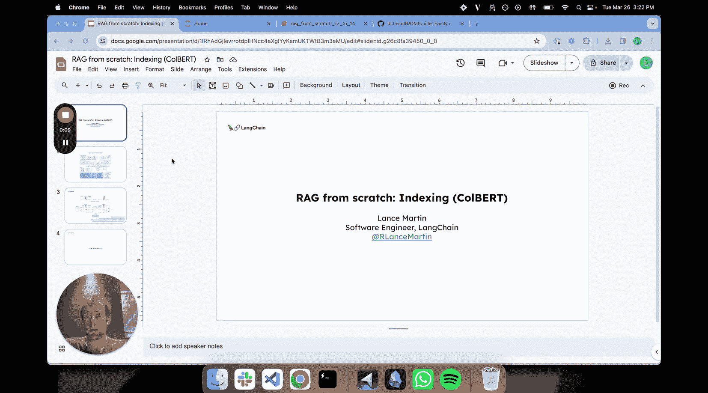
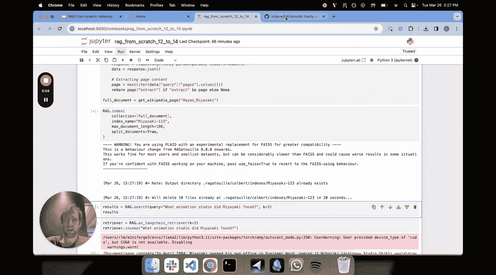
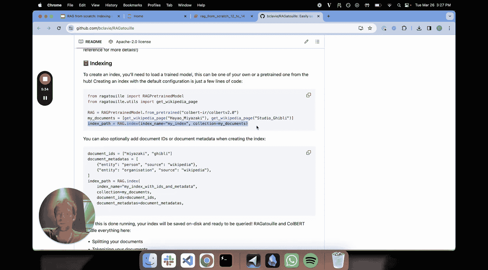
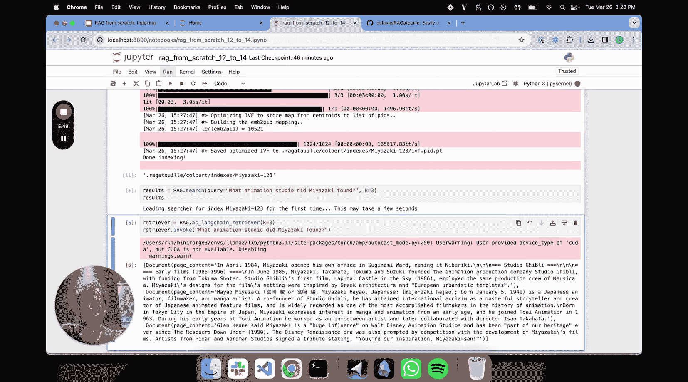
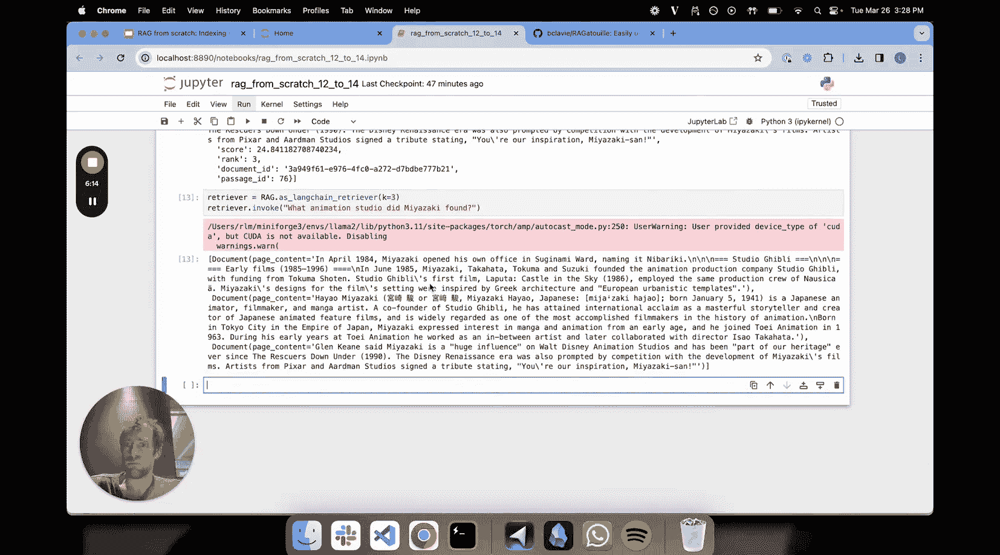
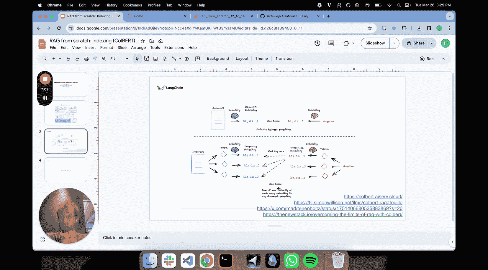

# 014：ColBERT 索引方法 🧠



在本节课中，我们将要学习一种名为 ColBERT 的高级索引方法。这是一种不同于传统向量嵌入的检索方法，旨在通过为文档中的每个词元（token）生成向量表示，来更精细地捕捉语义信息。

## 概述

在之前的章节中，我们探讨了多种索引方法，如多表示索引和分层索引。索引是 RAG 流程中至关重要的一环。我们首先讨论了查询转换，然后是如何将查询路由到特定数据库，接着是查询构造，即将自然语言转换为特定数据库的查询语言。现在，我们将关注一种先进的嵌入方法。

## 传统嵌入的局限性

传统的嵌入模型会将整个文档压缩成一个单一的向量。这个过程可以表示为：

**文档 -> 嵌入模型 -> 单个向量**

同样，问题也会被压缩成一个向量。检索时，我们计算问题向量与所有文档向量之间的相似度，并返回最相似的 K 个文档。

然而，将包含丰富细节的整个文档压缩为单个向量，可能会丢失一些细微的语义信息。ColBERT 方法正是为了应对这一挑战而设计的。

## ColBERT 的核心思想

ColBERT 的直觉非常简单直接。它不再为整个文档生成一个向量，而是：

1.  将文档分割成词元（tokens）。
2.  为**每一个词元**生成一个向量表示（嵌入）。
3.  对问题也进行同样的处理：分割成词元并为每个词元生成向量。

检索时的相似度计算过程如下：
*   对于问题中的**每一个词元向量**，计算它与文档中**所有词元向量**的相似度。
*   取其中最高的相似度值（max）。
*   对问题中所有词元的“最高相似度”进行求和，这个总和就是该文档的最终相关性分数。

简而言之，其评分机制可以概念化为：
`最终分数 = Σ( max( 问题词元_i 与 所有文档词元的相似度 ) )`

这种方法被报告具有非常强的检索性能。

## 实践：使用 RAGatouille 库

接下来，我们通过代码来实践 ColBERT。有一个名为 RAGatouille 的优秀库，可以让我们轻松尝试 ColBERT。


首先，我们安装必要的库并加载一个预训练的 ColBERT 模型。

```python
# 安装 RAGatouille
# pip install ragatouille

from ragatouille import RAGPretrainedModel

# 加载预训练模型
RAG = RAGPretrainedModel.from_pretrained("colbert-ir/colbertv2.0")
```

然后，我们准备一些文档数据并创建索引。以下示例使用了一篇关于宫崎骏的维基百科文章。



```python
# 准备文档
documents = ["这里是您的文档文本内容...", "另一个文档..."]

# 创建索引
index_path = RAG.index(
    collection=documents,
    index_name="my_colbert_index",
    max_document_length=300  # 设置最大文档长度
)
```

索引创建完成后，我们就可以进行检索了。

```python
# 进行检索
results = RAG.search(query="宫崎骏发现了什么？", k=3)
for doc in results:
    print(doc["content"])
```

此外，RAGatouille 的检索器可以很方便地集成到 LangChain 中，作为一个标准的检索器组件使用，与各种语言模型和其他模块（如重排序器）协同工作。





```python
from ragatouille import RAGPretrainedModel
from langchain.retrievers import RAGatouilleRetriever

# 创建 LangChain 检索器
retriever = RAGatouilleRetriever.from_pretrained("colbert-ir/colbertv2.0", index_path=index_path)
# 现在可以将其用于 LangChain 链中
```

## 总结

本节课我们一起学习了 ColBERT 索引方法。我们首先回顾了传统嵌入方法可能存在的限制，然后详细介绍了 ColBERT 如何通过为文档和问题中的每个词元生成向量，并采用“最大相似度求和”的机制来计算相关性，从而提供更精细的语义检索。最后，我们使用 RAGatouille 库快速实践了如何创建 ColBERT 索引并进行检索，并了解了如何将其集成到 LangChain 生态中。





ColBERT 是一种非常有趣的替代性索引方法，尤其值得在需要处理较长文档、追求更高检索精度的场景下进行探索和试验。