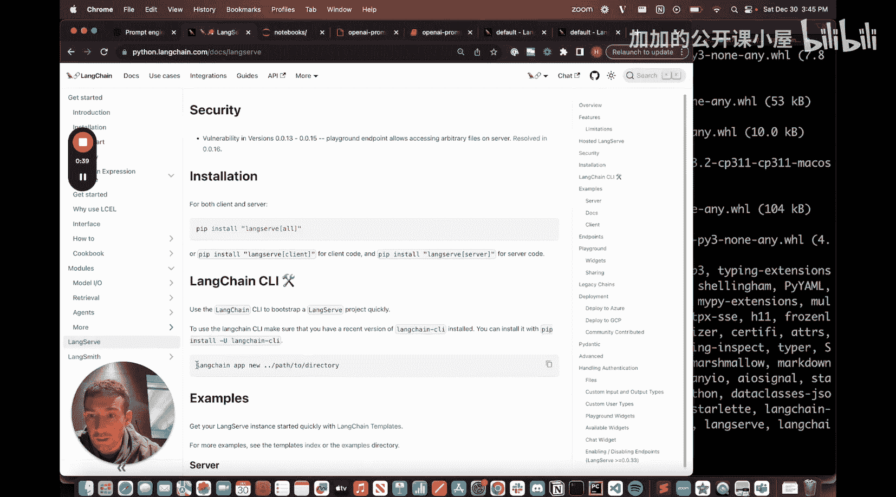
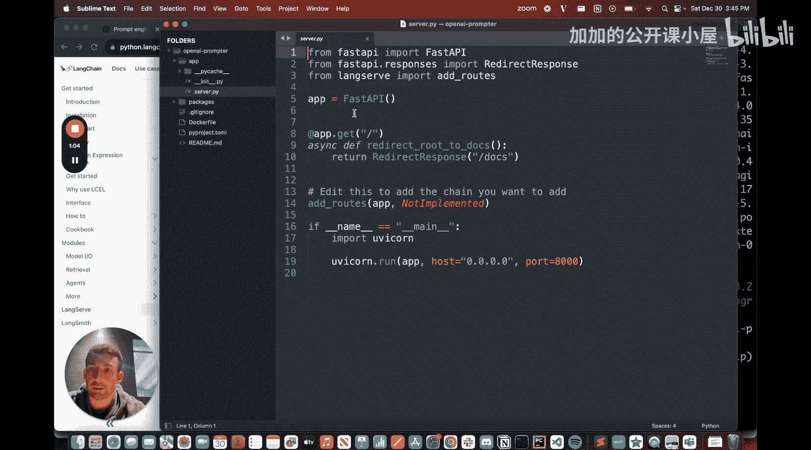
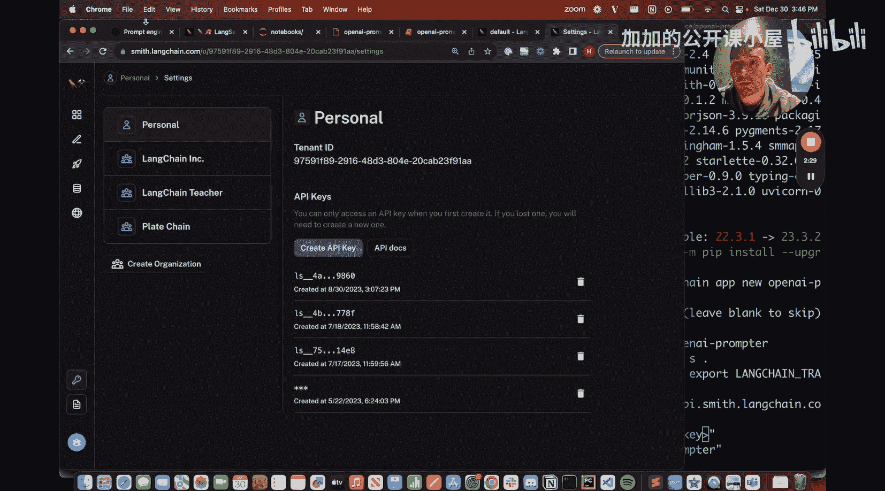
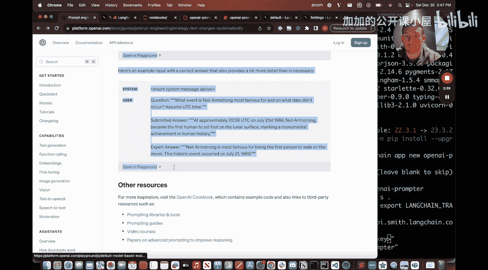
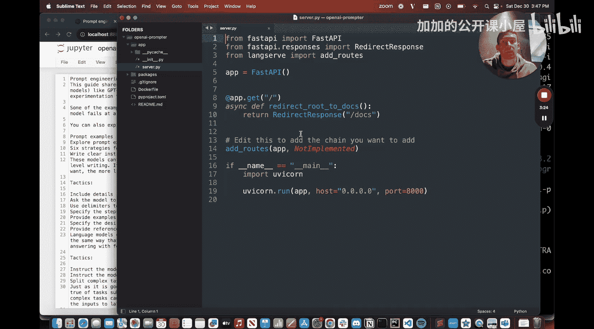
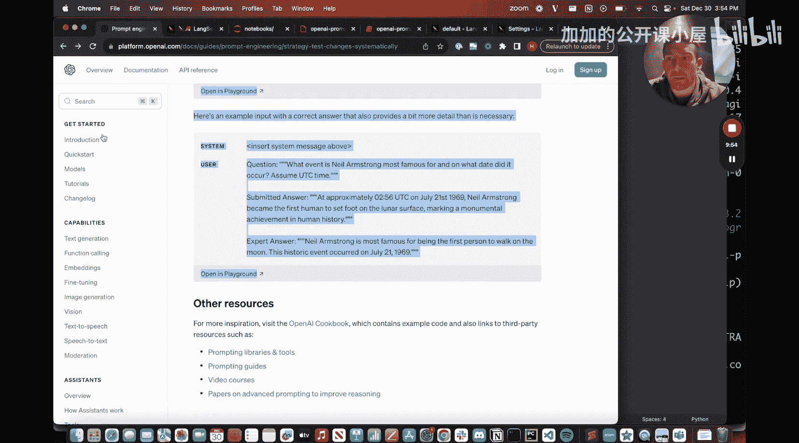

#  001：自动提示构建器（使用托管 LangServe）

在本节课中，我们将学习如何使用 LangChain 和 LangServe 来构建一个自动提示构建器。我们将从设置开发环境开始，逐步创建一个能够根据用户目标生成高质量提示模板的链。

## 环境设置



在开始构建之前，我们需要先设置好开发环境。以下是设置步骤。

首先，我创建了一个全新的虚拟环境。接下来，我将使用 LangServe 来设置一个模板链接或应用程序。使用 LangServe 的原因是，它能让项目在完成后更容易部署。



第一步是引导一个 LangChain 项目。我将使用 `langchain-cli` 来完成这个操作。安装完成后，我将创建一个新的应用，并将其命名为 `openai_prompter`。我不会添加额外的包，因为我将创建自己的组件。

创建完成后，进入项目目录。我主要关注的是这里的 `langserve` 模块，它封装了 FastAPI，能让我的 LangChain 链部署变得非常简单。

最后一步是设置 LangSmith。LangSmith 目前处于内测阶段。如果你没有访问权限但想跟着学习，可以通过 LinkedIn 或 Twitter 联系我，我会帮你获取访问权限。LangSmith 能让我们在开发过程中轻松调试，这对于涉及大量提示工程的工作非常有帮助。

在之前的视频中，有观众建议我详细讲解如何设置 LangSmith。你可以进入你的项目页面，创建一个新项目，例如命名为 `OpenAI Prompter`。然后进入设置页面，导出一些 API 密钥。你可以复制这里的命令，粘贴到你的环境中，并添加你的 API 密钥。你可以在 API 密钥页面创建新的密钥。我已经提前完成了这些设置。

## 准备提示工程指南

现在，让我们回到提示工程指南。我们要做的第一件事是复制指南的全部内容，因为我们将在提示中使用它来帮助我们编写更好的提示。



我将内容粘贴到一个文件中。然后，我将在 Jupyter Notebook 中创建我的链，之后再将其放入应用程序中。

我这样做有两个原因。一个真实的原因是，这将是一个迭代过程。我将在 LangSmith 和 Notebook 中进行一些提示工程，而 Notebook 这样的交互式环境非常适合快速迭代。另一个原因是，我想展示如何轻松地从 Notebook 中创建并导出一个链。



大多数情况下，这个过程相当简单。保存文件后，我得到了这个 Jupyter Notebook。让我们加载刚才粘贴进去的内容。

## 导入必要组件

接下来，让我们导入一些 LangChain 中我们将要用到的组件。

```python
from langchain.prompts import PromptTemplate
from langchain.schema.output_parser import StrOutputParser
from langchain.chat_models import ChatOpenAI
```



我导入了三个重要的东西。我将编写一个相当简单的链，也许后续会变得更复杂，但初始版本应该很简单，因为我将使用一个具有长上下文窗口并能处理所有这些指令的模型。

*   **PromptTemplate**：帮助我构建模型的输入结构。
*   **StrOutputParser**：基本上是将模型输出的消息格式（这是新版聊天模型的响应格式）转换为字符串。
*   **ChatOpenAI**：这是 LangChain 对 OpenAI 模型的封装，我将使用这些模型。

## 构建提示模板

现在是构建提示模板的有趣部分。这个模板将帮助我创建一个链，该链可以接收一个目标并写出一个好的提示。

```python
instructions = """[这里粘贴你的提示工程指南内容]"""

template = f"""
{instructions}

基于以上指南，请帮我编写一个好的提示模板。
这个模板应该是一个 Python 字符串。
它可以接受任意数量的输入变量。
模板应返回一个格式化的提示字符串。

目标：{{objective}}
"""
```

这里有一个有趣的点，我稍后会详细说明。基本上，我现在将这些指令作为一个变量传入提示中。目前，我们暂时假设这就是我们要做的。

然后，让我们在这里添加一些分隔符，并定义模板内容。实际上，我想写的不是一个单一的提示，而是一个提示模板。因为我认为大多数用户希望编写可以在代码中使用的提示模板，至少大多数 LangChain 用户是这样。

## 创建并测试链

现在，我们来创建这个链。

```python
prompt = PromptTemplate.from_template(template)
model = ChatOpenAI()
chain = prompt | model | StrOutputParser()
```

如前所述，我将把指令作为变量传入。让我们看看如果不这样做会怎样。如果我们只是简单地将指令硬编码在模板字符串里，你也可以轻松做到。

如果我这样做，我会得到 `prompt = PromptTemplate.from_template(template)`。然后创建链 `chain = prompt | model | StrOutputParser()`。

现在，我将传入一个目标。我的目标应该是什么？例如：“根据提供的上下文回答问题”。这是一个非常典型的 RAG（检索增强生成）提示，你希望语言模型根据提供的上下文来响应用户的问题。

让我们测试一下。这时我可能会遇到一个错误，因为在这些指令中，可能包含一些花括号 `{}`，它们并不是我想要格式化的变量，而只是文本的一部分。在处理代码或类似内容时，这种情况经常发生，我们也收到了很多关于如何处理它的疑问。

我首选的解决方法是采用我前面所做的：将包含这些不需要的花括号的文本视为输入变量。这意味着我现在必须将文本作为变量 `text` 提供。这有点麻烦，因为现在你有了两个输入变量。虽然这不是世界末日，但如果这个链是一个更大链条的一部分，那么情况就会变得越来越复杂和麻烦。

另一个错误可能是因为模型的上下文长度不够。我可以做一些复杂的 RAG 处理，但可能只是稍微超过了上下文窗口，而我希望使用它。

## 总结



本节课中，我们一起学习了如何为构建自动提示生成器设置 LangChain 和 LangServe 环境。我们完成了从创建项目、配置 LangSmith 到在 Jupyter Notebook 中构建基础提示链的步骤。我们还探讨了处理提示模板中特殊字符（如花括号）的一种方法，即将长文本作为变量传入。在下一节中，我们将深入迭代和优化这个提示生成链。