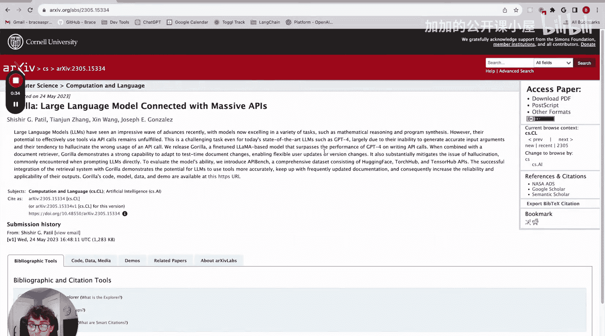
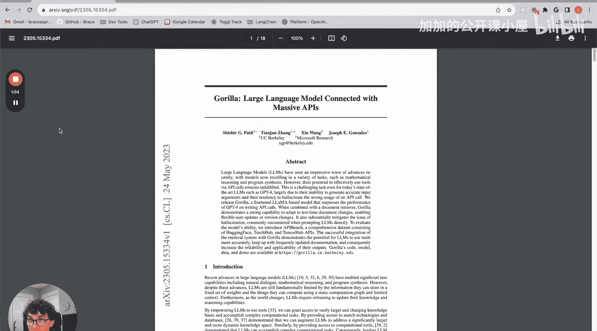
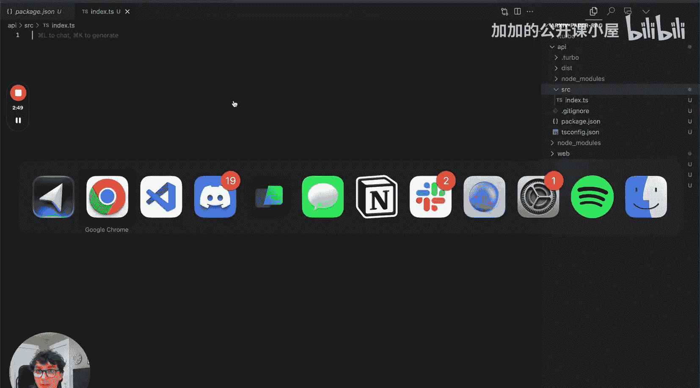
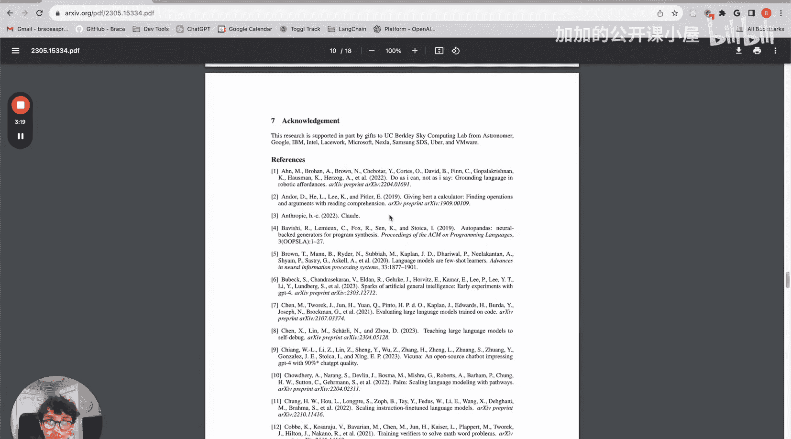
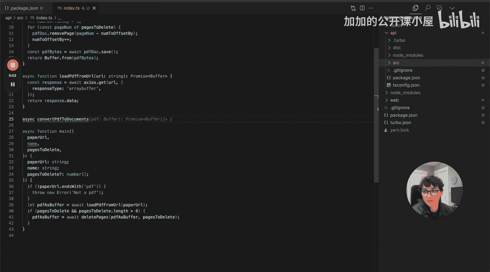

#  002：使用 TypeScript 构建全栈 RAG 应用 🚀

## 概述
在本节课中，我们将学习如何使用 LangChain 和 Next.js 前端构建一个全栈 Web 应用。该应用能够索引、处理学术论文，进行问答，并提供一个更易于理解论文内容的界面。



## 项目简介
如果你还不熟悉 arXiv，它是一个由康奈尔大学运营的网站。本质上，它是一个供研究人员发布论文的平台。例如，访问一个 arXiv URL，你可以点击下载 PDF，轻松获取论文的 PDF 格式。


这个应用的核心功能是：用户在前端提交论文 URL。后端将解析该论文，将其分割成块，并利用 GPT-4 的新 128k 上下文窗口，确保无论论文多长都能完整处理。GPT-4 将为论文生成笔记，并返回这些笔记以及一系列问题，提示用户针对论文的不同部分进行提问。之后，用户可以提出关于论文内容的问题，服务器将利用嵌入的论文块查找上下文，并基于论文内容回答问题。这样，你可以与论文“对话”，比通读全文更容易理解其内容。例如，一篇 18 页的论文，你可能只需要阅读 4 到 5 页就能获得很好的理解。




## 项目初始化
我们将从一个 TypeScript 模板仓库开始。这个模板已经创建好，包含一个 `web` 目录和一个 `api` 目录。`web` 将是一个 Next.js 应用，我们稍后会讲到。`api` 是一个简单的 TypeScript 应用，我们将使用 Express.js 将其构建为 API。

你可以从我的 GitHub 克隆这个模板。我已经设置好了这个模板，你可以克隆它并从我现在开始的地方起步。



在 `api/src` 目录下，我们有一个 `index` 文件。首先，我们将创建我们的主函数。

## 主函数设计
这个函数将接收三个参数：
1.  **论文 URL** (`paperUrl`)
2.  **论文名称** (`name`) - 用于 UI 显示，以便在网站上看到正在处理的论文名称。
3.  **要删除的页码** (`pagesToDelete`) - 这是一个可选参数，非常重要。



例如，一篇论文有 18 页，但第 10 到 12 页是参考文献和引用。这些页面充满了我们不关心的文本，并且通常包含大量关键词，可能会影响我们后续进行 RAG 语义搜索的能力。因此，这个可选参数允许用户指定要删除哪些页面，这样我们就不会对这些页面做笔记、发送给 GPT 或进行嵌入，从而获得更干净的嵌入结果。


主函数定义如下：
```typescript
async function main(paperUrl: string, name: string, pagesToDelete?: number[]) {
    // 函数主体
}
```

## 加载 PDF
主函数的第一步是从 URL 加载论文。我们将使用 `axios` 库将其作为缓冲区加载并返回。

以下是加载 PDF 的辅助函数：
```typescript
import axios from ‘axios‘;

async function loadPdfFromUrl(url: string): Promise<Buffer> {
    const response = await axios.get(url, {
        responseType: ‘arraybuffer‘
    });
    return Buffer.from(response.data);
}
```

在主函数中，我们可以先进行一个快速检查，然后调用这个函数：
```typescript
if (!paperUrl.endsWith(‘.pdf‘)) {
    throw new Error(‘Not a valid PDF‘);
}
const pdfAsBuffer = await loadPdfFromUrl(paperUrl);
```

## 删除指定页面
在将 PDF 发送给 Unstructured 进行解析之前，如果用户指定了要删除的页面，我们需要先处理这些页面。

我们将使用 `pdf-lib` 库中的 `PDFDocument` 类来加载和处理页面。

以下是删除页面的函数：
```typescript
import { PDFDocument } from ‘pdf-lib‘;

async function deletePages(pdfBuffer: Buffer, pagesToDelete: number[]): Promise<Buffer> {
    const pdfDoc = await PDFDocument.load(pdfBuffer);
    let numOffsetBy = 1;
    for (const pageNumber of pagesToDelete) {
        pdfDoc.removePage(pageNumber - numOffsetBy);
        numOffsetBy++;
    }
    const newPdfBytes = await pdfDoc.save();
    return Buffer.from(newPdfBytes);
}
```

在主函数中，我们检查并调用此函数：
```typescript
if (pagesToDelete && pagesToDelete.length > 0) {
    pdfAsBuffer = await deletePages(pdfAsBuffer, pagesToDelete);
}
```

## 使用 Unstructured 解析 PDF
下一步是使用 Unstructured 来分块和解析我们的 PDF。Unstructured 是 LangChain 提供的一个组件，它能将非结构化数据（如 PDF）分解成更小、更易管理的块，例如标题、正文、图像或表格。这使得处理这些非结构化数据格式变得非常容易。

我们将定义一个函数，将 PDF 转换为 LangChain 的 `Document` 类型。`Document` 类型是我们用于指定随后将要嵌入的文档的类型。




## 总结
本节课中，我们一起学习了如何开始构建一个全栈 RAG 应用。我们设置了项目结构，定义了主函数，并实现了从 URL 加载 PDF、删除指定页面以及准备使用 Unstructured 进行解析的功能。在下一节中，我们将深入探讨如何使用 Unstructured 和 LangChain 来处理和嵌入论文内容。