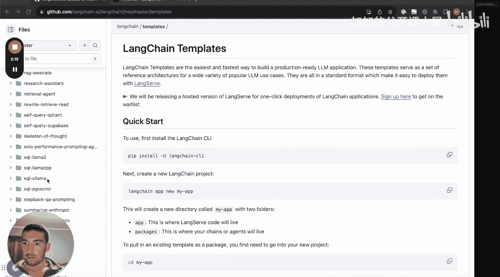
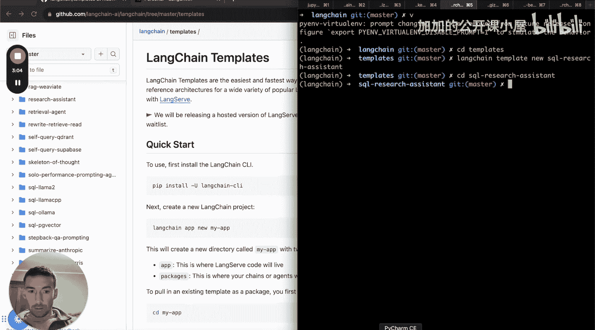
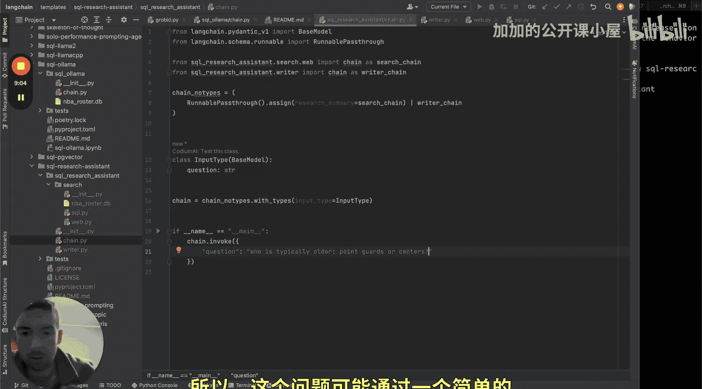
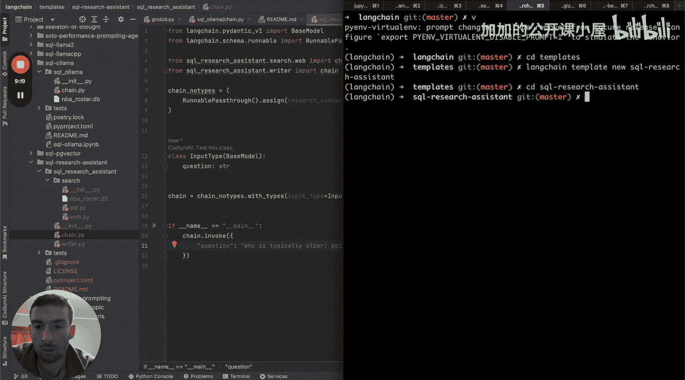
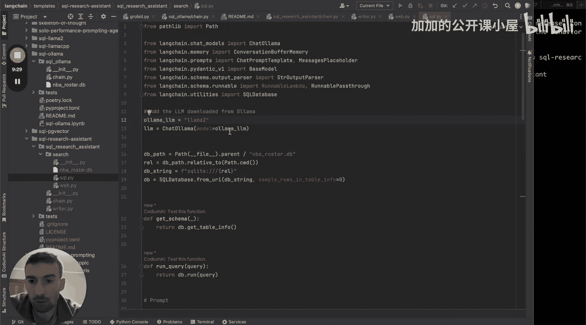
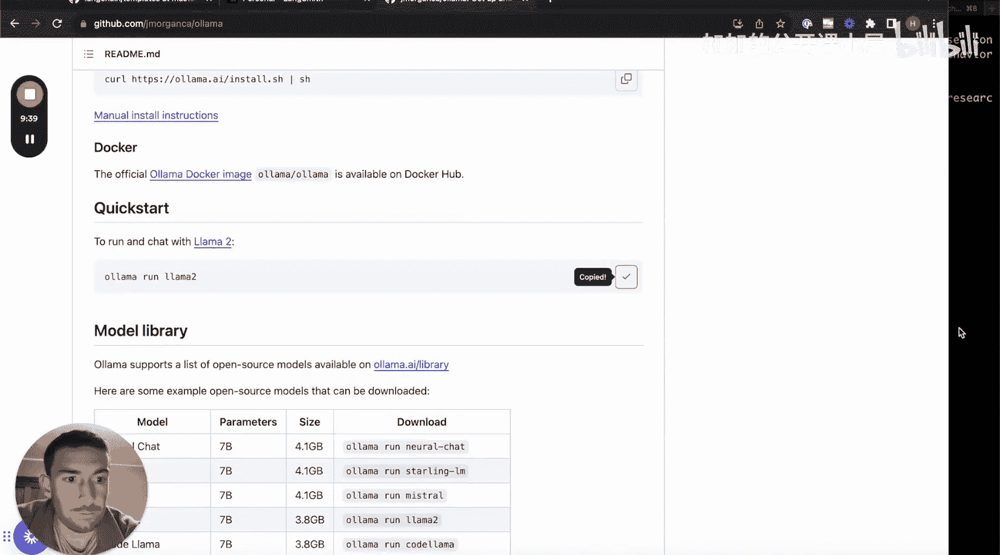
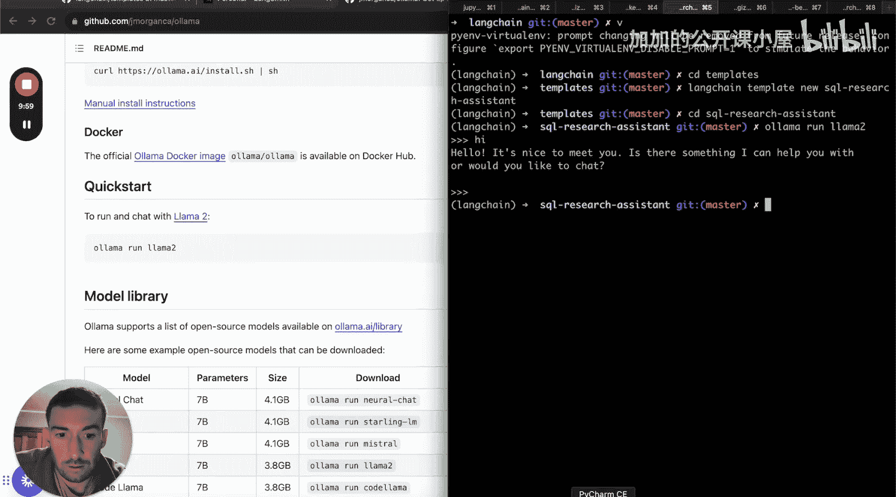

#  003：SQL 研究助手

在本节课中，我们将学习如何构建一个基于 SQL 数据库的研究助手。我们将修改现有的研究助手模板，使其能够通过执行 SQL 查询来获取信息，并生成研究报告。这个项目结合了两个有趣的概念：研究助手链和 SQL 问答链，展示了如何让多个具有不同职责的 LLM 协同工作。

## 项目概述与目标

上一节我们介绍了研究助手的基本概念，本节中我们来看看如何将其与 SQL 数据库结合。

许多数据以结构化格式存储，能够通过自然语言查询并基于这些数据撰写研究报告，将解锁大量应用场景。我们将使用一个 SQL 链作为研究工具，这意味着研究助手将连接到另一个链，该链本身使用 LLM 生成 SQL 查询并返回结果。这展示了让多个 LLM 各司其职、相互通信和委派任务的思想。

我们将结合研究助手模板和一个现有的 SQL 问答模板（SQL Oma）来构建这个项目。我们将从头开始设置环境变量和代码，确保你能清晰地看到每一步。

## 环境与模板初始化

首先，我们需要初始化工作环境并创建新的模板。

以下是为项目设置基础结构的步骤：

1.  进入 LangChain 模板仓库。
2.  使用 `langchain template new` 命令创建一个名为 `sql_research_assistant` 的新模板。
3.  进入新创建的模板目录。

完成这些步骤后，你会看到一个包含基础骨架代码的目录，其中 `chain.py` 文件包含一个简单的示例。

## 整合研究助手代码

接下来，我们将把原始的研究助手代码整合到新模板中。

研究助手主要由两个组件构成：研究链和写作链。写作链负责将收集到的信息重写为研究报告，这部分我们可以基本保持不变。我们需要修改的是研究链，将其从互联网搜索改为执行 SQL 查询。

原始的研究链会生成一系列子问题，然后通过网络搜索获取每个子问题的答案。我们的目标是保留生成子问题的部分，但将搜索和汇总答案的过程替换为 SQL 查询。

## 引入并修改 SQL 链

为了实现对 SQL 数据库的查询，我们需要引入一个 SQL 问答链。

我们将参考 `sql_olma` 模板中的 SQL 链。这个链原本设计用于对话式记忆，但我们的研究助手只需要针对一次性问题执行查询。因此，我们需要对其进行简化，移除与对话历史相关的部分，只保留核心的 SQL 问答功能。

修改后的 SQL 链将能够接收一个自然语言问题，生成相应的 SQL 查询语句，在指定的数据库上执行，并返回查询结果。

## 构建最终的研究链

现在，我们将修改后的 SQL 链集成到研究助手的主流程中。

核心思路是：研究链首先生成多个子问题，然后使用我们创建的 `SQLAnswerChain` 并行地处理每一个子问题。每个子问题都会被转化为 SQL 查询，并在数据库上执行，得到的答案将被收集起来。最后，所有这些子问题的答案将被汇总，并传递给写作链，由其整理成最终的研究报告。

我们添加一个简单的测试用例来验证功能，例如：“控球后卫和中锋，哪个位置通常年龄更大？”

## 配置与运行模型

在运行链之前，需要确保本地 LLM 服务（如 OLLAMA）已启动并运行。

我们计划使用 Zephyr 模型，但如果你的硬件资源有限，也可以切换到更小的模型，如 Llama 2。OLLAMA 使得与本地语言模型的交互变得非常简便。通过运行 `ollama run ` 命令，你可以启动并验证模型服务是否正常运行。

## 总结

本节课中我们一起学习了如何构建一个 SQL 研究助手。我们首先概述了项目目标，即让研究助手能够查询结构化数据库。然后，我们初始化了项目模板，并整合了基础的研究助手代码。接着，我们引入并简化了一个 SQL 问答链，将其核心功能嵌入到研究流程中，替换了原来的网络搜索步骤。最后，我们讨论了如何配置本地 LLM 环境以运行整个应用。这个项目清晰地演示了如何组合不同的链和模型，以创建功能更强大、更专业的 AI 应用。