#  004：从零构建新模板 🚀

在本节课中，我们将学习如何为 LangChain 实现一个全新的模板。我们将基于一篇名为“Skeleton of Thought”的新论文来构建这个模板。该论文的核心思想是让大型语言模型进行并行解码，以提高响应速度。我们将利用 LangChain 表达式语言的特性，轻松实现这一过程。

## 创建新模板 📁

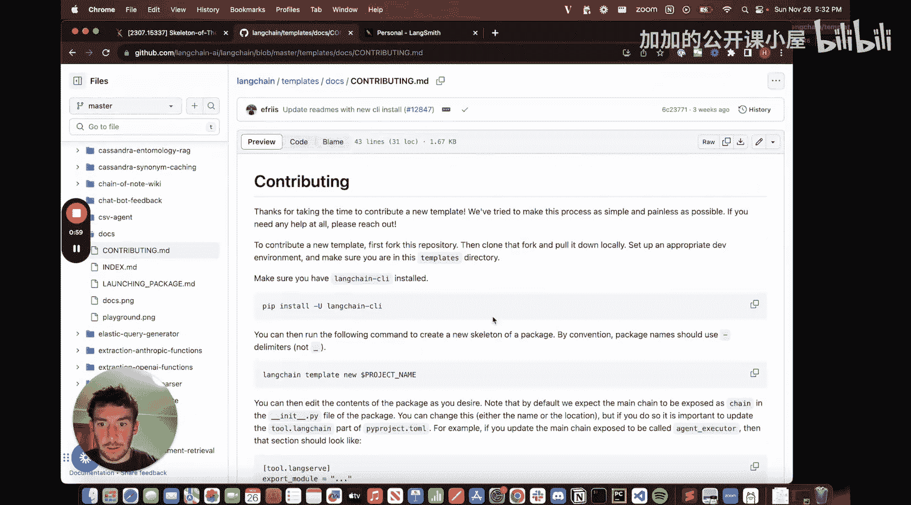

上一节我们介绍了本课程的目标，本节中我们来看看如何创建一个新的 LangChain 模板。

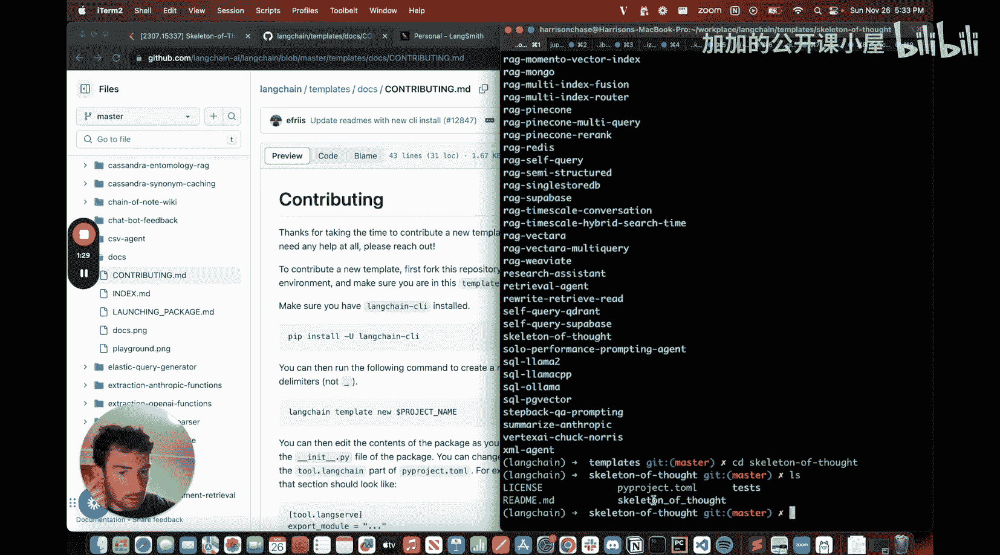

首先，我们需要进入 LangChain 模板目录。在这里，我们将创建一个名为 `skeleton-of-thought` 的新模板。创建完成后，目录结构会自动生成，其中包含一些基础文件，如 `README.md`、环境变量配置文件和一个简单的 `chain.py` 文件。

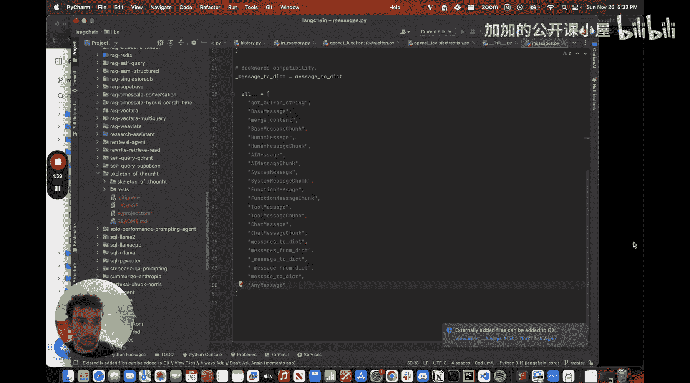

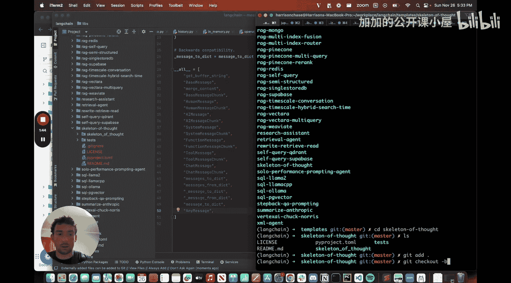

以下是初始模板目录中的关键文件：
*   `README.md`: 模板的描述文档。
*   `pyproject.toml`: 项目依赖配置文件，我们将添加 OpenAI 作为依赖。
*   `chain.py`: 核心文件，我们将在这里实现我们的逻辑链。

## 理解 Skeleton of Thought 论文 📄

在开始编码之前，我们需要理解“Skeleton of Thought”这篇论文的核心思想。其基本流程分为两步：

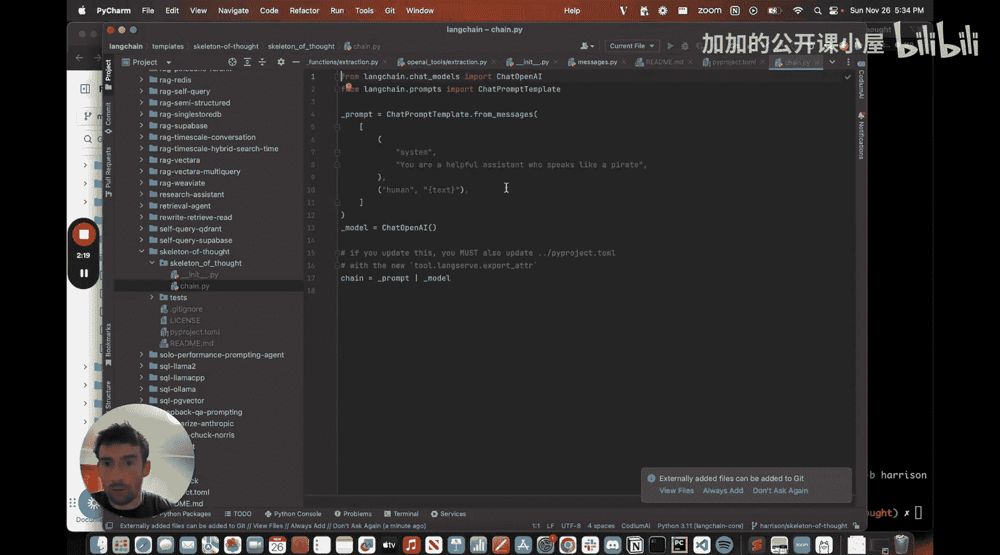

1.  **生成骨架**：针对用户提出的问题，语言模型首先生成一个简短的要点列表（即“骨架”）。
2.  **并行扩展**：然后，模型并行地对骨架中的每一个要点进行扩展和详细阐述。

这种方法有两个主要优点：
*   **速度提升**：由于扩展步骤是相互独立的，可以并行执行，从而显著加快整体响应速度。
*   **规划与执行**：它模拟了先规划（生成骨架）后执行（扩展要点）的思考过程。

例如，对于问题“职场中最有效的冲突解决策略是什么？”，传统模型会逐字生成完整答案。而 Skeleton of Thought 会先快速生成如“1. 积极倾听\n2. 聚焦问题本身\n3. 寻求共同点”这样的骨架，再同时扩展每一个点。

## 实现骨架生成链 🔗

现在，我们开始实现第一步：生成骨架的链。

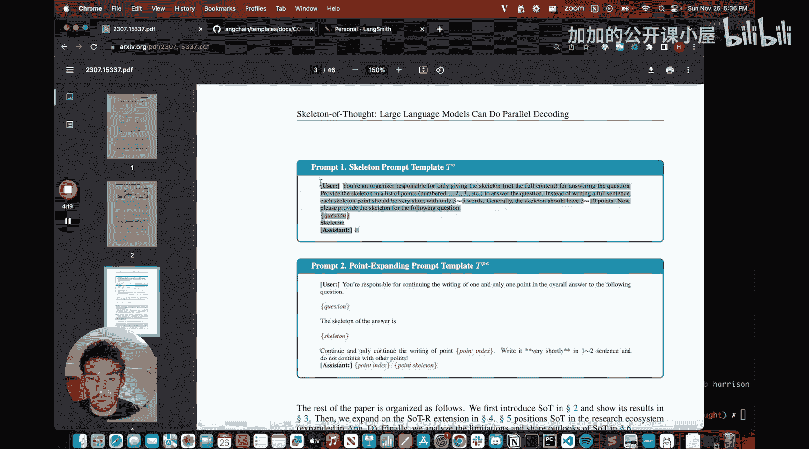

我们首先在 `chain.py` 中定义用于生成骨架的提示模板。这个模板将接收用户的问题，并指导模型输出要点列表。

```python
# 骨架生成提示模板
skeleton_prompt = PromptTemplate.from_template(
    “””
    请针对以下问题，生成一个简短的要点列表（骨架）：
    问题：{question}
    骨架：
    “””
)
```

接着，我们创建一个简单的链，它使用这个提示模板并调用语言模型。

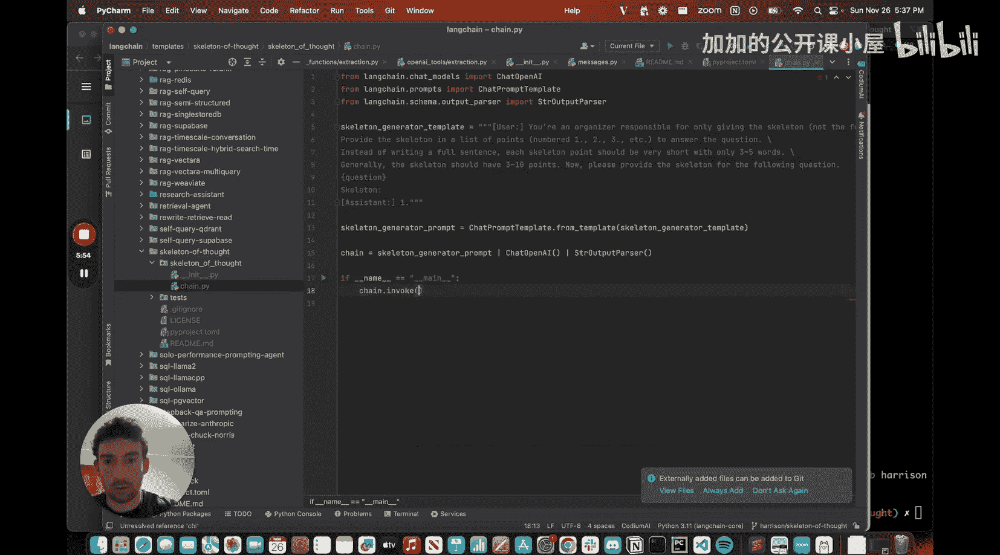

```python
# 创建骨架生成链
skeleton_chain = skeleton_prompt | llm | StrOutputParser()
```

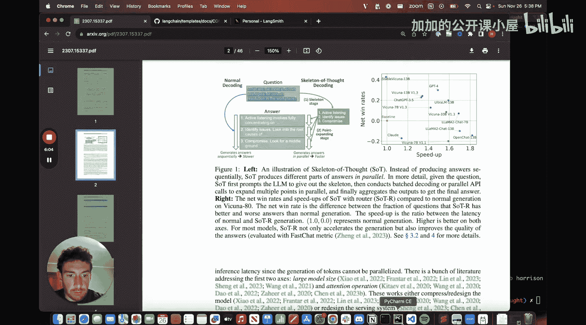

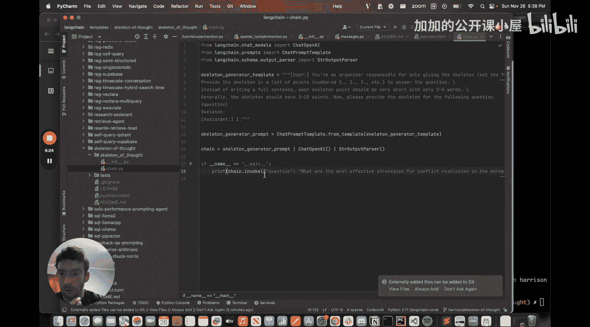

为了测试和调试，我们使用 LangSmith 工具。LangSmith 可以追踪链的执行过程，方便我们在其提供的 Playground 中实时调整提示词和查看结果。运行链后，我们就能得到针对示例问题的骨架要点。

## 实现要点扩展链 ⚡

上一节我们实现了骨架生成，本节中我们来看看如何并行扩展这些要点。

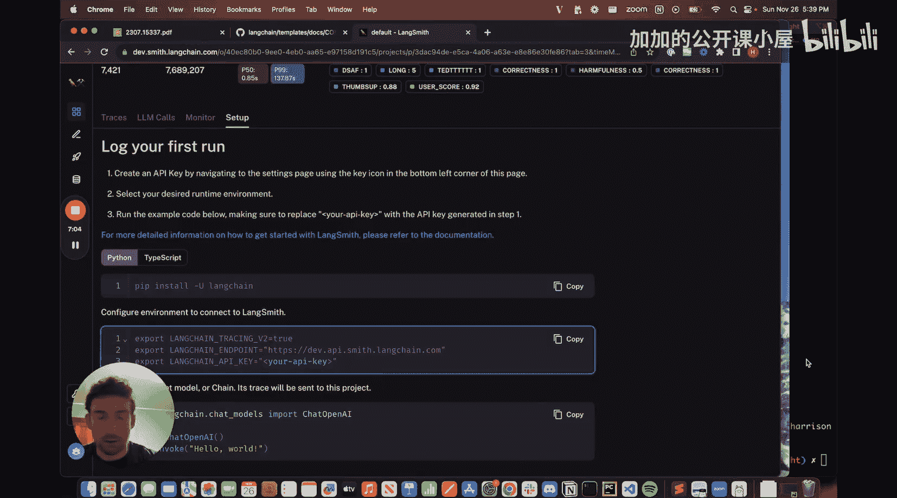

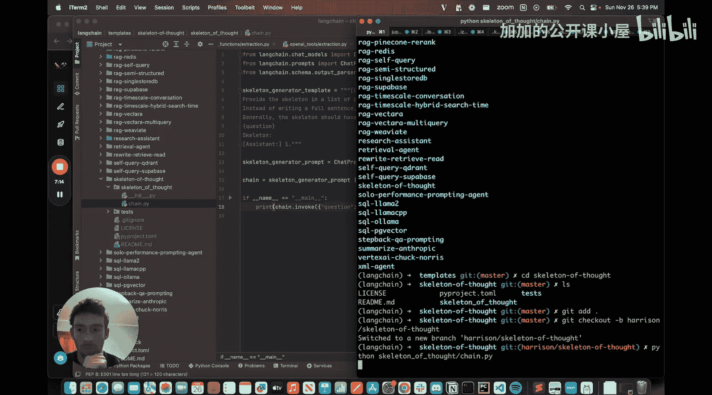

接下来，我们实现第二步：扩展骨架中每个要点的链。我们需要定义第二个提示模板，它接收原始问题、生成的整个骨架、当前要点的索引和内容。

```python
# 要点扩展提示模板
expansion_prompt = PromptTemplate.from_template(
    “””
    基于以下骨架，请详细扩展第 {point_index} 个要点：
    原始问题：{question}
    整体骨架：{skeleton}
    待扩展要点：{point_skeleton}
    详细扩展：
    “””
)
```

然后创建扩展链：
```python
expansion_chain = expansion_prompt | llm | StrOutputParser()
```

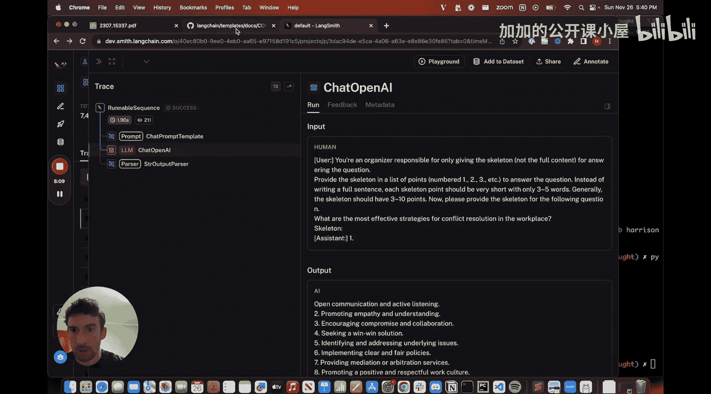

关键的一步是利用 LangChain 表达式语言实现并行化。我们可以将骨架生成链的输出（一个要点列表）映射到多个并行的扩展链调用上。

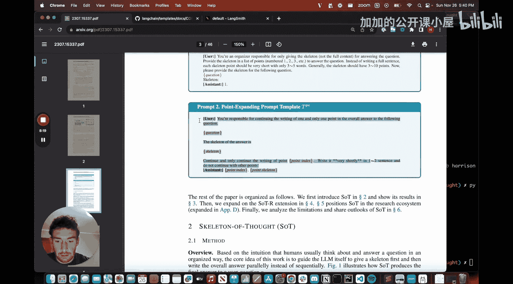

```python
# 组合链：先生成骨架，然后并行扩展每个要点
full_chain = skeleton_chain | (
    lambda skeleton: [
        expansion_chain.invoke({
            “question”: question,
            “skeleton”: skeleton,
            “point_index”: i,
            “point_skeleton”: point
        })
        for i, point in enumerate(parse_skeleton(skeleton)) # 假设有一个解析函数
    ]
)
```

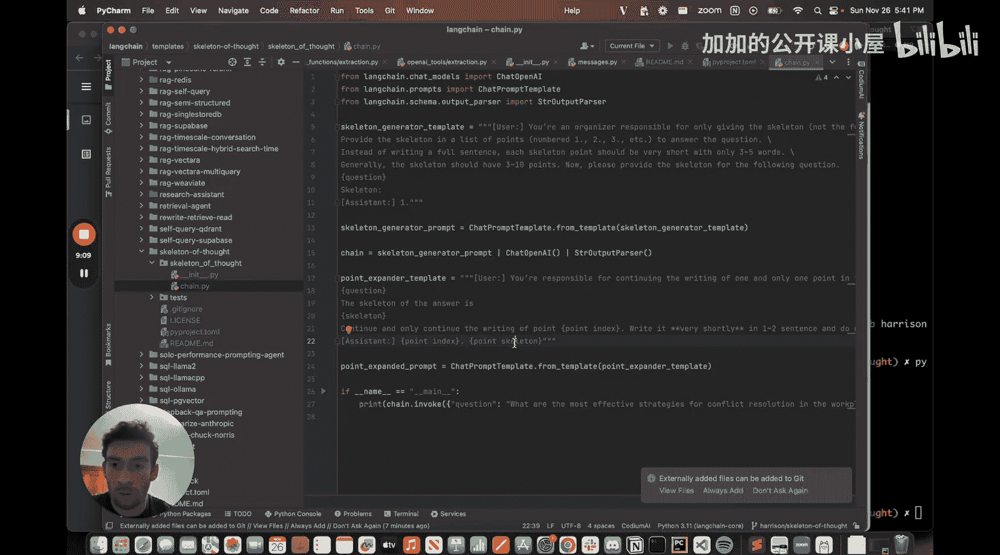

通过这种方式，所有要点的扩展任务将同时进行，充分利用了并行计算的优势。

## 总结 🎯

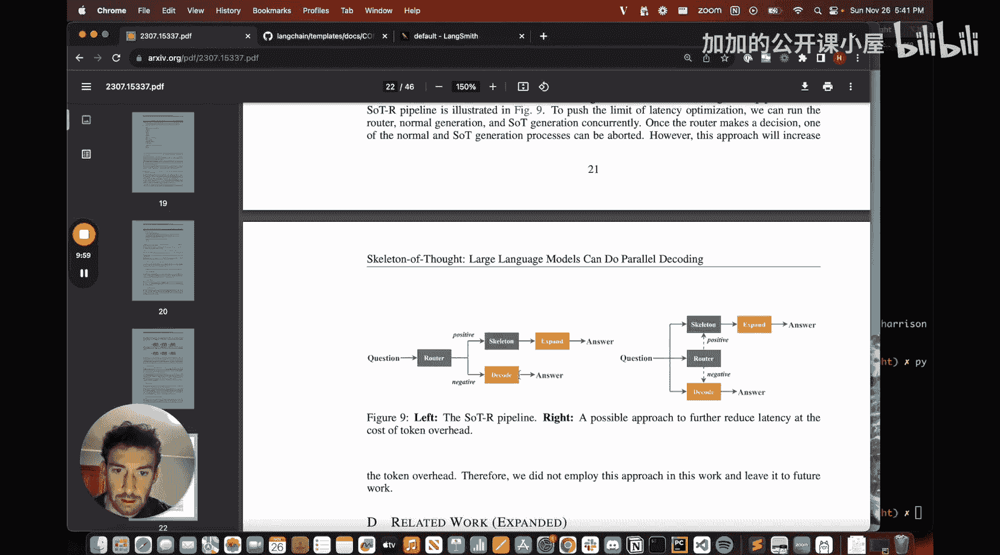

本节课中我们一起学习了如何从零开始为 LangChain 构建一个新模板。我们以“Skeleton of Thought”论文为例，实现了其核心的两阶段流程：首先生成回答的骨架要点，然后并行地对每个要点进行扩展。我们利用了 LangChain 表达式语言简化了链的构建和并行化过程，并使用 LangSmith 工具来辅助调试和优化。这个模板展示了如何通过结构化的并行调用，来提升语言模型应用的效率和响应速度。