#  005：从零构建研究助手 🔍

在本节课中，我们将从零开始构建一个研究助手。这个助手基于Tvili AI的研究助手，它是一个复杂的、实用的、性能良好的语言模型应用，远不止简单的聊天功能。我们将使用LangChain来构建它，并深入了解其背后的决策过程。

## 概述

Tvili AI的研究助手是一个网络平台（也有开源版本），你可以给它一个任务（例如，“LangChain和LangSmith有什么区别？”），它会从网络上进行大量研究，并生成一份详细的长篇报告。这份报告比ChatGPT或其他搜索引擎的回复要长得多，生成时间也更长，因为背后有复杂的处理流程。其优点是能够进行深入的研究，从而产生更好、更有趣的回应。

该助手基于一个名为“GT Researcher”的开源项目。其核心工作流程是：接收任务 -> 生成一系列研究问题 -> 为每个问题在线查找网页 -> 总结这些网页 -> 基于所有摘要生成最终报告。这个过程涉及许多环节，其中很多可以并行处理以提高速度。

接下来，让我们开始动手构建。

## 环境设置与依赖安装

我们将使用OpenAI的API，因此你需要一个OpenAI API密钥。同时，我们也会使用LangSmith来展示和调试内部过程。

首先，设置环境变量，包括`OPENAI_API_KEY`和LangSmith的相关密钥。

接着，安装必要的Python包：

```bash
pip install langchain openai duckduckgo-search
```

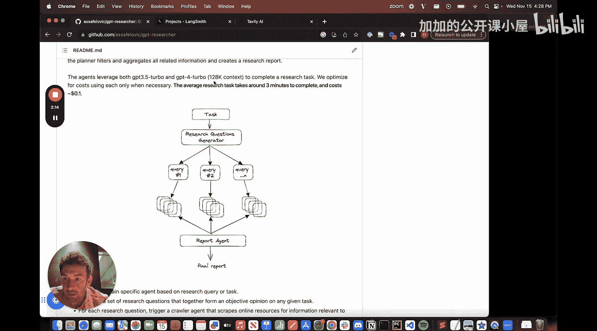

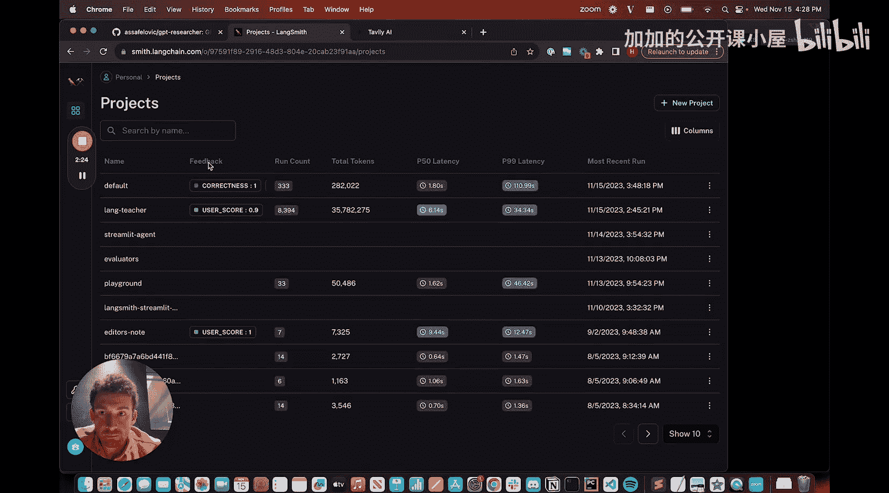

我们还需要`requests`和`beautifulsoup4`来帮助抓取网页内容：


```bash
pip install requests beautifulsoup4
```

## 第一步：构建网页内容摘要器

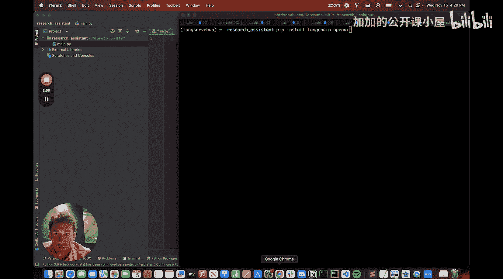

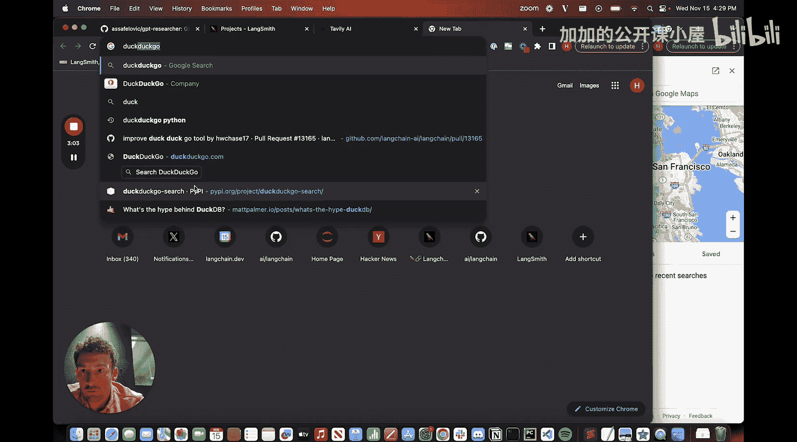

让我们从核心功能之一开始：根据特定问题总结网页内容。这样做有几个好处：可以处理大量不同的网页和信息；即使大语言模型有足够长的上下文窗口，拆分成小任务通常性能更好、更专注；便于并行处理；并且可以使用非超长上下文的模型。

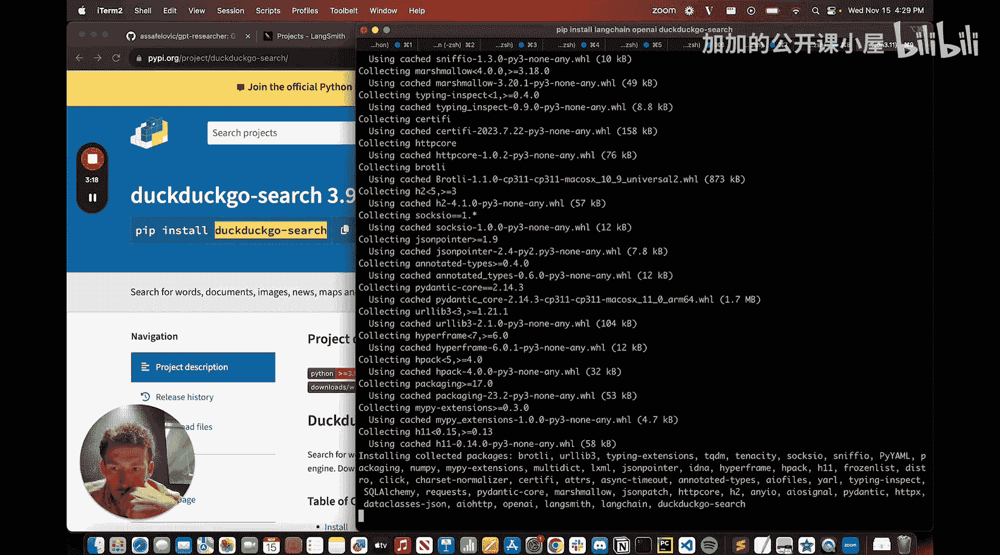

我们将创建一个函数，输入一个URL和一个问题，输出该网页针对该问题的摘要。

### 1. 创建网页抓取函数

首先，编写一个辅助函数来获取网页的文本内容。

```python
import requests
from bs4 import BeautifulSoup

def scrape_text(url):
    try:
        response = requests.get(url)
        if response.status_code == 200:
            soup = BeautifulSoup(response.text, "html.parser")
            text = soup.get_text(separator=" ", strip=True)
            return text
        else:
            print(f"Failed to retrieve the webpage. Status code: {response.status_code}")
            return ""
    except Exception as e:
        print(f"An error occurred: {e}")
        return ""
```

### 2. 构建提示模板与链

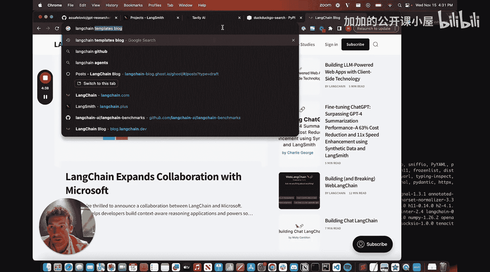

接下来，创建一个提示模板，指导语言模型根据提供的上下文（网页内容）回答问题。

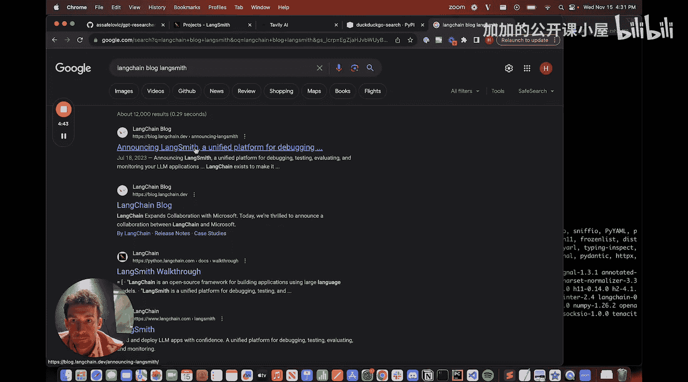

```python
from langchain.prompts import ChatPromptTemplate
from langchain.schema import StrOutputParser
from langchain.chat_models import ChatOpenAI

# 定义提示模板
template = """请根据以下上下文内容回答问题。如果上下文不包含相关信息，请说明无法根据提供的信息回答问题。

上下文：
{context}

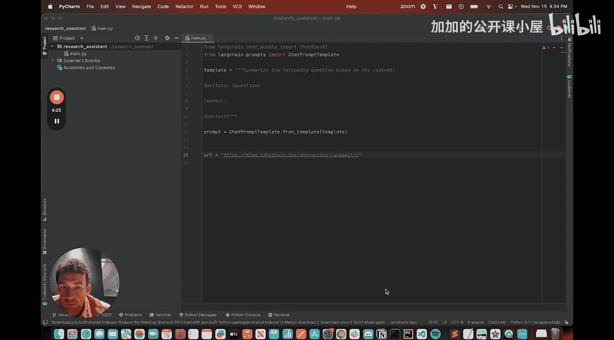

问题：
{question}

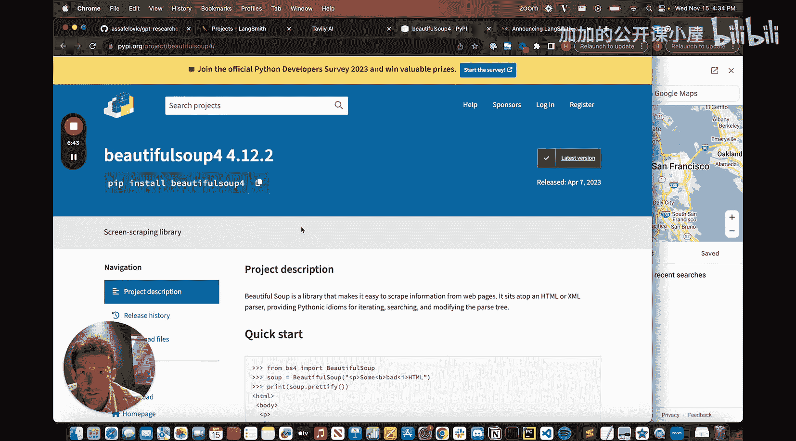

答案："""
prompt = ChatPromptTemplate.from_template(template)

# 选择模型。这里使用一个性价比高、上下文窗口较长的模型，例如 gpt-3.5-turbo-16k
model = ChatOpenAI(model="gpt-3.5-turbo-16k", temperature=0)

# 构建处理链：提示词 -> 模型 -> 输出解析器（将消息转为字符串）
chain = prompt | model | StrOutputParser()
```

### 3. 测试摘要功能

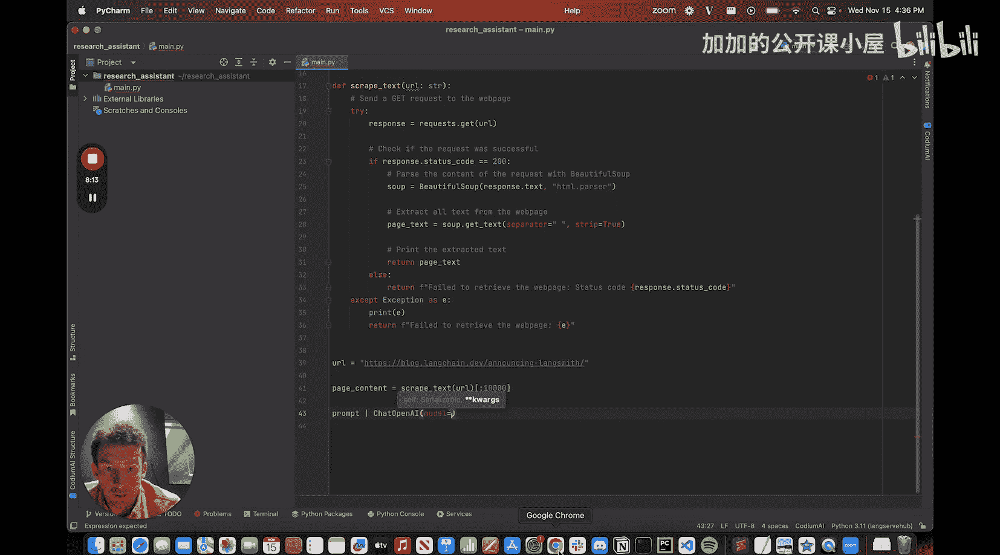

现在，让我们用一个示例URL和问题来测试这个链。

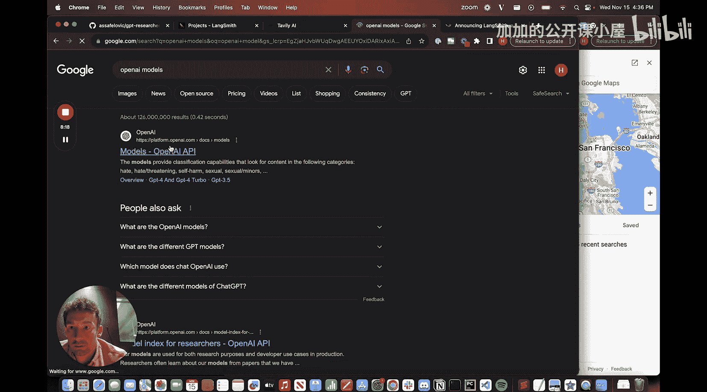

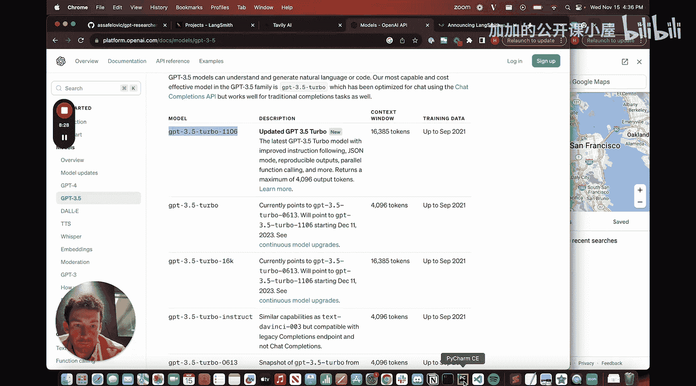

```python
# 示例：询问“什么是LangSmith？”，并抓取相关博客文章进行总结
url = "https://blog.langchain.dev/announcing-langsmith/"
question = "什么是 LangSmith？"

# 抓取网页内容（这里只取前10000个字符以避免过长）
page_content = scrape_text(url)
if page_content:
    # 限制内容长度，实际应用中可能需要更智能的截断或分块
    truncated_content = page_content[:10000]
    
    # 运行链
    answer = chain.invoke({"context": truncated_content, "question": question})
    print("问题：", question)
    print("答案：", answer)
else:
    print("未能获取网页内容。")
```

通过以上步骤，我们成功构建了一个基础模块：它能根据给定的问题，从指定网页中提取并总结相关信息。这个模块是构建更复杂研究助手的基础。

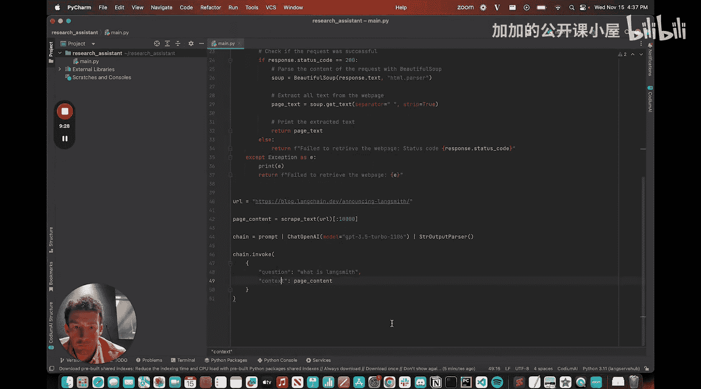

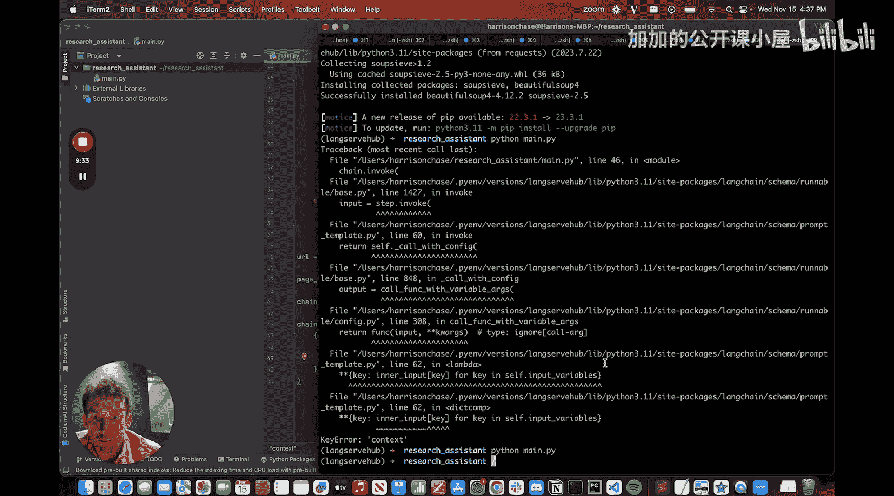

在下一节中，我们将以此为基础，扩展功能，实现并行搜索多个问题、汇总多个摘要，并最终生成完整的研究报告。

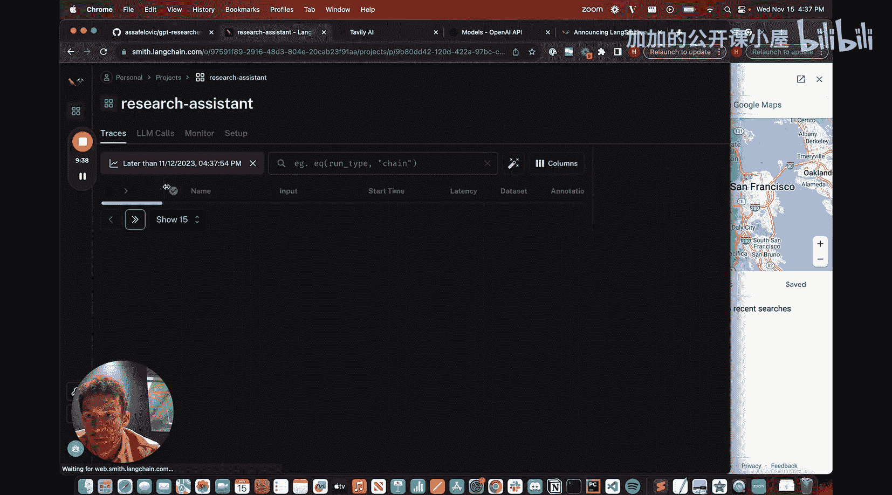

## 总结

本节课中，我们一起学习了如何从零开始构建一个研究助手的第一步。我们设置了开发环境，安装了必要的依赖库，并实现了一个核心功能模块：网页内容摘要器。这个模块能够抓取指定网页的文本，并利用大语言模型根据用户提出的问题进行针对性总结。我们使用了`requests`和`BeautifulSoup`进行网页抓取，利用LangChain的`ChatPromptTemplate`、`ChatOpenAI`和`StrOutputParser`构建了高效的处理流水线。这为后续实现更复杂的多问题研究、并行处理和报告生成功能打下了坚实的基础。