#  006：使用 Pinecone Serverless 构建和部署 RAG 应用 🚀

在本节课中，我们将从零开始，学习如何使用 Pinecone Serverless 来构建和部署一个检索增强生成应用。我们将逐步讲解所需的全部代码，并利用幻灯片作为指导来打好基础。

## 什么是 RAG？🤔

LangChain 社区提供了一个很好的可视化图表，将大语言模型比作一种新型操作系统的内核。当然，这个操作系统的核心组件之一，就是能够将你的“CPU”（在这里指 LLM）连接到“磁盘”（在这里指向量数据库或其他包含你想要传递给 LLM 信息的数据存储）。

LLM 有一个“上下文窗口”的概念，我们通常向其中传入提示。当然，我们也可以传入从外部来源检索到的信息。目前，最流行的外部来源之一就是向量数据库。它们具有非常出色的特性，例如能够执行语义相似性搜索。这意味着你可以取一段文本，基于其与向量数据库中已索引文本块的嵌入相似性进行搜索。这是 LLM 检索中非常流行的范式。

但它也存在一些痛点。其中一个痛点是需要自行配置向量数据库。虽然像 Pinecone 这样的提供商确实提供托管服务，并且变得非常流行，但即使使用 Pinecone 托管，你仍需为索引付费，这是一笔按月收取的固定费用，而非基于使用量的费用。

在本视频发布之际，Pinecone 推出了名为 **Pinecone Serverless** 的新服务，它解决了这两个痛点。它提供基于云存储的无限扩展能力，并采用按使用量计费的模式，承诺价格会显著降低。我个人对此感到非常兴奋，因为我在多个项目中都使用过 Pinecone。

因此，在本演示中，我们将使用 Pinecone，并将其连接到一个 RAG 应用。我们将展示如何部署它以及如何与之交互。需要说明的是，我们将使用 LangSmith 和 LangServe 进行托管。这两者目前都处于内测阶段，但你可以申请访问权限。如果你需要，可以联系 LangChain 团队。我们也会分享这些幻灯片和相关文档。

## 环境设置与项目初始化 ⚙️

现在，让我们进入编码环节。首先，你需要创建环境。我使用的是 Anaconda。我们将安装一些必要的包：LangChain CLI 和 LangServe。

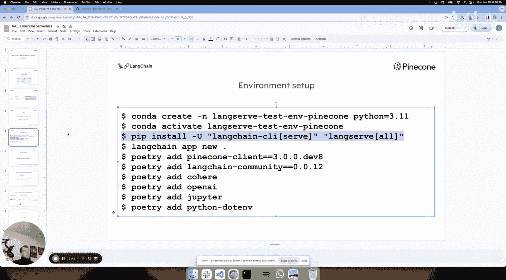

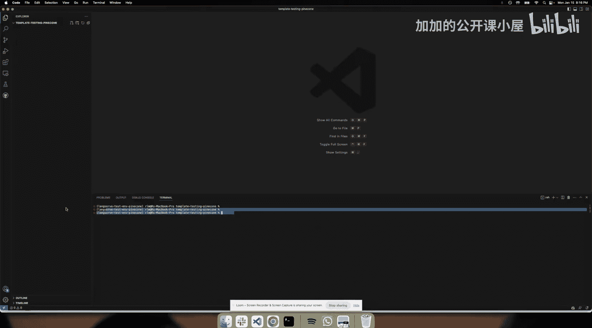

我已经完成了这些步骤。你可以看到我们的环境已经就绪，并且安装了这些包。

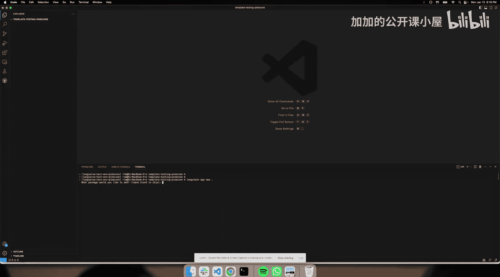

接下来，我将运行 `langchain app new` 命令。这将创建一个全新的、空白的 LangServe 应用。目前我们暂时不需要过多关注它，这将在我们考虑部署时有所帮助。

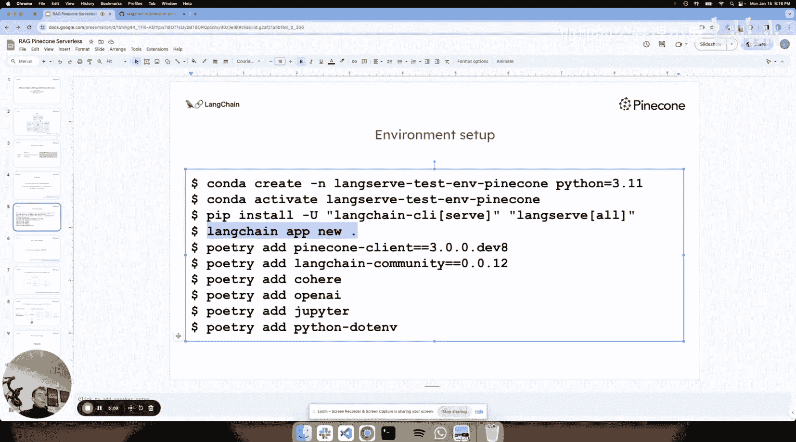

现在，我们只需简单地安装几个我们想要使用的包。我们将安装支持 Serverless 的 Pinecone 客户端。这里可能会遇到与 Python 版本相关的问题，我们可以进行调整。这个空的 LangServe 项目实际上是由 Poetry 管理的。我们可以在这里查看并修改 Python 依赖版本，以匹配 Pinecone 客户端的要求。

安装完成后，我们可以继续添加其他所需的包，例如 `jupyter` 和用于管理环境变量的 `python-dotenv`。

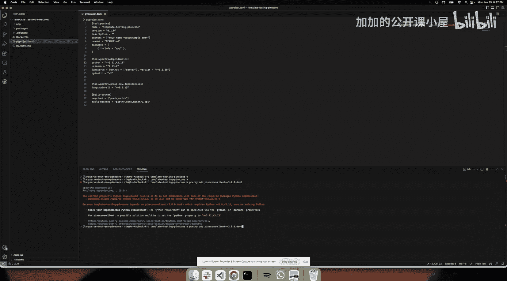

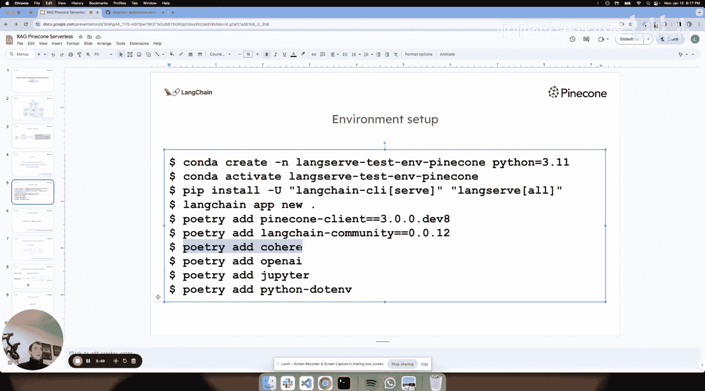

现在，当我们运行这些 `poetry add` 命令时，可以看到我们的 `pyproject.toml` 文件自动添加了这些新包。我们的项目现在拥有了一系列有用的包，这很棒。

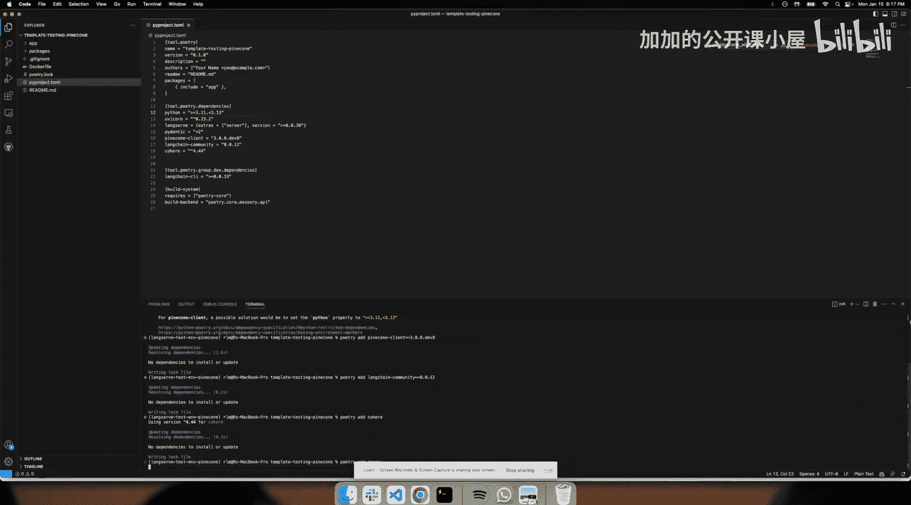

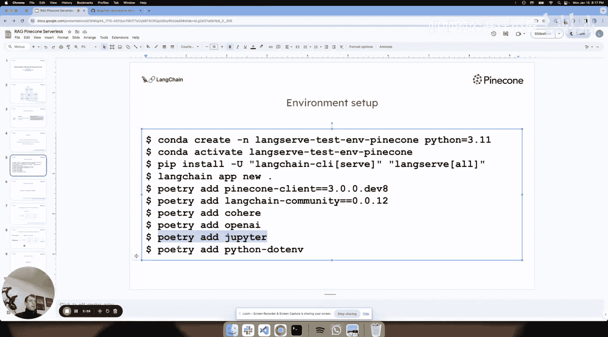

## 在 Jupyter Notebook 中构建原型 📓

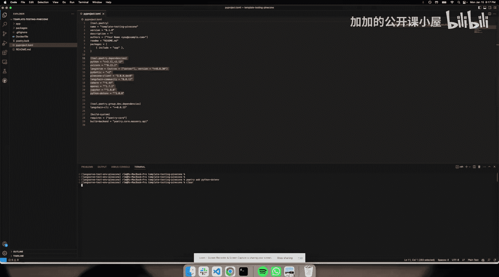

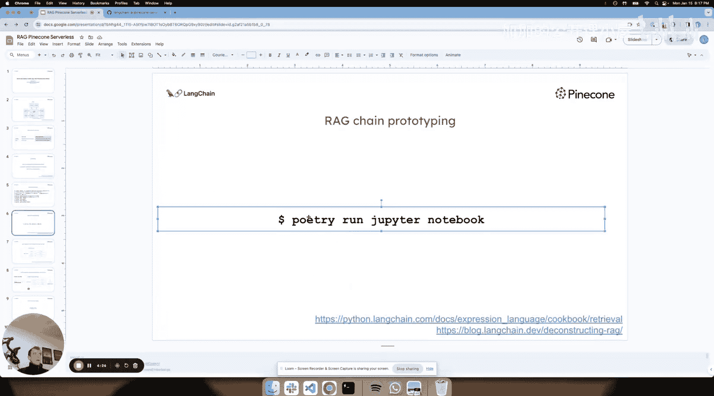

通常，当我构建 RAG 应用时，会从 Notebook 开始。例如，我喜欢使用 Jupyter Notebook，这显然非常方便。

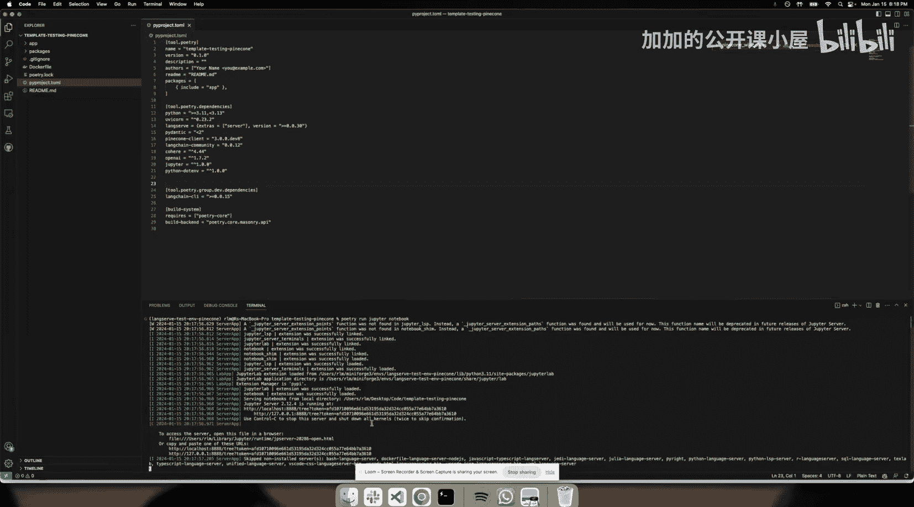

让我们启动一个新的 Notebook，并选择合适的 Kernel。很好，我们已经创建了一个新的空 LangServe 项目，添加了我们想要使用的包，并启动了 Jupyter Notebook。

接下来，我将引导你完成在 Notebook 中实际构建 RAG 代码原型的过程。为了节省时间，我将使用一些预先准备好的代码，但我们会详细讲解其中的内容。

首先，我们进行一系列导入。这里有一个有趣的点：Pinecone 团队已经创建了一个 Serverless 索引，并通过提供 Pinecone API 密钥、环境和索引名称授予了我访问权限。我已经设置了这些密钥，并在这里简单地定义了它们。

我想强调的另一点是，这个索引是从一个数据集创建的，该数据集是 Hugging Face 上可用的、使用 Cohere 嵌入的 Wikipedia 数据转储。我在这里做个笔记，这就是我们的数据集。

现在，我们有了包含这个由 Pinecone 提供的、非常庞大的 Wikipedia 数据转储的 Serverless 索引。我们将初始化 Pinecone 客户端。在这里，你还可以看到我们定义了嵌入模型以及向量存储。

至此，我们已经初始化了 Serverless 索引，可以访问它，并将其转换为一个 LangChain 检索器以供使用。

## 定义提示词与模型链 🔗

RAG 应用的第二个关键部分是定义提示词。通常，提示词类似于这样：**“仅根据以下上下文回答问题。上下文：{context}，问题：{question}”**。这里我们使用 `context` 和 `question` 作为变量。

接下来，让我们定义我们的模型。我们将使用 OpenAI 的一个近期发布的大上下文窗口 LLM，它拥有 128K 的上下文窗口，这非常棒。

这里是 LangChain 表达式语言发挥作用的地方，它允许我们轻松组合各种元素。我们定义了一个检索器、一个提示词和一个模型。我们可以非常容易地将它们组合成一个链。

我将这个链称为 `lc_chain`。其背后的原理很简单：我们使用检索器来提取与问题相关的上下文。当我们运行这个链时，它会获取问题，使用检索器（基于我们定义的 Cohere 嵌入）执行相似性搜索。它会将问题通过 Cohere 进行嵌入，然后在检索器上执行相似性搜索。返回的文档将被传递到我们提示词中的 `context` 键。同时，用户的问题也会被传递并保存到 `question` 键。然后，这些信息会被输入到我们的提示词中（提示词期望接收 `question` 和 `context`），接着传递给模型，最后清理输出。

## 运行链并查看结果 🔍

现在，让我们确保所有内容都已正确定义。这个链是一个 LangChain 表达式语言对象，这意味着它具有一个可运行接口，包含几个对所有此类对象都一致的调用方法。我们可以调用 `stream`、`batch` 或 `invoke` 方法。

我们将使用 `invoke` 方法并传入一个问题。例如，由于这是基于 Wikipedia 的，包含大量信息，我们可以问一个随机的问题：“什么是黑色电影？”

现在链开始运行了。我喜欢做的是深入幕后，看看实际发生了什么。为此，我将打开 LangSmith。正如之前在幻灯片中提到的，我已经设置了 LangSmith API 密钥并成为了其用户。

当我访问 LangSmith 网站并进入我的个人用户界面时，我可以看到所有的项目。这个“RLM”项目是我的默认项目。点击进入后，我可以看到一些很酷的东西：这里显示了我们刚刚提出的问题“什么是黑色电影？”，并且与该链相关的追踪记录已经自动记录到 LangSmith 中。这非常方便。

---

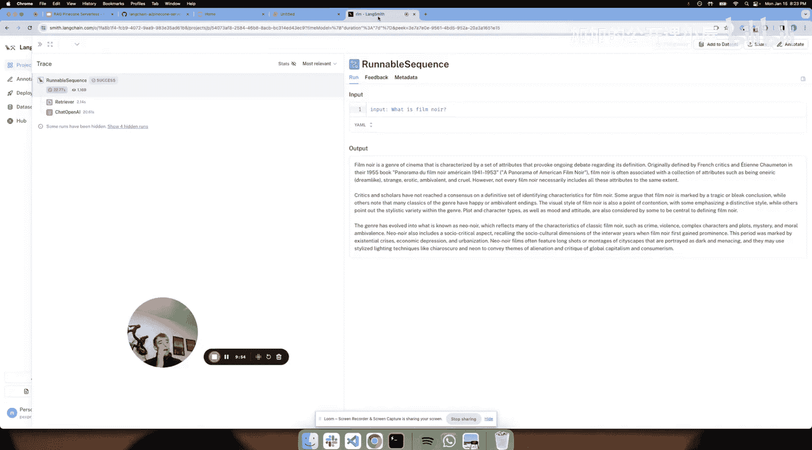

在本节课中，我们一起学习了 RAG 的基本概念，使用 Pinecone Serverless 初始化了向量数据库，并在 Jupyter Notebook 中构建了一个完整的 RAG 应用原型。我们定义了检索器、提示词和模型，并使用 LangChain 表达式语言将它们组合成一个可运行的链。最后，我们通过 LangSmith 观察了链的执行追踪，验证了其工作流程。