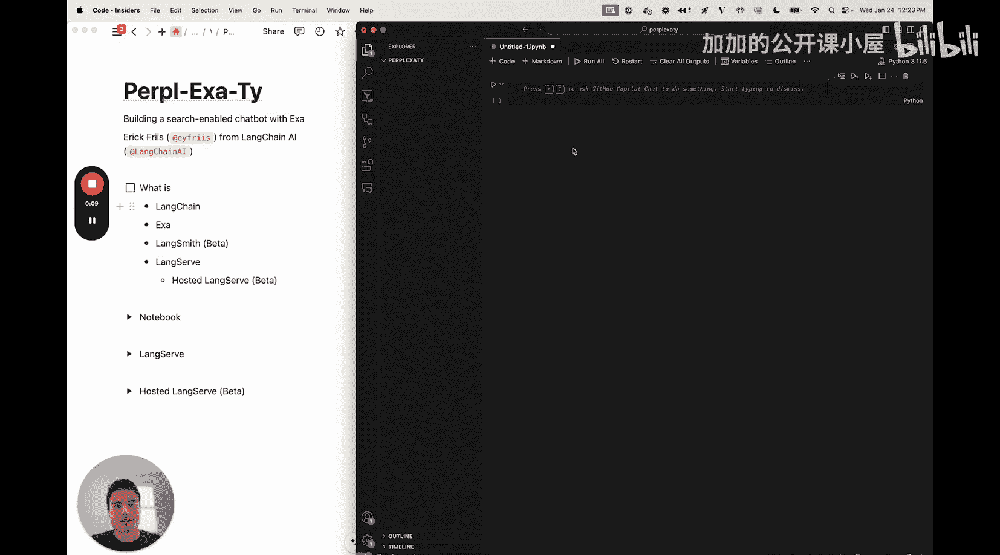
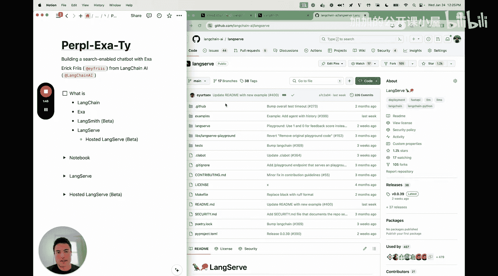
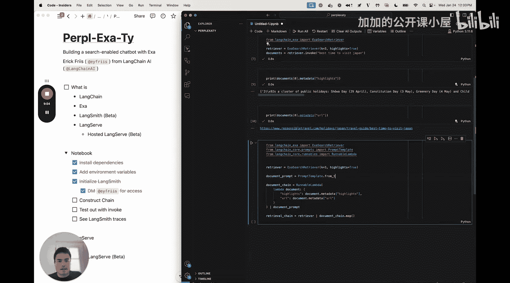

#  007：构建基于网页的 RAG 聊天机器人

在本节课中，我们将学习如何使用 LangChain、Exa（前身为 Metaphor）、LangSmith 和 LangServe 来构建一个具备网络搜索能力的聊天机器人。我们将从零开始构建一个检索增强生成（RAG）链，将其部署为 REST API，并最终托管到云端。



## 概述

我们将使用以下核心工具：
*   **LangChain**：一个用于开发大语言模型（LLM）应用的框架。
*   **Exa**：一个专注于 LLM 的搜索引擎，用于从网络检索信息。
*   **LangSmith**：用于调试和监控 LLM 应用的工具。
*   **LangServe**：一个开源包，用于将链部署为 REST 端点。

整个流程分为三步：首先在 Jupyter Notebook 中构建链，然后将其移植到 LangServe 作为 REST 端点，最后将其托管到云端。

## 第一步：环境设置与依赖安装

首先，我们需要安装必要的 Python 包。LangChain 正在拆分为更小的包，因此我们将安装特定的组件。

以下是需要安装的包：
*   `langchain-core`：提供核心的可运行（Runnable）工具和提示模板。
*   `langchain-openai`：用于接入 OpenAI 的 GPT-3.5 模型进行文本生成。
*   `langchain-exa`：全新的包，提供与 Exa 搜索引擎集成的检索器（Retriever）。

安装命令如下：
```bash
pip install langchain-core langchain-openai langchain-exa
```

安装完成后，我们需要设置环境变量。这包括你的 OpenAI API 密钥和 Exa API 密钥。

```python
import os
os.environ["OPENAI_API_KEY"] = "你的-openai-api-密钥"
os.environ["EXA_API_KEY"] = "你的-exa-api-密钥"
```

你可以在 [platform.openai.com](https://platform.openai.com) 获取 OpenAI API 密钥。Exa 的文档会指导你如何获取带有免费搜索额度的 API 密钥。

为了使用 LangSmith 进行追踪和调试，我们还需要设置以下环境变量。LangSmith 目前处于非公开测试阶段。



```python
os.environ["LANGCHAIN_TRACING_V2"] = "true"
os.environ["LANGCHAIN_API_KEY"] = "你的-langsmith-api-密钥"
os.environ["LANGCHAIN_PROJECT"] = "你的项目名称" # 可选，便于查找追踪记录
```

## 第二步：探索 Exa 检索器

在构建链之前，我们先了解一下 Exa 检索器的功能。Exa 有一个名为“高亮”（highlights）的特性，可以总结检索到网页的核心内容。

让我们导入检索器并进行一次搜索测试。

```python
from langchain_exa import ExaSearchRetriever

# 创建检索器，启用高亮功能，并限制返回3个最相关的结果
retriever = ExaSearchRetriever(highlights=True, num_results=3)

# 执行检索
docs = retriever.invoke("去日本旅游的最佳时间")
# 查看第一个文档的内容和元数据
print(docs[0].page_content[:500]) # 打印前500个字符的页面内容
print(docs[0].metadata) # 查看元数据，包括标题、URL和高亮信息
```

运行后，你会看到返回的文档包含完整的页面内容（可能很长）和元数据。元数据中包含了 `highlights` 数组，它概括了页面的要点，以及 `url`。在我们的聊天机器人中，我们将主要使用 `highlights` 和 `url`，以便让模型在生成答案时能够引用来源。

## 第三步：构建检索链

现在，我们来构建核心的 RAG 链。它的架构如下：
1.  接收用户查询。
2.  使用 Exa 检索器获取相关文档。
3.  从文档中提取高亮内容和 URL。
4.  将这些信息格式化为提示词（Prompt）。
5.  将提示词发送给 LLM 生成最终答案。

为了让后续移植到 LangServe 更简单，我们将把最终链的构建集中在一个代码单元中。

首先，导入必要的模块。

```python
from langchain_core.prompts import PromptTemplate
from langchain_core.runnables import RunnableLambda
from langchain_openai import ChatOpenAI
```

接下来，定义链的各个部分。

```python
# 1. 定义检索器（同上）
retriever = ExaSearchRetriever(highlights=True, num_results=3)

# 2. 定义一个处理单个文档的 RunnableLambda
# 它的作用是从文档中提取我们需要的信息：高亮内容和URL
extract_info = RunnableLambda(
    lambda doc: {
        “highlights”: doc.metadata[“highlights”],
        “url”: doc.metadata[“url”]
    }
)

# 3. 定义提示词模板
# 这个模板将用户查询和检索到的文档信息组合起来，指导LLM生成答案。
template = “””你是一个有帮助的助手。请根据以下提供的网络搜索信息来回答问题。
确保在答案中引用相关来源的URL。

用户问题：{question}

搜索到的信息：
{formatted_docs}

请基于以上信息回答：”””
prompt = PromptTemplate.from_template(template)

# 4. 定义语言模型
llm = ChatOpenAI(model=“gpt-3.5-turbo”)

# 5. 组装完整的链
chain = (
    # 步骤A：检索文档
    {“docs”: retriever}
    # 步骤B：对每个文档应用提取函数，并将结果列表格式化为字符串
    | {“formatted_docs”: lambda x: “\n\n”.join(
          [f“内容摘要：{item[‘highlights’]}\n来源：{item[‘url’]}” for item in x[“docs”]]
      ),
      “question”: lambda x: x[“question”]}
    # 步骤C：将格式化后的文档和问题填入提示词模板
    | prompt
    # 步骤D：将提示词发送给LLM生成答案
    | llm
)
```

现在，我们可以测试这个链。

```python
response = chain.invoke({“question”: “去日本旅游的最佳时间是什么时候？”})
print(response.content)
```

运行后，你应该能看到一个基于网络搜索信息生成的、并附有来源引用的答案。

## 第四步：使用 LangServe 部署为 API

上一节我们构建了本地的 RAG 链，本节我们将使用 LangServe 将其部署为一个 REST API 服务，这样其他应用就可以通过 HTTP 请求来调用它。

首先，需要安装 `langserve` 包。
```bash
pip install “langserve[all]”
```

接下来，我们创建一个简单的 FastAPI 应用，并使用 LangServe 的 `add_routes` 方法来注册我们的链。

```python
from fastapi import FastAPI
from langserve import add_routes

app = FastAPI(
    title=“Exa 搜索聊天机器人 API”,
    version=“1.0”,
    description=“一个基于 Exa 搜索的简单 RAG 聊天机器人”
)

# 将我们构建的 chain 添加到 FastAPI 应用中，路径为 /chat
add_routes(app, chain, path=“/chat”)

if __name__ == “__main__”:
    import uvicorn
    uvicorn.run(app, host=“localhost”, port=8000)
```

将上述代码保存为 `app.py` 并运行，你的链就成为了一个运行在 `http://localhost:8000` 的 API 服务。你可以通过访问 `http://localhost:8000/chat/playground` 来使用内置的交互式界面进行测试，或者直接向 `/chat/invoke` 端点发送 POST 请求。

## 第五步：在 LangSmith 中托管与监控

最后一步是将我们的应用托管到云端，让互联网上的任何人都能访问。我们可以使用 LangSmith 平台提供的托管版 LangServe 来实现。

1.  将你的代码推送到一个 Git 仓库（如 GitHub）。
2.  登录 LangSmith 平台。
3.  导航到 LangServe 托管部分，创建一个新服务。
4.  配置服务，指向你的 Git 仓库和包含 `add_routes` 代码的文件。
5.  LangSmith 会自动构建并部署你的应用，提供一个公开的 URL。

部署完成后，你不仅拥有了一个可公开访问的 API，还可以在 LangSmith 中查看每一次 API 调用的详细追踪记录（Trace），包括检索到的文档、生成的提示词和 LLM 的响应，这对于调试和优化应用至关重要。

## 总结

在本节课中，我们一起学习了构建和部署一个基于网页的 RAG 聊天机器人的完整流程。我们从安装依赖和设置环境开始，探索了 Exa 检索器的强大功能，然后逐步构建了一个结合网络搜索与大语言模型生成的链。接着，我们使用 LangServe 将这个链封装成了 REST API。最后，我们了解了如何利用 LangSmith 平台将应用托管到云端，并获得强大的监控能力。



这个流程展示了如何利用 LangChain 生态中的工具，快速将想法转化为可部署、可监控的实用 AI 应用。