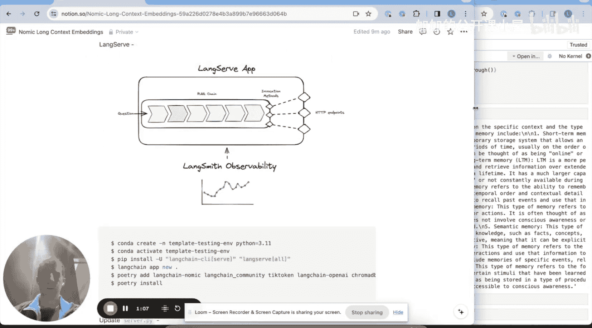
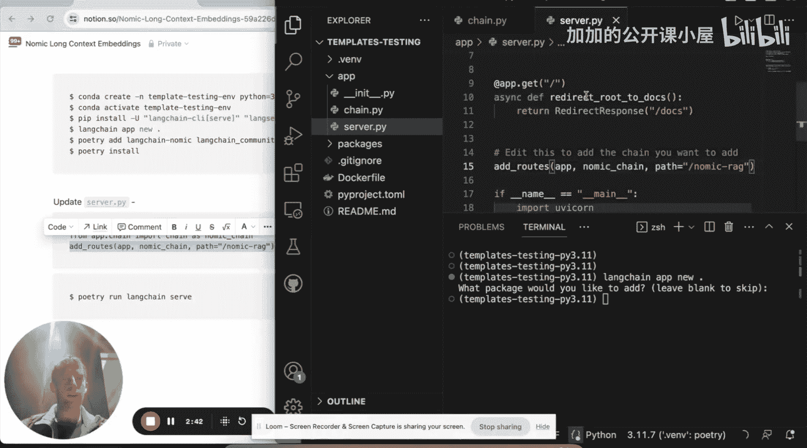

#  008：使用 Nomic 的新嵌入模型构建开源 RAG 应用（配合 ChromaDB 和 Ollama）


在本教程中，我们将从零开始，使用 Nomic 新发布的长上下文嵌入模型，构建一个检索增强生成应用。我们将涵盖文档加载、文本分割、向量存储、检索以及使用本地开源大语言模型生成答案的完整流程。

## 🚀 概述：构建开源 RAG 应用

LLM 和嵌入模型的上下文窗口正在不断扩大。通过 RoPE 或 SelfExtend 等方法，像 Llama 2、Phi-2、Mistral、Mixtral 这样的开源 LLM 的上下文窗口已从 4K 扩展到 32K 或更高。这使我们能够将更多内容输入模型。

嵌入模型也经历了同样的转变。最近，Nomic 发布的模型拥有 8K token 的上下文窗口，与 OpenAI 的 `text-embedding-ada-002` 等模型相当。Nomic 的博客和论文展示了其在多个基准测试上的强劲性能。

我们的目标是构建一个 RAG 应用，其工作流程如下：获取文档 -> 使用 Nomic 嵌入模型进行向量化 -> 存储到向量数据库 -> 接收用户问题 -> 检索相关文档 -> 使用开源 LLM 处理并生成答案。

上一节我们介绍了 RAG 的基本概念和 Nomic 模型，本节中我们来看看如何具体实现。

## 📥 第一步：环境准备与文档加载

首先，我们需要安装必要的库并加载文档。

```python
# 示例：安装所需库（假设已安装）
# pip install langchain langchain-community chromadb nomic
```

我已经完成了 `pip install`，并登录 Nomic 获取了 API 令牌，将其设置为环境变量。同时，我使用了 LangSmith 来辅助开发和追踪，但这是可选的。

现在，让我们开始加载文档。我将使用 LangChain 的网页加载器从三个我喜欢的博客文章 URL 加载内容。

```python
from langchain_community.document_loaders import WebBaseLoader

urls = [
    "https://example.com/blog1",
    "https://example.com/blog2",
    "https://example.com/blog3"
]
loader = WebBaseLoader(urls)
documents = loader.load()
```

文档已被加载到一个列表中。很好。

## ✂️ 第二步：文本分割

由于我们使用的嵌入模型可以处理长达 8K token 的上下文，并且 LLM 能处理 32K，我们可以使用较大的块大小进行分割。

以下是分割文档的步骤：

```python
from langchain.text_splitter import CharacterTextSplitter
from langchain_community.embeddings import NomicEmbeddings

text_splitter = CharacterTextSplitter.from_tiktoken_encoder(
    chunk_size=7500, chunk_overlap=0
)
splits = text_splitter.split_documents(documents)
```

我们使用基于 token 的分割器，设置块大小为 7500。现在，我们得到了分割后的文本块。

## 🔍 第三步：创建向量存储与检索器

接下来，我们将使用 Nomic 嵌入模型将文档向量化，并存储到 ChromaDB 这个开源向量数据库中。

以下是创建向量存储和检索器的代码：

```python
from langchain.vectorstores import Chroma

vectorstore = Chroma.from_documents(
    documents=splits,
    embedding=NomicEmbeddings(model="nomic-embed-text-v1"),
    collection_name="rag_chroma_nomic"
)
retriever = vectorstore.as_retriever()
```

这段代码创建了一个向量存储，指定使用 Nomic 的新嵌入模型。然后，我们从中构建了一个检索器。现在，我们可以通过这个检索器，针对任何问题获取相关的文档。

```python
relevant_docs = retriever.get_relevant_documents("什么是任务分解？")
```

## 🤖 第四步：配置本地大语言模型

为了在本地运行开源 LLM，我选择使用 Ollama，它非常方便。只需下载并运行 Ollama，然后拉取你感兴趣的模型。

例如，在终端中运行：
```bash
ollama pull mistral:instruct
```

这会将 Mistral Instruct 模型下载到本地，之后就可以在代码中调用它。

现在，让我们在代码中设置提示词和 LLM。

```python
from langchain.prompts import PromptTemplate
from langchain_community.llms import Ollama

# 定义 RAG 提示词模板
template = """请根据以下上下文回答问题：
{context}
问题：{question}
答案："""
prompt = PromptTemplate.from_template(template)

# 配置本地 LLM
llm = Ollama(model="mistral:instruct")
```

## ⛓️ 第五步：构建 RAG 链

现在，我们将所有组件组合成一个 RAG 链。这个链会接收用户问题，使用检索器获取相关上下文，填充提示词，然后交给 LLM 生成答案。

以下是构建 RAG 链的代码：

```python
from langchain.schema.runnable import RunnablePassthrough
from langchain.schema.output_parser import StrOutputParser

rag_chain = (
    {"context": retriever, "question": RunnablePassthrough()}
    | prompt
    | llm
    | StrOutputParser()
)
```

这个链的工作流程是：构建一个包含 `context`（来自检索器）和 `question`（用户输入）的字典 -> 填入提示词模板 -> 将提示词输入本地 LLM -> 解析输出。

现在，我们可以运行这个链来获取答案。

```python
answer = rag_chain.invoke("LangChain 的主要用途是什么？")
print(answer)
```

运行可能需要一些时间（例如20秒），但最终我们会得到基于提供文档的答案。

## 🌐 第六步：将链部署为应用（使用 LangServe）

如果我们想将这个 RAG 链变成一个可通过网络访问的应用程序，可以使用 LangServe。LangServe 是一个平台，可以将我们构建的任何链包装起来，并将其调用方法映射为 HTTP 端点。

以下是部署步骤：



1.  首先，确保安装了 LangChain CLI 和 LangServe。
    ```bash
    pip install langchain-cli langserve
    ```

2.  创建一个新的 LangServe 应用。
    ```bash
    langchain app new my-rag-app
    ```
    在询问是否添加示例包时，选择“否”。

3.  这会在当前目录创建一个 `my-rag-app` 文件夹，其中包含 `app/server.py` 和 `app/packages` 目录。

4.  在 `app` 目录下，创建一个新文件 `chain.py`，并将我们之前构建 RAG 链的代码复制进去。

    ```python
    # app/chain.py
    from langchain.vectorstores import Chroma
    from langchain_community.embeddings import NomicEmbeddings
    from langchain_community.llms import Ollama
    from langchain.prompts import PromptTemplate
    from langchain.schema.runnable import RunnablePassthrough
    from langchain.schema.output_parser import StrOutputParser
    from langchain_community.document_loaders import WebBaseLoader
    from langchain.text_splitter import CharacterTextSplitter

    # 1. 加载并分割文档（此处为示例URL，实际需替换）
    urls = ["https://example.com/blog1"]
    loader = WebBaseLoader(urls)
    documents = loader.load()
    text_splitter = CharacterTextSplitter.from_tiktoken_encoder(chunk_size=7500, chunk_overlap=0)
    splits = text_splitter.split_documents(documents)

    # 2. 创建向量存储和检索器
    vectorstore = Chroma.from_documents(
        documents=splits,
        embedding=NomicEmbeddings(model="nomic-embed-text-v1"),
        collection_name="rag_chroma_nomic",
        persist_directory="./chroma_db" # 可选：持久化存储
    )
    retriever = vectorstore.as_retriever()

    # 3. 定义提示词和LLM
    template = """请根据以下上下文回答问题：
    {context}
    问题：{question}
    答案："""
    prompt = PromptTemplate.from_template(template)
    llm = Ollama(model="mistral:instruct")

    # 4. 构建链
    rag_chain = (
        {"context": retriever, "question": RunnablePassthrough()}
        | prompt
        | llm
        | StrOutputParser()
    )

    # 导出这个链，供 server.py 使用
    chain = rag_chain
    ```

5.  修改 `app/server.py` 文件，导入我们的链并添加路由。

    ```python
    # app/server.py
    from fastapi import FastAPI
    from langserve import add_routes
    from chain import chain  # 从我们刚创建的 chain.py 导入

    app = FastAPI(
        title="Nomic RAG Chain",
        version="1.0",
        description="一个使用 Nomic 嵌入和本地 Mistral LLM 的简单 RAG 链。"
    )

    # 将链的 `invoke` 方法映射到 `/invoke` 端点
    add_routes(app, chain, path="/rag-nomic")

    if __name__ == "__main__":
        import uvicorn
        uvicorn.run(app, host="localhost", port=8000)
    ```

6.  启动服务器。
    ```bash
    cd my-rag-app
    python app/server.py
    ```

现在，你的 RAG 应用将在 `http://localhost:8000` 运行。你可以通过向 `http://localhost:8000/rag-nomic/invoke` 发送 POST 请求（Body 为 `{"input": "你的问题"}`）来调用它，或者直接访问 `http://localhost:8000/rag-nomic/playground` 在交互式界面中测试。

## 📝 总结

在本教程中，我们一起学习了如何利用最新的开源工具构建一个完整的 RAG 应用。我们从文档加载和分割开始，然后使用 Nomic 的长上下文嵌入模型将文本向量化并存储到 ChromaDB 中。接着，我们配置了在本地通过 Ollama 运行的开源大语言模型，并将检索器和 LLM 组合成一个高效的 RAG 链。最后，我们还探索了如何使用 LangServe 将这个链快速部署为一个可通过 Web 访问的应用程序。



整个流程基于开源组件，可以在个人电脑上运行（嵌入模型目前通过 API，但即将支持本地运行），这为构建私有、可控的智能问答系统提供了强大的基础。