#  009：基于 LangChain 模板构建 Gemini + Google 检索智能体

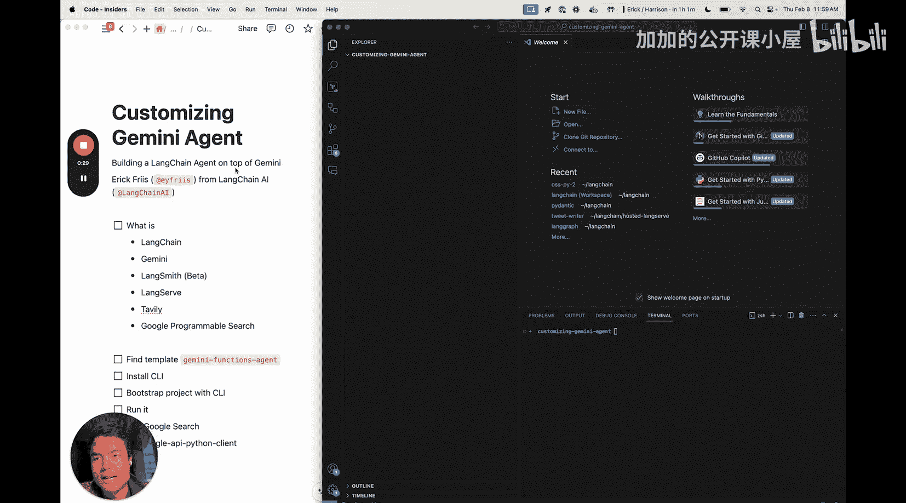

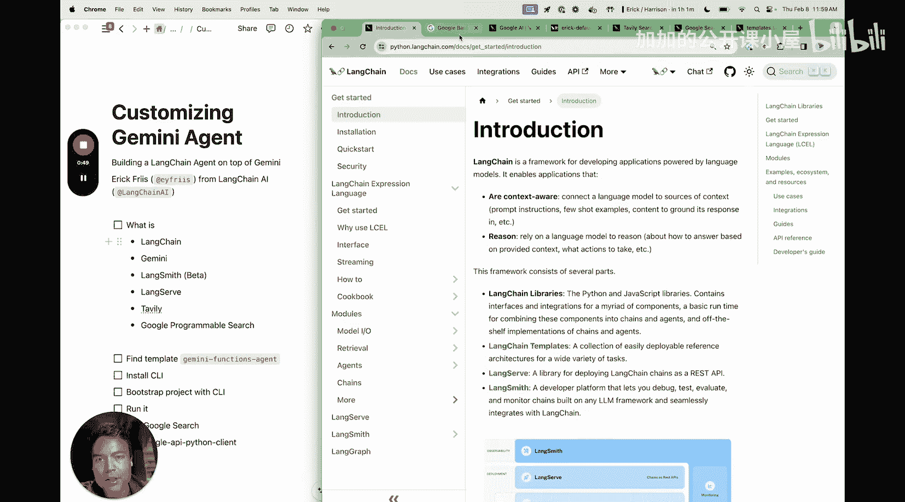

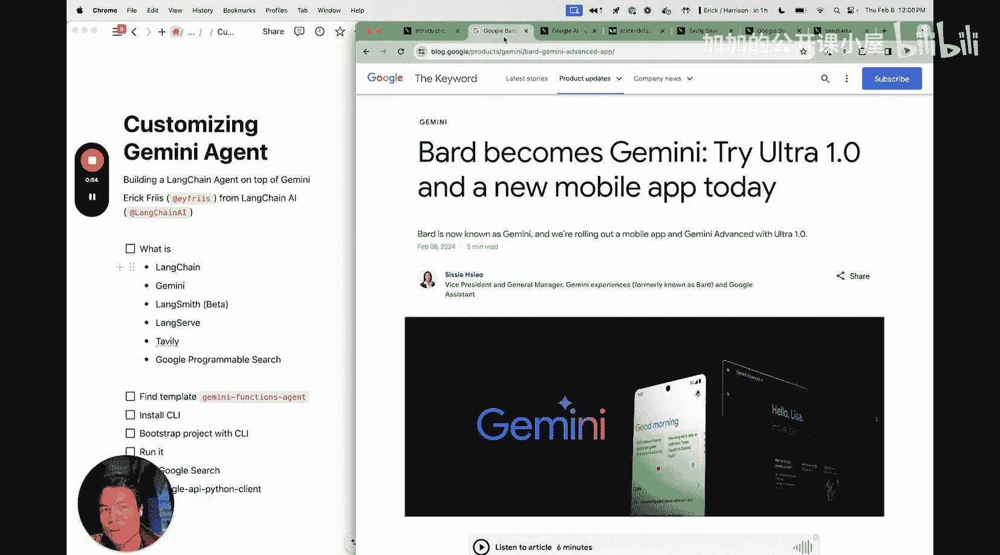

## 概述
在本节课中，我们将学习如何使用 LangChain 框架，结合 Google 的 Gemini Pro 模型，构建一个功能型智能体。我们将从一个预置的 LangChain 模板开始，并将其默认的搜索工具替换为 Google 可编程搜索，以比较不同搜索工具的效果。

## 课程内容

### 1. 工具与平台介绍
我们将使用以下工具和平台来完成本次构建。

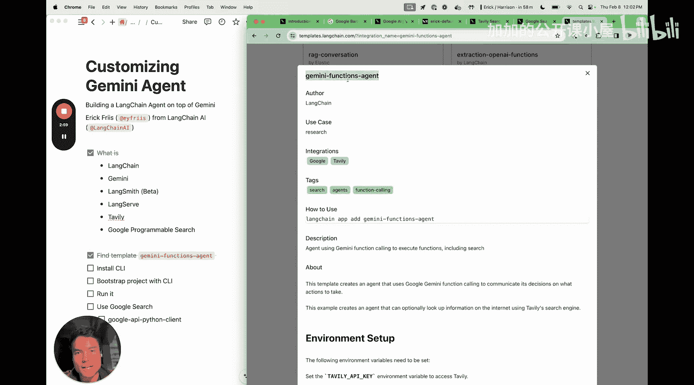

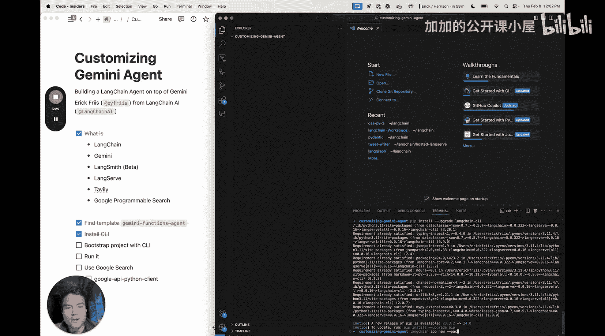

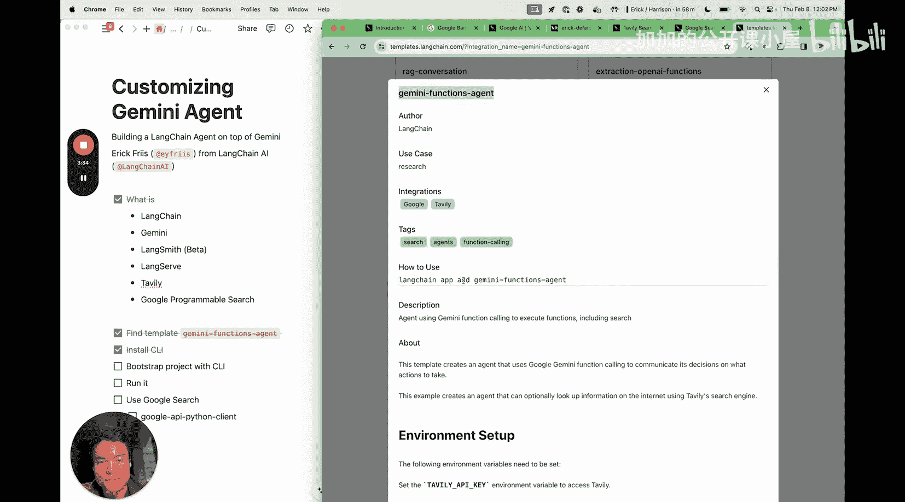

以下是核心组件列表：
*   **LangChain**：一个用于构建大语言模型（LLM）驱动应用程序的框架。
*   **Gemini Pro 模型**：我们将通过 LangChain 的 Google AI 连接器使用此模型。
*   **LangSmith**：LangChain 提供的用于应用程序可观测性和调试的平台。
*   **LangServe**：LangChain 提供的用于托管 REST API 的产品。
*   **Tavily Search**：我们将从使用此工具开始，作为智能体的默认搜索工具。
*   **Google 可编程搜索**：后续我们将添加此工具，以替换默认的搜索功能。

### 2. 获取并启动模板
首先，我们需要找到并初始化我们将要使用的 LangChain 模板。

具体步骤如下：
1.  访问 `templates.langchain.com`，这是所有可用模板的列表页面。
2.  在搜索框中输入“Gemini”，找到名为“Gemini Functions Agent”的模板。这个模板是昨天新添加的。
3.  复制该模板的唯一标识字符串。
4.  打开代码编辑器，在一个空白文件夹中，首先安装 LangChain CLI 命令行工具，以便快速启动应用。
5.  运行命令 `langchain new`，并指定我们复制的模板字符串，这将为我们创建一个基础项目。
6.  项目创建后，使用 Poetry 安装所有依赖项。Poetry 是一个 Python 依赖管理工具。
7.  运行 `poetry run langchain serve` 命令来启动服务。使用 `poetry run` 前缀可以确保命令在项目对应的虚拟环境中执行。

### 3. 运行与测试默认模板
服务启动后，我们可以在浏览器中访问本地 playground 界面来测试智能体。

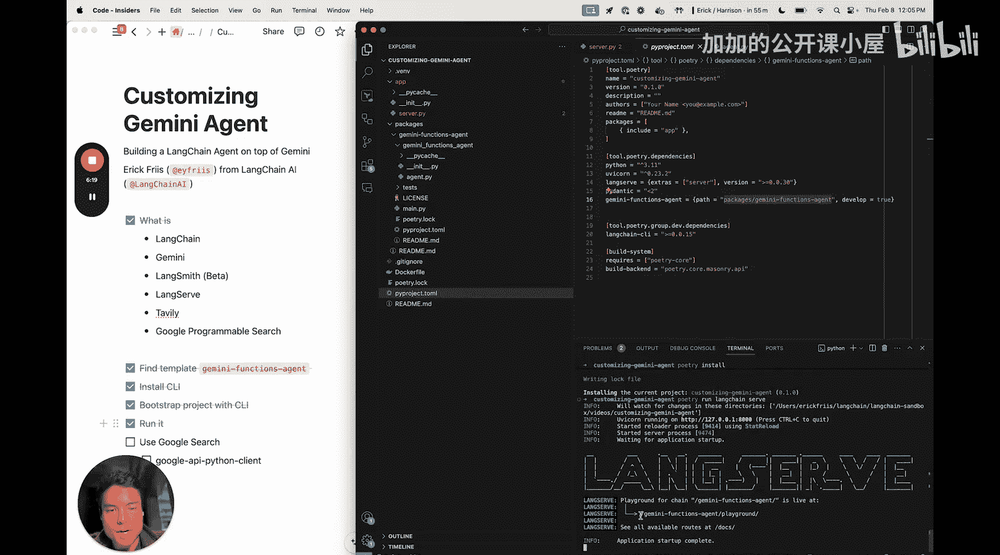

操作流程如下：
1.  在浏览器中打开 `localhost:8000`，进入 Gemini Functions Agent 的 playground。
2.  输入一个问题进行测试，例如：“2024年旧金山有哪些活动？”
3.  智能体会开始工作。我们可以切换到 LangSmith 平台，观察智能体执行任务的每一步。
4.  在 LangSmith 中，我们可以看到智能体首次调用时尝试使用了“Tavily search results”工具，但 Gemini 模型生成了一个无效的函数名，导致调用失败。
5.  随后，智能体进行了第二次尝试，这次正确地调用了 `tavily_search_results_json` 工具，并成功获取了搜索结果。
6.  最终，智能体将搜索结果汇总，并在 playground 界面中给出了关于旧金山活动的回答。

### 4. 替换搜索工具
上一节我们使用了默认的 Tavily 搜索工具。本节中，我们将把它替换为 Google 可编程搜索工具。

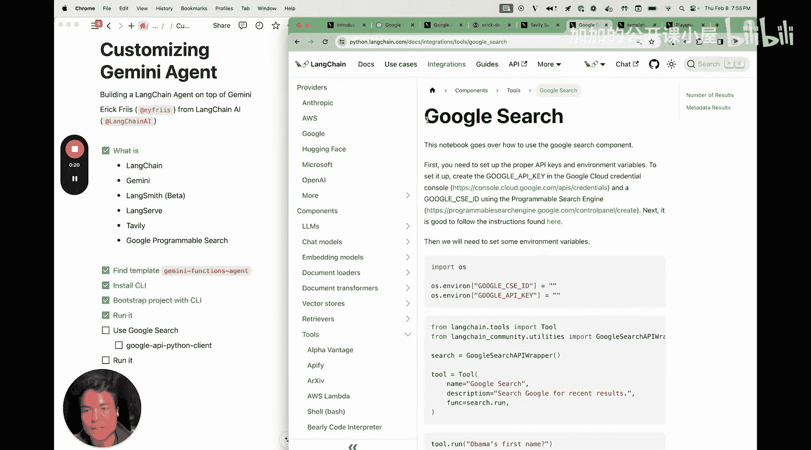

以下是修改步骤：
1.  回到代码编辑器，找到智能体工具配置的部分。最新的模板会直接传入工具列表，无需进行额外的函数格式化。
2.  我们的目标是将 `tavily_search` 工具替换为 `google_search` 工具。
3.  首先，需要安装 Google API Python 客户端库，以便使用 Google 搜索 API 的封装。可以通过运行 `poetry add google-api-python-client` 命令来安装。
4.  安装完成后，在代码中引入 `GoogleSearchAPIWrapper` 工具，并用它替换掉原来的 Tavily 工具。
5.  修改完成后，重新运行 `langchain serve` 命令，使更改生效。
6.  现在，智能体将使用 Google 搜索作为其信息检索工具。我们可以再次提问相同的问题，观察并比较使用不同搜索工具后，智能体返回的结果在内容和风格上可能存在的差异。

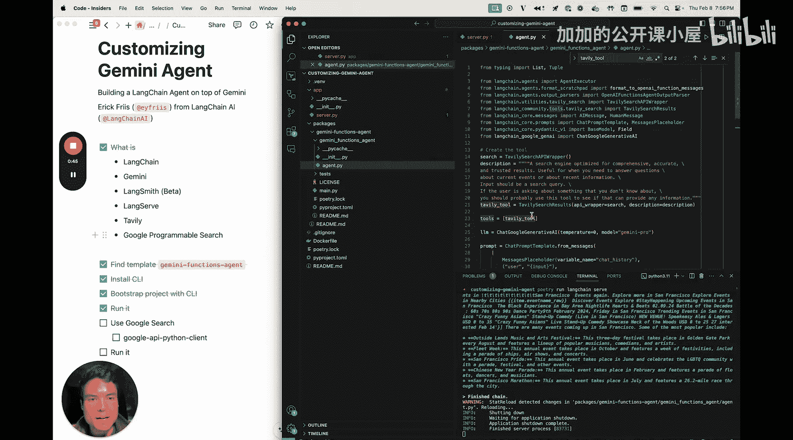

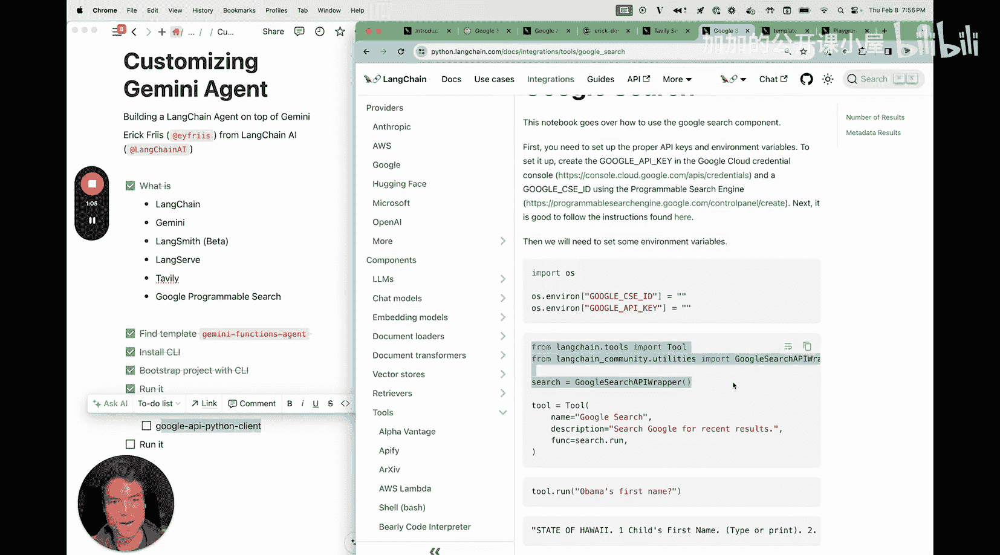

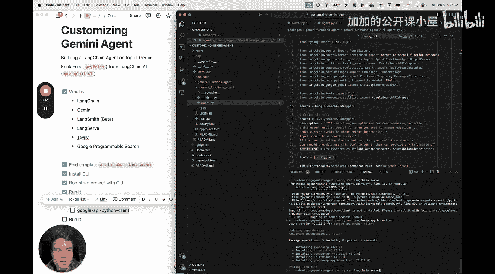

## 总结
本节课中，我们一起学习了如何基于 LangChain 模板快速构建一个 Gemini 智能体。我们首先介绍了所需的工具和平台，然后逐步完成了模板的获取、依赖安装和服务启动。接着，我们测试了默认配置下的智能体，并通过 LangSmith 观察了其内部执行过程。最后，我们动手修改了代码，将智能体的搜索工具从 Tavily 替换为 Google 可编程搜索，体验了定制化智能体功能的过程。这个过程展示了 LangChain 框架在快速原型开发和工具集成方面的灵活性。