#  010：使用开源模型构建 LangChain Agents 🚀

在本节课中，我们将学习如何基于开源模型 Mistral 和 Nomic Embeddings 来构建一个 LangChain Agent。我们将使用托管这些模型的平台，而非本地运行。课程将从一个检索代理模板开始，并将其修改为使用向量数据库进行检索。

## 平台与模型介绍

上一节我们介绍了课程目标，本节中我们来看看将要用到的核心平台和模型。

*   **LangChain**：开发LLM应用的最佳框架。它允许你连接语言模型、嵌入模型，并将它们组合成功能性的应用。它也提供了一些模板，作为如何构建应用的参考架构。
*   **Mistral**：我们将用于Agent决策的开源语言模型。我们将通过 Fireworks 平台连接它，该平台提供了一个有用的 **JSON 模式**功能，可以强制模型输出结构化内容。
*   **Nomic Embed Text v1.5**：我们将使用的开源嵌入模型。它具有**材料学习**等特性，允许你选择生成嵌入向量的维度。其工作原理在官方公告中有详细说明。
*   **Chroma**：我们将使用的向量数据库。这里我们使用其本地持久化版本。
*   **LangSmith**：LangChain 的调试与可观测性产品，用于查看Agent的实际运行情况和工具调用。
*   **LangServe**：一个 FastAPI 扩展，可以轻松地将 LangChain 链部署为 REST API，并在 Playground 中进行交互。

初始模板使用一个“Archive Retriever”工具，它根据查询查找学术论文摘要。稍后，我们将使用社区贡献的 `DocusaurusLoader` 来索引 LangChain Python 文档的几页内容，以便能够对其提问。

## 启动初始模板

上一节我们介绍了所需工具，本节中我们来看看如何获取并运行初始模板。

首先，我们需要安装 LangChain CLI，用于拉取模板。

```bash
pip install langchain-cli
```

然后，使用以下命令创建一个新的应用，并用 `retrieval-agent-fireworks` 模板初始化它。我们选择使用 Poetry 管理依赖。

```bash
langchain app new my-agent-app --package retrieval-agent-fireworks
```

创建完成后，CLI 会提示我们需要将路由添加到 `app/server.py` 文件中。以下是需要添加的代码：

```python
from retrieval_agent_fireworks.chain import chain as retrieval_agent_fireworks_chain

add_routes(app, retrieval_agent_fireworks_chain, path="/retrieval-agent-fireworks")
```

保存文件后，使用 Poetry 安装依赖并启动服务。

```bash
poetry install
poetry run langchain serve
```

服务启动后，可以在浏览器中访问 `http://localhost:8000/retrieval-agent-fireworks/playground` 进入 Playground 界面。

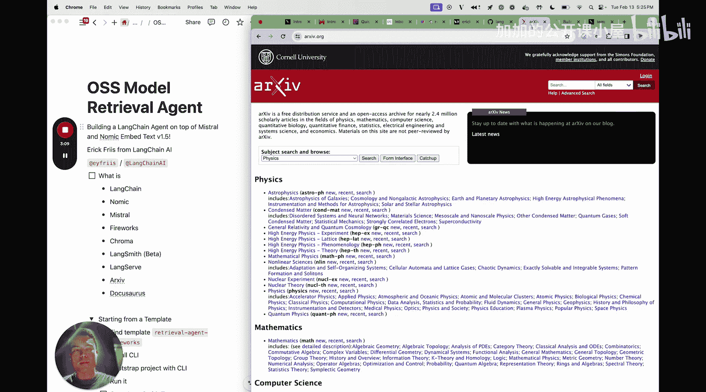

## 测试与观察

现在，让我们测试一下初始的 Agent。例如，我们可以提问：“What is Matryoshka learning?”，这是一个它可能会使用 Archive 工具去查询的概念。

在 Playground 提问后，我们可以同时在 LangSmith 中观察 Agent 的思考过程、工具调用和返回结果。初始的 Archive 检索工具可能无法返回最理想的答案，但这没关系，我们的目标是将其替换为自己的文档检索工具。

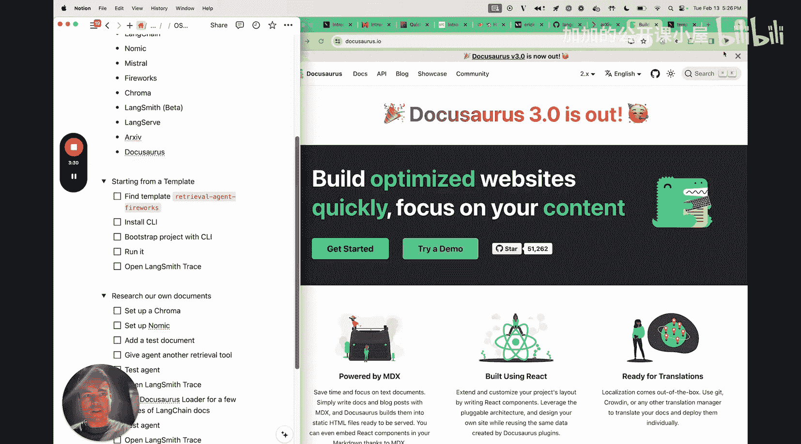

## 构建自定义文档检索工具

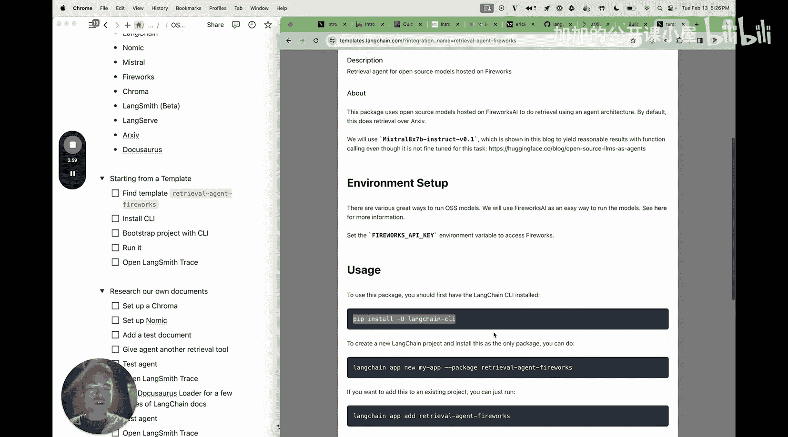

上一节我们测试了初始模板，本节中我们将动手修改它，用我们自己的文档向量库替换掉 Archive 检索工具。

首先，我们需要创建一个文档摄取脚本。这个脚本将负责下载文档、生成嵌入向量并存储到向量数据库中。

我们创建一个名为 `ingest.py` 的脚本，并添加以下核心代码：

```python
from langchain_community.vectorstores import Chroma
from langchain_nomic.embeddings import NomicEmbeddings

# 1. 初始化嵌入模型
embeddings = NomicEmbeddings(model="nomic-embed-text-v1.5")

# 2. 初始化向量数据库，指定持久化目录
vector_store = Chroma(
    embedding_function=embeddings,
    persist_directory="./chroma_db"
)
```

接下来，我们需要添加 `langchain-nomic` 依赖包以使用 Nomic 嵌入模型。

```bash
poetry add langchain-nomic
```

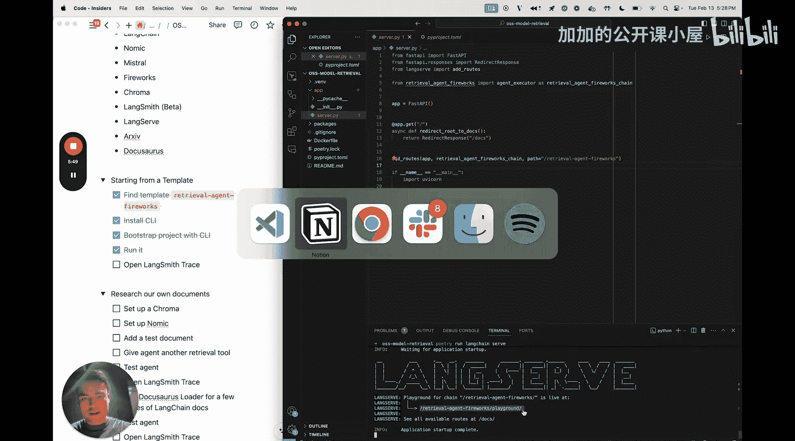

然后，我们需要使用文档加载器来加载内容。这里以加载 LangChain 文档为例：

```python
from langchain_community.document_loaders import DocusaurusLoader

# 3. 加载文档 (示例：LangChain文档的特定页面)
loader = DocusaurusLoader("https://python.langchain.com/docs/")
documents = loader.load()

# 4. 将文档分割成块
from langchain.text_splitter import RecursiveCharacterTextSplitter
text_splitter = RecursiveCharacterTextSplitter(chunk_size=1000, chunk_overlap=200)
docs = text_splitter.split_documents(documents)

# 5. 将文档块添加到向量库
vector_store.add_documents(docs)
# 确保更改被持久化
vector_store.persist()
```

运行此脚本 (`python ingest.py`) 后，你的文档就会被处理并存储到本地的 `./chroma_db` 目录中。

## 创建检索工具并集成到Agent

文档准备就绪后，我们需要创建一个检索工具，并让 Agent 能够使用它。

在模板的链定义文件（例如 `retrieval_agent_fireworks/chain.py`）中，我们需要进行修改。以下是关键步骤：

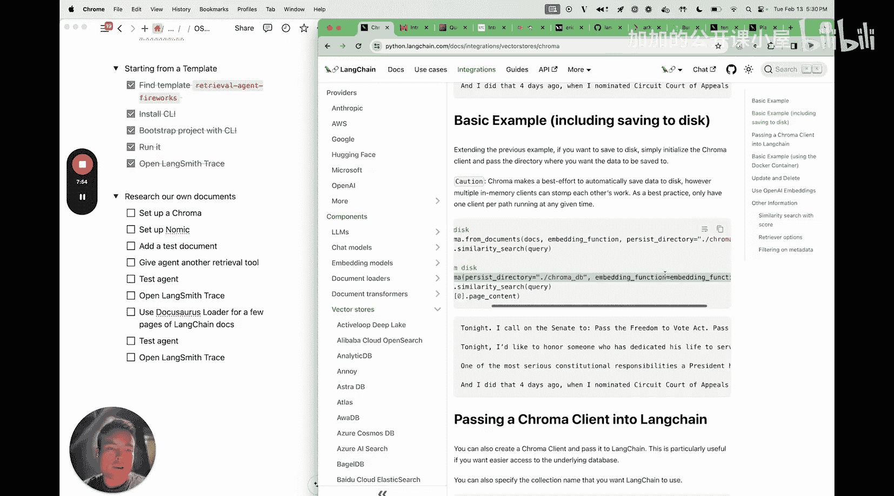

```python
# ... 其他导入 ...
from langchain_community.vectorstores import Chroma
from langchain_nomic.embeddings import NomicEmbeddings
from langchain.tools.retriever import create_retriever_tool

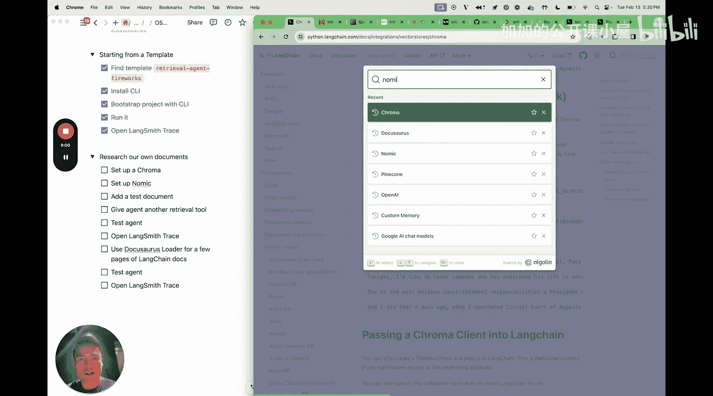

# 1. 初始化与之前相同的嵌入模型和向量库
embeddings = NomicEmbeddings(model="nomic-embed-text-v1.5")
vector_store = Chroma(
    embedding_function=embeddings,
    persist_directory="./chroma_db"
)

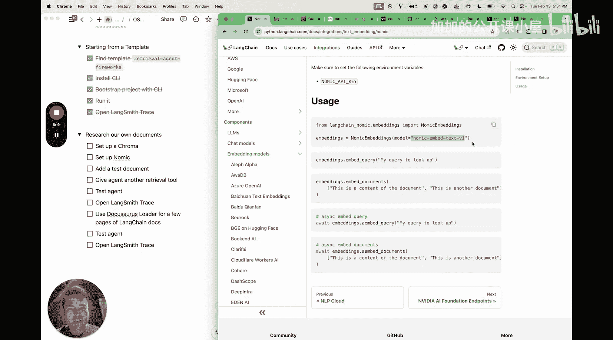

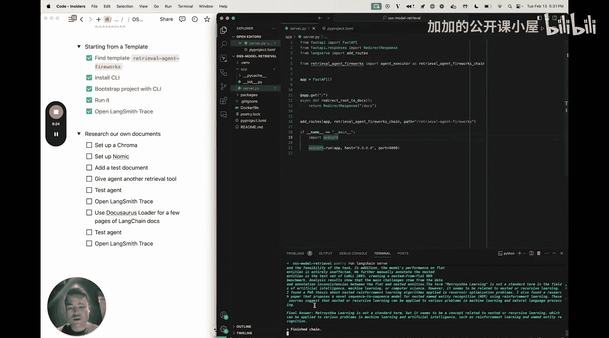

# 2. 从向量库创建检索器
retriever = vector_store.as_retriever()

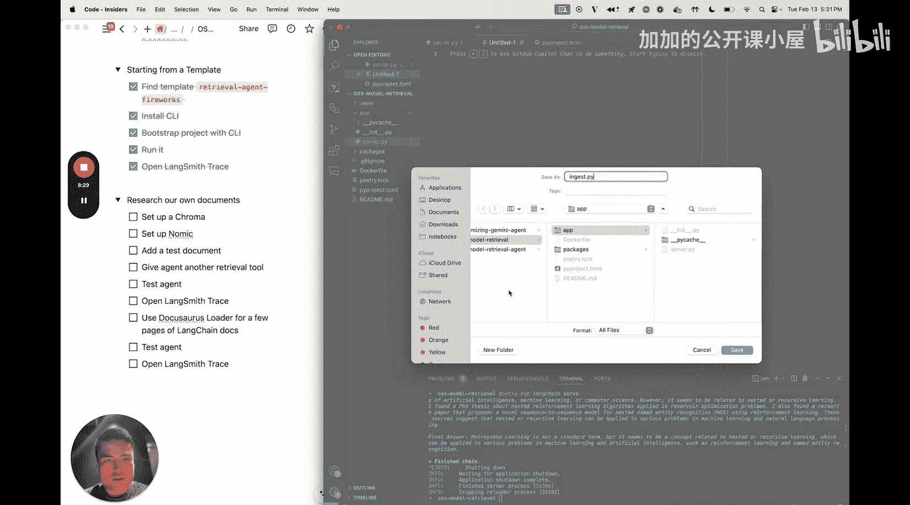

# 3. 将检索器包装成一个 LangChain 工具
retrieval_tool = create_retriever_tool(
    retriever,
    "langchain_docs_retriever",
    "Searches and returns information from the LangChain documentation."
)

# 4. 用新的工具列表替换或补充原有的工具列表
# 假设原有工具列表名为 `tools`
tools = [retrieval_tool]  # 也可以保留其他工具，如：tools = [retrieval_tool, existing_tool_1, ...]

# 5. 使用新的工具列表创建 Agent
agent = create_react_agent(llm, tools, prompt)
# ... 后续链的构建逻辑 ...
```

完成这些修改后，重启 LangServe 服务。现在，你的 Agent 就具备了从你自己的 LangChain 文档库中检索信息的能力。你可以在 Playground 中尝试提问，例如：“How do I use a ConversationBufferMemory?”。

## 总结

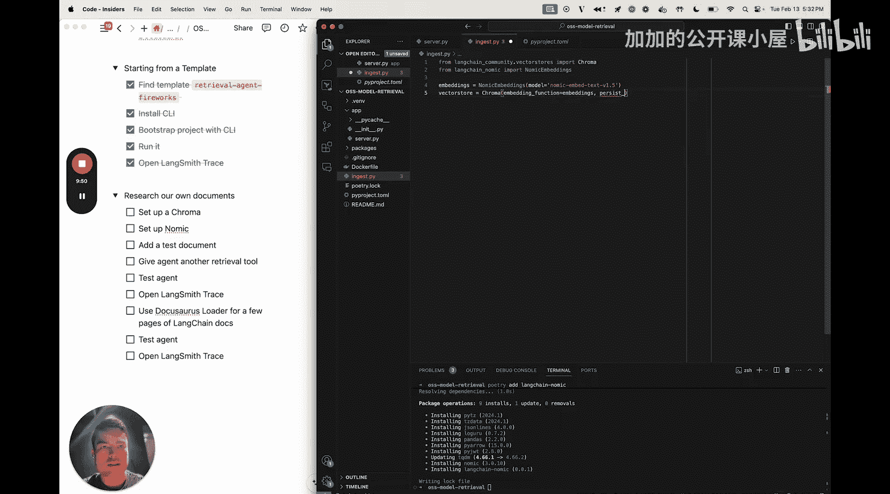

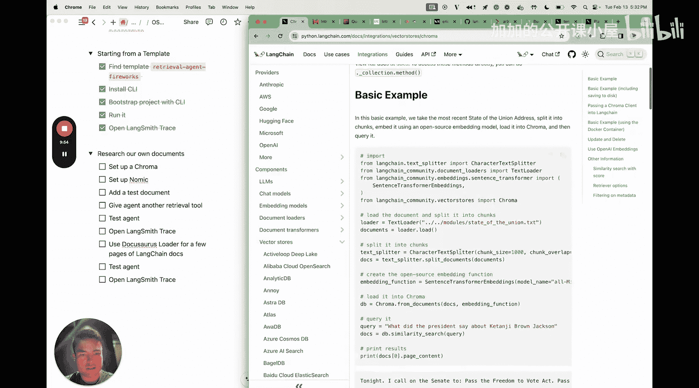

本节课中我们一起学习了如何基于开源模型构建一个功能性的 LangChain Agent。我们从检索代理模板出发，逐步替换了其默认的 Archive 检索工具，转而使用 **Chroma 向量数据库** 和 **Nomic Embeddings** 来建立自己的文档知识库，并最终将其集成为一个可供 Agent 调用的检索工具。通过 **LangSmith**，我们可以清晰地观察整个 Agent 的推理和工具调用过程。这个流程为你构建自定义的、基于私有知识的智能助手提供了坚实的基础。