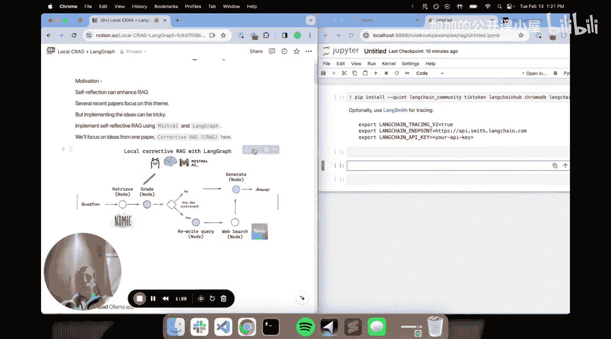
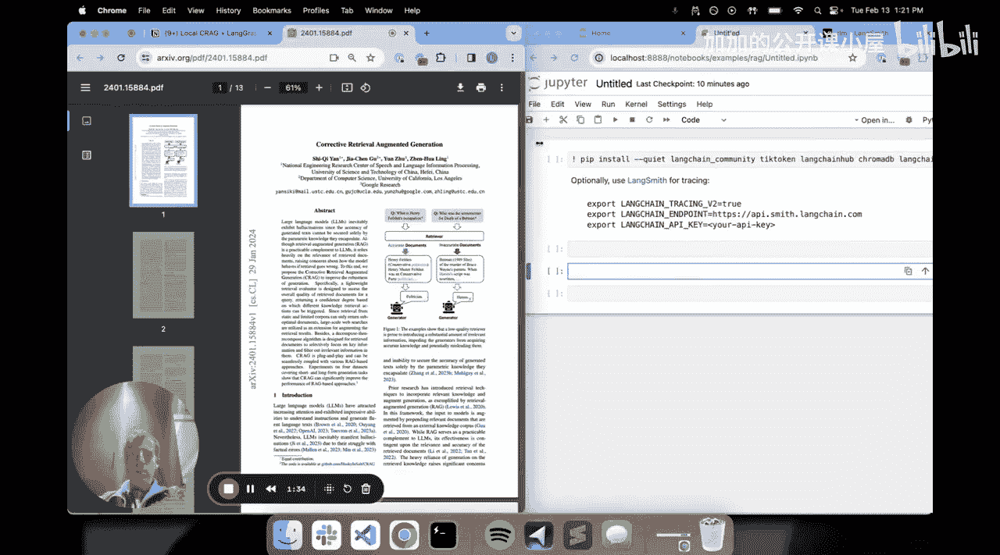
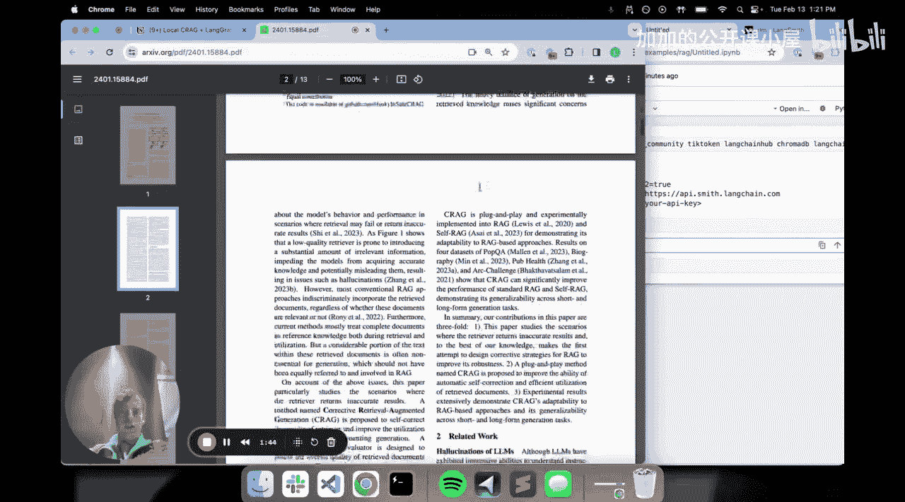
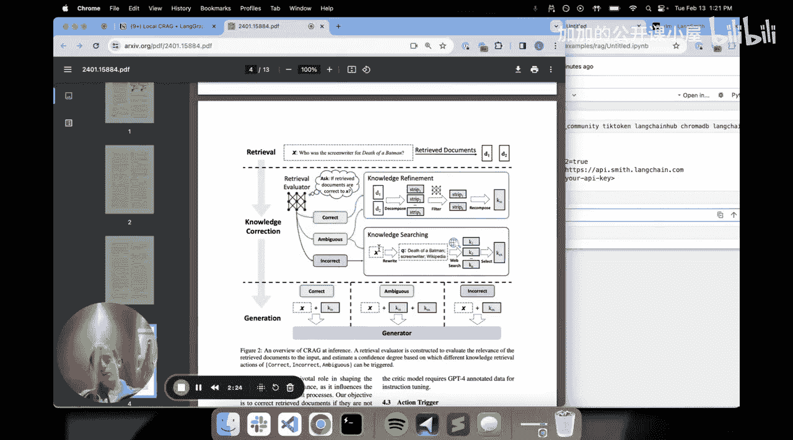
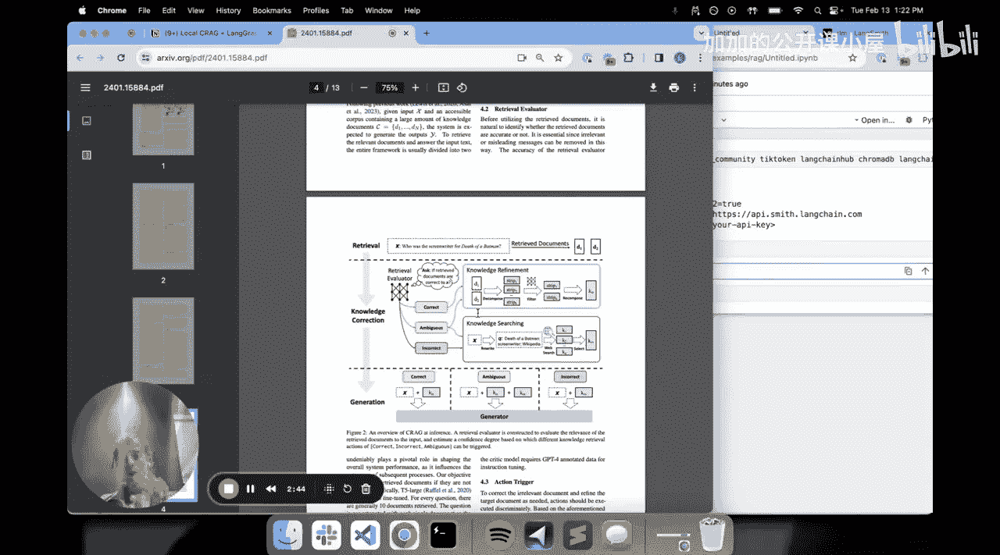
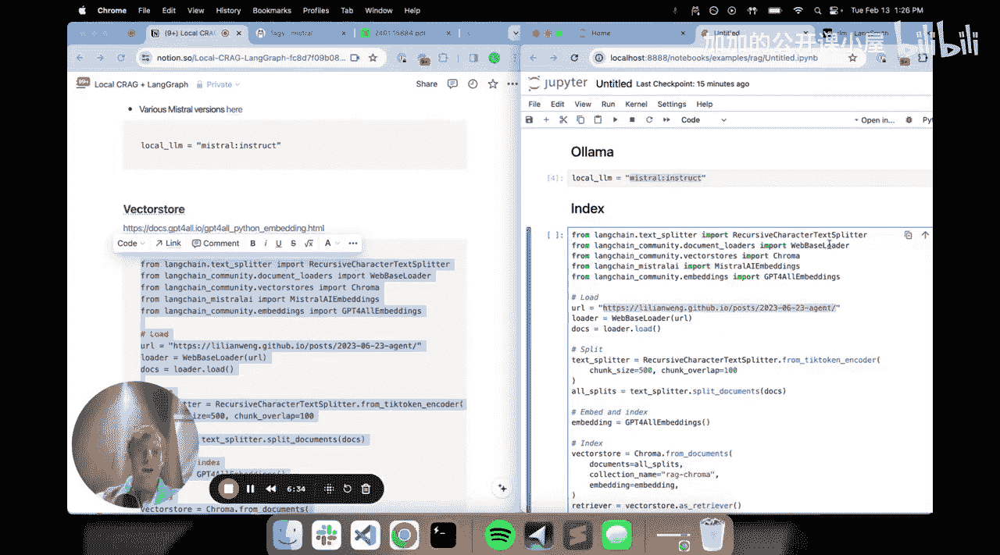
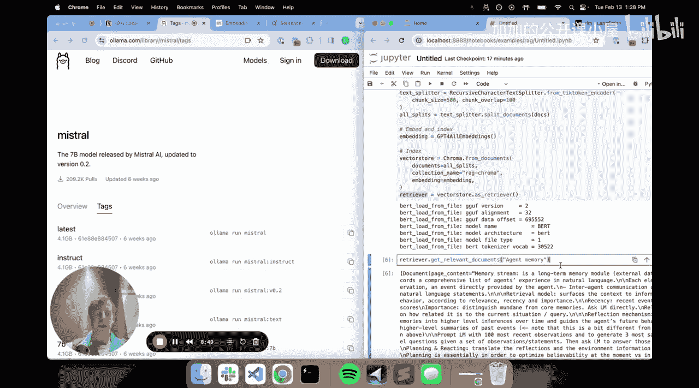
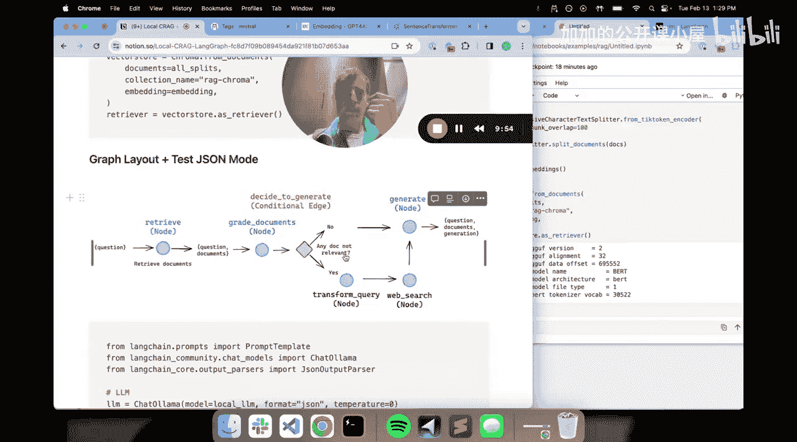

#  011：使用开源本地 LLM 从零构建 Corrective RAG 🛠️

在本节课中，我们将学习如何仅使用开源模型和本地模型，在笔记本电脑上从零开始构建一个具备自我反思能力的 RAG 应用。我们将重点介绍一种名为 Corrective RAG 的方法，它通过评估检索文档的相关性，并在必要时进行查询重写和网络搜索，来提升 RAG 系统的准确性和鲁棒性。

## 概述：什么是自我反思式 RAG？🤔

上一节我们介绍了 RAG 的基本概念。本节中，我们来看看 RAG 研究中的一个有趣趋势：自我反思。

传统的 RAG 流程通常是根据问题从索引中检索文档，然后直接生成答案。而自我反思的理念是，系统能够基于检索文档与问题的相关性，或者生成答案的质量，进行某种推理和反馈，并可能重试某些步骤。这是一种更智能、更具适应性的方法。

## 核心概念：Corrective RAG (CRAG) 📄





我们将重点实现一篇名为 Corrective RAG 的论文中提出的方法。其核心思想相当直观。



**基本流程如下：**
1.  执行检索。
2.  评估检索到的文档相对于问题的相关性。
3.  如果文档被判定为相关，则进行知识提炼，压缩相关部分。
4.  如果文档被判定为模糊或不相关，则执行网络搜索，并用搜索结果补充或替代原始检索结果。

这体现了自我反思 RAG 的通用原则：RAG 不应是一个简单的“检索-生成”单次过程，而可以包含推理、反馈、重试和从替代源检索等环节。

## 我们的实现方案 📋

在我们的构建中，我们将对原论文方法做一些简化。以下是我们的流程图：

```
[问题] -> [检索] -> [文档相关性评估] -> {相关？} -> [是] -> [生成答案]
                                         -> [否] -> [查询重写] -> [网络搜索] -> [生成答案]
```





我们的流程是：执行检索，使用一个节点来评估这些文档相对于问题的相关性。如果任何文档被判定为不相关，我们将进行查询重写和网络搜索，然后基于网络搜索结果进行生成。

## 第一步：运行本地大语言模型 💻

首先，我们需要知道如何在本地运行大语言模型。一个非常有用且方便的工具是 **Ollama**。

Ollama 是一个让你能轻松在本地（例如 Mac 笔记本）运行模型的好方法。你只需访问其官网，下载应用程序并安装。安装后，你可以浏览其模型库，选择并下载你想要的模型。

以下是下载并设置模型的代码示例：

```python
# 使用 Ollama 命令行工具拉取模型（在 notebook 外执行）
# ollama pull mistral:instruct

# 在 Python 中定义要使用的本地模型
from langchain_community.llms import Ollama
local_llm = Ollama(model="mistral:instruct")
```

这样，我们就获得了一个在本地系统上通过 Ollama 运行的大语言模型 `local_llm`，使用起来非常便捷。

## 第二步：构建本地检索索引 🔍

因为这是一个 Corrective RAG 应用，我们需要一个用于执行 RAG 的索引。

这里，我们将使用一篇关于智能体的博客文章作为数据源。以下是构建索引的步骤：

1.  **加载文档**：从指定 URL 加载博客文章。
2.  **分割文本**：将长文档分割成较小的块（例如每块 500 个词元）。
3.  **创建向量存储**：使用本地嵌入模型和向量数据库。

以下是构建索引的代码：

```python
from langchain_community.document_loaders import WebBaseLoader
from langchain.text_splitter import RecursiveCharacterTextSplitter
from langchain_community.embeddings import GPT4AllEmbeddings
from langchain_community.vectorstores import Chroma

# 1. 加载文档
loader = WebBaseLoader("https://lilianweng.github.io/posts/2023-06-23-agent/")
data = loader.load()



# 2. 分割文本
text_splitter = RecursiveCharacterTextSplitter(chunk_size=500, chunk_overlap=0)
all_splits = text_splitter.split_documents(data)

# 3. 创建向量存储和检索器
embeddings = GPT4AllEmbeddings() # 本地 CPU 优化的嵌入模型
vectorstore = Chroma.from_documents(documents=all_splits, embedding=embeddings)
retriever = vectorstore.as_retriever()

# 测试检索器
docs = retriever.get_relevant_documents("agent memory")
print(docs[0].page_content[:200]) # 打印前200个字符
```

我们使用了 **GPT4AllEmbeddings**，这是一个在本地运行、CPU 优化的对比训练嵌入模型，无需 API 调用。向量存储则使用了 **Chroma**，一个易于搭建的本地开源向量数据库。测试表明，检索器工作正常。

## 第三步：设计图状态与逻辑 🧠

当我们使用图（Graph）来构建这类逻辑化 RAG 流程时，第一步总是尝试规划逻辑步骤。

在图中，每个逻辑步骤都在转换一个**状态**。整个图的流程就是定义并不断修改这个状态的过程。

对于我们的 RAG 应用，状态可以定义为一个字典。这个字典包含与 RAG 流程相关的几个关键信息。

以下是状态字典的示意结构：



```python
state = {
    "question": "用户提出的原始问题",
    "documents": ["检索到的文档列表"],
    "generation": "最终生成的答案"
}
```

在流程中，我们会依次向这个状态字典中填充问题、检索到的文档，并最终附加生成的答案。

## 总结 🎯

本节课中，我们一起学习了如何构建一个具备自我反思能力的 Corrective RAG 系统。我们从了解自我反思 RAG 的概念和 Corrective RAG 论文的核心思想开始，然后规划了我们的简化实现流程。接着，我们实践了使用 Ollama 运行本地大语言模型，以及使用 GPT4AllEmbeddings 和 Chroma 构建本地检索索引。最后，我们探讨了如何为图计算设计状态流转的逻辑。



在接下来的章节中，我们将基于这个状态设计，具体实现文档评估、查询重写和网络搜索等节点，最终组装成完整的 Corrective RAG 应用图。