#  012：从零构建自修正代码助手 🛠️

在本节课中，我们将学习如何使用 LangGraph 构建一个自修正的代码生成助手。我们将借鉴 AlphaCodium 等先进项目中的“流程工程”思想，通过迭代生成、测试和修正代码，而不仅仅是依赖单次提示。课程将涵盖如何利用 LangGraph 定义执行流程、使用工具调用获取结构化输出，以及如何实现代码的自动测试与修正循环。

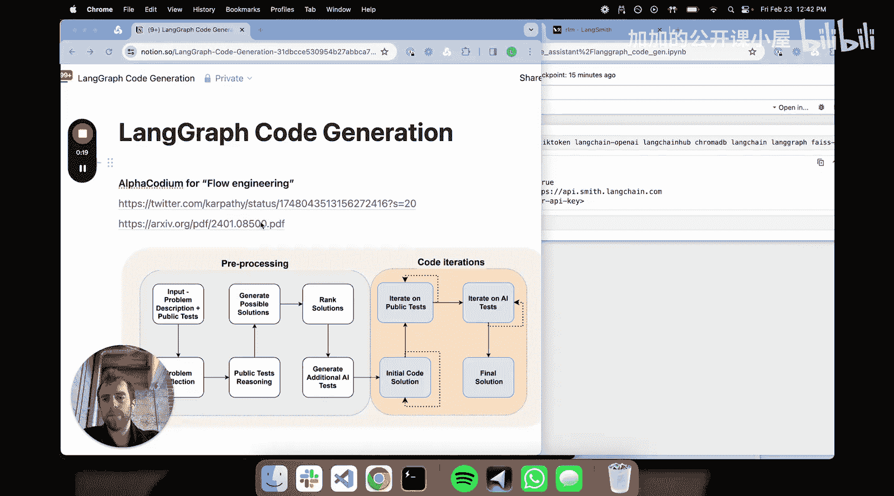

---

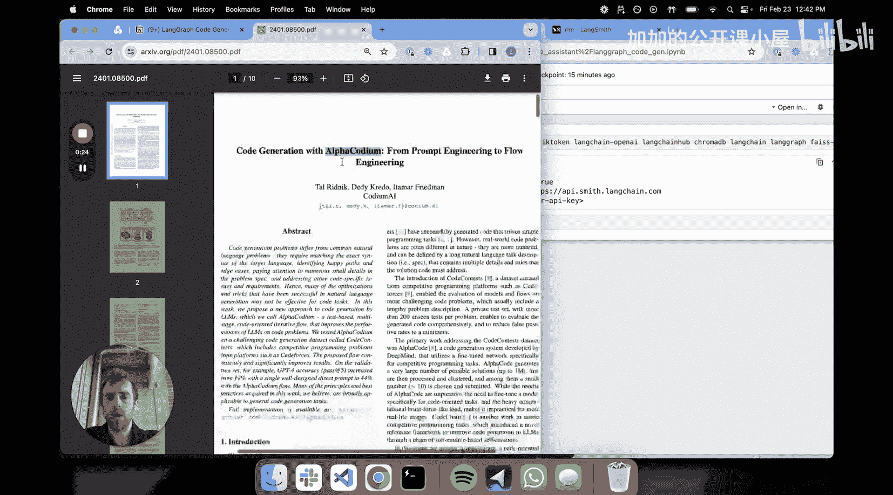

## 代码生成：一个有趣的大语言模型应用 💡

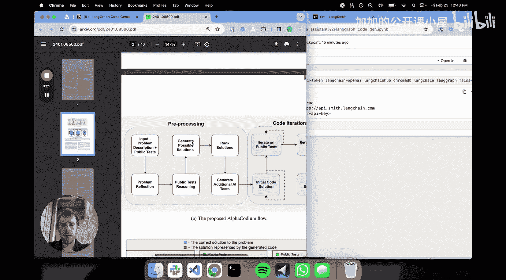

代码生成是大语言模型非常有趣的应用之一。我们已经看到像 GitHub Copilot 这样的项目变得极其流行。

几周前，Codeium AI 团队发表了一篇名为 AlphaCodium 的论文。这篇论文特别酷，因为它引入了使用“流程工程”进行代码生成的概念。

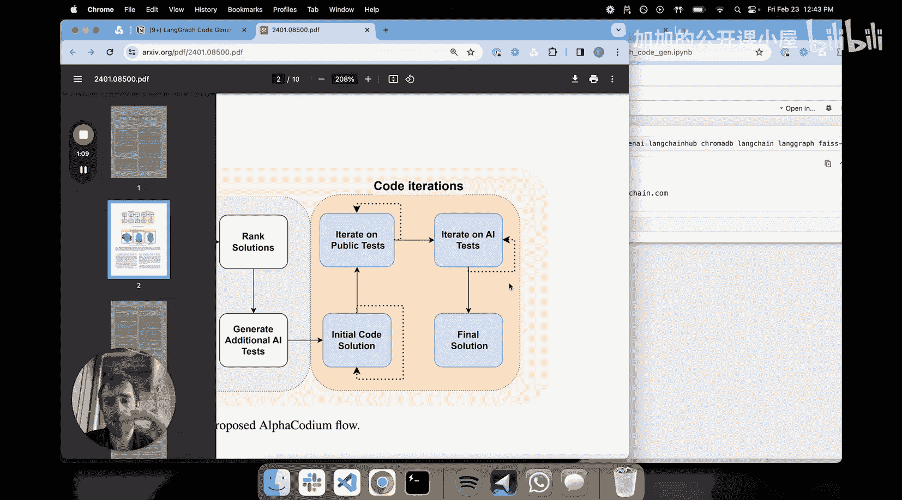

## 从提示到流程：AlphaCodium 的核心思想 🔄

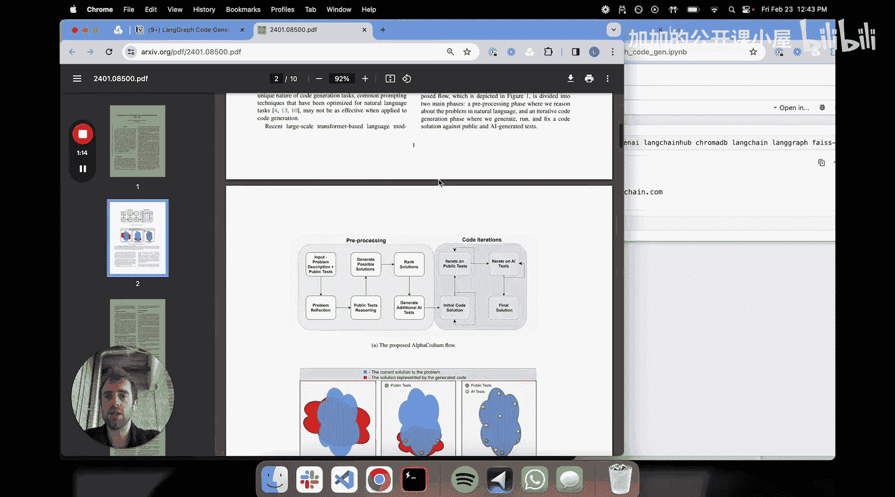

上一节我们提到了代码生成，本节中我们来看看 AlphaCodium 提出的新范式。

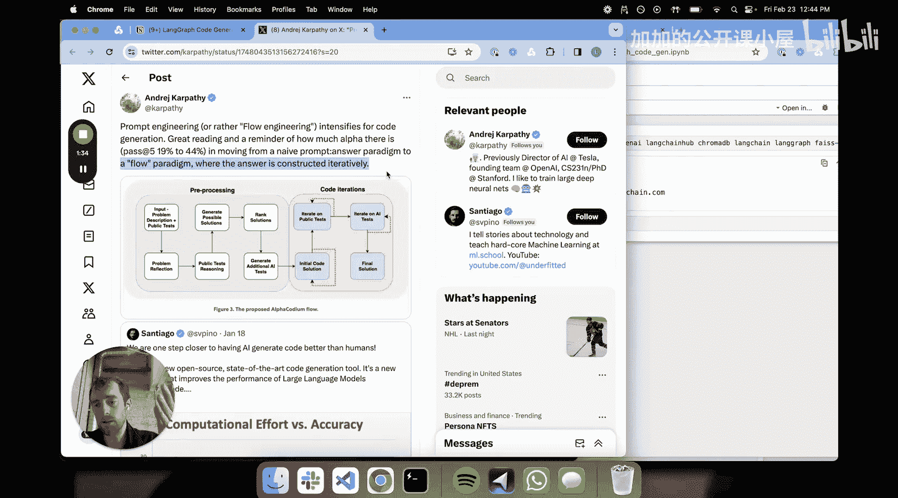

传统的流程是：大语言模型接收一个编程问题，然后直接输出一个解决方案。

AlphaCodium 的做法是：
1.  生成一组解决方案。
2.  对这些方案进行排序。

这听起来像是标准的“提示-响应”式流程。但其中我想请大家注意的关键点是：

它实际上会通过几种不同的方式测试这些代码，包括公共测试和 AI 生成的测试。关键在于，它会根据这些测试结果进行迭代，并尝试改进解决方案。

这个想法非常有趣。

随后，Carper AI 发布了一条推文，提到了这个主题。推文指出，“流程工程”是一个非常好的范式，它使我们从简单的“提示-答案”模式转向一种流程，在这种流程中，你可以利用测试随时间迭代地构建答案。

这是一个非常好的想法。

## LangGraph：构建任意流程的利器 🏗️

上一节我们介绍了流程工程的概念，本节中我们将介绍实现它的工具。

几周前，我们推出了 LangGraph，作为一种构建任意图结构的方法，它可以表示不同类型的流程。我之前已经做过一些关于 LangGraph 的视频，例如在 RAG（检索增强生成）中的应用，你可以进行检索，然后进行检索质量检查（例如对文档评分），如果文档质量不佳，你可以尝试重新检索或进行网络搜索。这是一种表示大语言模型任意逻辑流程的方式。

这与我们构建智能体的方式非常相似，但图结构的优势在于，你可以勾勒出一个更具结构性的流程。它有点像带有“护栏”的智能体：你以特定的顺序定义步骤，每次运行图时，它都严格按照这个顺序执行。

## 项目目标：用 LangGraph 实现 AlphaCodium 的部分思想 🎯

现在，我想尝试使用 LangGraph 来实现 AlphaCodium 中的一些想法。

具体来说，假设我们想要回答关于 LangChain 文档某一部分的编程问题。为此，我将选择 LangChain 表达式语言文档。

这是 LangChain 文档的一个子集，大约包含 6 万个词元，并且只关注 LangChain 表达式语言。LangChain 表达式语言基本上是一种使用 LangChain 表示链的方式，我们稍后会详细讨论。

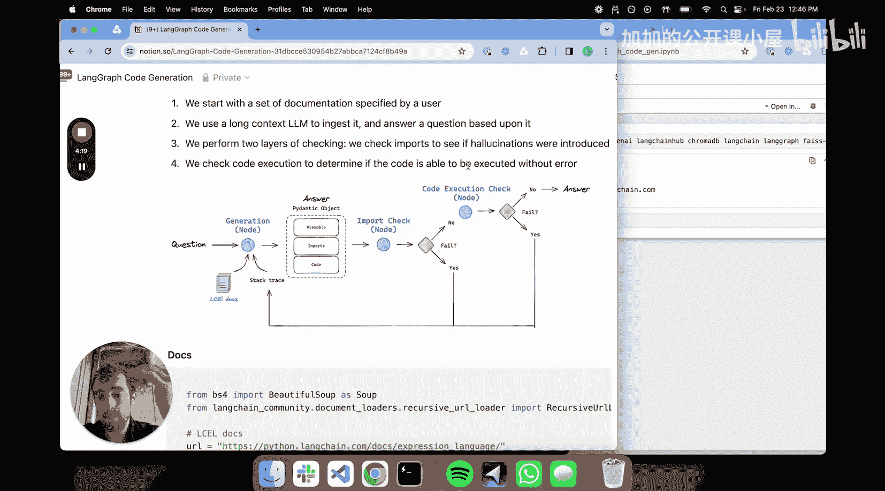

## 设计我们的自修正流程 📝

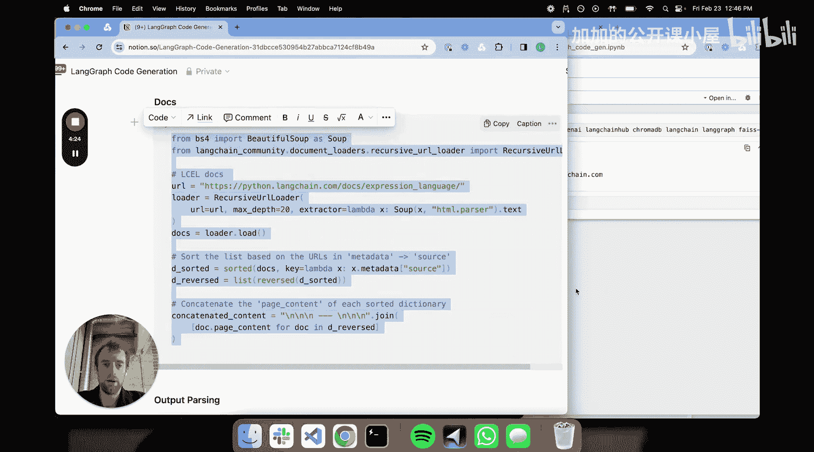

上一节我们确定了项目范围，本节中我们来设计具体的执行流程。

我想做几件简单的事情：
1.  在我们的图中定义一个节点，该节点接收一个问题，并参考 LangChain 表达式语言文档输出一个答案。
2.  然后，根据这个答案，我希望能够解析出各个组成部分。给定答案后，我希望能够解析出前言（这段代码在回答什么）、具体的导入语句以及代码本身。
3.  为了做到这一点，我想使用一些 Pydantic 对象，这样格式会非常规整。

如果我有了这些，我就可以非常容易地实现测试，例如：
*   检查导入语句是否有效。
*   检查代码是否能执行。

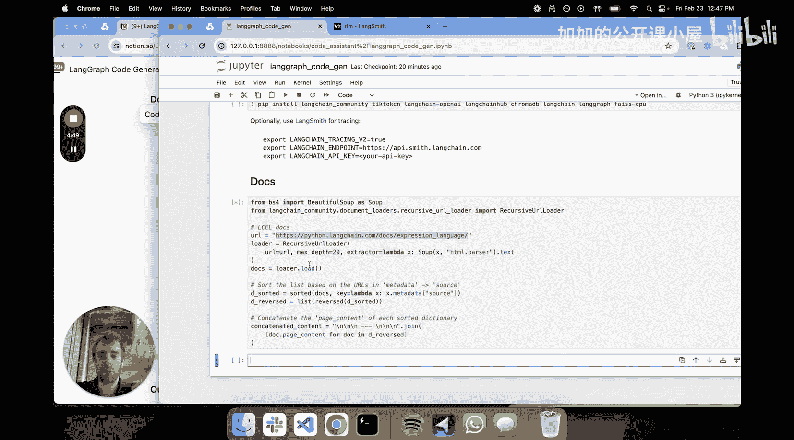

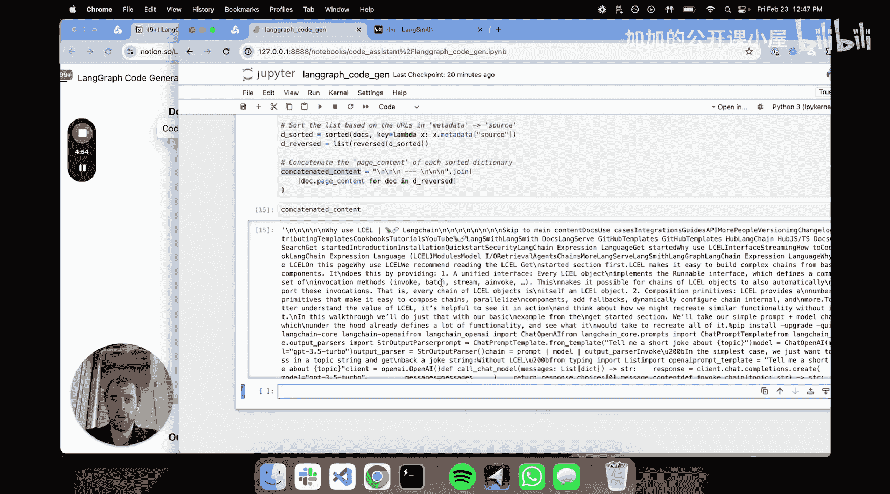

如果其中任何一项失败，我可以循环回到我的生成节点，并说：“嘿，再试一次，这是错误信息。”

再次强调，AlphaCodium 所做的要复杂得多。我并不是说我们要完全照搬实现。它实际上处理一大堆公开的编程挑战，并且每个问题都有公开可用的测试。我们这里做的是简化版本，但我想展示如何实现这类想法，并且你可以根据需要让它变得任意复杂。

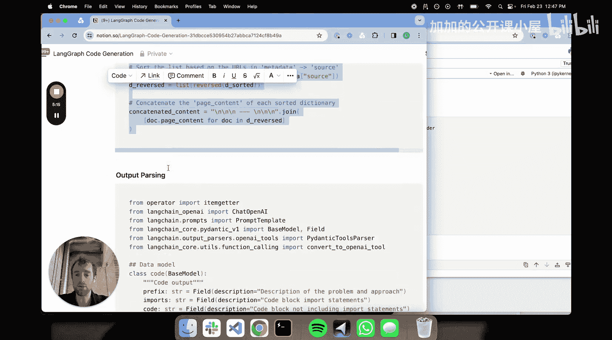

## 第一步：准备文档与环境 ⚙️

我将把一些代码复制到正在运行的笔记本中。我所做的只是进行了一些 `pip install` 安装，并且基本上为 LangSmith 定义了一些环境变量，我们稍后会看到这非常有用。

我将这部分称为 `docs`。这是我用来摄取与 LangChain 表达式语言相关文档的地方。

我现在启动这个流程。它正在运行。这部分使用了 URL 加载器来抓取文档，对它们进行排序和清理。

这些就是所有与 LangChain 表达式语言相关的文档，大约有 6 万个词元，因为我之前测量过。我们的文档准备好了。

## 第二步：利用工具调用获取结构化输出 🧰

现在我想展示一个非常有用的功能：在 OpenAI 模型中使用工具调用。其他大语言模型也有类似的功能，但我想展示一些真正有用的东西。

在这里，我将展示如何构建一个链，使其能够输出我们之前在图中讨论过的三个部分：对于每个解决方案，我们想要一个前言、导入语句和代码，作为一个我们可以单独处理的结构化对象。

以下是具体做法：
1.  我们从 Pydantic 导入 `BaseModel` 和 `Field`。
2.  我们为输出定义一个数据模型：我想要一个 `prefix`（纯语言描述的解决方案设置）、一个 `imports` 语句和 `code`。我希望这三个部分是独立的，以便后续处理。
3.  我将使用 `gpt-4-0125-preview` 这个拥有 128K 上下文窗口的模型。
4.  我将把这个数据模型转换成一个工具，并将其绑定到我的模型上。这样，模型将始终尝试执行一个函数调用，以输出我在此指定的格式。
5.  我定义了一个提示词，内容是：“这里是所有的 LCEL（LangChain Expression Language）文档。回答问题，并以以下几种方式构建你的输出。”

酷的是，我们总是通过函数调用来尝试输出一个 Pydantic 对象。

现在，我可以用一个问题来调用它。让我试试。

我将设置一个问题：“如何使用 LCEL 创建一个 RAG 链？”

现在开始运行。这需要一些时间，因为它正在处理。

实际上，我们传入了之前加载的所有文档，大约 6 万个词元的上下文。考虑到像 Gemini 这样的新型长上下文大语言模型，做这类事情变得越来越可行：加载整个代码库或整套文档，直接塞进模型，然后让它回答相关问题。

现在延迟肯定更高，因为上下文非常非常大。这没关系。

我们可以转到 LangSmith 看看运行情况。这是我们的提示词，有大约 63000 个词元，上下文量很大。我们问了一个问题，并将回答基于所有这些 LCEL 文档。希望它能输出一个我们可以使用的 Pydantic 对象作为响应。

完成了。我们可以看到我们的对象有一个 `prefix`，它也会有 `imports`。我们可以在 LangSmith 中看到答案：这里有你的导入语句、你的代码和你的前言。这些都可以很容易地从该对象中提取出来。它基本上是一个 Pydantic 对象，你可以通过 `answer.prefix`、`answer.imports`、`answer.code` 来提取每个部分。

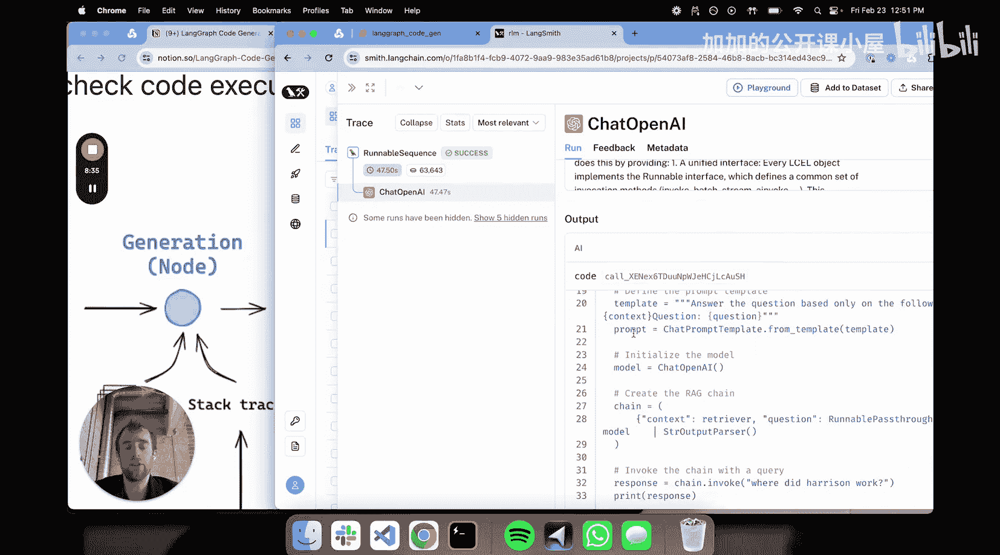

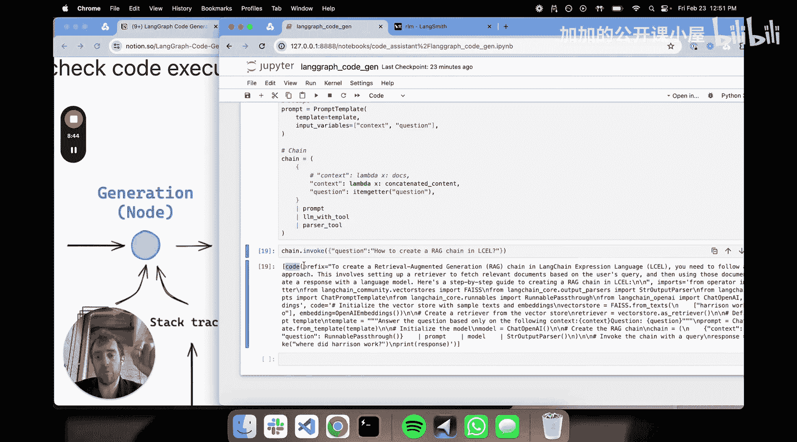

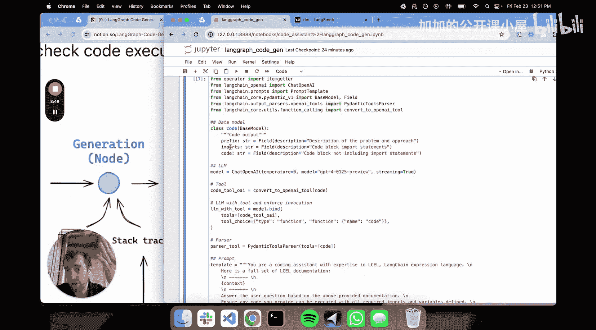

这很棒。

## 第三步：使用 LangGraph 定义执行流程 🕸️

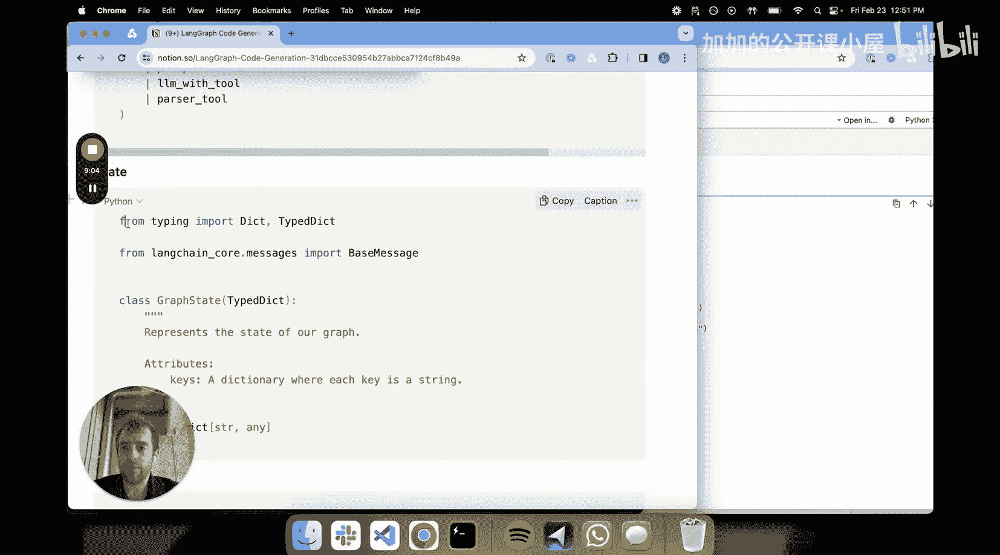

上一节我们实现了结构化输出，本节中我们开始设置我们的图。

我将为我们的图定义状态。这只是一个包含与我们问题相关内容的字典，例如我们的代码解决方案、任何错误信息，这就是我们所需要的。

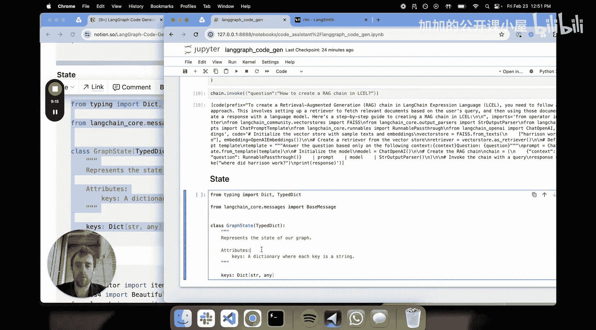

这里是所有与我的图相关的代码，我们将逐步讲解，所以不用太担心，我只是想把这些都放在这里。

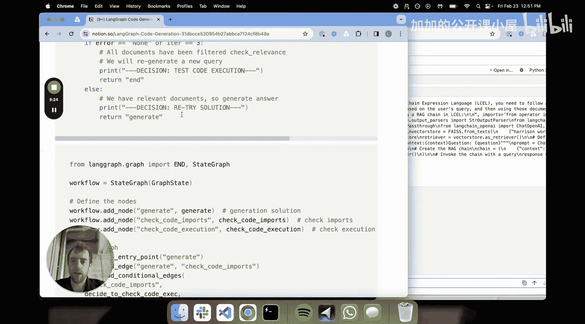

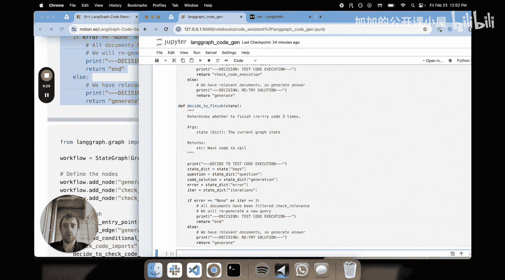

现在，如果我们向上看，理解它的方式很简单：我们图中的每个节点都对应一个函数，该函数以某种方式修改状态。

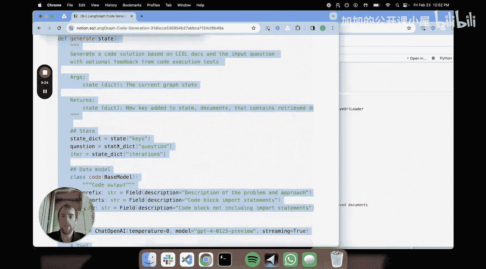

我们的生成节点将处理 `question` 和 `iteration`。这些是我们希望作为输入的状态部分。`iteration` 只是计算你尝试了多少次。

---

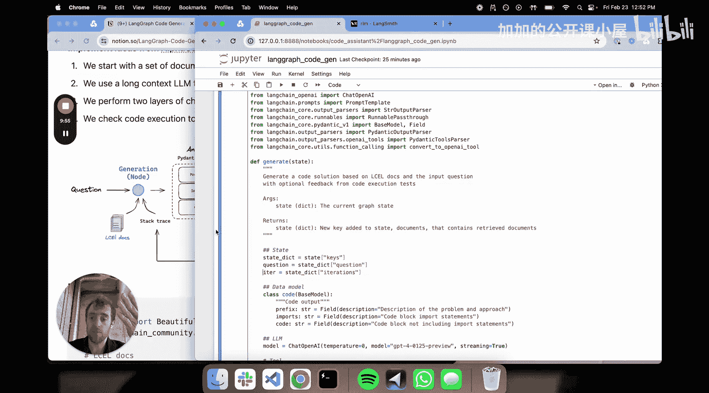

在本节课中，我们一起学习了如何构建一个自修正的代码生成助手。我们从介绍代码生成和 AlphaCodium 的“流程工程”思想开始，然后学习了如何使用 LangGraph 来定义这种迭代流程。我们实践了利用工具调用从大语言模型获取结构化输出（包括代码、导入和描述），并开始搭建图结构，为下一步实现测试与修正循环奠定了基础。这个框架展示了如何超越简单的提示，构建更健壮、可自我改进的 AI 编码工具。