#  014：使用 RAPTOR 从零构建长上下文 RAG 🦖

在本节课中，我们将要学习一种名为 RAPTOR 的新方法，它专门用于处理长上下文大语言模型的检索问题。我们将探讨长上下文模型的优势与局限，并动手构建一个 RAPTOR 系统。

## 概述：长上下文模型的机遇与挑战

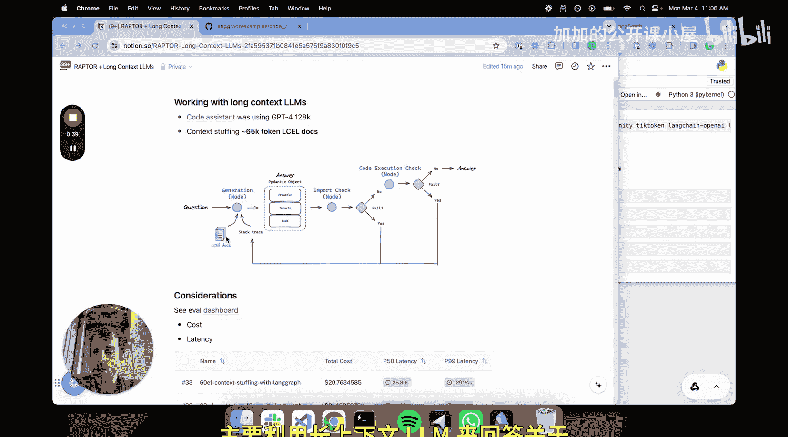

随着像 Gemini（支持百万级令牌）和 Claude 3（同样支持百万级令牌）这样的长上下文大语言模型的出现，一个有趣的问题产生了：**RAG（检索增强生成）是否已经过时？**

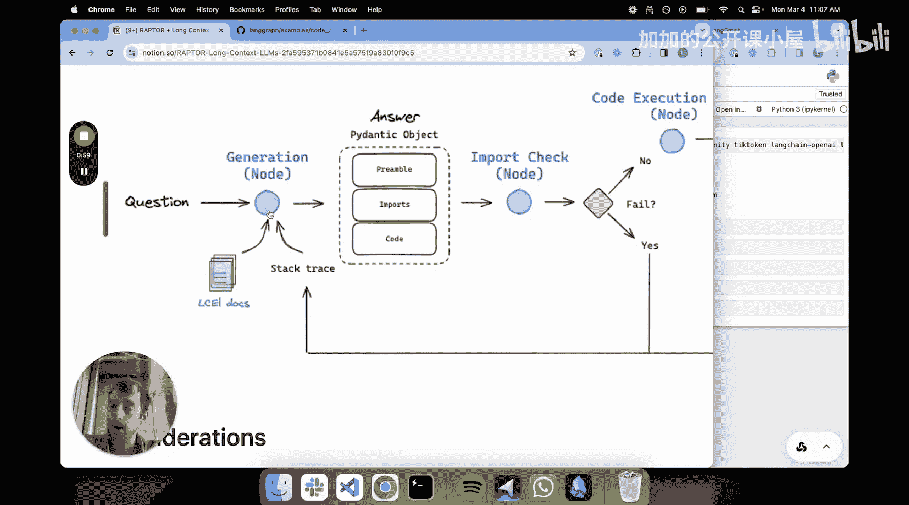

最近，我在一些项目中使用了长上下文模型。例如，上周发布的一个代码助手。它利用长上下文模型来回答关于 LangChain 表达式语言文档的编程问题。我们直接将大约 60，000 个令牌的文档内容与问题一起输入模型，无需进行检索，直接生成答案。这种方式非常便捷。


然而，通过评估，我发现了几个需要考虑的问题。我测试了 20 个问题，观察生成结果。在 LangSmith 仪表板上，可以看到 P50 延迟（第 50 百分位延迟）大约在 35 到 46 秒之间，而 P99 延迟在某些情况下甚至高达 420 秒。此外，每次生成的成本大约在 1 到 1.3 美元之间。这些都是使用超长上下文模型时需要考虑的因素，相比之下，传统的 RAG 系统检索的是更小、更精确的文本块。

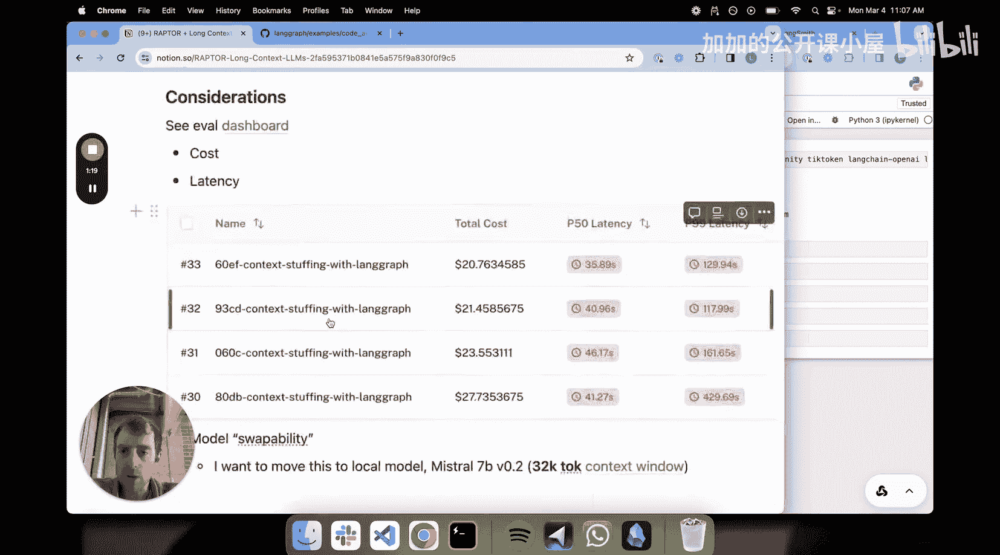

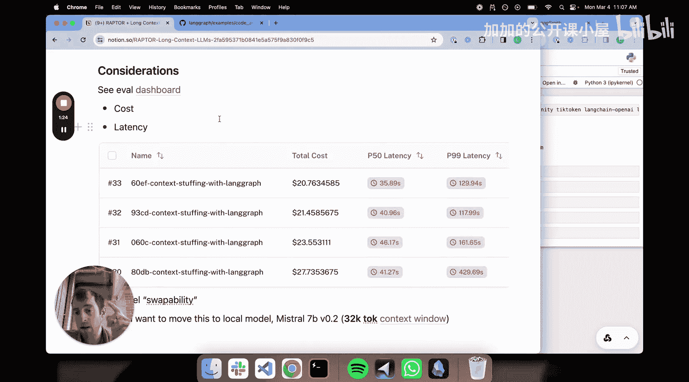

另一个问题是，很多人询问能否使用本地模型。我常用的本地模型是 Mixtral 7B V2，其上下文窗口为 32，000 个令牌。但我的文档大约有 60，000 个令牌，无法像之前那样直接进行“上下文填充”。

这些考虑让我开始思考：是否存在一种轻量级的检索策略，既能利用长上下文模型的优势，又能解决上述延迟、成本和上下文窗口限制的问题？特别是最后一点，因为我需要一个能在文档大小略大于上下文窗口（例如 2 倍）时仍能良好工作的方案。

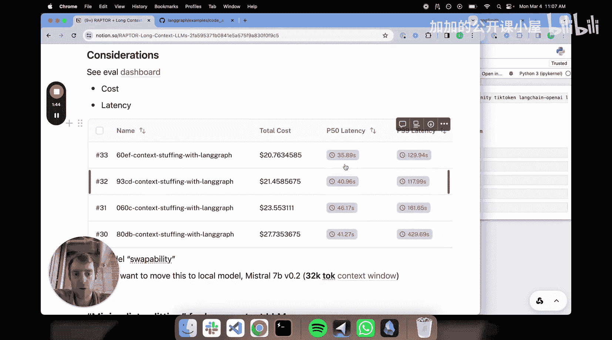

## 探索解决方案：从文档级检索到文档树

我在社交媒体上提出了这个问题：有没有适用于长上下文模型的、简约的文本分割策略？我希望用 Mixtral 7B（32K 令牌窗口）进行 RAG，但我的文档有 60K 令牌。我不能直接填充上下文，但也不想要非常精细的分块策略，我希望有一个简单的方法来处理更大的文档。


一个很好的建议是：**直接在文档级别建立索引**。这意味着你可以将整个文档进行向量化，然后在这些向量化的文档上执行类似 K-近邻的检索。这完全避免了文档分块，是一个相当合理的主意。

但另一个想法是**构建文档树**。提出这个想法的原因是，当你使用 K-近邻检索一组向量化的文档时，有时一个答案可能需要整合两到三个不同文档的信息才能回答。如果你将所有内容都进行上下文填充，这不是问题，因为所有信息都在那里。但如果你进行检索，你需要设置 K 参数（检索文档的数量）。这个设置很棘手：为了捕捉回答某些特定问题所需的所有内容，K 需要设为 4、5 还是 6？这很难确定。

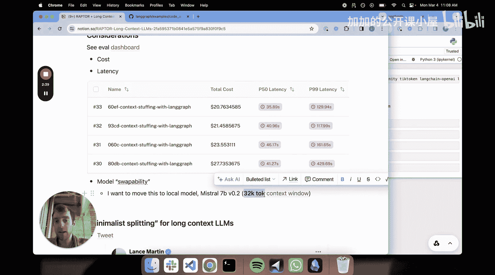

因此，构建文档树的想法成为解决基础 K-近邻检索这一挑战的有趣途径。


## 引入 RAPTOR：递归抽象处理树形组织检索

最近，一篇关于 **RAPTOR** 的论文正好探讨了这个想法，其代码也已开源。LlamaIndex 团队随后发布了 `llama-pack` 实现，这非常棒。

其核心思想相当有趣，让我在这里阐述一下，并讨论它如何有益于长上下文检索这个具体场景。

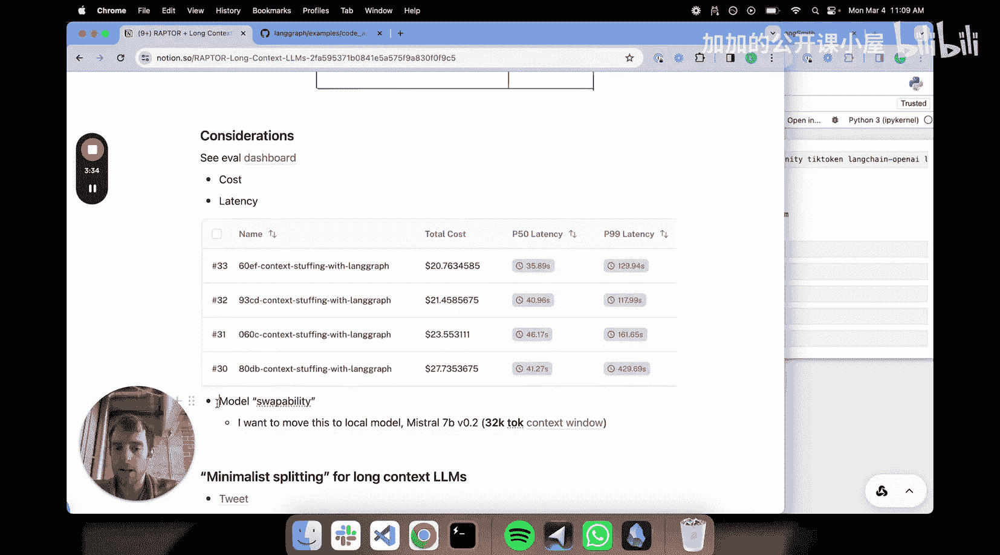

其直觉非常简单：
1.  首先，我们有一组原始文档。注意，这些文档可以是任意大小的。
2.  我们对这些文档进行向量化。
3.  然后，我们对它们进行聚类。聚类过程将相似的文档分组。
4.  接下来，我们做一件重要的事：**将聚类中的信息总结成一个更抽象或更高级别的内容摘要**。
5.  我们递归地重复这个过程（聚类 -> 摘要），直到最终只剩下一个聚类。

这个过程是这样的：你从一组被称为“叶子”的原始文档开始。进行分组（聚类），然后进行摘要步骤（压缩信息），接着再次进行。其理念是，这些中间级别或最终根级别的摘要可以整合来自文档不同部分的信息。

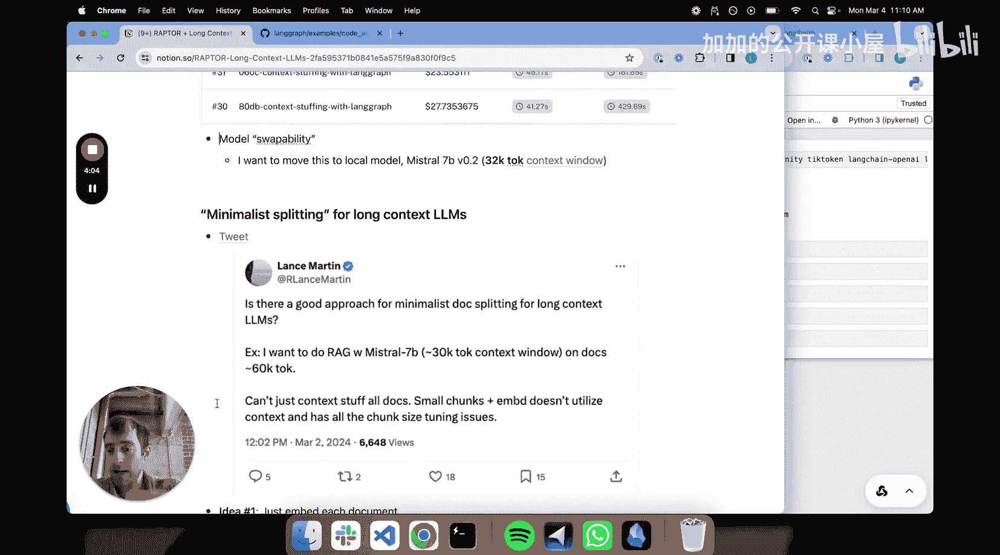

然后，他们将这些摘要与原始的“叶子”文档一起进行向量化，并执行检索。论文表明，**将所有这些东西（原始文档和各级摘要）作为一个整体进行检索，效果最好**。这是一个很好的结果，使得索引和使用变得非常简单。

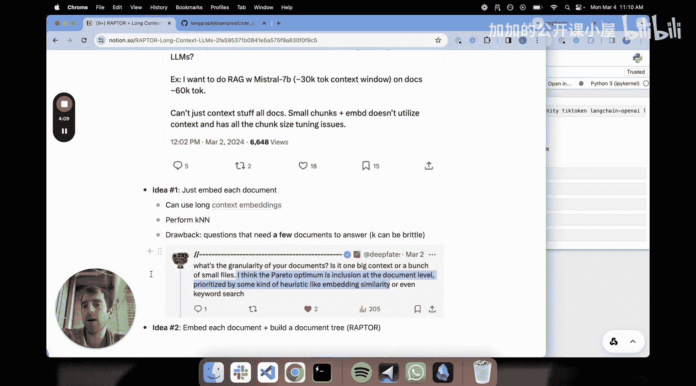

需要说明的是，他们的论文中提到的“叶子”是文本块，但我不太喜欢这样，因为我想使用长上下文模型，根本不想处理分块。对此，论文作者 Jerry 提出了一个合理的观点：**这种方法可以扩展到任何规模，例如，“叶子”可以是完整的文档，而不必是分块**。这完全正确。

所以，我们可以这样思考：
*   **想法一**：直接向量化每个完整文档并进行检索。
*   **想法二**：向量化每个文档，并在其上构建一个文档抽象树，同时也向量化这些更高级别的摘要。这样，我们的向量库中就包含了这些更高级别的摘要，如果需要回答涉及少量文档信息的问题，我们可以从中检索。这或许能更稳健地解决“仅对原始文档进行 K-近邻检索时，可能无法保证总是获取到回答所需的两三个文档”的问题，因为这里构建的摘要文档包含了来自多个“叶子”或子文档的信息。

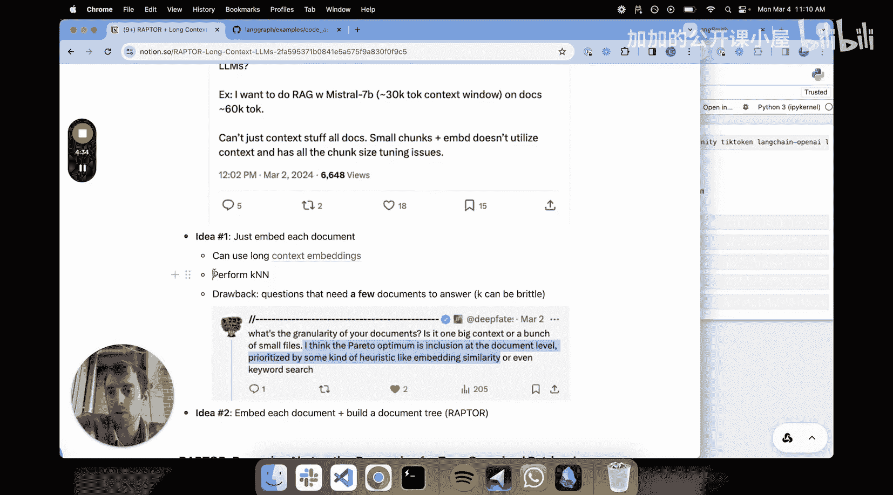

**这就是关键点**。

## 动手实践：使用 Claude 3 构建 RAPTOR

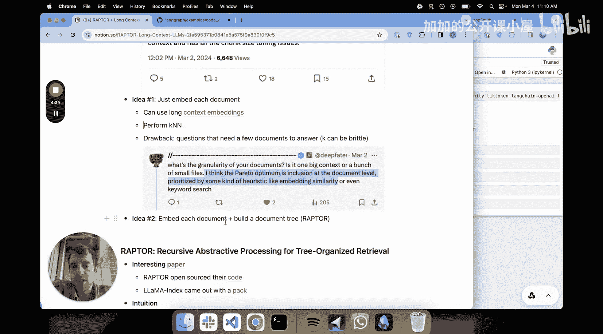

现在，让我们开始构建 RAPTOR，因为它非常有趣。为此，我将使用今天刚发布的 **Claude 3** 模型。这是一组来自 Anthropic 的新模型，性能非常强大，应该非常适合这个用例，因为我想对单个文档进行摘要，并且不希望担心这些文档的大小。

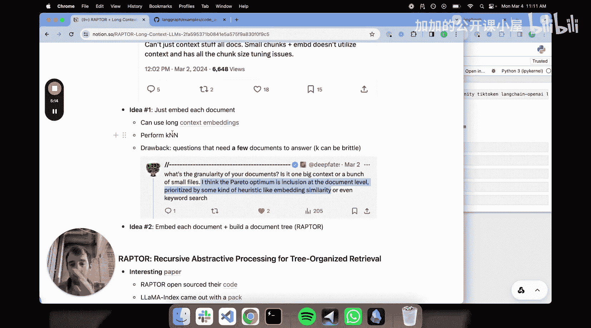

我将使用与上周代码助手示例中相同的文档集。我们从一个空白的笔记本开始。

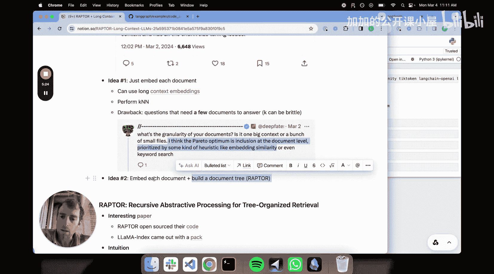

以下是构建步骤：

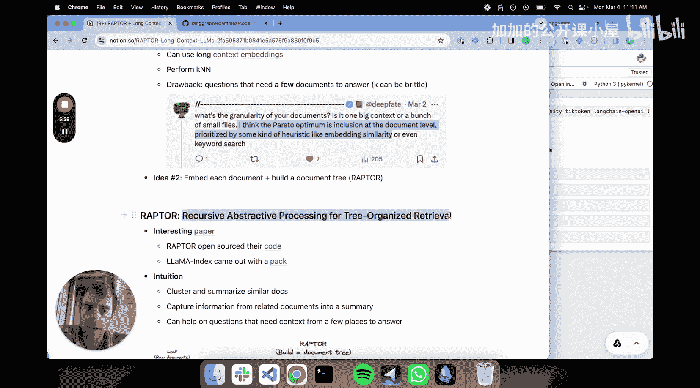

首先，进行一些必要的安装和环境变量设置。

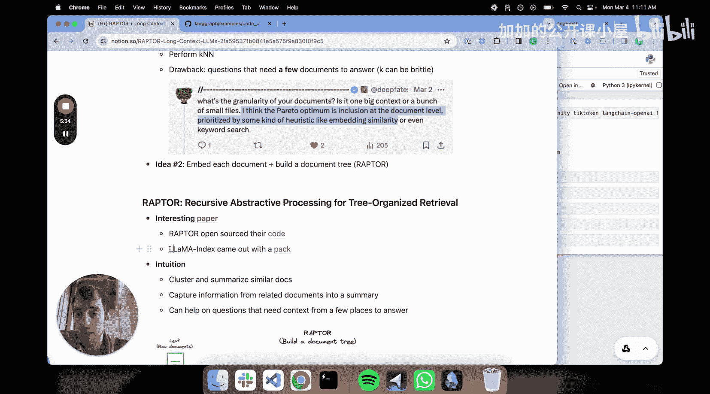

```python
# 安装必要的包
!pip install langchain anthropic scikit-learn

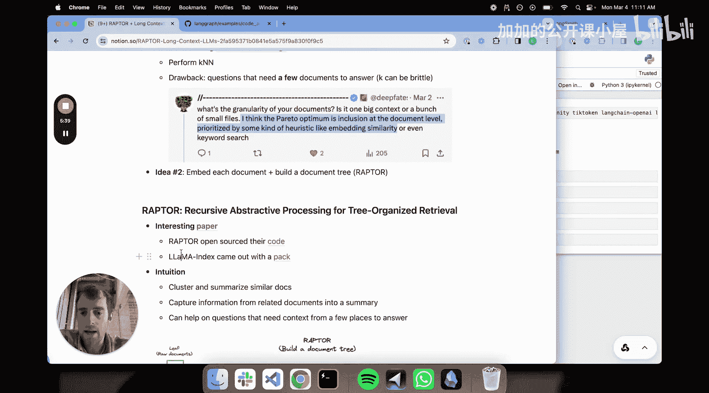

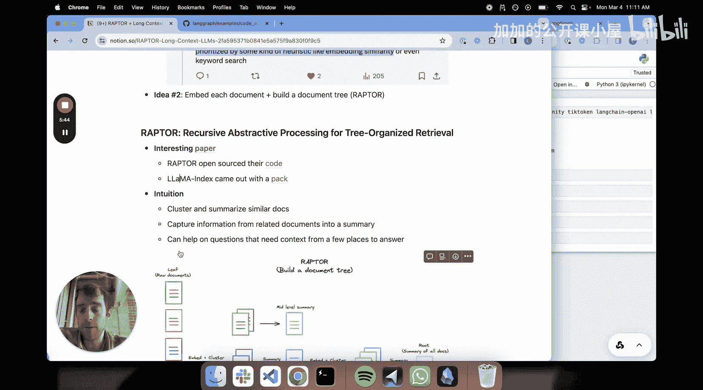

# 设置环境变量（例如 LangSmith 密钥）
import os
os.environ["LANGSMITH_API_KEY"] = "your_api_key_here"
os.environ["ANTHROPIC_API_KEY"] = "your_anthropic_api_key_here"
```

接下来，加载我们的文档。

```python
from langchain.document_loaders import TextLoader

# 假设文档位于 `./docs/` 目录下
documents = []
for file in os.listdir("./docs"):
    if file.endswith(".txt"):
        loader = TextLoader(f"./docs/{file}")
        documents.extend(loader.load())

print(f"已加载 {len(documents)} 个文档。")
```

现在，我们开始实现 RAPTOR 的核心流程：递归聚类与摘要。

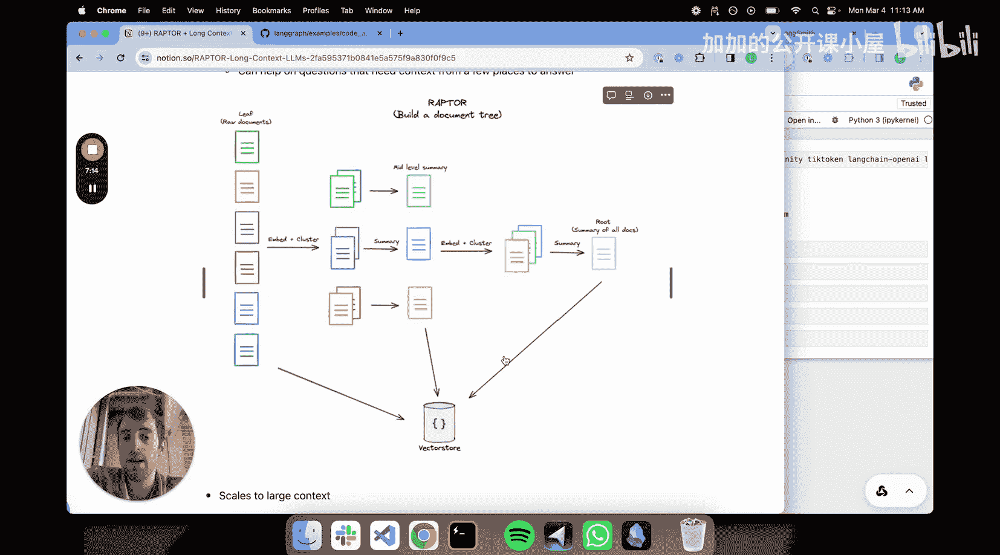

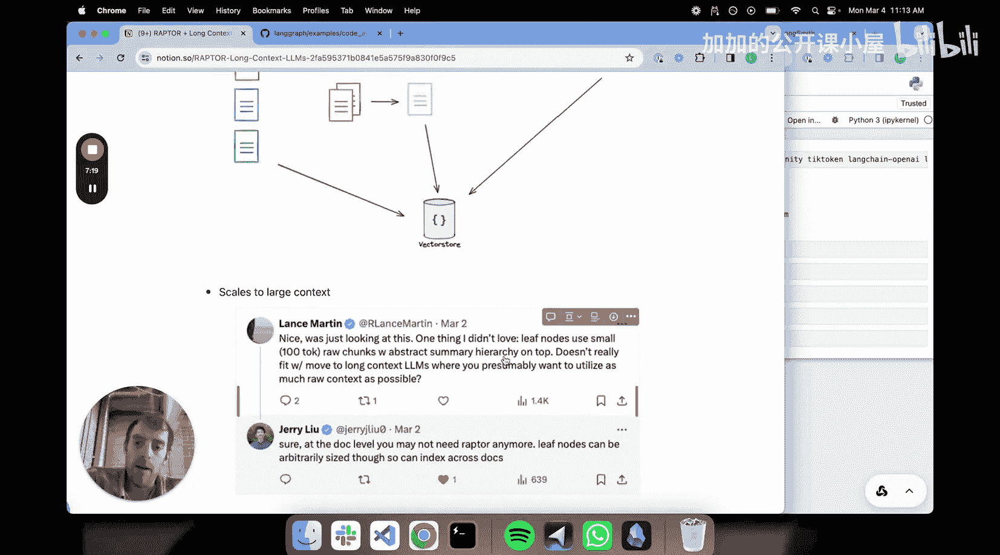

以下是构建递归摘要树的核心函数：

```python
from langchain.embeddings import OpenAIEmbeddings
from sklearn.cluster import KMeans
from langchain.chat_models import ChatAnthropic
from langchain.schema import Document
import numpy as np

def build_raptor_tree(docs, level=0, max_level=3, num_clusters=3):
    """
    递归构建 RAPTOR 树。
    docs: 当前层的文档列表。
    level: 当前递归深度。
    max_level: 最大递归深度。
    num_clusters: 每层聚类数量。
    """
    if len(docs) <= 1 or level >= max_level:
        # 递归基线：如果只有一个文档或达到最大深度，返回文档本身作为节点
        return docs

    # 1. 向量化文档
    embeddings_model = OpenAIEmbeddings() # 或使用其他嵌入模型
    texts = [doc.page_content for doc in docs]
    vectors = embeddings_model.embed_documents(texts)

    # 2. 聚类
    kmeans = KMeans(n_clusters=min(num_clusters, len(docs)), random_state=42)
    clusters = kmeans.fit_predict(vectors)

    # 3. 为每个聚类生成摘要
    llm = ChatAnthropic(model="claude-3-sonnet-20240229") # 使用 Claude 3 进行摘要
    summarized_docs = []
    for cluster_id in range(min(num_clusters, len(docs))):
        cluster_docs = [docs[i] for i in range(len(docs)) if clusters[i] == cluster_id]
        cluster_text = "\n\n---\n\n".join([doc.page_content for doc in cluster_docs])

        # 提示词生成摘要
        prompt = f"""请为以下一组相关文档生成一个简洁、全面的摘要。
        摘要应捕捉核心概念、主题和关键信息。

        文档组内容：
        {cluster_text}

        摘要："""
        response = llm.predict(prompt)
        # 创建一个新的 Document 对象代表这个摘要节点
        summary_doc = Document(page_content=response, metadata={"level": level, "cluster": cluster_id, "type": "summary"})
        summarized_docs.append(summary_doc)

    # 4. 递归处理摘要后的文档（作为下一层）
    next_level_docs = build_raptor_tree(summarized_docs, level+1, max_level, num_clusters)

    # 返回当前层的原始文档（叶子）和所有上层摘要节点
    # 在实际索引时，我们会将所有这些节点（原始docs + 所有summary_docs）都存入向量库
    all_nodes = docs + summarized_docs
    if isinstance(next_level_docs, list):
        all_nodes.extend(next_level_docs)
    return all_nodes

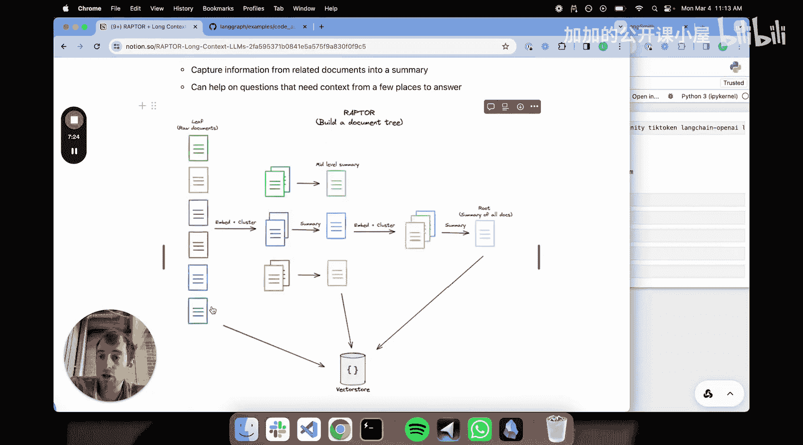

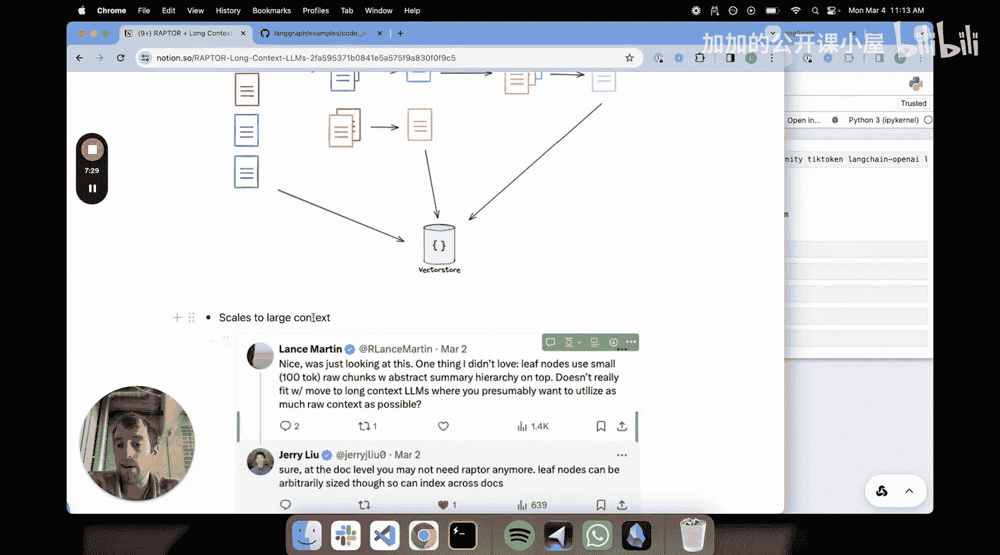

# 构建 RAPTOR 树
all_index_nodes = build_raptor_tree(documents, max_level=2, num_clusters=3)
print(f"RAPTOR 树构建完成，共生成 {len(all_index_nodes)} 个节点（包括原始文档和各级摘要）。")
```

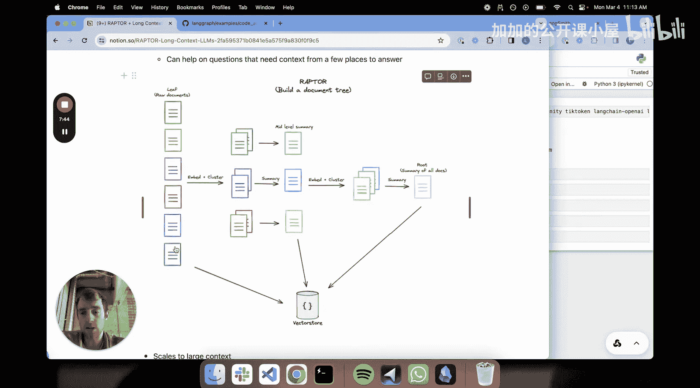

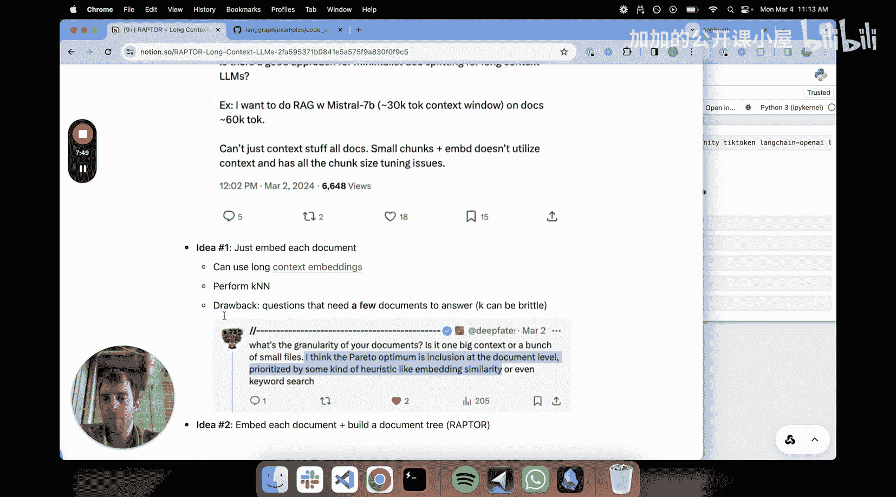

构建好包含所有节点（原始文档和摘要）的列表后，我们将它们全部向量化并存入向量数据库。

```python
from langchain.vectorstores import Chroma

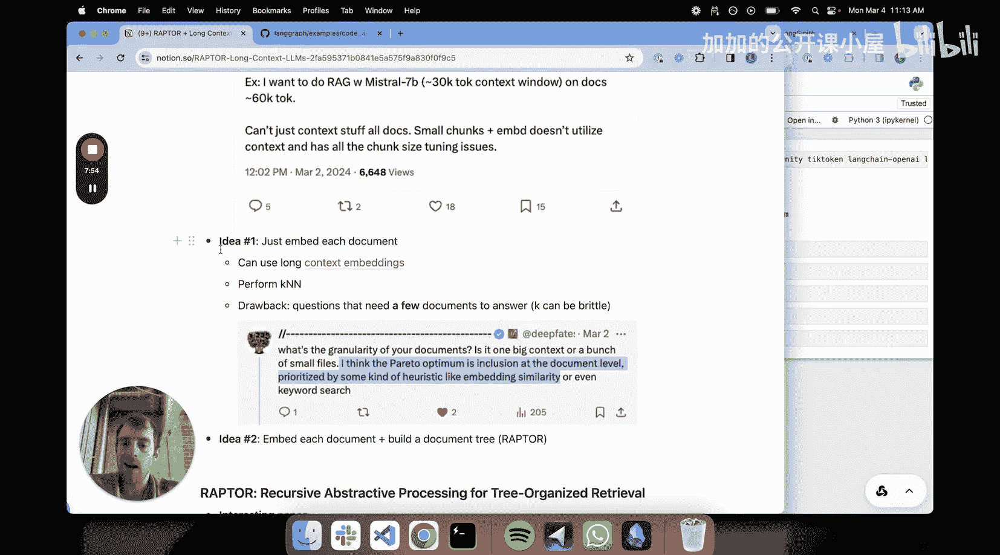

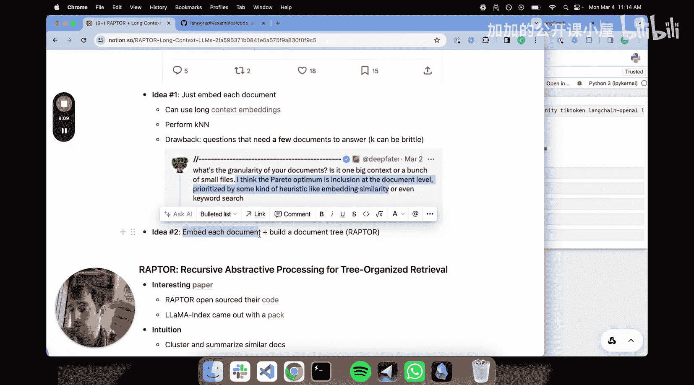

# 为所有节点生成向量并创建向量存储
embeddings = OpenAIEmbeddings()
texts = [node.page_content for node in all_index_nodes]
metadatas = [node.metadata for node in all_index_nodes]

vectorstore = Chroma.from_texts(texts=texts, embedding=embeddings, metadatas=metadatas)
print("向量数据库创建完成。")
```

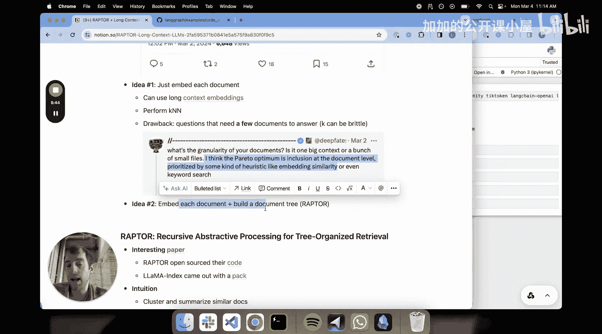

最后，我们可以构建一个检索链。当用户提问时，我们从向量库中检索最相关的节点（可能是原始文档，也可能是某个高级别摘要），然后将检索到的内容与问题一起交给 LLM 生成答案。

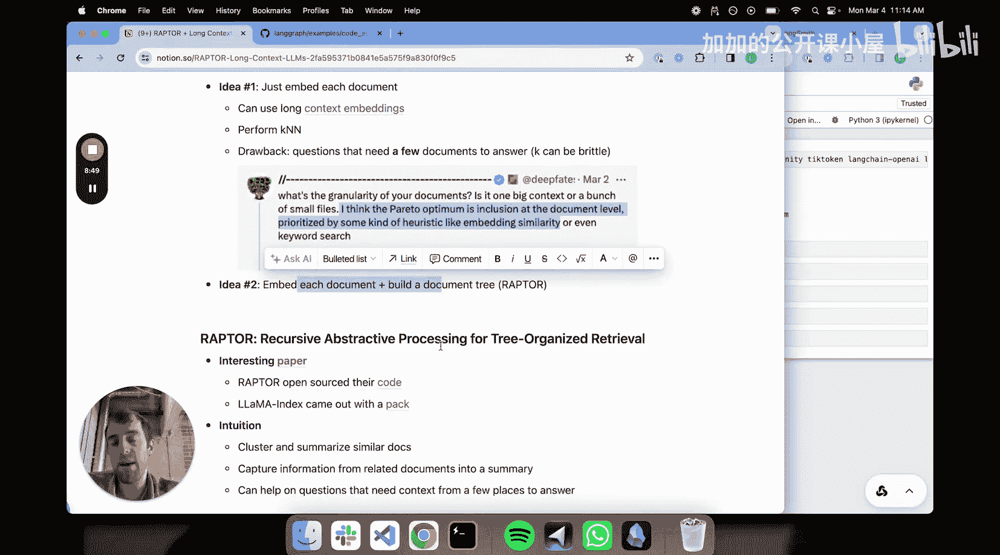

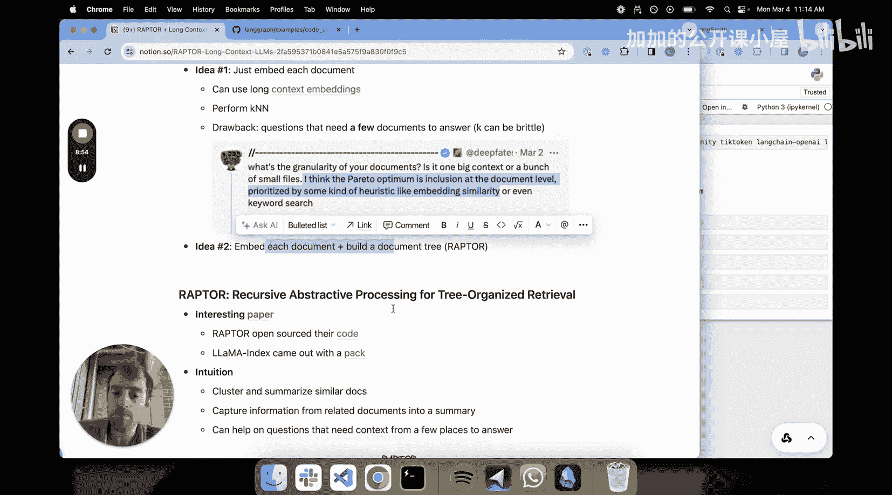

```python
from langchain.chains import RetrievalQA

# 创建检索链
qa_chain = RetrievalQA.from_chain_type(
    llm=ChatAnthropic(model="claude-3-sonnet-20240229"),
    chain_type="stuff",
    retriever=vectorstore.as_retriever(search_kwargs={"k": 4}) # 检索 top-4 个节点
)

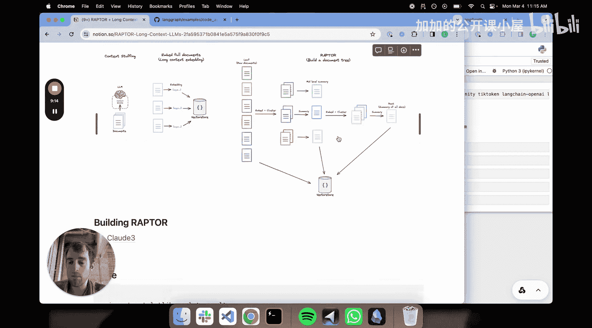

# 进行提问
question = "LangChain 表达式语言中，如何定义一个链？"
result = qa_chain.run(question)
print(f"问题：{question}")
print(f"答案：{result}")
```

## 总结


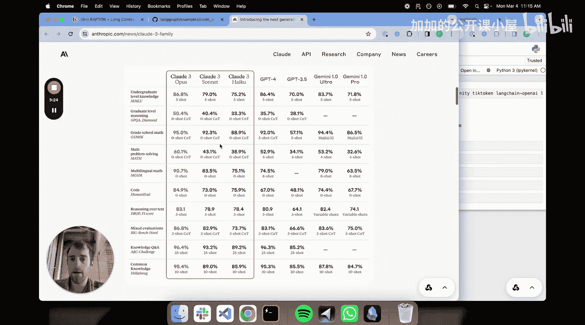

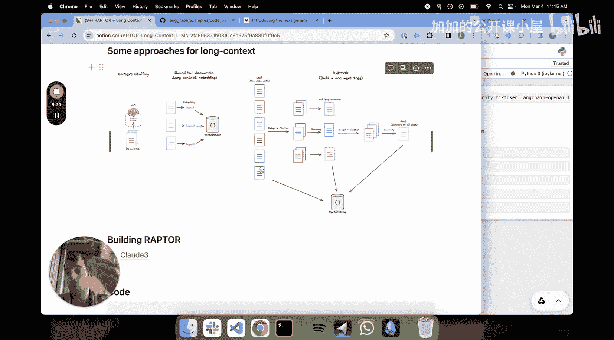

本节课中，我们一起学习了如何为长上下文大语言模型设计检索策略。我们首先分析了直接进行“上下文填充”的优缺点，包括其可能带来的高延迟和高成本。接着，我们探讨了两种改进思路：简单的文档级检索和更复杂的文档树（RAPTOR）方法。

RAPTOR 方法通过递归地对文档进行聚类和摘要，构建了一个层次化的抽象树。这个树结构使得我们能够创建出整合了多个底层文档信息的“摘要节点”。在检索时，我们不仅搜索原始文档，也搜索这些摘要节点，从而更有可能一次性找到回答复杂问题所需的综合性信息，避免了传统 K-近邻检索中参数 K 设置的脆弱性。

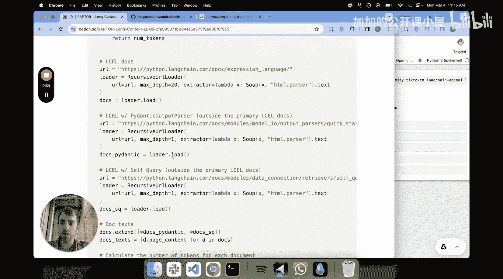

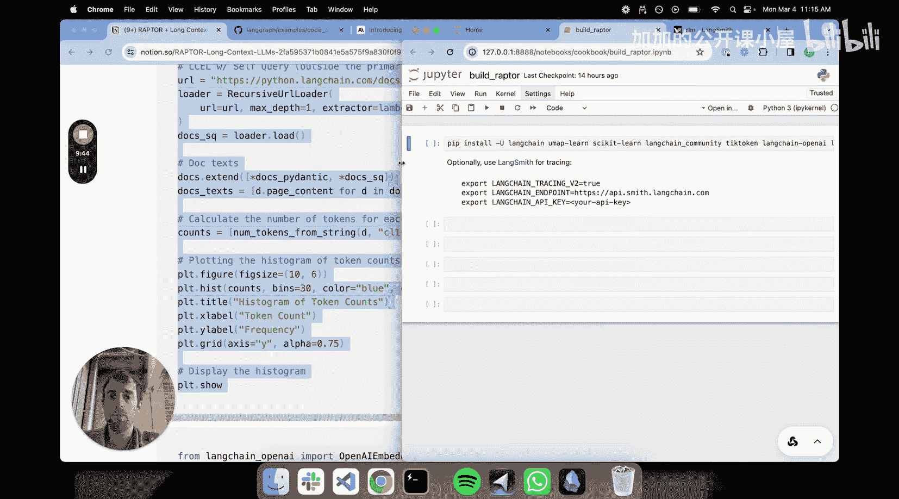

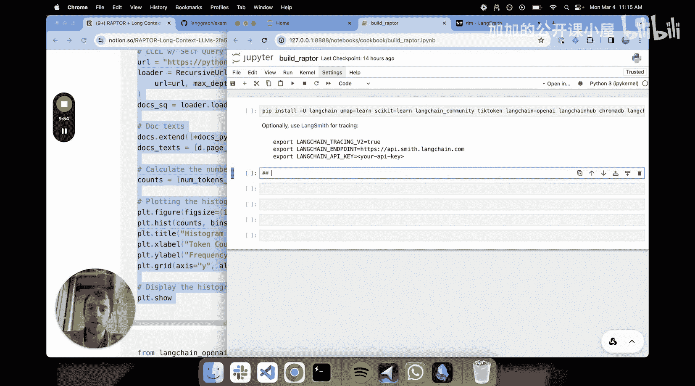

通过动手实践，我们使用 Claude 3 模型和 LangChain 框架从零构建了一个简易的 RAPTOR 系统，并将其应用于文档检索与问答。这种方法为我们在文档规模略大于模型上下文窗口，或希望平衡检索效率与答案质量时，提供了一个有力的工具。