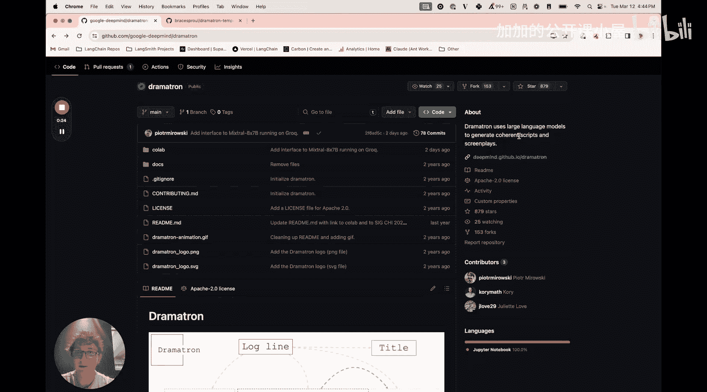
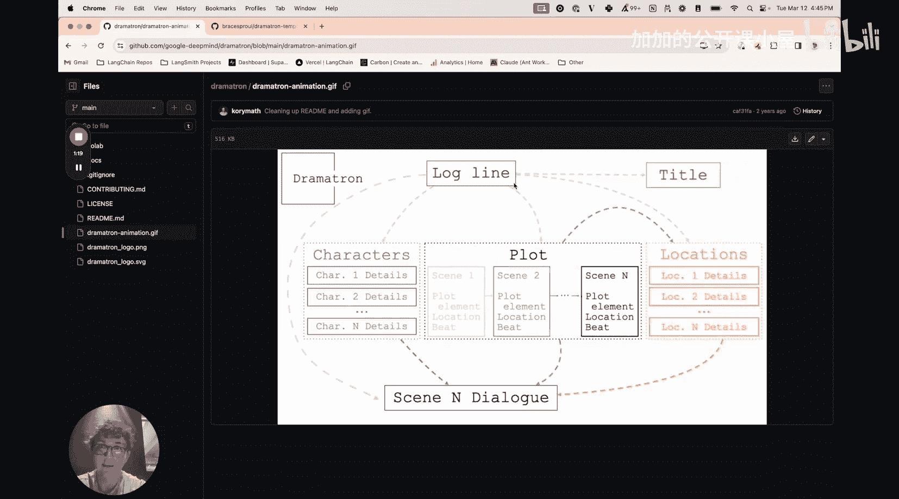
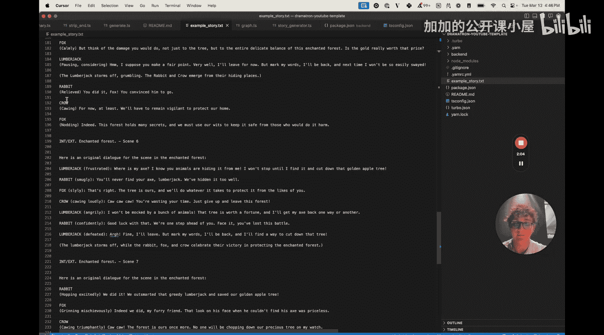
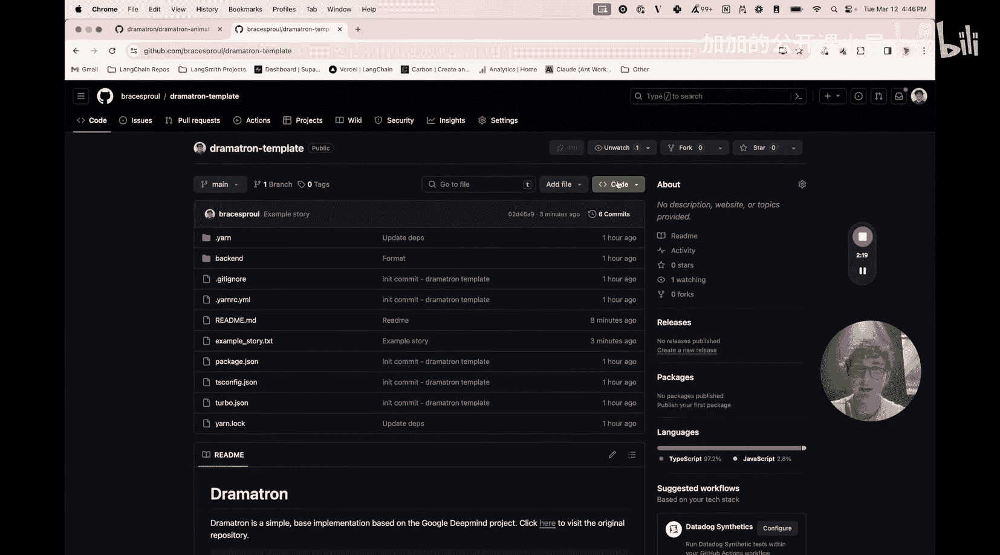
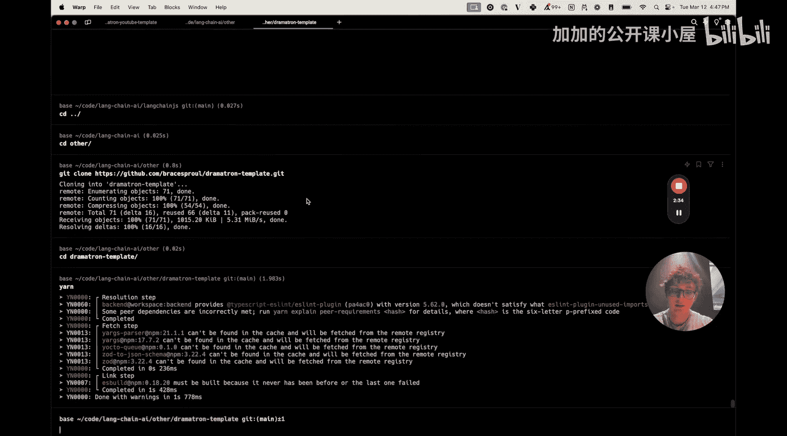
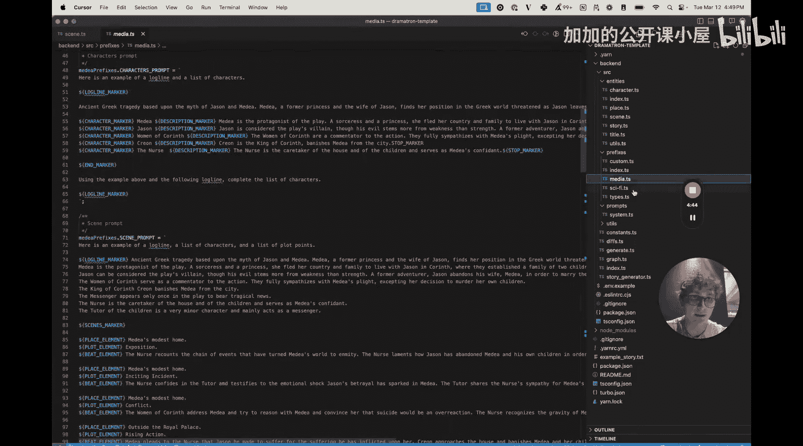
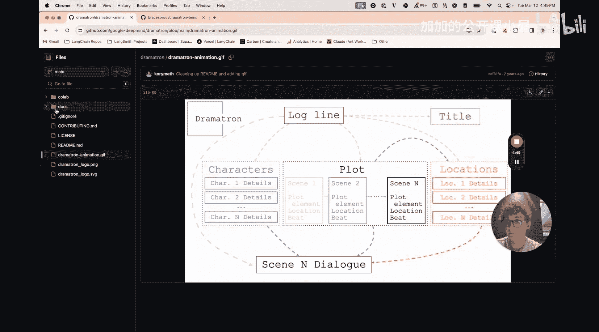
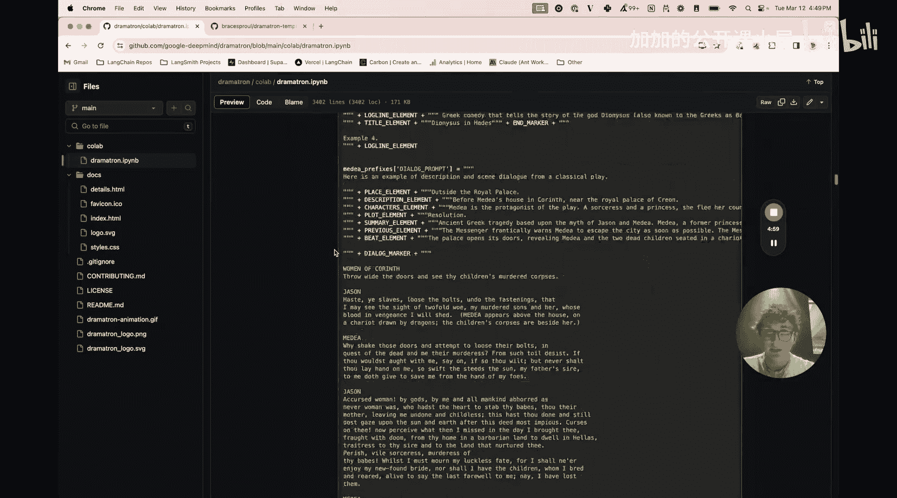
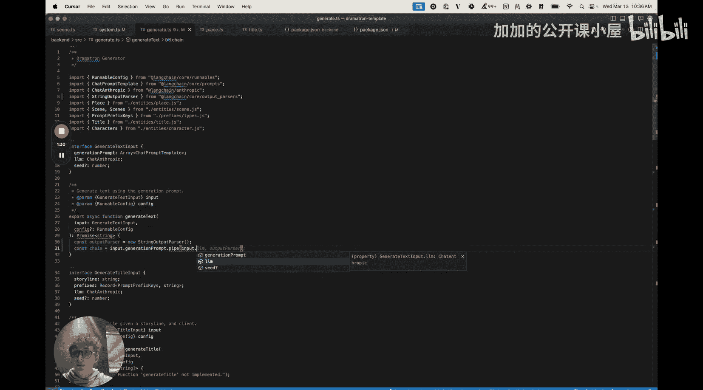

#  015：使用 LangGraph JS 与 Anthropic Claude 3 构建 Google Dramatron 🎭



## 概述
在本教程中，我们将学习如何使用 LangChain JS 和 LangGraph 来实现 Google DeepMind 的 Dramatron 项目。Dramatron 是一个利用大语言模型生成完整剧本的系统。我们将从零开始，逐步构建一个能够根据故事梗概生成标题、角色、情节和最终对话的应用程序。

## 项目介绍
Dramatron 是 Google DeepMind 在 2022 年发布的一个项目。它通过一个流程化的步骤，利用大语言模型生成完整的剧本。其工作流程可以概括为：输入一个故事梗概，然后系统依次生成标题、角色、情节（包含场景、地点、情节要点等），最后生成对话并将所有内容整合成一个完整的剧本。

在本教程结束时，我们将得到一个能够输出如下格式剧本的应用程序：
```
[剧本标题]
[场景描述]
[不同场景]
[实际对话]
```
整个过程将使用 Anthropic 的新模型，并且不依赖函数调用，仅通过提示词和少量解析完成。



## 环境准备

### 获取项目模板
首先，您需要克隆本教程的模板仓库。我已经预先实现了许多基础代码，以节省您的时间。



请复制仓库的 URL 并使用 Git 命令进行克隆。



克隆完成后，请进入项目目录。



### 安装依赖
在项目根目录下，运行以下命令来安装所有必要的依赖项：
```bash
yarn
```

### 项目结构
项目采用 Monorepo 结构，基于我的一个模板。我们移除了前端部分，因为本教程只关注后端实现。

在 `backend/src` 目录下，主要包含以下文件夹和文件：
*   `entities/`: 存放应用程序使用的各种实体类，如角色、情节、标题、故事等。这些类主要用于存储和解析从大语言模型生成的文本。
*   `prefixes/`: 存放用于生成不同内容（如角色、场景、对话）的提示词模板。这些提示词移植自原始的 Dramatron 仓库。
*   `utils/`: 包含一些工具函数，如故事渲染、文本处理等。
*   `graph/`: 我们将在这里定义 LangGraph 的工作流图。
*   `generate.ts`: 包含所有调用大语言模型生成文本的核心函数。
*   `story-generator.ts`: 包含 `StoryGenerator` 类，其 `step` 方法是整个生成流程的核心。
*   `index.ts`: 应用程序的入口文件，用于运行整个图。

### 配置环境变量
在 `backend/src/example.env` 文件中，您需要设置自己的 Anthropic API 密钥。如果您想使用 LangSmith 进行追踪以观察应用运行情况，也可以在此设置 LangSmith 的密钥。

## 核心实现步骤

上一节我们介绍了项目的整体结构和准备工作，本节我们将开始编写核心的生成逻辑。



### 第一步：实现基础文本生成函数
所有具体的生成函数（如生成标题、角色）都将调用一个基础的 `generateText` 函数来实际与大语言模型交互。因此，我们首先在 `generate.ts` 文件中实现它。



该函数接收一个提示词列表和一个可选的种子参数。

首先，我们需要定义一个输出解析器。由于我们总是期望得到字符串输出，因此使用 `StringOutputParser`。



接下来，我们使用 LangChain 表达式语言来构建一个链：将输入传递给提示词模板，然后将结果传递给大语言模型，最后通过输出解析器进行解析。

具体代码如下：
```typescript
import { StringOutputParser } from "@langchain/core/output_parsers";
// ... 其他导入

const chain = input
  .pipe(prompt)
  .pipe(model)
  .pipe(new StringOutputParser());
```
这段代码创建了一个处理管道：输入数据经过提示词模板格式化，然后发送给大语言模型，最后将模型的输出解析为字符串。

### 第二步：实现具体的生成函数
在 `generate.ts` 中，我们需要实现一系列具体的函数，例如 `generateTitle`, `generateCharacters`, `generateScenes` 等。

这些函数的核心职责是：
1.  组合特定的提示词（从 `prefixes/` 目录中获取）。
2.  调用上面实现的 `generateText` 函数来获取大语言模型的原始响应。
3.  利用 `entities/` 目录中定义的类来解析响应文本，并将其转换为结构化的对象（例如 `Title` 或 `Characters` 实例）。

例如，`generateTitle` 函数会使用“标题生成”的提示词模板，然后将返回的文本解析成一个 `Title` 实体对象。

### 第三步：构建故事生成器
在 `story-generator.ts` 文件中，`StoryGenerator` 类的 `step` 方法是核心。它根据当前的状态（例如，已经生成了哪些部分）来决定下一步该调用哪个具体的生成函数（如 `generateTitle` 或 `generateCharacters`）。

这个方法将被我们在 LangGraph 中定义的节点调用。

### 第四步：定义 LangGraph 工作流
在 `graph/` 目录下，我们将使用 LangGraph 来定义整个剧本生成的状态机或工作流图。

这个图将包含多个节点，每个节点对应生成过程中的一个步骤（例如“生成标题”、“生成角色”、“生成场景”）。节点之间通过边连接，根据上一步的结果和条件判断来决定流程是继续向前推进，还是需要返回到之前的步骤进行迭代优化。

`StoryGenerator.step` 方法将成为这些节点中执行实际生成任务的函数。

### 第五步：运行应用程序
最后，在 `index.ts` 文件中，我们将初始化 LangGraph 图，设置初始状态（即用户输入的故事梗概），然后运行这个图。图会按照我们定义的逻辑逐步执行，最终输出完整的剧本。



## 总结
在本节课中，我们一起学习了如何使用 LangChain JS 和 LangGraph 来构建一个类似 Google Dramatron 的剧本生成应用。我们从项目结构讲起，逐步实现了基础文本生成、具体内容生成、故事生成器以及最终的工作流图。通过这个流程，我们能够将一个简单的故事梗概，扩展成包含标题、丰富角色、详细情节和生动对话的完整剧本。这个项目展示了如何将复杂的多步生成任务，通过清晰的模块化和状态管理（LangGraph）优雅地实现。