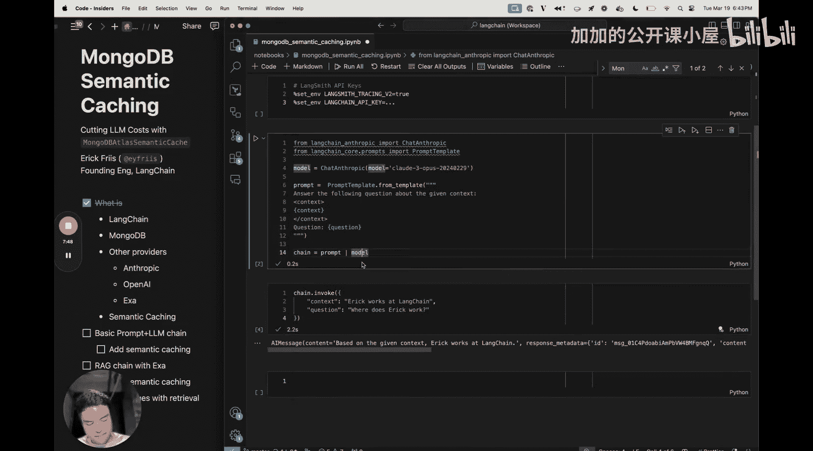
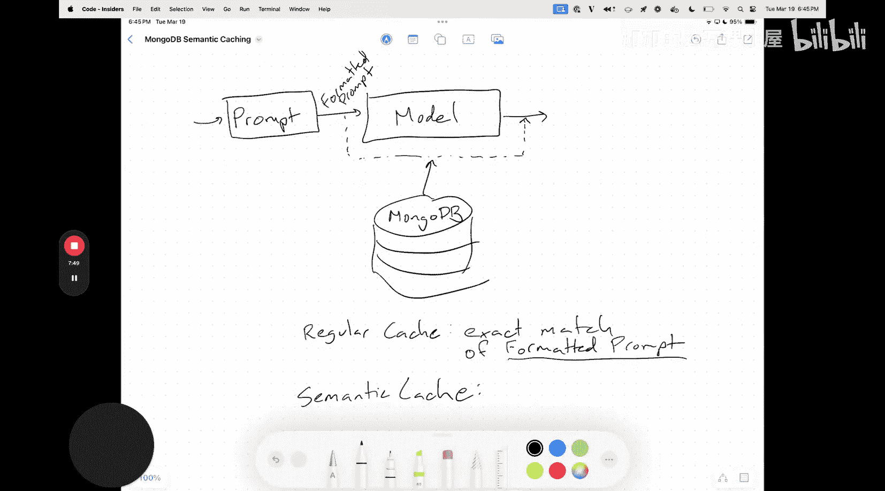

#  016：利用 MongoDB 语义缓存降低 LLM 成本 🚀

在本节课中，我们将学习如何使用 MongoDB 语义缓存来显著降低大型语言模型（LLM）的调用成本。我们将通过 LangChain 框架，结合 MongoDB Atlas 的向量搜索功能，构建一个能够智能缓存相似查询结果的系统。

今天，MongoDB 发布了与 LangChain 的集成包，这意味着你可以将 MongoDB 用作向量数据库、缓存，甚至是语义缓存。我们将使用几个不同的服务提供商来实现这个方案。首先，我们会简要介绍每个组件，然后通过两个来自我们“食谱”（cookbook）的示例进行实践：第一个是带有语义缓存的基础提示词和 LLM 链，第二个是结合了检索增强生成（RAG）的系统，并讨论在检索系统中使用语义缓存可能遇到的挑战。

## 核心组件介绍

上一节我们概述了课程目标，本节中我们来看看实现方案所需的各个核心组件。

以下是本教程将使用的主要技术栈：

1.  **LangChain**：我所在公司开发的编排框架。它允许你连接任何 LLM、向量数据库和各种工具，为这些集成提供了标准抽象和一站式解决方案。我们提供了大量“食谱”，帮助你实现学术论文中的方法或基础解决方案。
2.  **MongoDB Atlas**：一个 NoSQL 数据库云服务。我们将利用其原生的向量搜索功能来实现语义缓存，因为语义缓存本质上涉及与向量存储检索非常相似的嵌入向量查找步骤。
3.  **Anthropic Claude 3**：我们将使用 Anthropic 的 LLM 来为应用生成响应。
4.  **OpenAI Embeddings**：在本应用中，我们将使用 OpenAI 的嵌入模型来生成文本的向量表示。
5.  **Exa Search Retriever**：在 RAG 步骤中，我们将使用 Exa 的搜索检索器来获取相关的文档作为生成响应的依据。

## 示例一：基础提示词与 LLM 链的语义缓存

现在，让我们开始实践。我们将实现的第一个链来自我们的“食谱”，它是一个基础提示词和 LLM 链。这是入门最简单的方式，我们将构建一个类似的示例。

### 环境设置

首先，你需要安装必要的软件包。

以下是需要安装的四个主要提供商的 LangChain 集成包：

```bash
pip install langchain-mongodb langchain-anthropic langchain-openai langchain-exa
```

接下来，需要设置相应的环境变量以配置这些服务。我已经在我的环境中设置好了。在本例中，我们将使用 OpenAI 来生成嵌入向量。此外，我们还会使用 LangSmith（LangChain 官方的可观测性和调试工具）来追踪应用运行情况。要激活 LangSmith，你只需要设置以下两个环境变量：

```bash
export LANGCHAIN_TRACING_V2=true
export LANGCHAIN_API_KEY=你的_langchain_api_密钥
```

LangSmith 允许我们追踪整个应用流程，查看提示词是如何构建的，以及在检索步骤中实际获取了哪些文档，还包括 LLM 调用定价、令牌计数等信息。

### 构建基础链

完成所有设置后，我们就可以开始编码了。首先，我们需要建立一个提示词到模型的链。

在 LangChain 中，我们通过 `Runnable` 接口来组合提示词、模型以及其他组件，可以将提示词的输出“管道传输”到模型中。

现在来配置具体的提示词和模型。首先设置模型，我们将使用 Anthropic 的 Claude 3 Opus 模型。

```python
from langchain_anthropic import ChatAnthropic

model = ChatAnthropic(model="claude-3-opus-20240229")
```

我们选择 Opus 是为了更好地展示缓存带来的速度提升，因为它是 Anthropic 最大、最慢的模型。如果你需要更快的速度，也可以使用 Sonnet 或 Haiku 模型。

接下来设置提示词模板。

```python
from langchain_core.prompts import ChatPromptTemplate

prompt = ChatPromptTemplate.from_template("""
请根据给定的上下文回答问题。

<context>
{context}
</context>

问题：{question}
""")
```

这是一个经典的 RAG 提示词模板。`{context}` 和 `{question}` 是占位符，我们将在调用时用实际内容替换它们。XML 标签 `<context>` 用于向 LLM 明确指示上下文内容。

现在，我们可以将提示词和模型组合成一个链。

```python
chain = prompt | model
```

让我们尝试用一些上下文和问题来调用这个链。

```python
response = chain.invoke({
    "context": "Eric 在 LangChain 工作。",
    "question": "Eric 在哪里工作？"
})
print(response.content)
# 输出：根据给定的上下文，Eric 在 LangChain 工作。
```

调用耗时约 2.6 秒。如果我们再次运行，它仍然需要大约 2.6 秒，因为每次都会向 Anthropic 发送 API 请求，这会累积令牌使用量并增加费用。

### 引入语义缓存



为了减少这种开销，我们引入语义缓存。让我们先通过一个图示来理解其原理。


语义缓存的核心目的是避免向模型提供商发送过多的重复 API 调用。在我们刚刚构建的链中，流程是 **提示词 -> 模型 -> 输出**。语义缓存的作用是在模型步骤周围创建一个“旁路”：如果我们之前已经处理过**语义相似**的格式化提示词，我们将直接从缓存中获取之前的响应，而不再调用模型。

这可以通过两种主要方式实现：

1.  **常规缓存**：查找与**格式化提示词字符串完全匹配**的条目。这适用于我们知道会收到几乎相同提示词的情况。但在我们的例子中，由于提示词中包含用户的问题和来自检索步骤的上下文，即使问题只有细微差别（例如 “Eric 在哪里工作？” 和 “Eric 在哪里工作。”），也无法命中缓存，因为它要求完全匹配。
2.  **语义缓存**：这是我们今天要使用的方法。它不再基于精确的字符串匹配，而是基于**嵌入向量**进行索引和查找。



语义缓存的工作流程是：当一个新的查询到来时，系统会计算其嵌入向量，然后在缓存中查找语义最相似的已有查询及其对应的响应。如果相似度超过某个阈值，则直接返回缓存的响应，否则才去调用 LLM 并存储新的结果。

## 总结


本节课中，我们一起学习了如何利用 MongoDB Atlas 的向量搜索功能，在 LangChain 框架中实现语义缓存。我们首先介绍了方案的核心组件，然后动手构建了一个基础提示词链，并分析了为何需要语义缓存而非精确匹配缓存。通过语义缓存，我们可以有效减少对昂贵 LLM 的重复调用，从而降低应用成本并提升响应速度。在接下来的课程中，我们将把这个缓存机制集成到更复杂的 RAG 系统中，并探讨其中可能遇到的挑战。