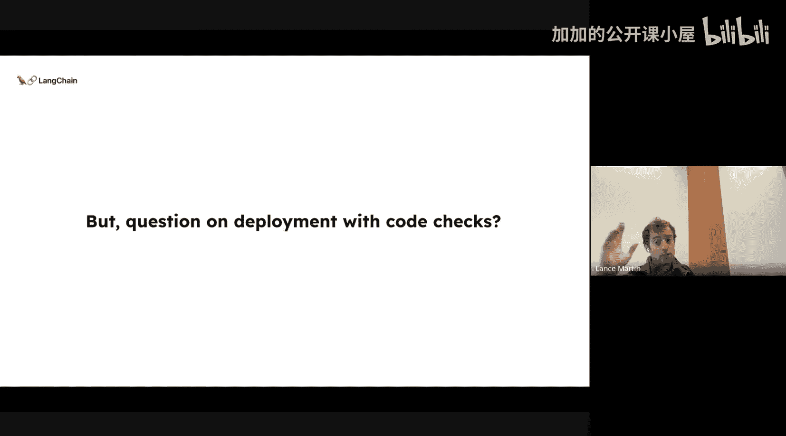
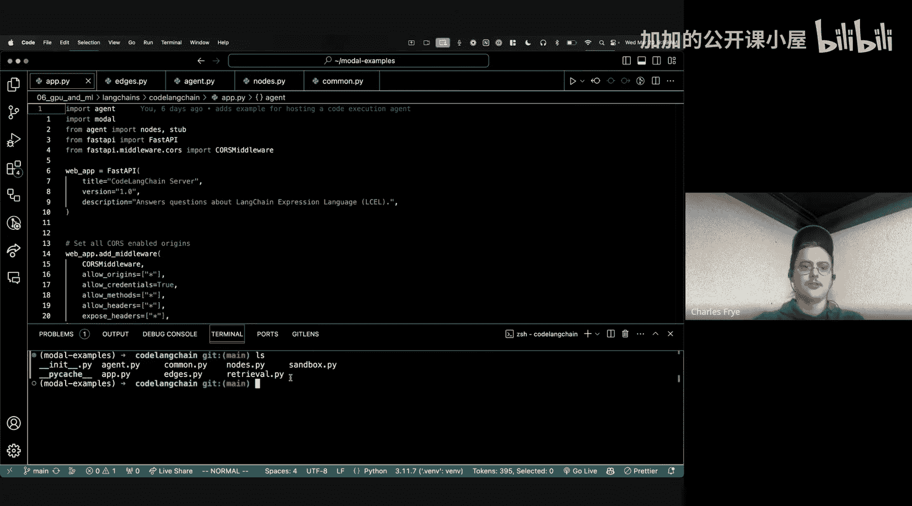

#  017：部署代码智能体，告别部署之痛

在本节课中，我们将学习如何将一个在笔记本中运行的代码生成与检查原型，转化为一个安全、可扩展的生产级应用。我们将重点介绍如何解决代码执行环境隔离、安全性和部署流程等关键挑战。

---

## 背景与动机

几个月前，Kodium AI 发布了一个名为 **Alphacodium** 的出色项目。它提出了一种非常巧妙的代码生成方法。

其核心思想是：模型根据编程问题生成一个答案，然后执行一系列检查。在这个案例中，它针对公开的编程挑战，利用公开的测试用例和 AI 生成的测试来验证解决方案。如果发现问题，系统会返回并重试。

正如 Carpathy 在一篇推文中所说，这标志着从简单的“提示-答案”范式，转向了“流程工程”范式。在这种范式中，答案是通过多次尝试、检查和重试迭代构建的。这为解决代码生成问题提供了一种很好的思路。Alphacodium 的工作非常酷，引入了代码生成的流程工程概念，这为我们奠定了基础。

现在，有很多用户会向 LangChain 询问编程问题。但 LangChain 本质上是一个检索增强生成系统，它存在于我们的文档中，并不能可靠地生成可执行代码。它非常擅长提供定性答案，能将你指引到大致正确的方向，但无法保证返回的代码实际可执行。

因此，我们一直对“如何做得更好”这个问题很感兴趣。受 Alphacodium 论文的启发，我们设想：是否可以构建一个我们称之为 **Code LangChain** 的小系统？这个系统不仅能生成代码解决方案，还能实际检查它们。

例如，我们可以进行以下检查：
*   **导入检查**：确保导入的库是真实且可用的。
*   **代码执行检查**：确保生成的代码能够运行。

如果其中任何一项检查失败，系统可以循环返回并重试。这就是我们的基本动机。显然，你可以让这个系统变得非常复杂，加入各种不同的检查，但这只是一个起点，我们想看看类似这样的简单设计是否有效。

---

## 系统搭建与初步测试

我们的实验设置如下：我选取了 LangChain 表达式语言的文档作为知识源。规模较小，大约 6 万个 token。我没有使用检索，而是直接通过上下文填充的方式，使用拥有 128,000 token 上下文窗口的 GPT-4 进行生成。

有趣的是，我使用了函数调用来输出一个结构化的对象，我称之为“答案对象”。这个对象包含：
*   **前言**：描述问题是什么。
*   **导入语句**。
*   **代码**。

所有部分都被清晰地分隔开。这使我能够轻松进行两项检查：
1.  首先，检查导入语句是否实际有效。
2.  其次，确保代码本身可以执行。

这听起来可能有些简单甚至幼稚，但在我之前的一些测试中发现，模型幻觉常常会渗透到导入语句中。模型经常会“幻想”出一个不存在的库名，这是一个非常常见的问题，而导入检查可以捕捉到这一点。

同样，通过执行检查，无论是代码本身的语法错误，还是代码块中的逻辑幻觉，都会被捕获，从而触发重试循环。所有这些流程都是使用 LangGraph 来编排的。

接下来，我们进行了评估。我针对 LangChain 表达式语言构建了一个评估集进行测试。我对比了两种方式：
*   **基线**：简单的单次上下文填充生成。
*   **LangGraph 多尝试流程**：即我们设计的带检查和重试的流程。

结果发现，导入检查本身已经相当不错，有无此流程变化不大。但**代码生成的质量得到了显著提升**。我们有一篇单独的博客文章和视频深入探讨了这一点，其中有很多例子显示，如果代码解决方案中存在微小的逻辑错误，当你将错误信息反馈给系统并说“这是你之前的方案，这是错误信息，请重试”时，它通常能够解决。

这是一个巧妙的小技巧，效果非常好，在评估中带来了巨大的改进。

实际上，我想强调一点关于导入检查的结果。数据显示，在没有导入检查时，正确率已经在很高的百分之九十几，而加入检查后更接近 100%。这看起来提升不大，但这里有一个关键点：当我们讨论软件系统的可靠性时，我们通常用“几个九”（如 99.9%）来衡量，而不是简单的百分比。

这是因为，特别是当你与一个系统多次交互时，90% 的成功率和 99% 的成功率带来的用户体验差异是巨大的。如果成功率是 90%，那么在 10 到 15 次交互内你很可能会遇到一次失败；而如果是 99%，则需要大约 100 次交互。如果你的用户交互次数低于平均故障间隔，那么从 90% 提升到 99% 就是一个非常明显的体验改变。所以你说的完全正确，90% 和 99% 之间的用户体验差异是显著的。

另一件有趣的事是，作为基线的上下文填充方法本身已经相当不错了。相比之下，使用 RAG 时幻觉实际上更严重，具体原因我还在探究。这意味着，由于各种原因，我们这个基线可能已经比很多其他系统（比如某些 RAG 系统）要好了。这也是一个值得注意的地方。

---

## 部署挑战与解决方案

至此，我们搭建了一个流程，将其实现为一个图，执行导入检查和代码检查，并发现它在代码执行性能上带来了巨大提升。但这里存在一个“陷阱”：我们可以将其部署为一个 LangServe 应用，这本身没问题。LangServe 基本上包装了这个链，其调用方法（如 `stream`、`batch`、`invoke`）会被映射到 HTTP 端点，这一切应该可以开箱即用。

但问题在于：正如前面提到的，我们执行这些代码导入和代码执行检查。**在已部署的应用中，你如何安全地做到这一点？** 这有点不那么显而易见。你需要一个环境，里面安装了所有可能需要的库，并且能够可靠地运行这些检查，同时还要防范各种奇怪的提示注入攻击等。这是一个很大的开放性问题，而这正是 Charles 介入的地方。我向他阐述了这个问题，而他利用 Modal 平台做了一些非常酷的事情来支持这一点。

连接回我们“无痛生产化代码智能体”的主题，要让这些东西在生产环境中工作，你已经展示了几个关键部分：
1.  找到一个有趣的新研究想法。
2.  下一步是评估它。很多人已经开始更好地评估他们的语言模型应用，开始构建测试集、合成数据生成等，从而建立信心，确信这将为用户提供高质量的体验，而不仅仅是起初的“看起来不错”的指标。
3.  你还提到了使用 LangSmith 进行可观测性，以监控应用。

这些都是将应用带入生产环境非常重要的组成部分。这里已经具备了构建一个良好部署应用的很多优秀基础。

接下来，我想谈谈来自 Modal 平台的一些其他部分，它们有助于更轻松、更稳健、更高质量地部署这类应用。正如你可能在机器学习工程环境中熟悉的那样，Lance 有一个 Jupyter 笔记本来创建应用程序并运行一些评估。我想把它变成一个 Web 应用程序，同时修复它在执行代码时存在的一些安全问题。这个过程相当直接，下面我将逐步介绍一些代码，并向你展示如何操作。

---

## 总结

在本节课中，我们一起学习了如何将一个带有多重检查（导入、执行）的代码生成流程从研究原型推进到生产部署。我们首先介绍了受 Alphacodium 启发的“流程工程”概念，然后搭建了基于 LangGraph 的检查和重试系统，并验证了其有效性。最后，我们重点探讨了部署中的核心挑战——安全地执行代码检查，并引入了 Modal 平台作为解决方案，以实现环境隔离、安全执行和便捷部署。通过结合 LangChain 的编排能力和 Modal 的云基础设施，我们可以构建出既强大又易于维护的生产级代码智能体应用。