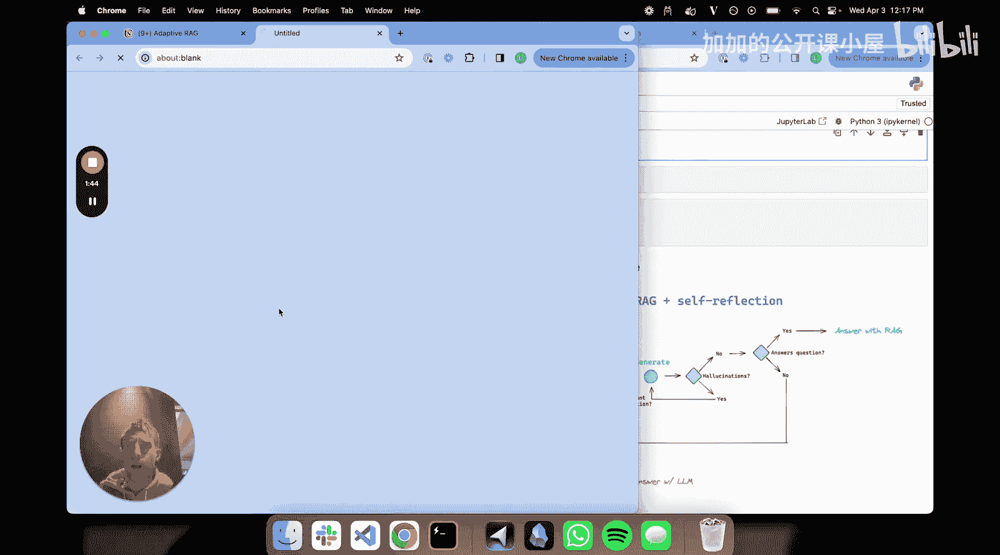
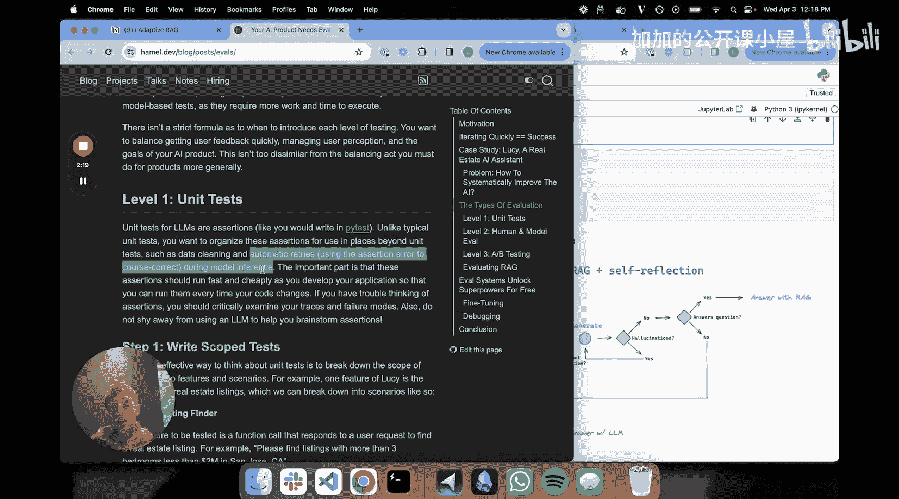
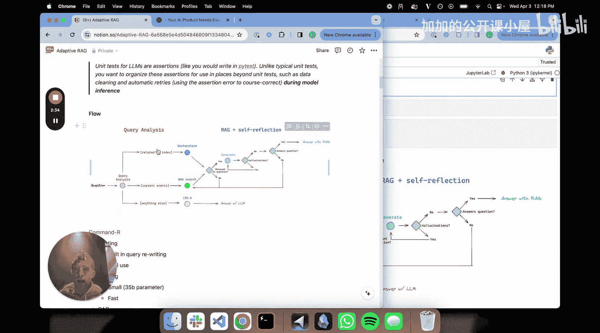
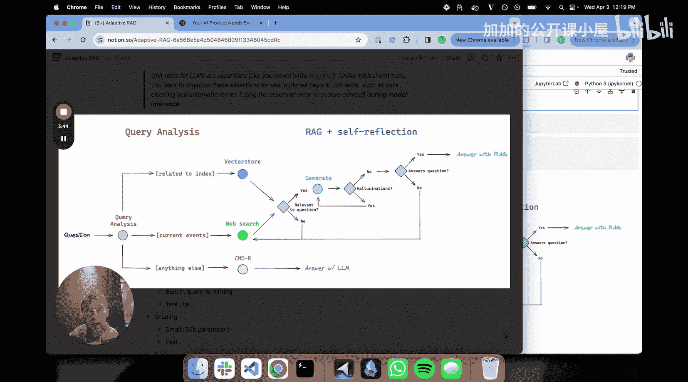
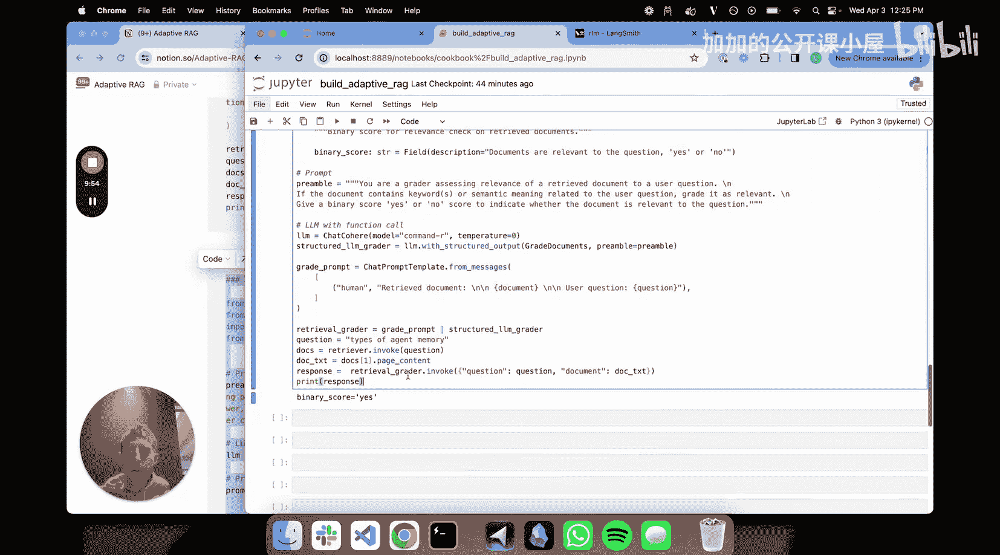

#  018：从零构建自适应 RAG 系统 🛠️

在本节课中，我们将学习如何结合查询分析和流程工程（或称自适应 RAG）这两个核心概念，从零开始构建一个智能的检索增强生成系统。我们将使用 Cohere 的 Command-R 模型来实现路由、检索和评估功能。

## 概述

我们将构建一个 RAG 系统，它不仅能根据问题智能地选择数据源（如向量数据库或网络搜索），还能在生成答案的过程中进行“在线单元测试”，例如检查检索到的文档是否相关、生成的答案是否存在幻觉等，并根据测试结果自动调整流程。

---

## 核心概念一：查询分析与路由 🧭

上一节我们介绍了课程目标，本节中我们来看看第一个核心概念：查询分析与路由。

查询分析是处理用户问题的第一步。它的核心任务是分析输入的问题，并以某种方式修改或优化它，以提升后续检索的效果。常见的方法包括将复杂问题分解为子问题，或使用“后退提示”等技巧。紧接着，系统需要进行路由决策，即将问题引导至最合适的数据源。

以下是几种常见的路由目标：
*   **向量数据库**：用于检索与特定领域（如代理、提示工程）相关的内部知识。
*   **网络搜索**：用于获取最新的、广泛的公开信息。
*   **关系型数据库**：用于查询结构化的数据。
*   **大语言模型直接回答**：作为后备方案，处理无需检索的简单对话或常识问题。

因此，查询分析模块就像是 RAG 管道的前端，负责接收问题、优化问题，并将其发送到正确的地方。



---

## 核心概念二：流程工程与自适应 RAG 🔄

在完成了问题路由之后，我们需要确保整个 RAG 流程的可靠性。这就是第二个核心概念：流程工程或自适应 RAG。

其核心思想是在 RAG 的推理流程中嵌入一系列的“测试”或“检查点”。这与传统的单元测试不同，这些断言被直接组织在模型推理过程中，用于实现“自动重试”或“自我纠正”。

以下是几个关键的检查点：
*   **文档相关性检查**：评估检索到的文档是否与原始问题真正相关。公式可表示为：`relevance = grader(question, retrieved_documents)`，输出为“是”或“否”。
*   **答案幻觉检查**：判断生成的答案是否包含事实性错误或编造的信息。
*   **答案充分性检查**：确认生成的答案是否完整地回答了原始问题。



如果任何一项检查失败，系统可以触发纠正机制，例如重新检索或重新生成，从而构建一个更具韧性和适应性的 RAG 流程。



---

## 系统架构与工具选择 🗺️

现在，让我们将这两个概念结合起来，勾勒出我们将要构建的系统架构。

我们的流程从用户问题开始：
1.  **查询分析与路由**：决定将问题发送至向量数据库、网络搜索，或直接由大语言模型回答。
2.  **检索与相关性检查**：从选定的源（如向量库）检索文档，并立即检查其相关性。如果不相关，则回退到网络搜索。
3.  **生成与质量检查**：基于相关文档生成答案，随后依次检查答案是否存在幻觉，以及是否充分回答了问题。
4.  **返回最终答案**：通过所有检查后，将答案返回给用户。

为了实现这个流程，我们选择使用 **Cohere 的 Command-R** 模型，原因如下：
*   **出色的工具调用能力**：原生支持查询改写和路由决策，非常适合构建智能代理。
*   **模型轻量高效**：拥有 350 亿参数，是开源权重模型，可以本地运行或通过 API 快速调用，适合用于多次评估。
*   **专为 RAG 优化**：拥有 128K 的大上下文窗口，并且针对检索增强生成场景进行了良好调优。

---



## 实战构建：代码实现 💻

理论部分已经介绍完毕，本节我们将进入实际的代码构建环节。

首先，我们需要完成环境设置和基础组件的构建。

```python
# 环境设置与向量数据库构建
import os
from langchain_community.vectorstores import Chroma
from langchain_cohere import CohereEmbeddings

# 设置 API 密钥等环境变量
os.environ["COHERE_API_KEY"] = "your_api_key_here"

# 使用 Cohere 嵌入和 Chroma 创建向量存储
embeddings = CohereEmbeddings()
# 假设我们已经将关于智能体、提示工程和对抗性攻击的博客文章加载到 `documents` 中
vectorstore = Chroma.from_documents(documents, embeddings)
retriever = vectorstore.as_retriever()
```

### 第一步：构建路由工具

路由工具负责分析问题并选择数据源。我们通过为 Command-R 模型绑定工具并设定系统指令来实现。

```python
from langchain_cohere import ChatCohere
from langchain_core.prompts import ChatPromptTemplate
from langchain_core.tools import Tool

# 定义工具：网络搜索和向量数据库检索
web_search_tool = Tool(name="web_search", func=web_search_function, description="Search the web for current information.")
vector_tool = Tool(name="vector_store", func=retriever.invoke, description="Retrieve documents about agents, prompt engineering, and adversarial attacks.")

# 创建路由提示词
preamble = """你是一个专家，负责将用户问题路由到向量数据库或网络搜索。
向量数据库中包含以下主题的知识：智能体、提示工程、对抗性攻击。
请针对这些主题的问题使用向量数据库工具，否则使用网络搜索工具。"""

# 初始化 Command-R 模型并绑定工具
model = ChatCohere(model="command-r")
model_with_tools = model.bind_tools([web_search_tool, vector_tool])
router_chain = preamble | model_with_tools
```

我们可以测试一下路由逻辑：
*   输入：“芝加哥熊队会在 NFL 选秀中选谁？” -> 应触发 `web_search`。
*   输入：“有哪些类型的智能体记忆？” -> 应触发 `vector_store`。
*   输入：“嗨，你好吗？” -> 可能不调用任何工具，直接由模型处理。

### 第二步：构建评估器（Grader）

评估器用于在流程中进行“是/否”的二元判断。我们将利用 LangChain 的结构化输出功能来严格约束模型的回答格式。

```python
from pydantic import BaseModel, Field
from langchain_cohere import ChatCohere

# 1. 定义评估数据模型
class GradeDocuments(BaseModel):
    """评估检索到的文档是否与问题相关。"""
    binary_score: str = Field(description="文档是否与问题相关，回答‘是’或‘否’。")

# 2. 创建评估链
llm = ChatCohere(model="command-r")
structured_llm_grader = llm.with_structured_output(GradeDocuments)

prompt = ChatPromptTemplate.from_messages([
    ("system", "你是一个评估员，负责评估检索到的文档与用户问题的相关性。只回答‘是’或‘否’。"),
    ("human", "问题：{question}\n文档：{document}")
])
retrieval_grader_chain = prompt | structured_llm_grader

# 3. 测试评估器
question = “有哪些类型的智能体记忆？”
retrieved_doc = retriever.invoke(question)[0] # 获取一篇文档
result = retrieval_grader_chain.invoke({"question": question, "document": retrieved_doc.page_content})
print(result.binary_score) # 应输出“是”
```

**关键点**：`with_structured_output` 方法将我们定义的 Pydantic 模型转换为模型所需的函数模式，并确保输出被严格解析为该模型的一个实例。这保证了在后续的流程图中，我们总能得到预期的“是/否”结果。

### 第三步：组装完整流程图

我们将使用 LangGraph 或 LCEL 来定义包含条件判断的工作流。以下是流程的逻辑描述：

1.  **路由节点**：接收问题，调用路由链决定路径。
2.  **检索节点**：根据路由结果，从向量库或网络搜索获取文档。
3.  **相关性检查节点**：调用 `retrieval_grader_chain` 评估文档相关性。
    *   如果 **相关**，继续到生成步骤。
    *   如果 **不相关**，且当前路径是向量检索，则跳转到网络搜索路径；如果是网络搜索路径，则可能直接生成或标记失败。
4.  **生成节点**：基于相关文档生成初始答案。
5.  **幻觉检查节点**：调用另一个结构化评估链检查答案事实性。
6.  **答案充分性检查节点**：调用第三个评估链检查答案是否完整。
7.  **最终返回节点**：如果所有检查通过，返回答案；否则，返回错误或重试。

由于代码较长，此处展示核心的图构建思路：

```python
from langgraph.graph import StateGraph, END
# 定义状态、节点函数和条件边
# ...
builder = StateGraph(YourStateSchema)
builder.add_node(“route”, route_node_function)
builder.add_node(“retrieve”, retrieve_node_function)
builder.add_node(“grade_documents”, grade_documents_node_function)
# ... 添加所有节点

# 设置边和条件逻辑
builder.set_entry_point(“route”)
builder.add_conditional_edges(
    “route”,
    decide_next_step_based_on_route, # 根据路由结果决定去向量检索还是网络搜索
    {“vector”: “retrieve_vector”, “web”: “retrieve_web”, “direct”: “generate”}
)
builder.add_edge(“retrieve_vector”, “grade_documents”)
builder.add_conditional_edges(
    “grade_documents”,
    decide_based_on_relevance, # 根据相关性评分决定是去生成还是回退到网络搜索
    {“relevant”: “generate”, “not_relevant”: “retrieve_web”}
)
# ... 连接生成和后续检查节点
builder.add_edge(“hallucination_check”, “answer_check”)
builder.add_edge(“answer_check”, END)

graph = builder.compile()
```

---

## 总结 🎯

本节课中，我们一起学习了如何构建一个自适应的 RAG 系统。

我们首先介绍了**查询分析与路由**，它作为系统的智能调度中心，将问题引导至最合适的数据源。接着，我们深入探讨了**流程工程（自适应 RAG）** 的概念，通过在推理链路中嵌入“在线单元测试”（如相关性检查、幻觉检查），使系统具备了自我评估和纠正的能力。

随后，我们选择了 **Cohere Command-R** 模型作为实现核心，因为它兼具优秀的工具调用能力、高效的运行速度和对 RAG 场景的针对性优化。在实战部分，我们逐步实现了**路由工具**、利用结构化输出构建的**二元评估器**，并勾勒出将这些组件组合成**自动化工作流**的完整蓝图。



通过本教程，你掌握了构建一个不仅能够检索，还能够自我验证和调整的健壮 RAG 系统的关键思路与工具。