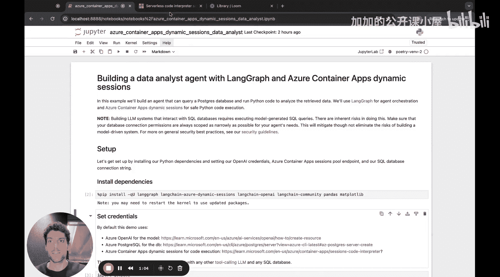
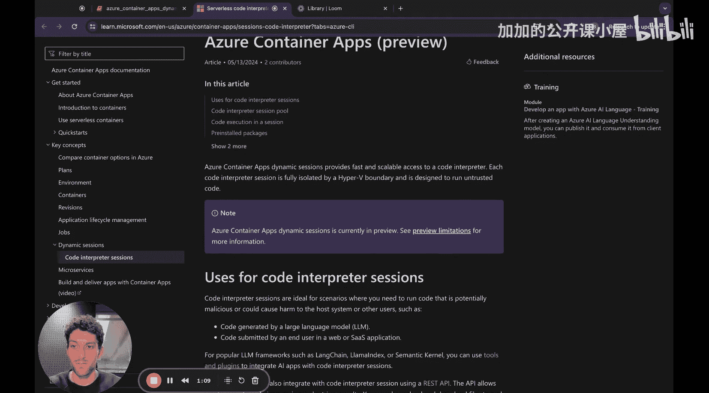
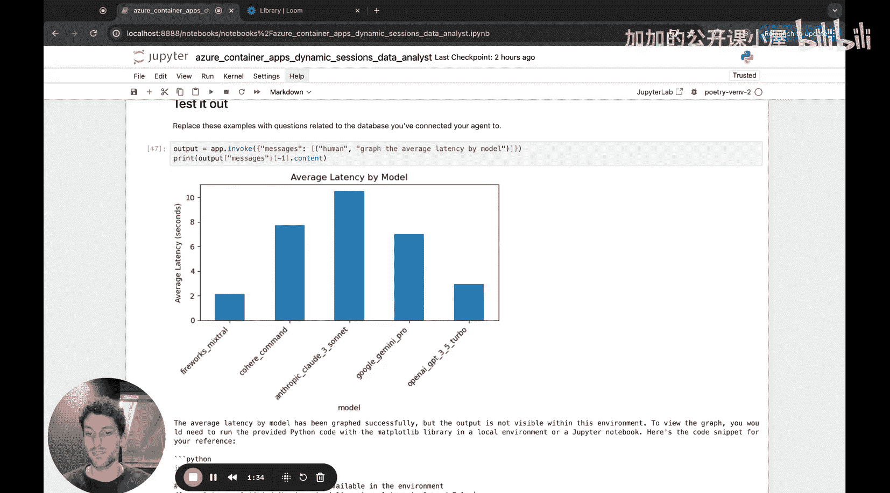
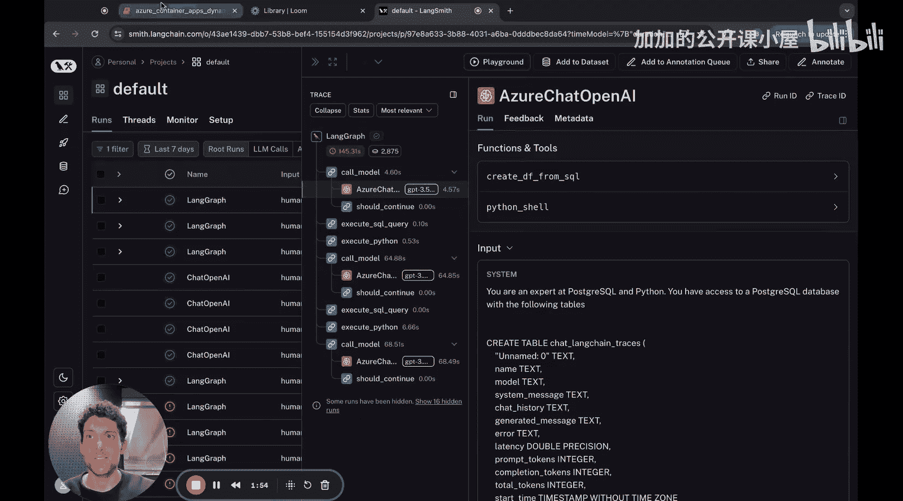
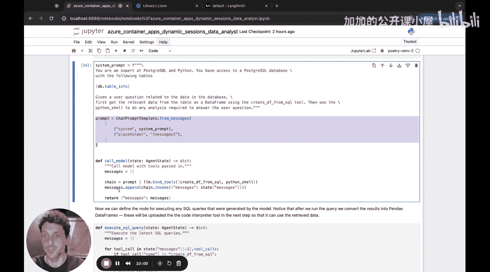

#  022：构建用于查询 SQL 数据库与分析数据的智能体 🚀

在本节课中，我们将学习如何利用 LangGraph 和 Azure Container Apps 的动态会话功能，构建一个能够查询 SQL 数据库并执行 Python 代码来分析数据的智能体。

## 概述

大型语言模型擅长处理许多任务，但数值计算并非其强项。幸运的是，它们擅长编写程序逻辑，如果能够执行这些逻辑，就能为模型完成复杂的计算任务。通过将模型连接到快速、安全的代码解释器，我们可以解锁许多应用场景。这正是 Azure Container Apps 动态会话集成所提供的功能。它是一个由 Azure Container Apps 提供的可靠且安全的代码解释器服务，目前处于预览阶段，并提供了与 LangChain 的良好集成，使得它可以轻松地与任何 LangChain 或 LangGraph 智能体结合使用。

我们将构建的智能体架构相当简单：使用一个支持工具调用的模型来调用两种不同的工具。一种工具用于对 SQL 数据库编写和执行查询，另一种工具用于编写和执行 Python 代码，该代码可以访问检索到的数据并对其执行计算。

## 环境准备与配置

首先，我们需要安装所有必要的依赖项，主要是 LangGraph 和新的 LangChain Azure 动态会话集成。

接下来，我们需要设置一些凭据。我们将使用 Azure OpenAI 作为模型，使用 Azure PostgreSQL 作为数据库，当然，还需要使用 Azure Container Apps 动态会话来执行代码。笔记本中的链接应能指导您如何设置所有这些服务。这里展示的 LangGraph 架构实际上可以推广到任何具有工具调用能力的 LLM 以及任何 SQL 数据库。

现在，我们可以为这些不同的服务设置所有凭据。

首先，设置 Azure OpenAI。

然后，设置动态会话。

最后，设置 SQL 数据库。

每当将模型连接到 SQL 数据库时，需要记住一个重要事项：执行模型生成的 SQL 存在固有风险。根据您的应用程序，尽可能缩小连接权限的范围至关重要。在本例中，我们的智能体只需要能够从 SQL 数据库读取数据，因此我们应该相应地设置连接权限。

设置好所有凭据后，我们可以导入所有必要的 LangGraph 类和方法，并实例化我们的 SQL 数据库、Azure OpenAI 模型和会话代码解释器工具。

## 定义 LangGraph 智能体

任何智能体的核心要素都是状态、节点和边。

节点是智能体实际执行各种功能的地方。

状态是在所有节点之间传递的内容。每个节点的输入是当前的智能体状态，每个节点的输出应该是对该状态的更新。

边定义了智能体从一个节点到下一个节点的流程。

在我们的案例中，智能体状态将很简单，它只是一个消息序列。

我们需要添加的唯一自定义消息类型，我们称之为“原始工具消息”。

我们的工具将创建诸如数据框之类的输出，对于代码解释器，有时还会生成图像。我们希望这些内容成为智能体状态的一部分，以便未来的节点可以访问它们。但我们不希望这些内容成为任何消息内容的一部分，因为我们不希望数据框和图像在未来的模型调用中被发送回模型。

因此，我们只需在工具消息中添加一个新属性，我们称之为 `raw`，用于原始工具输出。这将允许我们向工具消息添加任意额外的工具输出，以便未来的节点可以访问过去节点执行的全部工具输出。

现在，我们可以定义 LangGraph 智能体的实际节点。提醒一下，我们将有三个主要节点。

一个节点用于实际调用我们的模型，另外两个节点用于执行我们的模型可能调用的工具：一个用于 SQL 工具，一个用于 Python 工具。

对于模型节点，我们将使用工具调用 API 来确保我们的模型正确调用我们希望它访问的工具。如果您不熟悉，工具或函数调用是一种特定类型的聊天模型 API，允许您在调用模型时传入工具模式，并让它为您传入模式的工具生成输入。

关键点在于，工具调用模型实际上并不调用工具，它们只是为工具生成输入。应用程序需要实际获取这些输入并将其传递给工具。

在我们的案例中，我们将向模型传递两个工具模式：一个称为 `create_df_from_sql`，另一个称为 `python_shell`。

`create_df_from_sql` 用于查询我们的 SQL 数据库并从中生成 Pandas 数据框。因此，此工具模式的关键属性是 `select_query` 属性，它应该只是一个 SQL `SELECT` 语句，由我们的模型生成，用于从 SQL 数据库中获取相关数据。另外两个属性是 `df_columns` 和 `df_name`。一旦我们从 SQL 数据库中提取数据，就会将其转换为具有相应变量名和模型生成的列名的 Pandas 数据框。

我们的 `python_shell` 工具非常简单，它只有一个属性 `code`，即我们希望代码解释器执行的 Python 代码。

模型调用节点的另一部分是有一个简单的提示词。提示词将包含一条系统消息，然后我们也会将状态中的任何消息传递给模型。系统提示词会包含一些积极的鼓励，告诉模型它擅长 SQL 和 Python，此外还有 `db_table_info` 信息。

如果我们查看其内容，在本例中，正如我所说，连接到智能体的数据库包含 LangSmith 追踪记录。因此，如果我们查看 `db_table_info`，它应该告诉我们数据库中存在的表结构的一些信息，并提供数据库中的一些示例行。这非常重要，因为如果我们希望模型生成有意义的 SQL 查询，那么它需要了解它可以访问的 SQL 数据库中存在哪些类型的表。因此，这些信息应该包含在每次模型调用时发送的提示词中。

然后，实际节点中发生的其余部分将处理模型响应，提取工具调用，并相应地更新状态。

## 总结

本节课中，我们一起学习了如何构建一个结合 LangGraph 和 Azure Container Apps 动态会话的智能体。我们了解了其核心架构，包括状态、节点和边的定义，以及如何配置模型、数据库和代码执行环境。通过将工具调用模型与 SQL 查询和 Python 代码执行工具相结合，我们创建了一个能够自主查询数据并进行分析的智能体。这种模式具有很强的通用性，可以扩展到其他支持工具调用的模型和数据库系统。