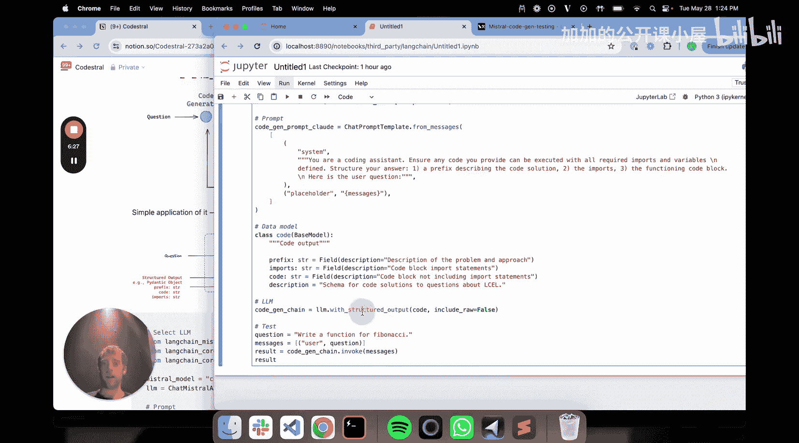
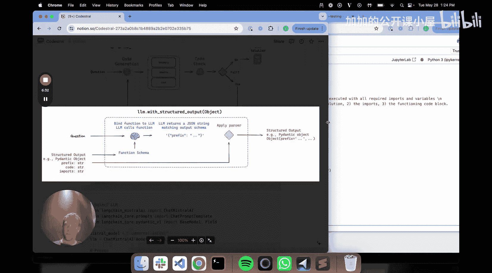
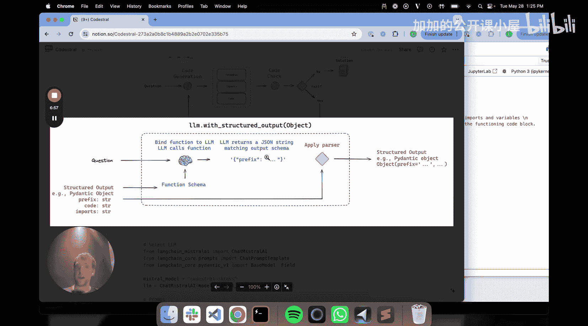
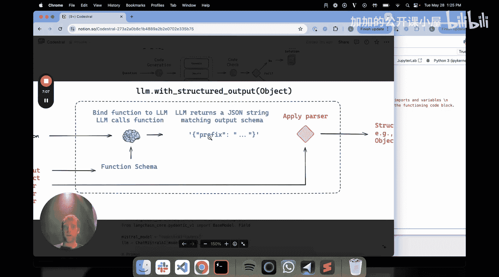
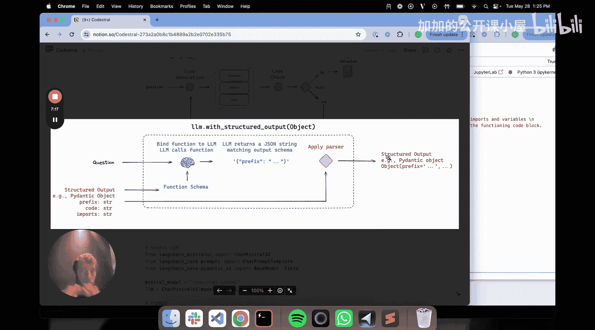
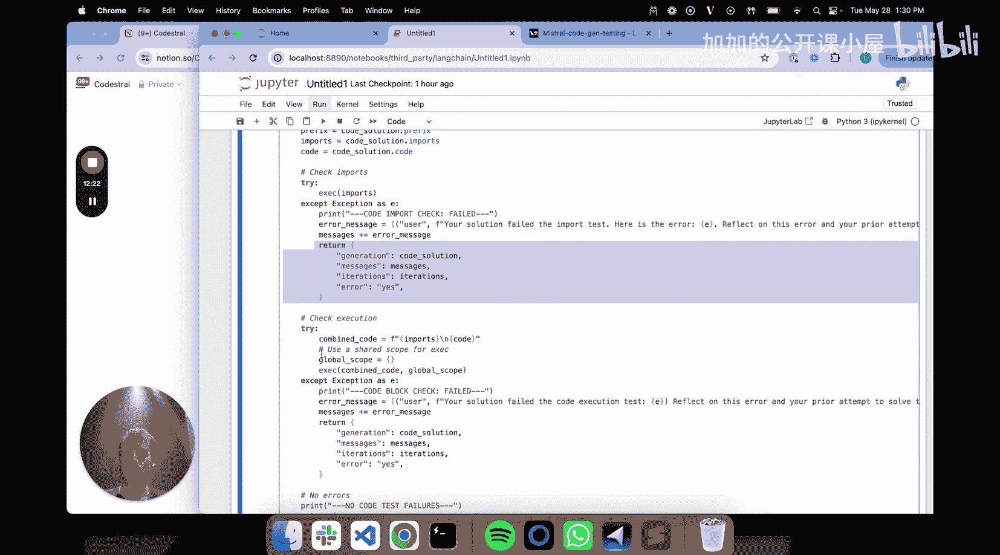

#  023：使用 Codestral 构建自修正代码助手 🛠️

在本节课中，我们将学习如何利用 Mistral 新发布的 Codestral 代码生成模型，结合 LangChain 和 LangGraph，构建一个能够自我检查和修正的代码助手。核心思想是：生成代码 -> 检查代码 -> 若失败则反馈重试，形成一个高效的“流工程”循环。

---

## 概述：为何选择代码生成模型？

代码生成模型非常通用且实用。许多公司希望定制代码助手，例如结合文档和代码生成。在 LangChain，我们有一个名为 `chat_langchain` 的工具，它本质上是一个基于文档的问答系统，可以根据用户问题生成可运行的代码块。

代码的一个显著优点是易于评估。我们可以轻松测试一段代码是否能执行，或者是否能通过单元测试。几个月前，Codeium AI 团队提出的“代码生成流工程”理念非常强大。其核心思想是：生成一个代码解决方案后，可以轻松地在线检查它。如果检查失败，可以循环回去重试。这种简单的“检查-重试”循环被证明能显著提高代码生成模型的准确性和可用性。

## 基础流程设计

我们将构建的基本流程如下：
1.  接收一个与代码生成相关的问题。
2.  将其传递给模型（Codestral）以生成解决方案。
3.  使用函数调用（工具使用）让 Codestral 输出一个包含三个部分的对象：问题描述、导入语句和代码本身。
4.  执行简单的代码检查（例如，导入是否有效，代码是否能执行）。
5.  如果检查失败（代码有错误），则循环回去重试。

这个简单的“检查-重试”循环是提升代码生成模型效果的关键。

---

## 第一步：使用 Codestral 生成结构化代码输出

首先，我们来看看如何实际使用 Codestral 模型。我们将通过 LangChain 的 `with_structured_output` 功能，让模型按照我们定义的格式输出代码。

### 定义输出结构

我们希望模型输出的结构包含三个部分：`preamble`（代码描述）、`imports`（导入语句）和 `code`（功能代码块）。我们使用 Pydantic 模型来定义这个结构。

```python
from pydantic import BaseModel, Field
from typing import List, Optional

class CodeSolution(BaseModel):
    """Schema for the code solution."""
    preamble: str = Field(description="Description of the code solution.")
    imports: Optional[List[str]] = Field(description="List of import statements.")
    code: str = Field(description="The functioning code block.")
```

### 构建提示词与链

接下来，我们构建提示词，告诉模型它是一位代码助手，并指示其按照上述结构输出。然后，我们将这个输出结构绑定到 LLM 上，形成一个链。

```python
from langchain_mistralai import ChatMistralAI
from langchain_core.prompts import ChatPromptTemplate

# 初始化 Codestral 模型
llm = ChatMistralAI(model="codestral-latest", temperature=0)

# 构建提示词
prompt = ChatPromptTemplate.from_messages([
    ("system", "你是一位代码助手。请确保所有代码都可以在定义了所有导入和变量的情况下执行。请按以下三个部分构建你的答案：1. 描述代码解决方案的前言。2. 所需的导入语句。3. 一个可运行的代码块。"),
    ("human", "{question}")
])

# 将结构化输出绑定到链
chain = prompt | llm.with_structured_output(CodeSolution)
```

### 工作原理

`with_structured_output` 在底层将我们定义的 Pydantic 对象转换为函数调用的 JSON 模式。当链被调用时，LLM 知道需要调用这个“函数”，并生成一个符合我们模式的 JSON 字符串。随后，LangChain 的输出解析器会把这个 JSON 字符串解析回我们的 Pydantic 对象。

### 测试代码生成

现在，让我们测试这个链，让它生成一个斐波那契数列函数。





```python
# 测试生成
result = chain.invoke({"question": "写一个计算斐波那契数列的函数。"})
print(f"Preamble: {result.preamble}")
print(f"Imports: {result.imports}")
print(f"Code:\n{result.code}")
```

运行后，我们会得到一个 `CodeSolution` 对象，它包含了我们要求的三部分内容。这种结构化输出对于后续的自动化检查和修正至关重要。

---

## 第二步：引入 LangGraph 构建工作流

上一节我们介绍了如何使用 Codestral 生成结构化的代码。本节中，我们来看看如何构建一个包含循环检查的自动化工作流。我们将使用 **LangGraph** 库，它特别适合构建这种带有“循环”或“反馈”的图状工作流。

我们的工作流可以概括为：生成代码 -> 检查代码 -> 根据检查结果决定是返回给用户还是反馈重试。





### 定义图状态



首先，我们需要定义一个“状态”（State），它会在整个图的生命周期中传递，包含所有节点共享的信息。

```python
from typing import TypedDict, Annotated, List
from langgraph.graph.message import add_messages
import operator

class State(TypedDict):
    # 消息历史，用于与LLM对话
    messages: Annotated[List, add_messages]
    # 当前迭代次数，用于控制重试上限
    iterations: int
    # 存储代码生成的结果
    generation: dict
    # 存储检查时遇到的错误信息
    error: str
```

### 创建节点：生成代码

我们的第一个节点是 `generate`，它负责调用 Codestral 生成代码解决方案。

```python
from langchain_core.messages import HumanMessage

def generate(state: State):
    """节点：生成代码解决方案。"""
    # 1. 从状态中获取当前消息和历史迭代次数
    messages = state[“messages”]
    iterations = state[“iterations”]

    # 2. 调用我们之前构建的链来生成代码
    code_solution = chain.invoke({“question”: messages[-1].content})

    # 3. 将生成的结果转换为消息格式，添加到历史中
    new_message = HumanMessage(
        content=f”尝试解决方案：\n描述：{code_solution.preamble}\n导入：{code_solution.imports}\n代码：{code_solution.code}”
    )
    messages.append(new_message)

    # 4. 更新状态：存储生成结果，增加迭代次数
    return {
        “generation”: {“preamble”: code_solution.preamble, “imports”: code_solution.imports, “code”: code_solution.code},
        “iterations”: iterations + 1,
        “messages”: messages
    }
```

### 创建节点：检查代码

第二个节点是 `code_check`，它负责对生成的代码执行我们定义的检查（例如，导入是否有效，代码是否能执行）。

```python
import sys
import traceback

def code_check(state: State):
    """节点：检查生成的代码。"""
    # 1. 从状态中获取生成的代码
    gen = state[“generation”]
    preamble = gen[“preamble”]
    imports_list = gen[“imports”] or []
    code_block = gen[“code”]

    # 2. 检查导入语句
    import_error = None
    if imports_list:
        import_code = “\n”.join(imports_list)
        try:
            # 在一个新的命名空间中执行导入
            exec(import_code, {})
        except Exception as e:
            import_error = f”导入失败: {e}”

    # 3. 检查完整代码（导入+主体代码）
    code_error = None
    full_code = “\n”.join(imports_list + [code_block])
    try:
        exec(full_code, {})
    except Exception as e:
        code_error = f”代码执行失败: {e}”

    # 4. 根据检查结果更新状态
    messages = state[“messages”]
    if import_error or code_error:
        # 如果有错误，将错误信息添加到消息中，供下一次生成参考
        error_msg = f”检查失败。{import_error or ''} {code_error or ''}。请修正代码。”
        messages.append(HumanMessage(content=error_msg))
        return {“error”: error_msg, “messages”: messages, “should_continue”: True}
    else:
        # 如果通过检查，则标记完成
        return {“error”: “”, “should_continue”: False}
```

### 连接节点并定义条件边

现在，我们需要将这两个节点连接起来，并定义它们之间的流转逻辑。我们使用 `LangGraph` 的 `StateGraph`。

```python
from langgraph.graph import StateGraph, END

# 初始化图
workflow = StateGraph(State)

# 添加节点
workflow.add_node(“generate”, generate)
workflow.add_node(“code_check”, code_check)

# 设置入口点
workflow.set_entry_point(“generate”)

# 定义边：从“生成”到“检查”
workflow.add_edge(“generate”, “code_check”)

# 定义条件边：从“检查”根据结果决定下一步
def decide_next_step(state: State):
    """根据检查结果决定下一步：继续重试还是结束。"""
    if state.get(“should_continue”, False) and state[“iterations”] < 3: # 设置最大重试次数为3
        return “generate” # 返回‘generate’节点重试
    else:
        return END # 结束图执行

workflow.add_conditional_edges(
    “code_check”,
    decide_next_step
)

# 编译图
app = workflow.compile()
```

### 运行自修正工作流

现在，我们可以运行这个图了。它会自动执行“生成->检查->（必要时）重试”的循环。

```python
# 初始化输入状态
initial_state = {
    “messages”: [HumanMessage(content=“写一个函数，计算并返回一个列表的平均值。”)],
    “iterations”: 0,
    “generation”: {},
    “error”: “”
}

# 运行图
final_state = app.invoke(initial_state)

# 输出最终结果
if final_state[“error”]:
    print(f“经过 {final_state[‘iterations’]} 次尝试后，仍然失败。最后错误：{final_state[‘error’]}”)
else:
    print(f“成功！经过 {final_state[‘iterations’]} 次尝试。最终代码：”)
    print(final_state[“generation”][“code”])
```

---

## 总结

本节课中，我们一起学习了如何构建一个自修正的代码助手：

1.  **利用结构化输出**：我们使用 Codestral 模型和 LangChain 的 `with_structured_output`，让模型按照预定格式（描述、导入、代码）生成代码，这为自动化处理奠定了基础。
2.  **引入流工程理念**：我们实现了“生成-检查-重试”的核心循环。通过简单的代码执行检查，可以捕获基础错误。
3.  **使用 LangGraph 编排工作流**：我们利用 LangGraph 将生成节点和检查节点连接成一个图，并定义了基于检查结果的条件跳转逻辑，从而轻松实现了带循环的复杂工作流。



这种方法的核心优势在于**利用代码本身可执行、可测试的特性**，通过快速的自动化反馈来显著提升代码生成的一次性准确率和可靠性。你可以扩展 `code_check` 节点，加入更复杂的单元测试、代码风格检查或安全扫描，从而构建出更强大的企业级代码助手。