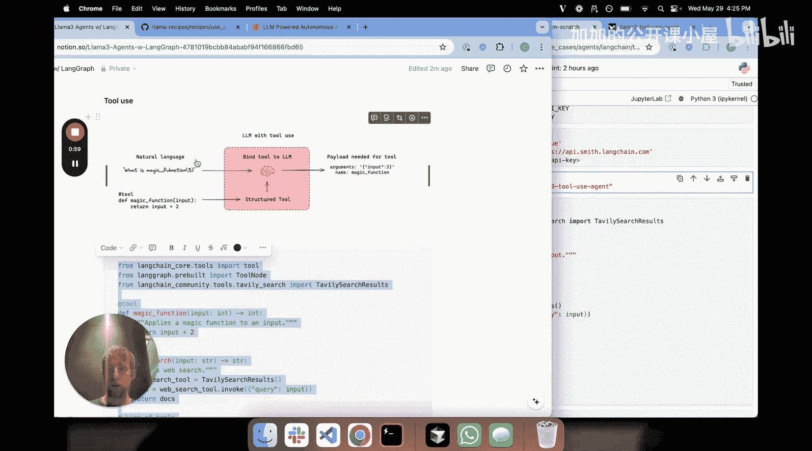
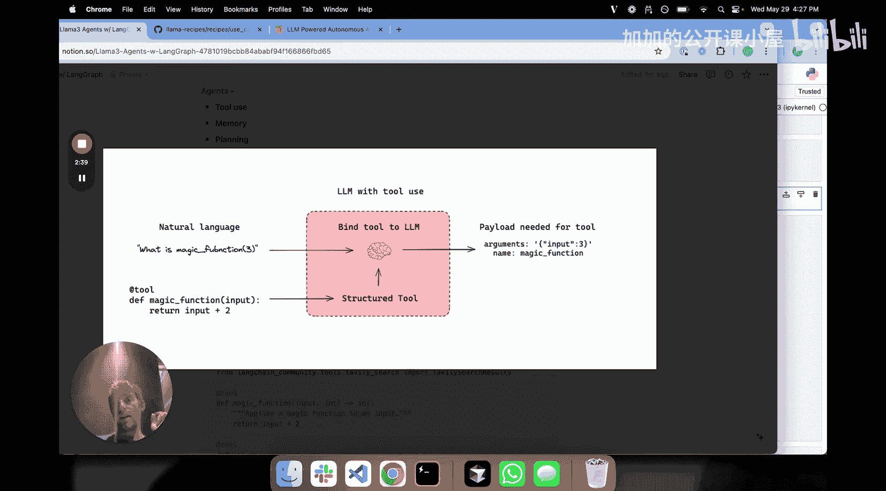
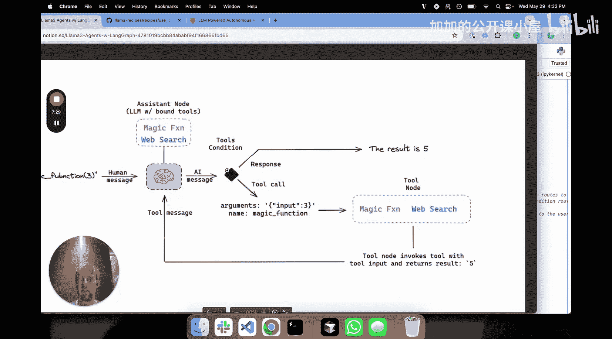
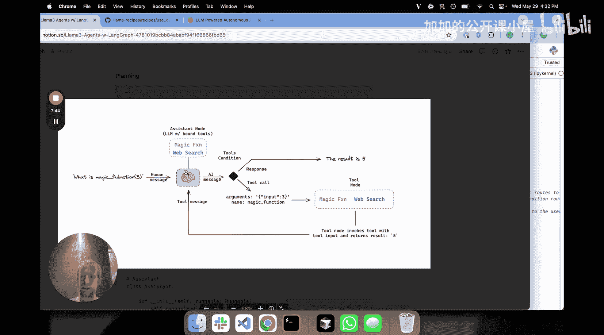
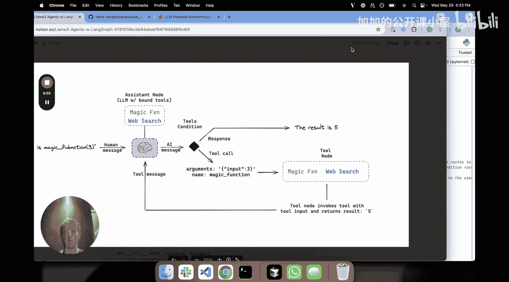
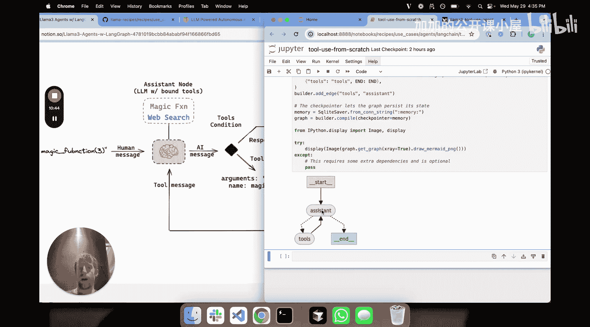

#  024：使用 Llama 3 构建开源 LLM 智能体 🛠️

在本节课中，我们将学习如何使用开源大语言模型（LLM）Llama 3 从头开始构建一个智能体。我们将拆解智能体的核心组件，并通过代码示例演示如何实现它们。

## 概述：什么是智能体？

一篇由 Lilian Weng 撰写的优秀博客文章指出，智能体的核心组件包括**规划**、**记忆**和**工具使用**。在本教程中，我们将重点讲解**工具使用**这一组件，并展示如何将其与 Llama 3 结合使用。

## 工具使用详解

上一节我们介绍了智能体的概念，本节中我们来看看如何让 LLM 使用外部工具。核心思想很简单：我们希望让 LLM 知道某些外部工具的存在，并让它返回调用该工具所需的必要信息。

### 核心概念：从函数到工具

LLM 本质上是字符串到字符串的转换器，它本身不具备直接调用函数的能力。但它可以做到的是：识别一个函数，并返回调用该函数所需的名称和参数。



以下是实现这一过程的关键步骤：

1.  **定义函数**：创建你希望 LLM 能够调用的函数。
2.  **转换为工具**：使用 LangChain 的 `@tool` 装饰器将函数转换为“工具”。这会为函数添加名称、描述和参数模式（Pydantic Schema）。
3.  **绑定到 LLM**：将这些工具信息传递给 LLM，使其“知道”这些工具的存在。
4.  **LLM 决策**：当用户输入一个问题时，LLM 会决定是否需要调用工具。如果需要，它会返回一个包含 `tool_calls` 字段的响应，其中指明了要调用的工具名称和参数。



让我们通过代码来具体理解。

### 代码实现步骤

首先，我们定义两个示例函数并将其转换为工具。

```python
# 示例函数 1：一个简单的“魔法”函数
@tool
def magic_function(input: int) -> int:
    """一个将输入加 2 的函数。"""
    return input + 2

# 示例函数 2：一个网络搜索函数（使用 Tavily）
@tool
def web_search(query: str) -> str:
    """用于搜索当前事件的网络搜索工具。"""
    # 这里调用 Tavily API 进行搜索
    # ... 具体实现代码 ...
    return search_results
```

转换后，`magic_function` 就成为了一个结构化工具，拥有名称、描述和参数模式。这些信息可以被传递给 LLM。

接下来，我们设置 LLM（这里使用 Groq 提供的 Llama 3 70B 模型）和提示词，并将工具绑定到 LLM。

```python
from langchain_groq import ChatGroq

# 初始化 LLM
llm = ChatGroq(model="llama3-70b-8192")

# 创建提示词，告诉 LLM 可用的工具及其使用场景
prompt = ChatPromptTemplate.from_messages([
    ("system", "你是一个有用的助手，可以使用两个工具：web_search 和 magic_function。使用 web_search 查询当前事件。只有当用户直接要求时，才使用 magic_function，否则直接回答。"),
    ("placeholder", "{messages}"),
])

# 将工具绑定到 LLM，创建一个可运行链（Runnable）
assistant = prompt | llm.bind_tools([magic_function, web_search])
```

现在，我们可以测试这个链。当我们询问“magic_function(3) 的结果是什么？”时，LLM 会决定调用工具。

```python
# 测试调用工具
response = assistant.invoke({"messages": [HumanMessage(content="magic_function(3) 的结果是什么？")]})
print(response.tool_calls)
# 输出类似：[{'name': 'magic_function', 'args': {'input': 3}, 'id': '...'}]
```

响应中的 `tool_calls` 字段包含了工具名称 `magic_function` 和参数 `{'input': 3}`。这正是我们需要的调用信息。

如果我们问一个不需要工具的问题，例如“美国的首都是哪里？”，LLM 会直接回答，而 `tool_calls` 字段为空。

```python
# 测试不调用工具
response2 = assistant.invoke({"messages": [HumanMessage(content="美国的首都是哪里？")]})
print(response2.tool_calls)  # 输出：[]
print(response2.content)     # 输出：华盛顿特区
```

至此，你应该理解了工具使用的基本原理：将函数转化为工具，绑定给 LLM，LLM 根据用户输入决定是否调用并返回调用参数。

## 构建智能体图

理解了工具调用后，我们就可以进入更有趣的部分：构建一个能够自主运行、在需要时反复调用工具的智能体。我们将使用 **LangGraph** 来实现，它擅长处理带有循环和状态管理的流程，这正是智能体所需要的。

### 智能体工作流程

智能体的核心是一个循环：
1.  **LLM 决策节点**：接收用户输入或上一步的工具结果，决定下一步是回答问题还是调用工具。
2.  **工具执行节点**：如果决定调用工具，则执行该工具，并将结果返回给 LLM 决策节点。
3.  **循环**：LLM 根据工具结果再次决策，直到最终生成一个自然语言回答。

这个流程可以用下图表示：
`[用户输入] -> [LLM决策] -> (是) -> [调用工具] -> [返回结果] -> [LLM决策] -> ... -> (否) -> [生成最终回答]`

### 使用 LangGraph 实现

以下是使用 LangGraph 构建上述智能体图的关键步骤：

首先，我们定义智能体的状态，它将在整个图流程中传递。这里的状态主要是对话消息列表。



```python
from typing import TypedDict, Annotated, List
from langchain_core.messages import BaseMessage
import operator

class State(TypedDict):
    messages: Annotated[List[BaseMessage], operator.add]  # 消息列表，会随时间累积
```

接着，我们创建两个关键节点和条件边：

1.  **助手节点**：包装我们之前创建的 `assistant` 链，负责调用 LLM 并做出决策。
2.  **工具节点**：负责执行 LLM 选择调用的工具。
3.  **条件边**：根据 LLM 的输出决定下一步走向。如果调用了工具，则前往工具节点；如果生成了最终回答，则结束。



```python
from langgraph.graph import StateGraph, END

# 初始化图
graph_builder = StateGraph(State)

# 1. 定义助手节点
def call_model(state: State):
    messages = state['messages']
    response = assistant.invoke({"messages": messages})
    return {"messages": [response]}

# 2. 定义工具节点
def call_tool(state: State):
    last_message = state['messages'][-1]
    tool_call = last_message.tool_calls[0]  # 取第一个工具调用（简化）
    tool_to_call = {t.name: t for t in [magic_function, web_search]}[tool_call['name']]
    output = tool_to_call.invoke(tool_call['args'])
    return {"messages": [ToolMessage(content=str(output), tool_call_id=tool_call['id'])]}

# 将节点添加到图中
graph_builder.add_node("assistant", call_model)
graph_builder.add_node("tools", call_tool)

# 3. 设置入口点和条件边
graph_builder.set_entry_point("assistant")

# 定义条件判断函数：如果最后一条消息包含工具调用，则去“tools”节点，否则结束。
def should_continue(state: State):
    messages = state['messages']
    last_message = messages[-1]
    if last_message.tool_calls:
        return "tools"
    else:
        return END



# 添加条件边
graph_builder.add_conditional_edges(
    "assistant",
    should_continue
)
# 添加从工具节点返回助手节点的边
graph_builder.add_edge("tools", "assistant")

# 编译图
graph = graph_builder.compile()
```

现在，我们可以运行这个智能体图。当我们问“magic_function(3) 的结果是什么？”时，图会这样运行：
- 进入 `assistant` 节点，LLM 决定调用 `magic_function`。
- 条件边检测到工具调用，路由到 `tools` 节点。
- `tools` 节点执行 `magic_function(3)`，得到结果 `5`，并将其包装为 `ToolMessage` 返回。
- 图自动从 `tools` 节点返回 `assistant` 节点。
- `assistant` 节点再次被调用，这次它收到了包含结果 `5` 的 `ToolMessage`。
- LLM 根据这个结果生成最终的自然语言回答（例如，“结果是 5”）。
- 条件边检测到没有新的工具调用，流程结束。

我们可以使用 LangGraph 的可视化功能来查看这个图的结构。

```python
# 显示图结构（在支持的环境下，如Jupyter Notebook）
graph.get_graph().draw_mermaid_png()
```

## 总结

本节课中我们一起学习了如何使用 Llama 3 构建开源 LLM 智能体。

1.  **工具使用**：我们掌握了如何将任意 Python 函数转换为 LLM 可识别的工具，并让 LLM 根据用户输入决定是否调用及如何调用这些工具。核心在于 `bind_tools` 方法和解析 `tool_calls` 响应。
2.  **智能体构建**：我们利用 LangGraph 构建了一个具有循环能力的智能体图。该图包含 LLM 决策节点和工具执行节点，通过条件边连接，使得智能体可以多次调用工具、处理结果，最终生成回答。这实现了智能体“思考-行动-观察”的循环过程。



通过结合工具使用和 LangGraph 的图流程控制，你 now have the foundation to build sophisticated agents that can interact with the external world using open-source models like Llama 3.