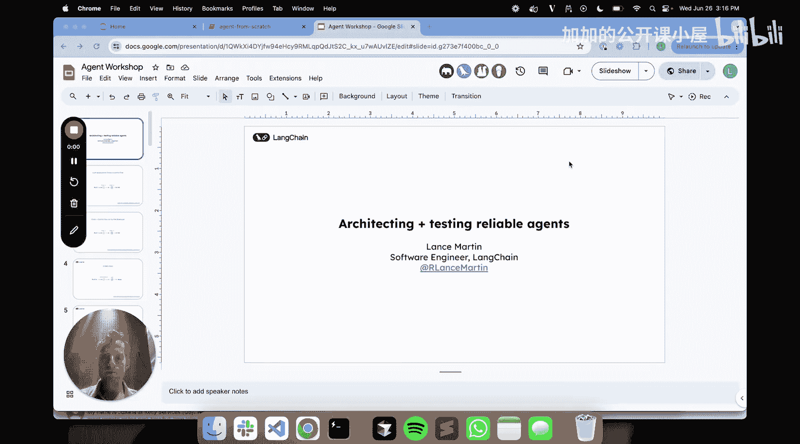
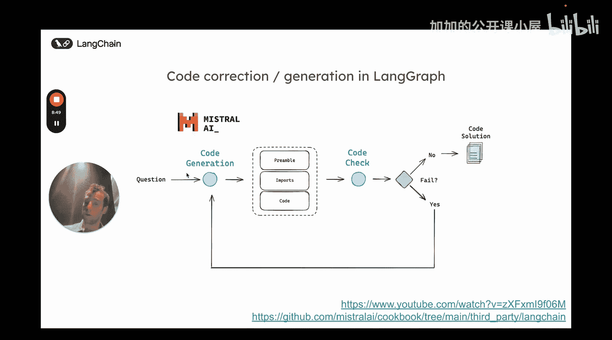
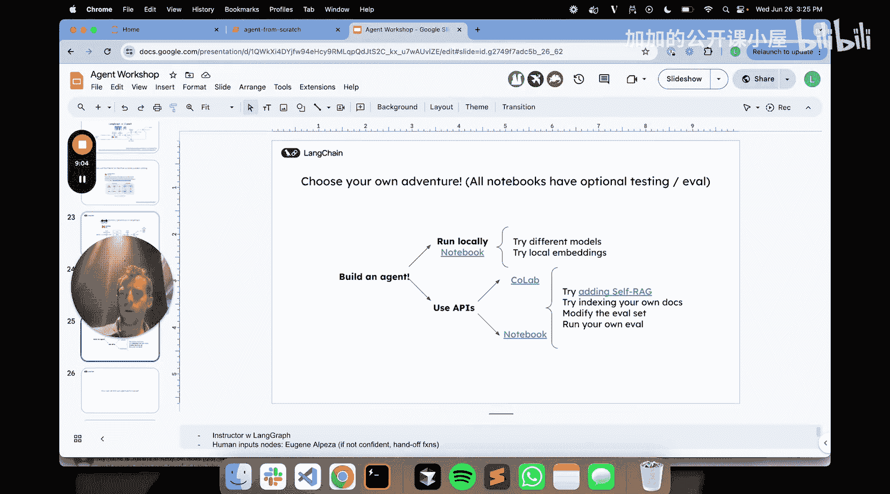
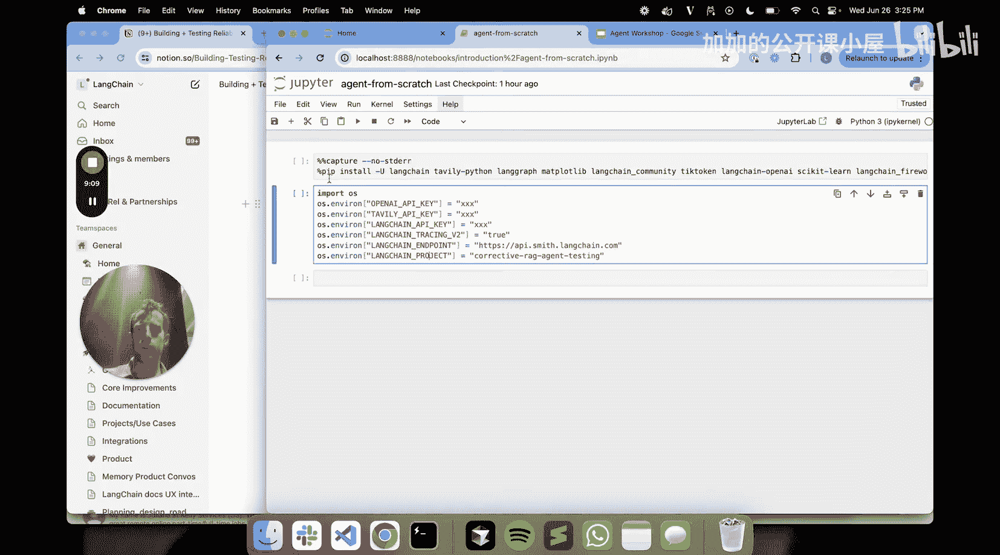
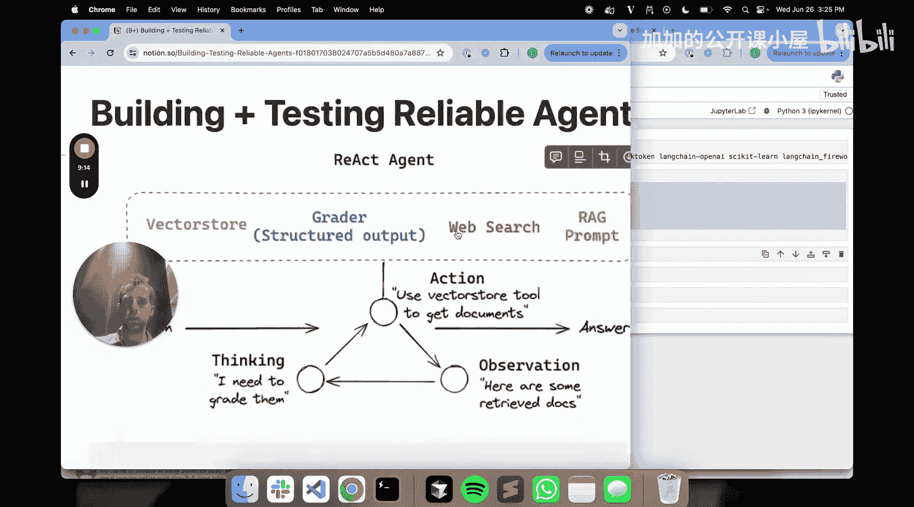
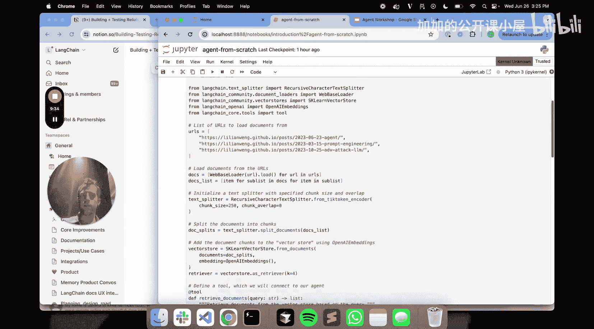
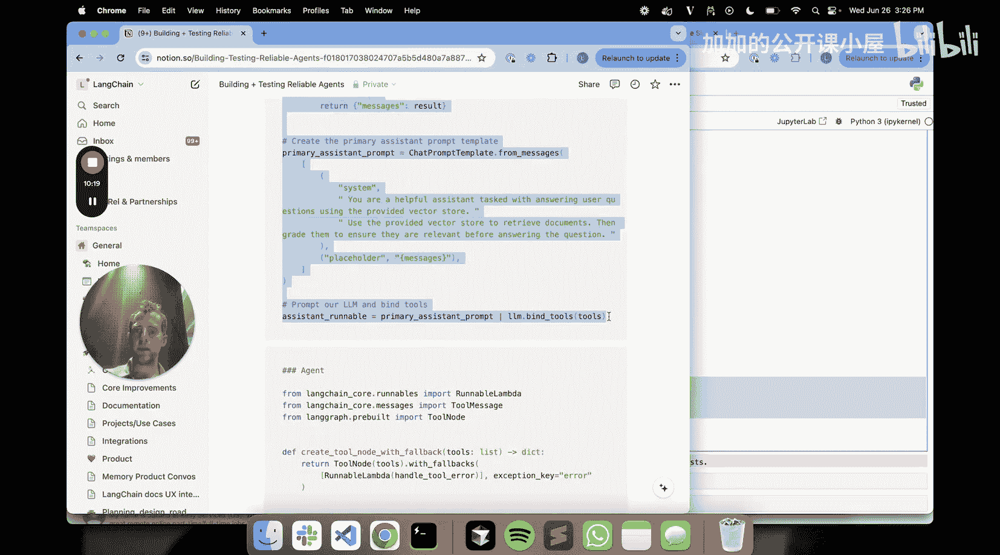
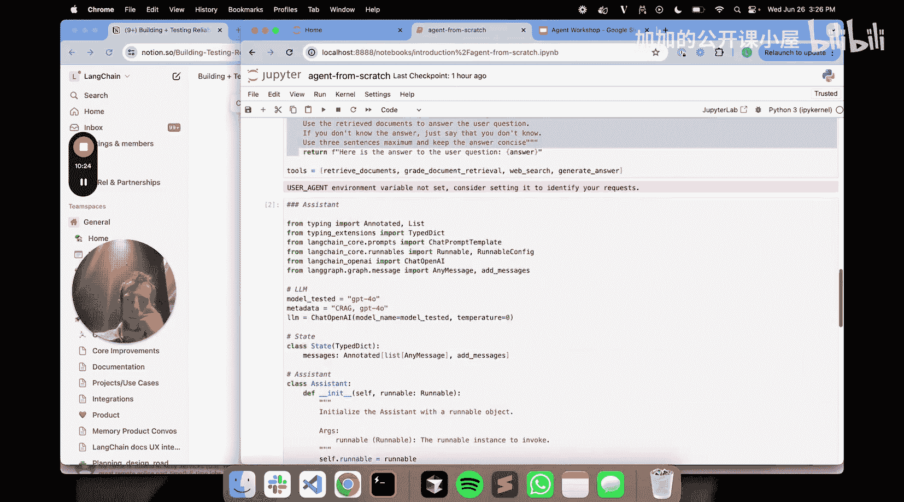

#  027：构建与测试可靠的智能体



## 概述
在本节课中，我们将学习如何构建和测试可靠的智能体。我们将首先理解智能体与链的核心区别，然后探讨传统智能体（如ReAct风格）的局限性。接着，我们将介绍LangGraph这一解决方案，它通过让开发者定义部分控制流，结合LLM的决策能力，在灵活性和可靠性之间取得了平衡。最后，我们将通过代码对比，直观地展示如何使用ReAct和LangGraph两种方式构建同一个智能体。

---

## 智能体与链：核心概念

上一节我们概述了课程目标，本节中我们来看看智能体与链的基本概念。

基于LLM的应用遵循一个控制流：通常从用户输入开始，经过一系列步骤，最终结束。**链**可以看作是开发者预先设定好的一套固定步骤的控制流。

一个典型的链式流程可以用以下伪代码描述：
```python
# 链式流程示例
question = user_input()
retrieved_docs = vector_store.retrieve(question)
answer = llm.generate(retrieved_docs, question)
return answer
```

而**智能体**则不同，它的控制流在很大程度上由LLM来动态决定，而非完全由开发者固定。在一个简化的例子中，智能体在每一步都可能让LLM来决定是重复当前步骤还是进入下一步。

因此，核心区别在于：
*   **链**：开发者定义的、固定的控制流。
*   **智能体**：由LLM动态定义的控制流。

---

## 工具调用与ReAct智能体

理解了智能体的基本概念后，我们来看看智能体是如何做出决策的。这通常通过**工具调用**或**函数调用**来实现。

工具调用的本质是：你为LLM提供一组可用的工具，LLM根据用户的输入，选择要调用的工具，并提供运行该工具所需的参数。

以下是一个工具调用的示例流程：
1.  LLM接收自然语言输入：“`step_two` 函数在输入为3时的输出是什么？”
2.  我们将 `step_two` 函数绑定为一个工具提供给LLM。
3.  LLM返回调用该工具所需的载荷：`{"tool_name": "step_two", "arguments": {"input": 3}}`。

一种流行的方法是将其实现为一个循环，即**ReAct风格**的智能体。其工作流程如下：

以下是ReAct智能体的典型循环步骤：
1.  接收用户输入。
2.  LLM决定基于输入调用哪个工具。
3.  运行被调用的工具。
4.  将工具的输出返回给LLM。
5.  LLM进行思考，决定是否需要调用另一个工具。
6.  重复步骤2-5，直到LLM决定不再调用工具，直接向用户返回最终响应。

这种方式的优点是**极其灵活**，可以实现多种可能的控制流。去年大热的AutoGPT、BabyAGI等项目就是这类开放式智能体的代表，它们能访问大量工具，为解决开放式问题执行任意的控制流。

---

## 灵活性与可靠性的挑战

然而，许多开发者报告，这类开放式或高度灵活的智能体存在**可靠性参差不齐**的问题。

问题通常源于LLM的**非确定性**，尤其是在工具调用环节。具体挑战包括：
*   **调用错误的工具**：例如，用户请求执行 `step_two`，但LLM调用了 `step_three`。
*   **提供错误的参数**：例如，工具需要输入 `3`，但LLM传递了 `4`，或者参数格式不正确。

因此，我们面临一个权衡：
*   **链**：不灵活，但**非常可靠**。
*   **开放式/ReAct智能体**：非常灵活，但**可靠性较低**。

那么，是否存在一种**既灵活又可靠**的中间方案呢？这就是我们要解决的核心问题。

---

## LangGraph：平衡之道

LangGraph的核心理念是：**让开发者设定部分控制流，只在关键节点让LLM介入决策**，从而实现灵活性与可靠性的平衡。

例如，开发者可以设定：总是以 `step_one` 开始，以 `step_two` 结束。而在这两者之间，则插入一个由LLM决策的环节，让智能体决定是返回 `step_one` 还是继续到 `step_two`。

LangGraph允许你将这种流程表示为一张**图**：
*   **节点**：代表流程中的各个步骤。
*   **边**：代表步骤之间的连接，这些连接可以是条件性的，由LLM决定。

一个LangGraph智能体包含几个与通用智能体一致的核心组件：
*   **共享状态**：在智能体整个生命周期内存在，任何节点都可以访问和修改。
*   **工具调用**：节点内部可以调用工具，并将工具的输出写入共享状态。
*   **条件边**：基于LLM的决策，将控制流路由到不同的节点。

这种模式在多项研究中被成功应用，例如：
*   **Corrective RAG**：先检索文档，然后让LLM评估文档相关性。如果发现不相关文档，则触发网络搜索进行补充，最后基于混合结果进行RAG。
*   **迭代式问题解决（如代码生成）**：生成代码方案 -> 运行单元测试 -> 如果测试失败，将错误信息反馈给LLM让其重试。与Mistral AI的合作表明，这种方法能显著提升代码生成任务的表现。

总结来说：
*   **链**：最可靠，但最不灵活。
*   **ReAct智能体**：最灵活，但最不可靠。
*   **LangGraph智能体**：在两者间取得了良好的平衡，既保持了相当的灵活性，又通过开发者引导提升了可靠性。无论是运行复杂的RAG流程，还是迭代式代码生成，LangGraph都表现优异。

---

## 代码实战：ReAct vs LangGraph

理论部分已经介绍完毕，现在让我们通过代码来直观对比。我们将用两种方式构建同一个具备检索、评估、搜索和生成功能的智能体。

首先，我们需要设置一些基础环境和工具。

以下是初始化环境和定义工具的代码：
```python
# 1. 定义向量库并索引四篇博客文章
vector_store = create_vector_store(index_documents(blog_posts))

# 2. 定义四个工具
@tool
def retrieve_documents(query: str):
    """根据查询从向量库检索文档。"""
    return vector_store.retrieve(query)

@tool
def grade_documents(question: str, documents: list):
    """根据问题评估文档的相关性。"""
    # 评估逻辑...
    return relevance_score

@tool
def web_search(query: str):
    """执行网络搜索。"""
    # 搜索逻辑...
    return search_results

@tool
def generate_answer(context: str, question: str):
    """根据上下文和问题生成最终答案。"""
    return llm.invoke(f"Context: {context}\nQuestion: {question}")
```

### 构建ReAct智能体

接下来，我们使用标准的ReAct模式来构建智能体。

以下是构建ReAct智能体的核心代码：
```python
from langchain.agents import create_react_agent, AgentExecutor

# 定义模型和工具列表
model = ChatOpenAI(model="gpt-4")
tools = [retrieve_documents, grade_documents, web_search, generate_answer]

# 创建ReAct智能体
agent = create_react_agent(model, tools)
agent_executor = AgentExecutor(agent=agent, tools=tools, verbose=True)

# 运行智能体
result = agent_executor.invoke({"input": "用户的问题是什么？"})
print(result["output"])
```
这个智能体将完全依赖LLM在每一步决定调用哪个工具，形成一个自由的循环，直到LLM决定给出最终答案。

### 构建LangGraph智能体

现在，我们使用LangGraph来构建一个具有更明确流程的智能体。我们将定义一个图，其中包含检索、评估、条件路由等节点。

以下是构建LangGraph智能体的示例框架：
```python
from langgraph.graph import StateGraph, END
from typing import TypedDict

# 1. 定义状态结构
class AgentState(TypedDict):
    question: str
    documents: list
    graded_docs: list
    search_results: list
    final_answer: str

# 2. 创建图构建器
graph_builder = StateGraph(AgentState)

# 3. 定义节点函数
def retrieve_node(state: AgentState):
    # 调用检索工具
    docs = retrieve_documents(state["question"])
    return {"documents": docs}

def grade_node(state: AgentState):
    # 调用评估工具
    score = grade_documents(state["question"], state["documents"])
    return {"graded_docs": score}



def route_after_grade(state: AgentState):
    # 让LLM决策：如果文档相关性高，去生成答案；否则去搜索
    # 这里简化表示，实际会调用LLM进行判断
    if state["graded_docs"] == "high":
        return "generate"
    else:
        return "search"

def search_node(state: AgentState):
    # 调用搜索工具
    results = web_search(state["question"])
    return {"search_results": results}

def generate_node(state: AgentState):
    # 准备上下文，调用生成工具
    context = combine(state["documents"], state.get("search_results"))
    answer = generate_answer(context, state["question"])
    return {"final_answer": answer}





# 4. 添加节点和条件边
graph_builder.add_node("retrieve", retrieve_node)
graph_builder.add_node("grade", grade_node)
graph_builder.add_node("search", search_node)
graph_builder.add_node("generate", generate_node)



graph_builder.set_entry_point("retrieve")
graph_builder.add_edge("retrieve", "grade")
graph_builder.add_conditional_edges("grade", route_after_grade, {"generate": "generate", "search": "search"})
graph_builder.add_edge("search", "generate")
graph_builder.add_edge("generate", END)

# 5. 编译并运行图
graph = graph_builder.compile()
final_state = graph.invoke({"question": "用户的问题是什么？"})
print(final_state["final_answer"])
```
在这个LangGraph智能体中，控制流是部分预设的（例如，总是先检索，然后评估），但关键的路由决策（评估后是直接生成还是先去搜索）交给了LLM。这种方式结合了开发者对流程的引导和LLM的灵活性。



---

## 总结

本节课中我们一起学习了构建可靠智能体的核心方法。

我们首先区分了**链**（固定、可靠）和**智能体**（灵活、由LLM驱动）的概念。然后，我们探讨了传统**ReAct智能体**虽然灵活，但因其完全依赖LLM的非确定性决策而可能导致可靠性问题。

接着，我们引入了**LangGraph**作为解决方案。它的核心思想是**让开发者定义流程的骨架，只在必要的决策点引入LLM**。通过将应用建模为**图**（节点代表步骤，边代表由LLM决定的条件路由），我们能够在保持智能体灵活性的同时，通过预设的关键路径大幅提升其可靠性。



最后，我们通过代码对比了使用ReAct和LangGraph构建同一功能智能体的不同方式，直观展示了LangGraph如何在结构化和灵活性之间取得平衡。



对于初学者而言，理解这种权衡至关重要。当你需要高度可靠、可预测的流程时，可以选择链或高度结构化的LangGraph。当你面对开放性问题，需要最大程度的灵活性时，可以选择ReAct智能体。而LangGraph则为你提供了一个强大的中间地带，尤其适合那些需要一定流程保障，但又离不开智能决策的复杂应用场景。