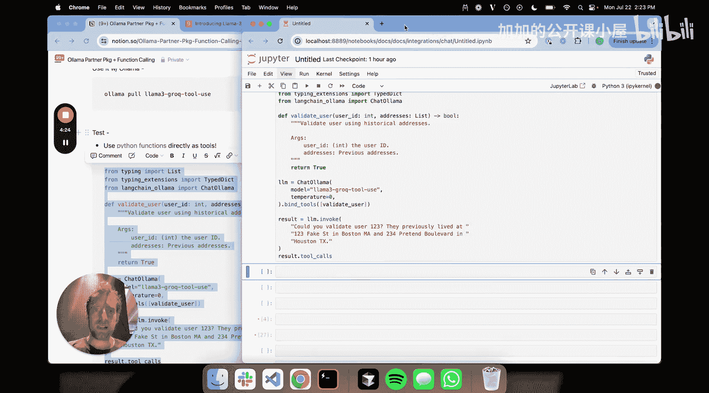
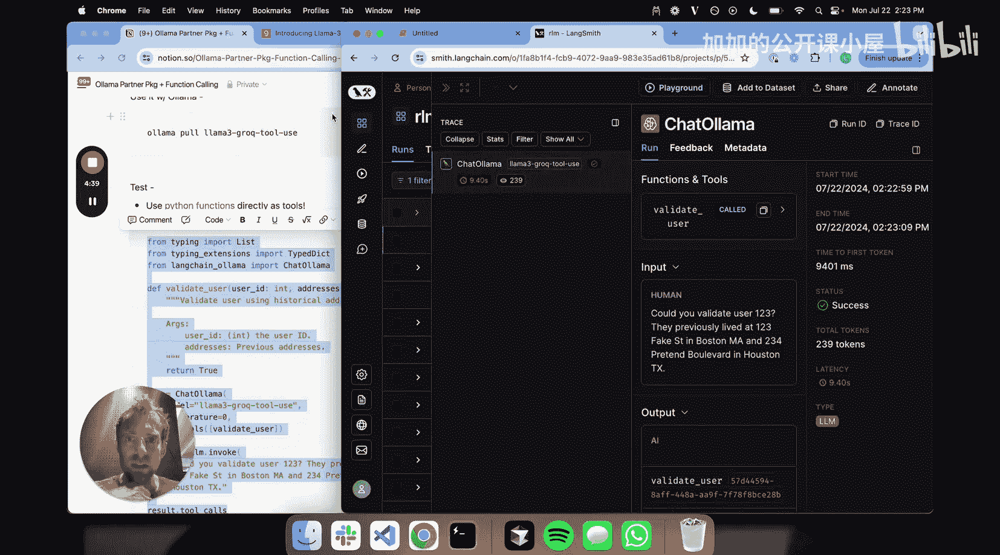
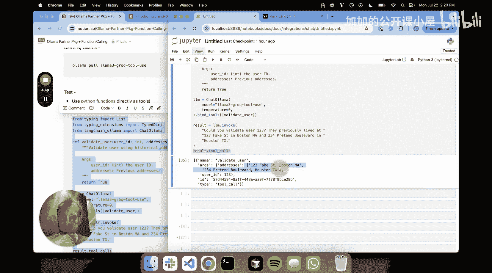
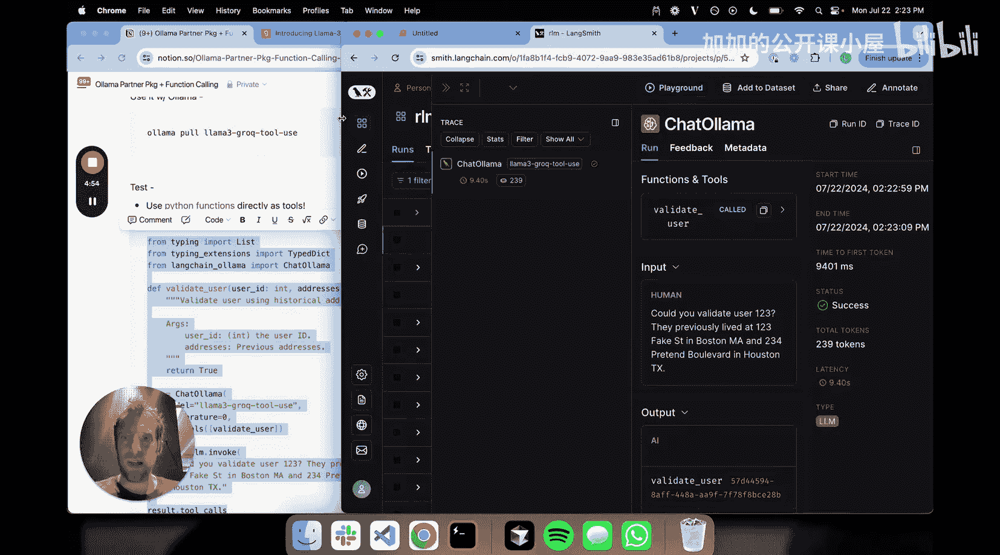
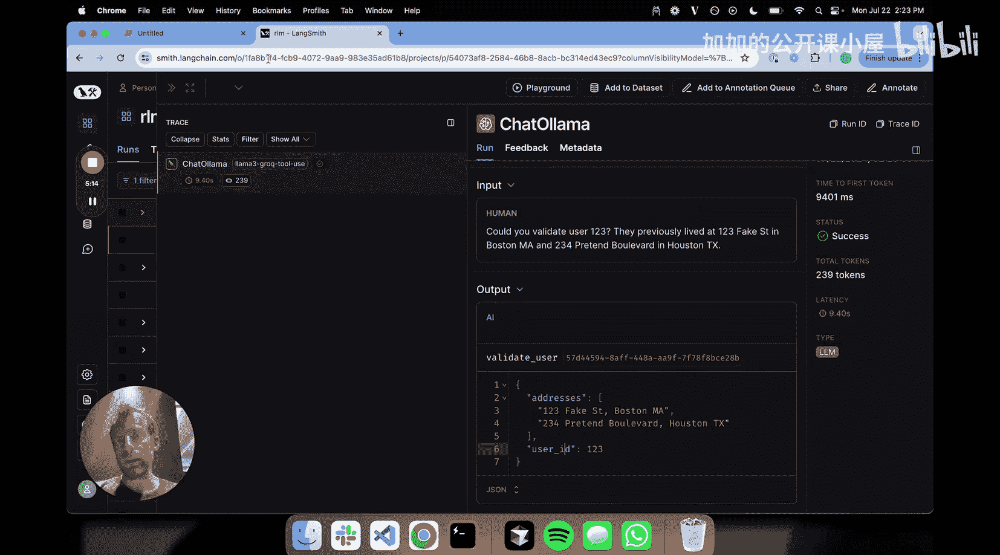
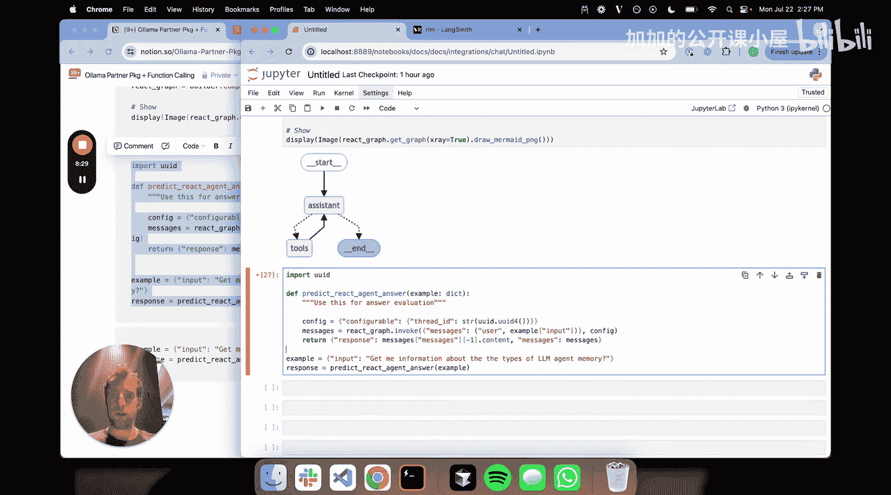
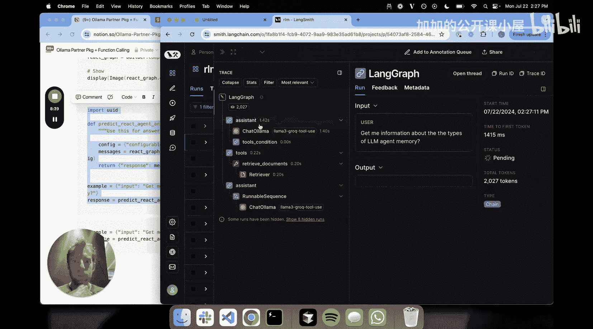
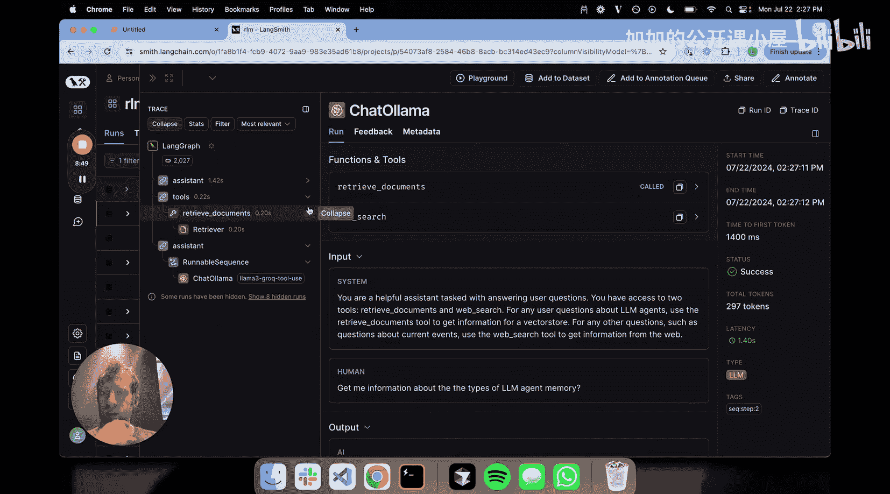
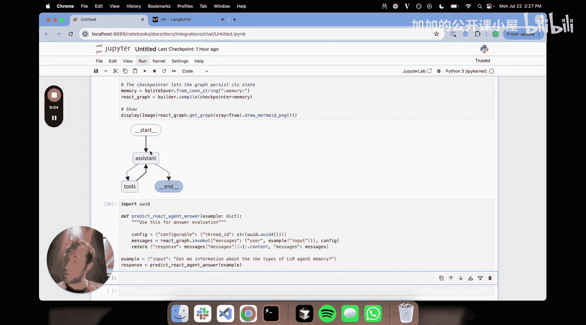
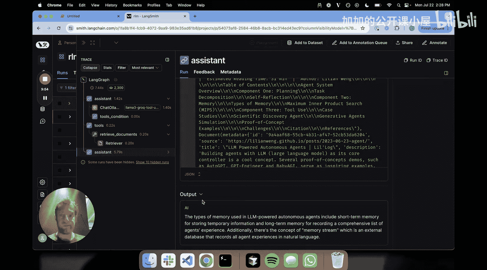

#  031：使用 Ollama 进行完全本地的工具调用 🚀

## 概述
在本节课中，我们将学习如何使用 Ollama 在本地运行的大型语言模型（LLM）进行工具调用。我们将介绍工具调用的核心概念，并演示如何结合 LangChain 和 Ollama 的工具调用功能来构建一个简单的智能体。

---

## 工具调用的核心概念

上一节我们介绍了课程目标，本节中我们来看看工具调用的核心思想。

工具调用与函数调用是同义词。其主要思想是：将一个可以调用的函数（即工具）绑定到你的 LLM 上，使 LLM 能够访问该工具，并能生成格式化的输出来调用该工具，或者说，创建运行该工具所需的有效载荷。

LLM 本质上是字符串到字符串的映射，它无法直接运行工具，但可以根据用户输入生成运行工具所需的有效载荷。你可以将此过程理解为：从原始的非结构化用户输入生成有效载荷，以实际运行工具。

例如，假设我们有一个名为 `step2` 的工具，它接受输入 `foo`。我们将其绑定到 LLM。当 LLM 接收到“`step2` 的输入是 3”这样的指令时，它能够生成运行该工具所需的参数。

**核心流程可以表示为：**
`用户输入（字符串）` -> `LLM` -> `工具调用有效载荷（结构化参数）` -> `执行工具`

---

## 本地工具调用的挑战与机遇

之前，能够很好地进行工具调用的优秀本地 LLM 并不多。当我们说“很好地进行”时，指的是在像 80 亿参数这样的小模型规模上也能有相当不错的表现。

Llama 3 700 亿参数模型在工具调用上表现很好，但此前我们很少见到在 80 亿参数级别上表现出色的模型。最近，Goc 基于 Llama 3 发布了一个特定的微调版本，在工具调用排行榜上表现优异。这个模型有 80 亿参数的版本，是与 Give 合作完成的，非常有趣。

这个模型名为 `llama3-goc-tool-use`，可以通过 Ollama 获取。







---

## 实践：设置环境与基础工具调用



以下是设置环境和进行基础工具调用的步骤。



1.  **安装必要的包**：首先，需要安装 LangChain 与 Ollama 的集成包。
    ```bash
    pip install langchain-llama
    ```

2.  **拉取模型**：通过 Ollama 拉取专门用于工具调用的微调模型。
    ```bash
    ollama pull llama3-goc-tool-use
    ```

3.  **定义工具**：在 LangChain 中，工具可以是简单的 Python 函数。以下是一个示例工具，用于验证用户的历史地址。
    ```python
    from langchain.tools import tool

    @tool
    def validate_user(user_id: int, addresses: list):
        """
        使用历史地址验证用户。
        参数:
            user_id: 用户ID (整数)
            addresses: 地址列表 (列表)
        """
        # 在实际应用中，这里会有具体的验证逻辑
        return f"已验证用户 {user_id}，地址为 {addresses}"
    ```

4.  **绑定工具并调用**：将工具绑定到本地 LLM，然后进行测试。
    ```python
    from langchain_llama import ChatLlama

    # 初始化本地 LLM
    llm = ChatLlama(model="llama3-goc-tool-use")

    # 将工具绑定到 LLM
    llm_with_tools = llm.bind_tools([validate_user])

    # 调用 LLM，触发工具调用
    response = llm_with_tools.invoke("验证用户 123，他们曾住在 ['地址A', '地址B']")
    print(response)
    ```
    执行后，LLM 会生成调用 `validate_user` 工具所需的结构化参数（`user_id=123`, `addresses=['地址A', '地址B']`）。你可以通过 LangSmith 等工具查看详细的调用链和参数。

---

## 进阶：构建一个简单的智能体

上一节我们完成了单一工具的调用，本节中我们来看看如何组合多个工具来构建一个能自主决策的智能体。

我们将构建一个简单的 ReAct 风格智能体，它可以根据问题类型决定使用哪个工具：检索内部文档或进行网络搜索。

以下是构建智能体的关键步骤。

1.  **准备工具**：我们需要两个工具。
    *   **检索工具**：基于向量数据库查询相关文档。
    *   **网络搜索工具**：使用 Tavily 进行实时网络搜索。
    ```python
    from langchain.tools import TavilySearchResults
    from langchain_community.vectorstores import Chroma
    from langchain_openai import OpenAIEmbeddings
    from langchain.tools.retriever import create_retriever_tool

    # 1. 创建检索工具
    urls_to_index = [...] # 填入相关URL
    vectorstore = Chroma.from_documents(documents, OpenAIEmbeddings())
    retriever = vectorstore.as_retriever()
    retriever_tool = create_retriever_tool(
        retriever,
        "retrieve_documents",
        "检索与问题相关的文档。"
    )

    # 2. 创建网络搜索工具
    search_tool = TavilySearchResults()
    ```



2.  **定义智能体提示词**：指导智能体如何选择工具。
    ```python
    from langchain_core.prompts import ChatPromptTemplate

    prompt = ChatPromptTemplate.from_messages([
        ("system", """你是一个乐于助人的助手，负责回答用户问题。
        你可以使用两个工具：`retrieve_documents` 和 `web_search`。
        对于任何关于 LLM 智能体的问题，请使用 `retrieve_documents` 工具。
        对于其他问题，请使用 `web_search` 工具。"""),
        ("user", "{input}")
    ])
    ```





3.  **组装智能体**：使用 LangGraph 定义智能体的执行流程。
    ```python
    from langgraph.graph import StateGraph, END
    from langgraph.prebuilt import ToolNode

    # 定义状态
    from typing import TypedDict, Annotated, Sequence
    import operator

    class AgentState(TypedDict):
        input: str
        chat_history: list
        intermediate_steps: Annotated[Sequence[tuple], operator.add]

    # 创建图
    graph_builder = StateGraph(AgentState)

    # 定义助手节点（决策）
    def assistant(state: AgentState):
        llm_with_tools = llm.bind_tools([retriever_tool, search_tool])
        response = llm_with_tools.invoke(prompt.format_messages(input=state["input"]))
        return {"intermediate_steps": [(response, None)]}

    # 定义工具执行节点
    tool_node = ToolNode([retriever_tool, search_tool])

    # 添加节点和边
    graph_builder.add_node("assistant", assistant)
    graph_builder.add_node("tools", tool_node)
    graph_builder.set_entry_point("assistant")

    # 根据 LLM 输出决定下一步：调用工具还是结束
    def should_continue(state: AgentState):
        last_step = state["intermediate_steps"][-1]
        if hasattr(last_step[0], 'tool_calls') and last_step[0].tool_calls:
            return "tools"
        else:
            return END

    graph_builder.add_conditional_edges(
        "assistant",
        should_continue
    )
    graph_builder.add_edge("tools", "assistant")

    # 编译图
    agent = graph_builder.compile()
    ```

4.  **测试智能体**：向智能体提问，观察其决策过程。
    ```python
    result = agent.invoke({"input": "告诉我关于 LLM 智能体记忆类型的信息。"})
    print(result["intermediate_steps"][-1][0].content) # 打印最终答案
    ```
    智能体会根据提示词，判断这是一个关于 LLM 智能体的问题，从而调用 `retrieve_documents` 工具。工具返回结果后，信息会再次传递给助手节点生成最终答案。整个过程可以在 LangSmith 中清晰地追踪。



---



## 总结
本节课中我们一起学习了如何使用 Ollama 和 LangChain 进行完全本地的工具调用。我们从工具调用的基本概念入手，演示了如何将 Python 函数绑定到本地 LLM 上。接着，我们进一步探索了如何利用多个工具构建一个简单的 ReAct 智能体，该智能体能够根据问题内容自主选择使用检索工具还是网络搜索工具来获取信息并回答问题。这为在资源受限环境下构建功能强大的 AI 应用提供了新的可能性。