#  035：用于数据可视化的文本转SQL智能体

在本节课中，我们将学习一个结合了LangChain、自然语言处理和SQL查询的智能体项目。这个智能体不仅能将用户用自然语言提出的问题转换为SQL查询，还能将查询结果自动生成为可视化图表。我们将通过一个美式橄榄球数据的实例，来了解其工作原理和架构。

## 项目概述与演示

我是来自LangChain的Lance。最近，我对展示LangChain能力，特别是复杂且有趣的智能体应用很感兴趣。我找到了一个很酷的代码仓库，想在这里快速展示一下。

这是一个用于数据可视化的文本转SQL智能体。我们之前见过文本转SQL，这是一个常见的用例。但它的巧妙之处在于，它弥合了自然语言提问和数据可视化之间的鸿沟。这个智能体不仅能为你执行SQL查询，还能为你生成结果的可视化图表。

我想先演示一下它的实际效果，然后再深入代码仓库，讲解它是如何工作的。在美国，秋天人们常对橄榄球感兴趣。我找到了一些来自机器学习模型的近期统计数据，该模型基于过往赛季训练，并试图预测即将到来的新赛季球员表现。我从Kaggle获取了这些数据，它是一个CSV文件。

现在，我想展示如何使用这个智能体与数据交互。我不喜欢写SQL查询，很多人都是如此。基本上，这是已经搭建好的智能体用户界面。我稍后会详细讲解，但我想先展示一下它是如何工作的。

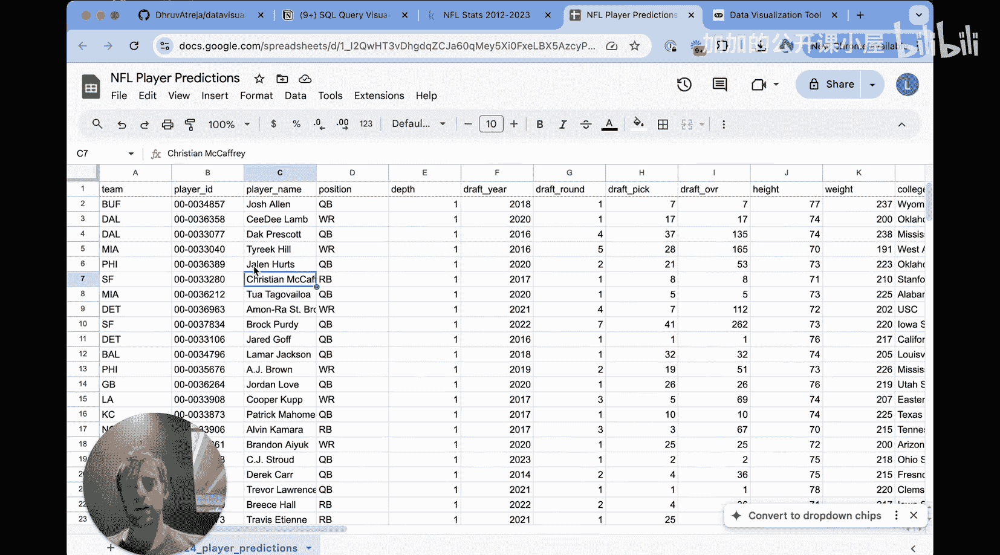

它的一个优点是，我可以上传SQLite数据库或CSV文件。我将选择我获取的这个CSV文件。现在文件已上传，我可以直接与它交互并提问。

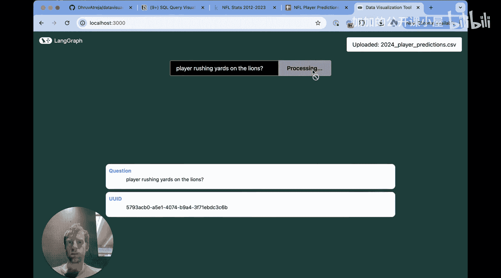

我们看到一些内部状态信息在这里流式输出。我们得到了可视化图表，这很酷，对吧？这里展示了底特律雄狮队（Detroit Lions）各位球员的预测冲球码数。这只是对智能体实际功能和输出样貌的一个说明。

现在，让我们深入底层，解释一下它实际上是如何工作的。

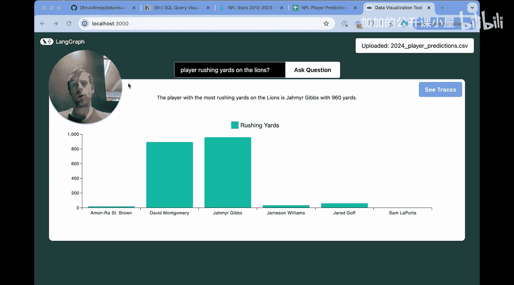

## 整体架构解析

我回到了代码仓库，让我们来梳理一下这里展示的整体架构。我是用户。我提供了一个CSV文件，并提出了一个问题。现在，我们来谈谈发生了什么。

首先，那个CSV文件被上传了。这意味着什么，发生了什么？在代码仓库中，那个CSV文件实际上被导入了一个SQLite服务器，该服务器将CSV转换成了SQLite数据库。

然后，我这里有一个SQL智能体，它与该数据库进行交互。它根据用户的问题生成查询，基本上就是将问题转换为SQL，执行它，并返回格式化的数据。这就是在这个“黑箱”内部发生的事情，我们稍后会深入探讨。

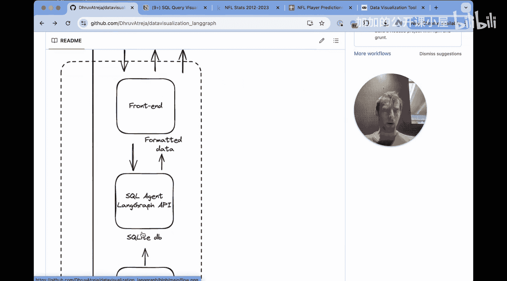

接着，格式化后的数据被传回前端，我们在这里看到它。然后前端实际渲染出可视化图表。但所有繁重的工作都发生在这个SQL智能体内部，它是在LangChain中定义的。

## 代码仓库结构

现在让我们来梳理一下。我目前在代码仓库中，会看到几个目录：`backend_js`、`backend_py`、`frontend`、`sqlite_server`。

我们先从比较直观的部分开始。SQLite服务器就是我们刚才讨论的。它负责接收我们的CSV文件，将其转换为SQLite数据库并提供服务，使其可访问。实际上，你甚至可以进入SQLite服务器的上传页面，看到所有我上传的文件。我用这个做了几次不同的测试，它们都保存在这里，并有一个ID，我以后可以实际使用它。这很巧妙。

所以，这就是SQLite服务器的部分。如果你对所有代码感兴趣，可以在这里深入研究，但这里就是它所在的位置。

我想重点谈谈LangChain部分。显然还有前端，它都在这里。现在，你可以选择用Python或JavaScript在LangChain中实现SQL智能体。我个人更喜欢Python，所以你可以在这个`my_agent`子目录中看到。这些Python脚本包含了所有实际在LangChain中定义我们智能体的逻辑。

这里你会看到一些有趣的东西。如果你看这个整体目录，你会看到这个`langgraph.json`文件。这实际上提供了一个必要的配置文件，用于在LangGraph Studio中运行我们的智能体。你可以看到我们指定了我们的图，称之为`my_agent`，它指向`my_agent/my_main.py`中的图。如果我打开`main.py`，我可以看到这就是图。我可以进入工作流管理器。

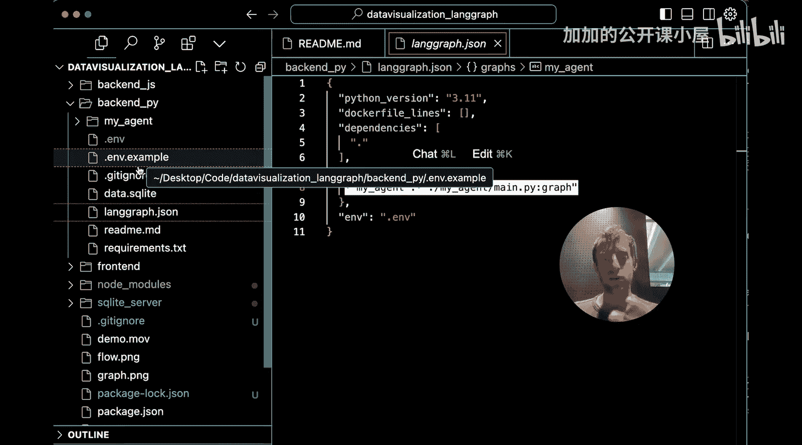

在这里，我可以看到所有图节点被添加的地方，以及图实际被编译的地方。这很不错。所以如果我返回，那个`return_graph`方法只是编译图并返回它，使其可访问。

在LangGraph Studio中，LangGraph Studio实际上是一个很好的方式，可以将这段代码打包为LangChain API。这使我们能够做几件不同的事情。

我们的代码通过LangChain API打包后：第一，我们可以通过LangGraph Studio与之交互，这样我们可以直接在一个可视化的IDE（LangGraph Studio）中测试和交互，我们稍后会快速展示一下。第二，我实际上可以在我们的应用程序中使用那个API。具体来说，如果我进入`frontend/app.py`，查看`env.docs.example`，API URL可以在这里提供，并且它可以通过Studio直接与我们本地运行的LangChain API交互。

这就是所有部分如何组合在一起的。如果我回顾一下正在发生的事情：在`.py`或`.js`文件中，智能体逻辑在一系列脚本中定义。然后我们有一个LangGraph Studio的配置文件指向我们的智能体。当我们在Studio中打开它时，Studio会自动用LangChain API包装这段代码。然后它使其在本地对我们的前端可访问，这就是我们的应用程序实际使用的东西。

## 在LangGraph Studio中探索

现在，为什么不让我先展示一下Studio呢？这是一个非常好的方式来直观了解它在底层是如何工作的。

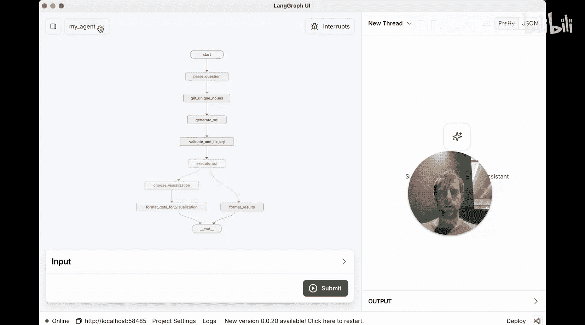

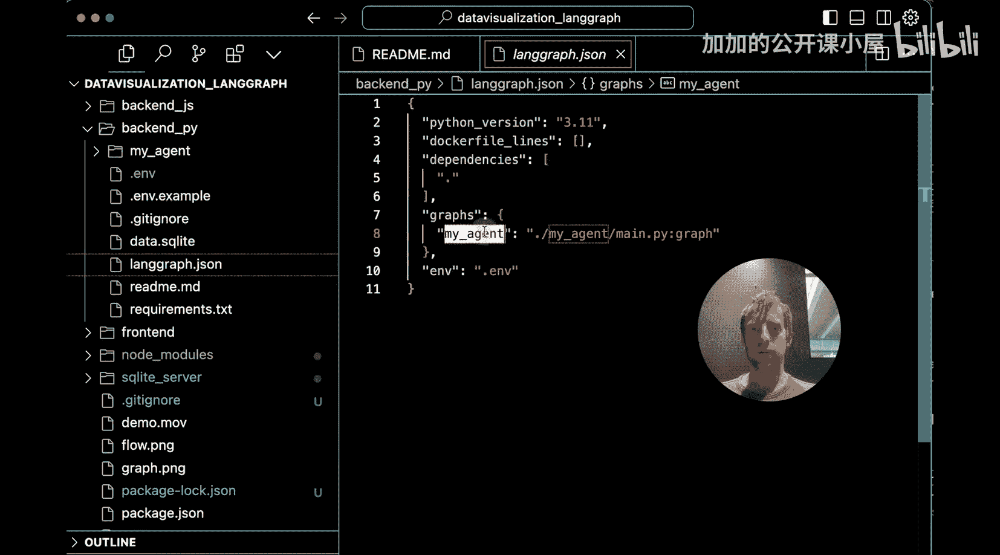

这为我们提供了一种方式来可视化图中正在发生的事情，并实际测试它。让我们展示一个例子。让我们继续重新测试我们在UI中提出的那个问题作为例子。

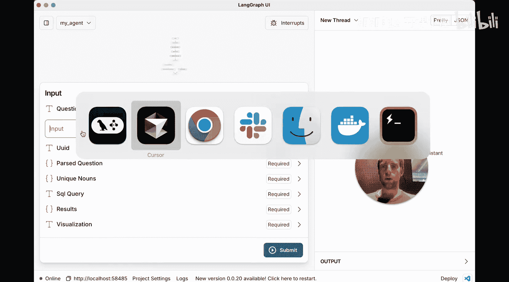

“雄狮队的冲球码数”。

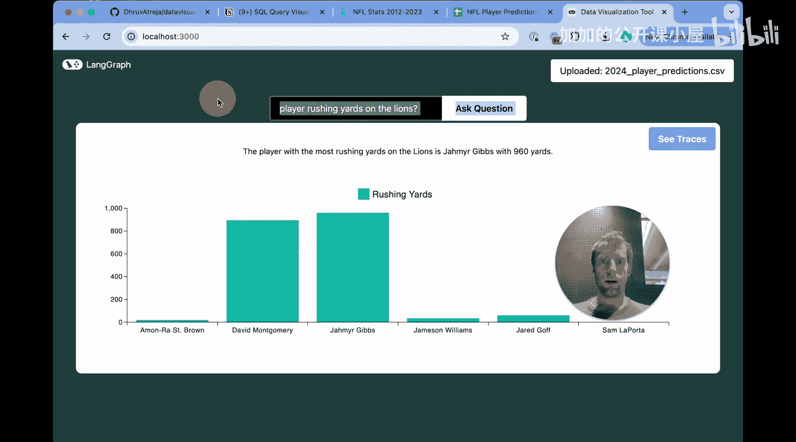

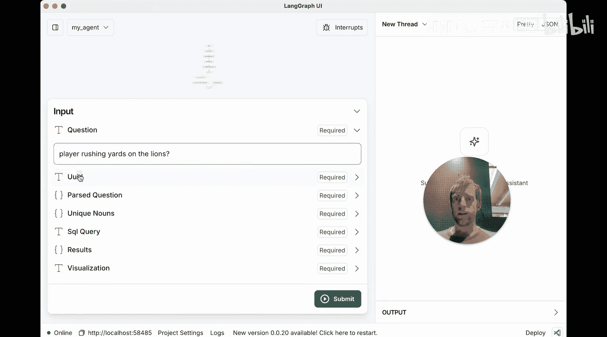

很好。在这个UI中。现在，让我快速展示给你看。我回到代码仓库。

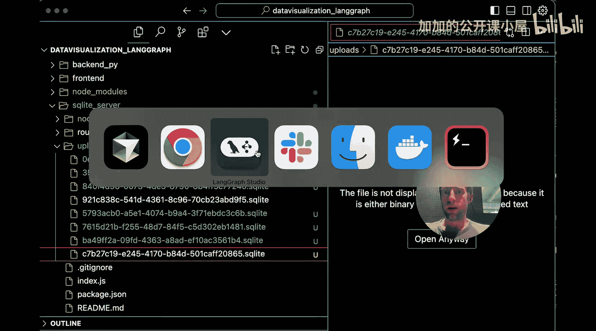

我进入SQLite服务器，转到上传页面，我实际上可以在这里查看已上传的各种文件。你可以看到这些都是我的ID，它们是SQLite数据库。我获取最近的一个。

复制过来，然后我们开始。我只需在这里提供UID。然后我会继续提问，让我们实际看看它的运行。

很好，它正在运行：解析问题、获取唯一名词、生成SQL。很好，我们在这里看到的基本上是后端或SQL智能体的完整端到端运行，以及最终的数据表示就在这里：标签、值和数据，如图所示。这正是在UI中渲染的内容。UI只是从后端（也就是我们的智能体）获取数据，并在前端进行可视化。非常棒。

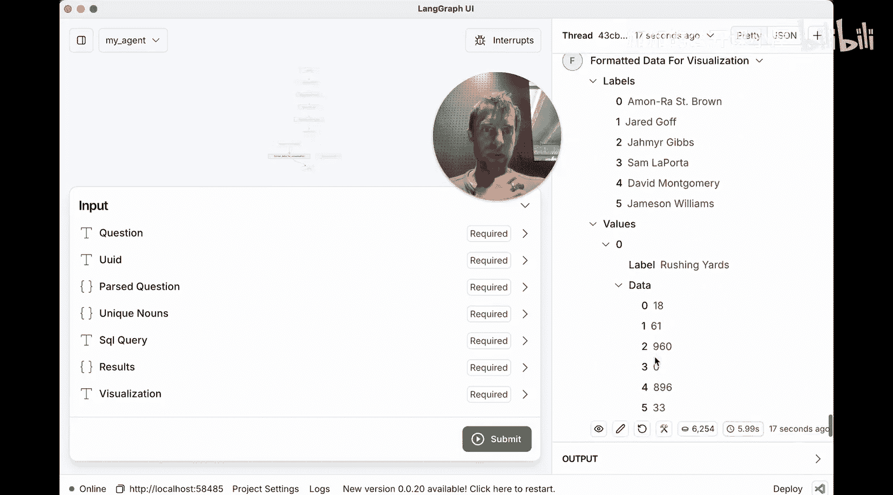

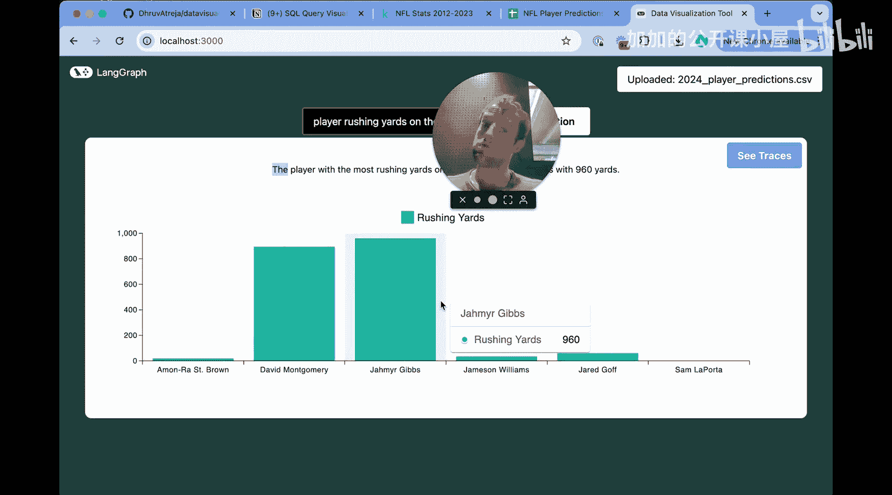

## 深入智能体工作流程

现在，让我们实际谈谈它在底层真正在做什么。这当然是LangGraph Studio的一个很好的用例示例。

这是一个文本转SQL对话流程。它有几个不同的节点。

首先是“解析问题”。它首先查看问题，并确定它是否与表格相关。在这个特定情况下，它判定是相关的。所以表格名在这个案例中是CSV数据。这里是被认为与问题相关的列。我的问题是“雄狮队球员的冲球码数”。所以基本上判定我可能需要的列包括`team`、`player`、`yards`、`rushing_yards`。现在这个“名词”列有点意思，它代表任何非数值数据列，你很快就会明白为什么这很重要。

接下来是“获取唯一名词”。这个我必须深入研究一下，因为它并不明显，但当你思考时，它实际上很直观。事情是这样的：它正在获取这些名词列，并仅仅输出其中的唯一值。所以你可以看到它正在输出所有这些唯一的球员姓名和球队名称。那么，它为什么要这样做呢？

这是文本转SQL中一个非常常见且棘手的问题。注意，我的问题问的是“lions”（雄狮队）。这个文本转SQL过程必须在自然语言输入“lions”和数据库实际存储的球队名称之间进行映射，这两者不会匹配。所以这很聪明。在我的CSV查询中，我用了小写的“lions”，而数据库中的球队名称实际上是三个字母的缩写。所以有趣的是，文本转SQL需要进行这种映射，以表明我实际上指的是，在这个案例中，我相信可能是“DET”代表底特律，它就在这里面，会被输出到某个地方。实际上，你会看到一些很酷的东西，因为所有这些信息都是可访问的。

当我们执行这个SQL查询时，我们做的这个映射非常巧妙，从我传递的内容。

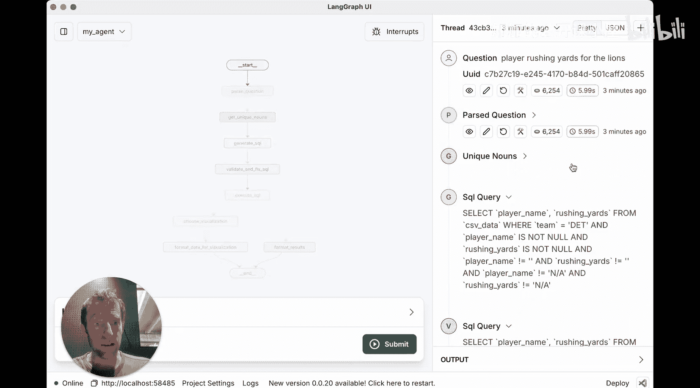

## 总结

在本节课中，我们一起学习了一个结合LangChain、自然语言处理和SQL查询的智能体项目。我们了解了它如何将用户用自然语言提出的问题转换为SQL查询，并自动生成可视化图表。我们探讨了其整体架构，包括SQLite服务器、LangChain智能体逻辑以及前端可视化部分。我们还通过LangGraph Studio深入查看了智能体的工作流程，理解了“解析问题”、“获取唯一名词”和“生成SQL”等关键步骤如何协同工作，解决了自然语言与数据库术语之间的映射难题。这个项目展示了如何利用LangChain构建强大的端到端数据查询与可视化应用。