#  036：LangGraph 数据增强智能体模板 🚀

在本节课中，我们将学习如何使用 LangGraph 的数据增强智能体模板。该模板旨在解决一个常见问题：如何将开放式的、非结构化的研究任务（例如网络搜索）的结果，整理并填充到结构化的输出（如数据库或电子表格）中。我们将通过一个具体的例子，展示如何配置和运行这个智能体，并理解其内部工作原理。

---

## 概述

过去几个月，LangGraph 受到了广泛关注，并且我们发现用户的需求集中在几个常见的使用场景上。因此，我们推出了模板，为这些热门场景提供可以直接使用、轻松扩展和配置的应用程序起点。你无需从零开始构建那些许多人已经构建并配置过的通用功能。

接下来，我将展示其中一个模板，让你了解模板的一般工作原理。

这个特定模板要解决的问题是：**从开放式研究任务中获取结构化结果**。

这是一个常见的需求陈述：我有一个数据库或电子表格，需要用开放式研究的结果来填充。这种研究通常来自网络，但也可能来自其他研究来源。本质上，这是一个将非结构化研究转化为适合 CSV、电子表格或数据库格式的结构化输出的问题。

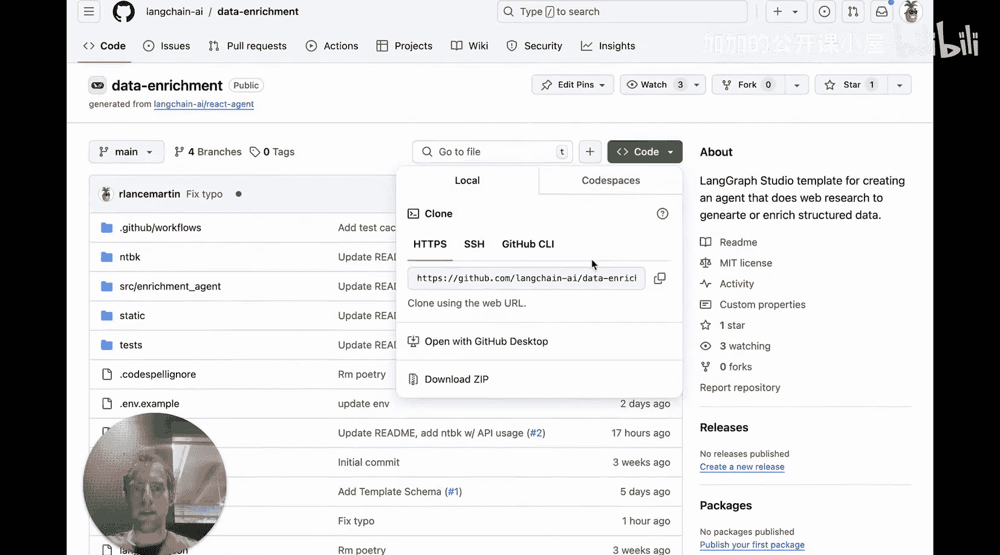

其工作流程是：作为用户，我与智能体交互时，指定一个**主题**和一个**输出模式**。智能体会为我完成所有研究，并按照我指定的模式生成结果。

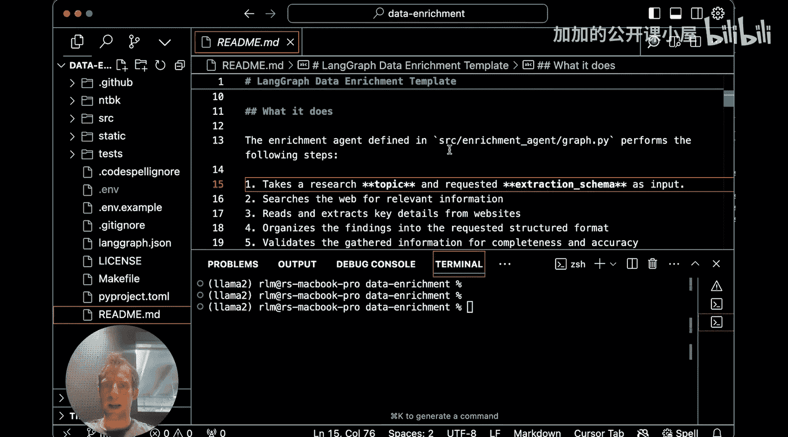

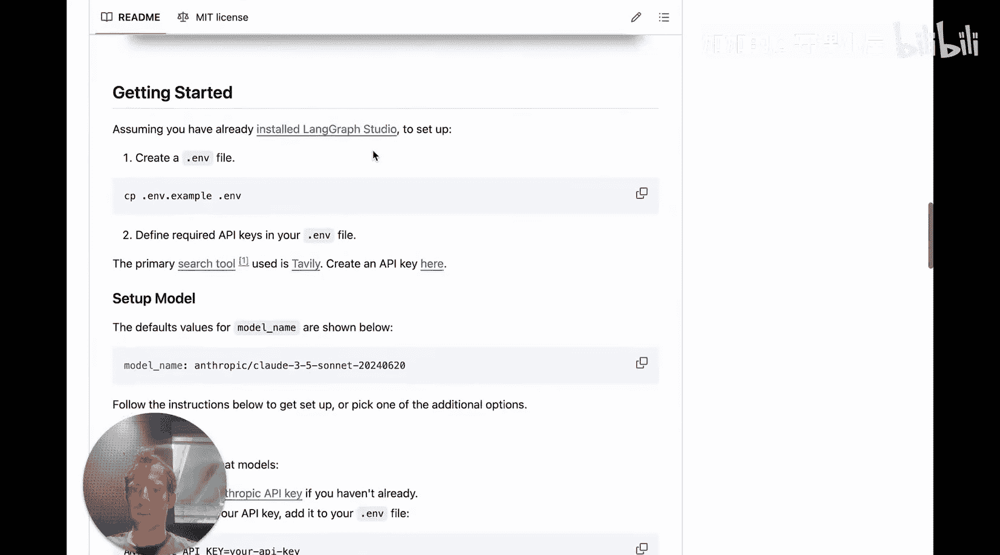

我将快速演示其功能，然后稍后详细讲解细节。

---

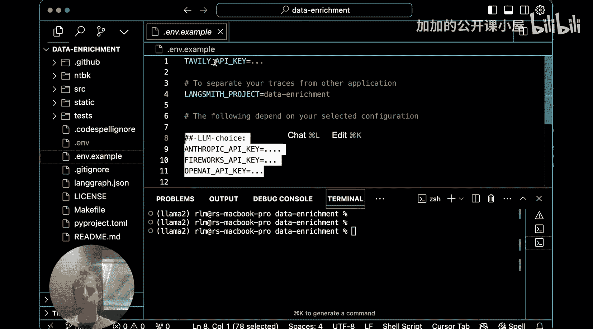

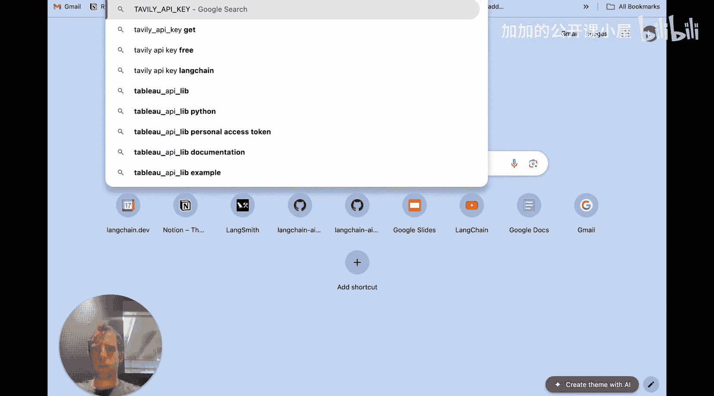

## 快速演示：配置与运行

首先，我需要获取这个模板。我将复制仓库地址并将其克隆到本地。

克隆完成后，我在 IDE 中打开项目。这就是代码和 README 文件。

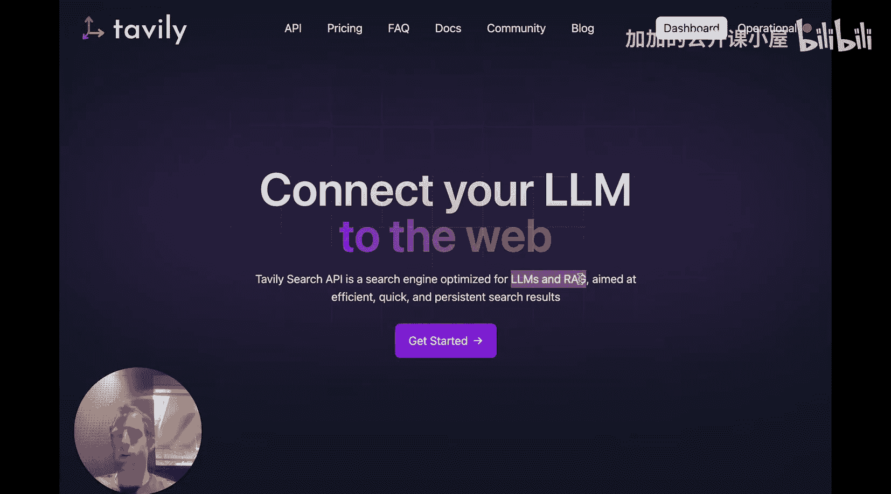

根据 README 的说明，要运行此智能体，首先需要创建一个 `.env` 文件。

回到 README，第一步就是创建这个文件。在示例中，你需要设置几个环境变量：`TAVILY_API_KEY`、`LANGSMITH_PROJECT` 和你的 `LLM` 配置。

那么，这些分别是什么？

1.  **Tavily**：这是一个我非常喜欢的优质网络搜索工具。它是一个为 LLM 或 RAG 设计的搜索 API。它的优点是易于设置、提供慷慨的免费额度，并且效果很好。当然，你也可以轻松配置此模板以使用其他搜索工具，Tavily 只是这里的一个推荐选项。
2.  **LangSmith Project**：这设置了 LangSmith 的项目名称，你所有的智能体运行记录都将日志记录到此项目中。LangSmith 是 LangChain 提供的用于可观测性、追踪、监控和评估的平台。它对于调试和监控智能体行为非常有用。
3.  **LLM Choice**：你可以选择任何你想要的模型。这里默认提供了一些示例配置，但你可以非常轻松地扩展它。

按照说明，我创建了 `.env` 文件。实际上，这就是运行此智能体模板所需的全部配置。

如果你查看 `langgraph.json` 文件，这是 LangGraph Studio 使用的配置文件。LangGraph Studio 是一个用于 LangGraph 的 IDE，它提供了一种非常简便的方式来运行智能体、查看结果并理解智能体的内部行为。

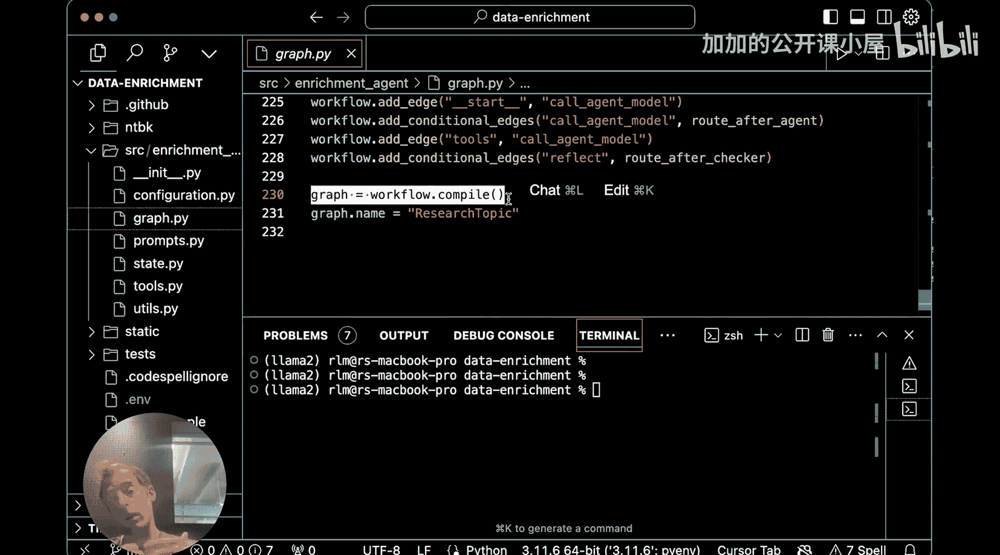

这个配置文件基本上就是命名了一个我想在 LangGraph Studio 中打开的图，并指定了已编译图源文件的路径。`src/enrichment_agent/graph.py` 就是原始的已编译图。

这非常方便，我们只需要这些就能在 Studio 中启动并运行。

现在，我打开了 Studio。我打开包含模板的目录，可以看到 `langgraph.json` 文件，`.env` 文件也在这里。我点击“打开”。

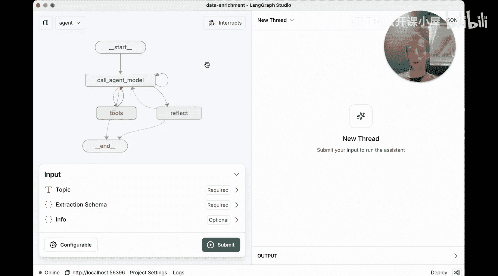

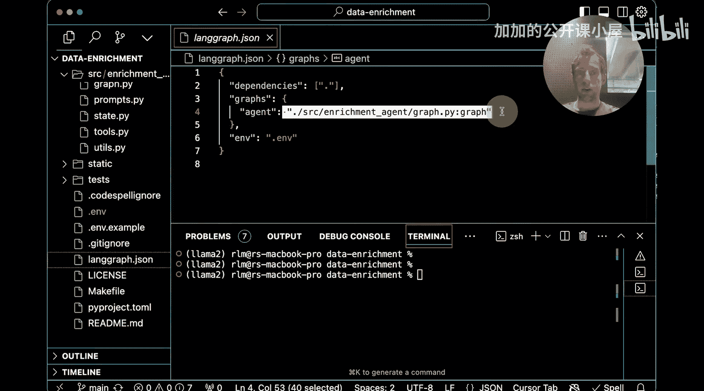

加载图后，我们看到它被命名为“agent”，这来自 `langgraph.json` 配置文件。我们命名了这个图，并给出了编译图的位置。这就是我们的图，它有一个很好的可视化界面，显示了节点和边。

你可以看到，我们可以轻松地输入两样东西：**主题** 和 **提取模式**。

我们还有一个“可配置”区域，允许我们输入许多不同的参数，例如最大循环次数、搜索结果数量、模型名称、提示词等。我们稍后会讨论这些含义。现在我先不调整它们，只想展示所有配置项都在这里，你可以轻松配置图的功能。这里也是你输入参数的地方。

现在，让我们回到 README，看看一些可用于研究任务的示例输入。

我对“LM 训练”感兴趣，我想了解 LM 训练的前五大芯片提供商。我将此作为我的主题。

这就是我指定提取模式的地方。这很有趣，提取模式就是一个 JSON 对象。只要它是有效的 JSON，我们就可以使用它。

现在，让我们运行它。回顾一下我们做了什么？我们所做的就是创建了包含我的 Tavily API 密钥以及我想要使用的模型 API 密钥的 `.env` 文件。这就是你需要做的全部。我在 Studio 中打开了它，然后点击运行。

智能体正在运行。很好，运行完成了。现在，我向你展示 Studio 中一个非常酷的功能：我可以向下滚动，实际上可以逐步查看我的智能体运行的整个过程。我可以看到每一步：调用了工具，返回了特定工具调用的所有结果，返回给模型，最后进入反思步骤，再回到调用，再到智能体模型，最终反思，然后我们得到了一个好结果。

我们稍后将更详细地讲解每个节点在做什么，但这是一种浏览智能体轨迹、了解发生的一切的绝佳方式。这非常酷。

现在，我们也可以看到研究过程的结果。你可以看到我们有一个公司列表。例如 NVIDIA，它给出了未来展望、关键优势、市场份额、名称、技术等信息。这很酷。这些都是我们在提取模式中为列表中的每个公司指定的内容。

这就是当你运行智能体时得到的结果。我们在 IDE LangGraph Studio 中运行了它，这提供了一个非常好的方式来浏览智能体的完整轨迹、它做了什么以及我们得到了什么。

这实际上就是如何使用这个智能体。现在，我们可以更进一步，深入了解它在底层实际做了什么。

---

## 深入理解：代码与节点解析

为了理解其底层原理，我想先在 Studio 中逐步查看每个步骤，然后对照代码相应地解释代码中发生了什么。

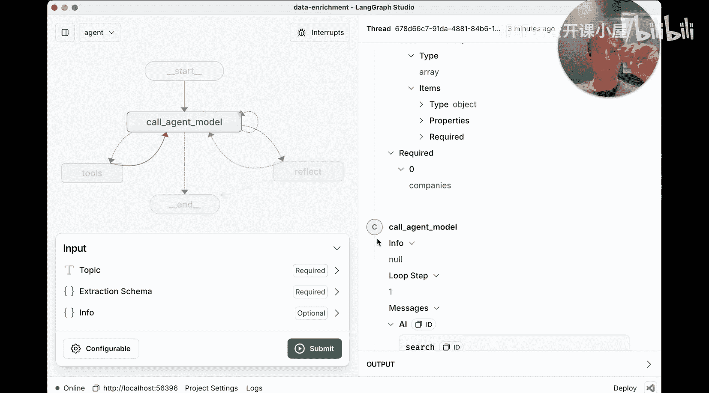

我们从提供的输入开始：主题“LM 训练的前五大芯片提供商”和我们关心的模式。

然后，我们进入了“调用智能体模型”节点。现在，有趣的部分开始了。让我们看看代码。

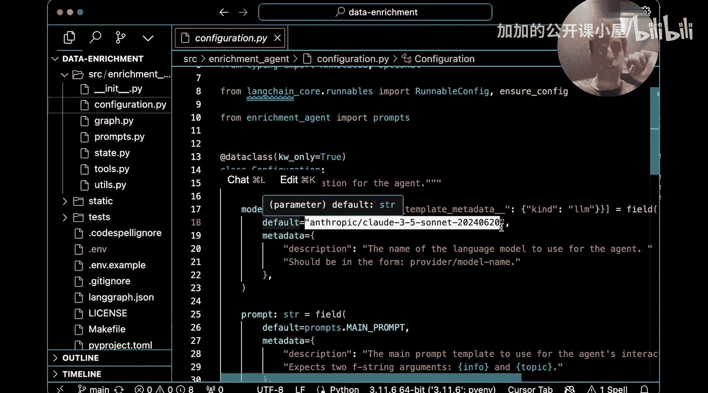

“调用智能体模型”在 `graph.py` 中定义。关键直觉是：这个智能体基本上就是我们初始定义的 LLM。默认情况下，查看 `config.py`，LLM 的默认配置是 Anthropic 模型。我们在 `.env` 文件中设置了 API 密钥，可以无障碍地使用 Anthropic。在我们的“可配置”区域，你也可以更改模型名称，README 也讨论了你可以选择的其他模型。这让你了解我们已经设置了我们的 LLM。

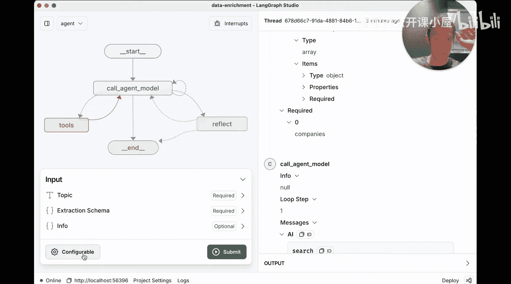

在 `graph.py` 中，我们获取那个 LLM 并绑定了几个不同的工具。关键点在于，我们绑定了工具：`search`、`info_tool`、`scrape_website`。

那么，这些是什么？
如果你打开 `tools.py`，你可以看到其中两个工具的定义。
1.  **`search`**：这就是我们之前讨论过的 Tavily。这是一个非常好的搜索工具。基本上，它会调用 Tavily，返回与所提问题相关的一系列网站摘要。
2.  **`scrape_website`**：这个工具会获取一个 URL，并实际抓取网站的内容。它会爬取网站，格式化结果，并可以看到这些信息被填入我们指定的模式中。所以，它基本上是爬取整个网站并将结果提取到我们期望的模式中。这是第二个工具。
3.  **`info_tool`**：这是我们在节点定义中实际定义的第三个工具。这实际上是我们研究过程的最终结果。它将在我们收集了所有相关信息后被调用，基本上就像一个结构化输出工具，以期望的模式产生最终输出。这就是 `info_tool` 的作用。

所以，本质上，我们有一个通过配置初始化的聊天模型。我们绑定了这三个工具，并让它在循环中调用工具。

---

## 总结

本节课中，我们一起学习了 LangGraph 的数据增强智能体模板。我们了解了该模板旨在解决从非结构化研究生成结构化输出的核心问题。通过实际操作，我们完成了从克隆模板、配置环境变量（包括搜索工具 Tavily 和 LangSmith 项目），到在 LangGraph Studio 中运行和调试智能体的全过程。

我们深入探讨了智能体的核心组件：一个绑定了搜索 (`search`)、网站抓取 (`scrape_website`) 和最终信息整合 (`info_tool`) 等工具的 LLM。智能体通过循环调用这些工具，执行研究任务，并最终按照用户定义的 JSON 模式输出结构化的结果。

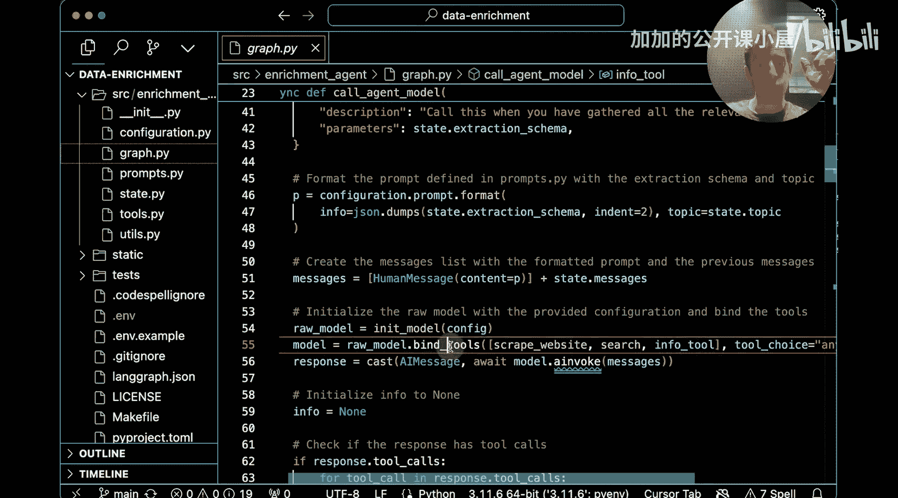

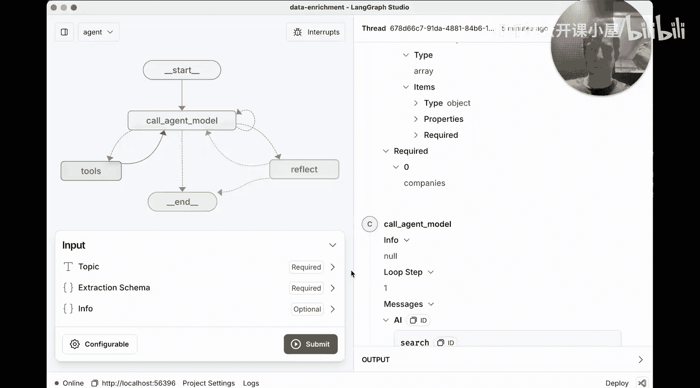

这个模板提供了一个强大的起点，你可以基于它轻松扩展，修改搜索工具、LLM 模型或输出模式，以适应你特定的数据增强和研究需求。利用 LangGraph Studio 的可视化调试功能，你可以清晰地洞察智能体的每一步决策和行动，从而更好地优化和定制你的智能体应用。