#  037：LangGraph Assistants 🧠

在本节课中，我们将学习如何使用 LangGraph Studio 来协作构建和迭代基于大语言模型（LLM）的智能体应用。我们将了解如何为同一个底层“图”（信息架构）创建多个不同的“助手”，以及如何为每个助手管理多个“版本”。

## 概述：图、助手与版本

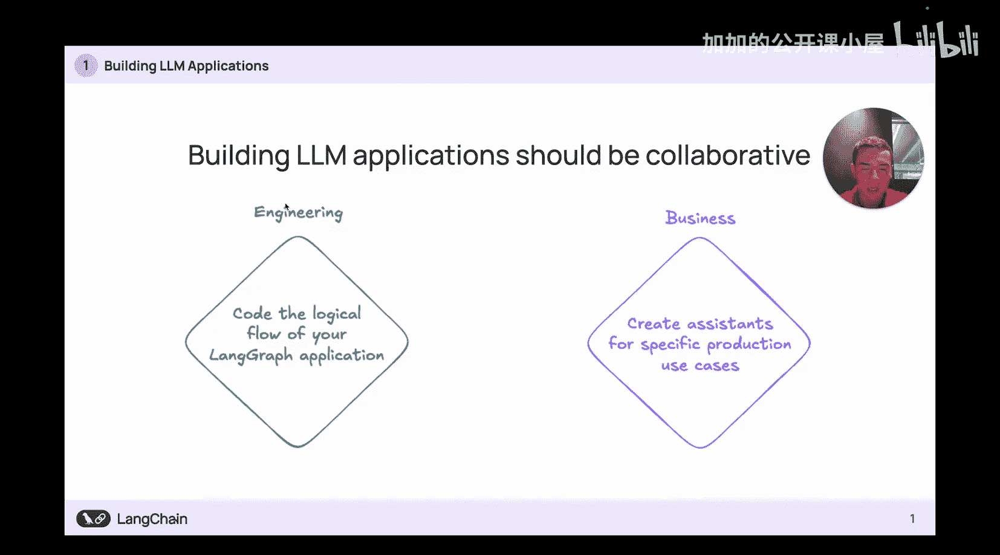

在深入细节之前，让我们先理解几个核心概念。一个 **图（Graph）** 定义了智能体的信息处理流程，它由开发者使用 LangGraph 库（Python 或 JavaScript）编写，是应用的基础架构。


基于同一个图，我们可以创建多个 **助手（Assistant）**。每个助手代表对图的一种核心配置，例如更换底层的大语言模型（LLM）或为其提供不同的工具。

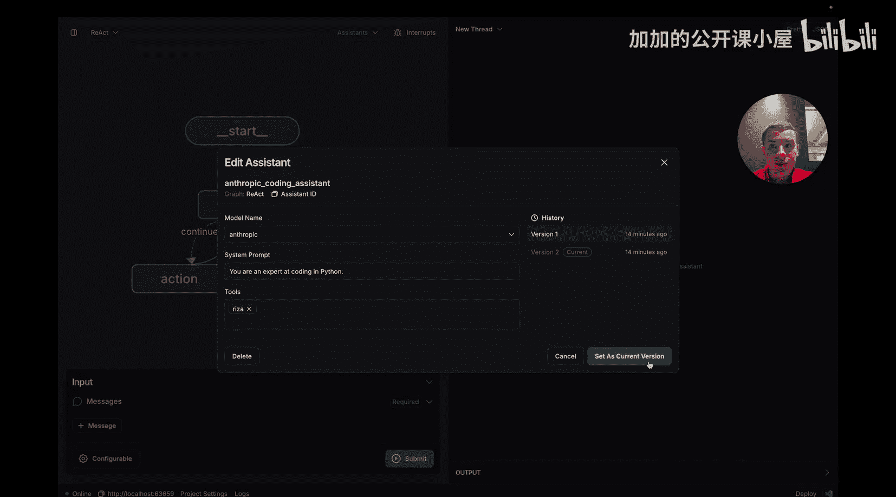

对于每个助手，我们还可以创建多个 **版本（Version）**。版本允许我们对助手进行更精细的调整，例如修改系统提示词，使其行为更符合特定用户或场景的需求。

上一节我们介绍了核心概念，本节中我们来看看 LangGraph Studio 如何让开发者和业务人员无需编写代码，就能直观地创建和管理这些助手与版本。

## 在 Studio 中探索预建助手

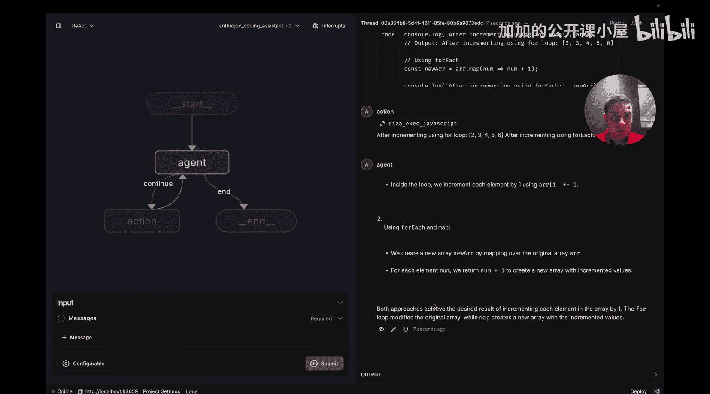

假设我们已经用 LangGraph 库编写了一个简单的 ReAct 智能体图。现在，我们想为这个图创建两个不同的助手：一个编程助手和一个情绪鼓励助手。

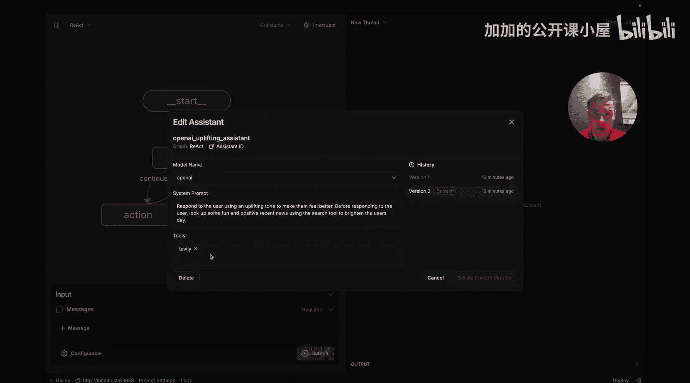

以下是操作步骤概览：

1.  **查看现有助手与图**：在 Studio 左侧可以看到已创建的 ReAct 图。点击助手下拉菜单，可以看到为该图创建的两个助手。
    
    
    
2.  **编辑与切换助手版本**：
    *   点击“编辑助手”按钮，可以查看该助手的配置和历史版本。
    *   例如，“Anthropic 编程助手”的系统提示词设定它为 JavaScript 专家，并拥有 `ReAct Code Interpreter` 工具来安全运行代码。
    *   在版本历史中，`V1` 是一个擅长 Python 的助手。我们可以点击“设为当前版本”来切换到 `V1`。
        
        
        
        
3.  **测试不同版本的助手**：
    *   切换后，顶部下拉菜单会显示“Anthropic 编程助手 V1”已被选中。
    *   我们可以提问：“如何遍历数组并将每个元素加一？”。助手会使用 Python 写出正确代码并解释。
    *   新建一个对话线程，切换到 `V2` 版本（JavaScript 专家）并提问同样问题，验证其是否使用 JavaScript 作答。
4.  **测试另一个助手**：
    *   切换到“OpenAI 鼓励助手”。其 `V2` 版本的系统提示词要求它以积极口吻回应，并可以使用 `Tavily Search` 工具搜索网络上的正面新闻。
    *   提问一个情绪低落用户可能问的问题，例如“我今天过得很糟”。助手会使用搜索工具查找正面新闻，并以鼓舞人心的语气回应。
    *   新建对话，切换到没有搜索工具的 `V1` 版本提问同样问题，它将仅用积极语气回应，而无法提供具体新闻。
        
        
        
        

## 理解助手与版本的关系

现在我们已经看到了助手在 Studio 中的运作方式，让我们回头更清晰地阐述版本和助手与你的 LangGraph 应用之间的关系。

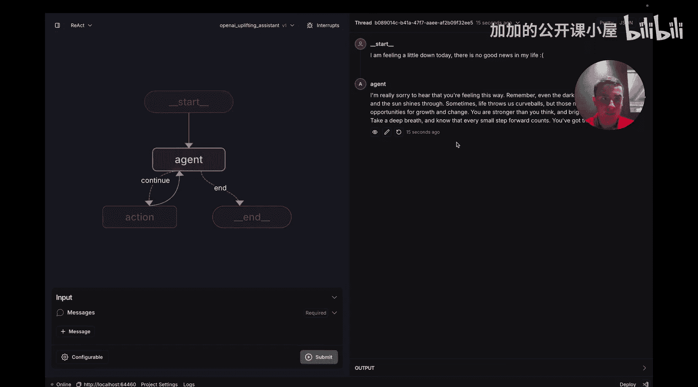


*   **图（Graph）**：这是由开发者编码实现的**信息架构**，控制信息在智能体中的流动。它通过 `langgraph` 库以代码形式定义。
*   **助手（Assistant）**：可以看作是对图的**核心配置变更**。例如：
    *   更换驱动图的 **LLM**（如从 OpenAI 换为 Anthropic）。
    *   为图提供不同的**工具**（如添加或移除搜索工具）。
    *   业务人员和开发者无需修改底层代码即可创建和迭代助手。
*   **版本（Version）**：这是更细粒度的调整层，应有**特定目标**。例如，为某个用户定制助手。可以通过持续修改**系统提示词**来实现，使智能体的回应更符合用户的期望。

上一节我们厘清了概念关系，本节中我们将回到 Studio，从头开始创建自己的助手和版本。

## 从零开始创建助手与版本

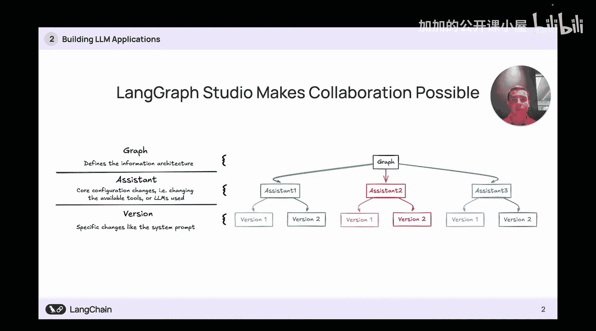


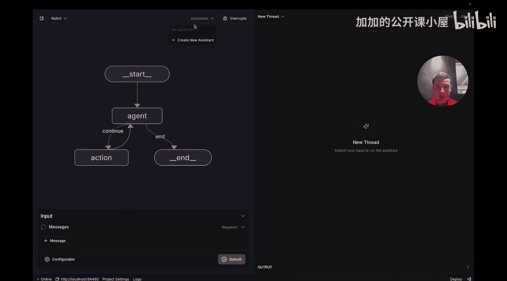

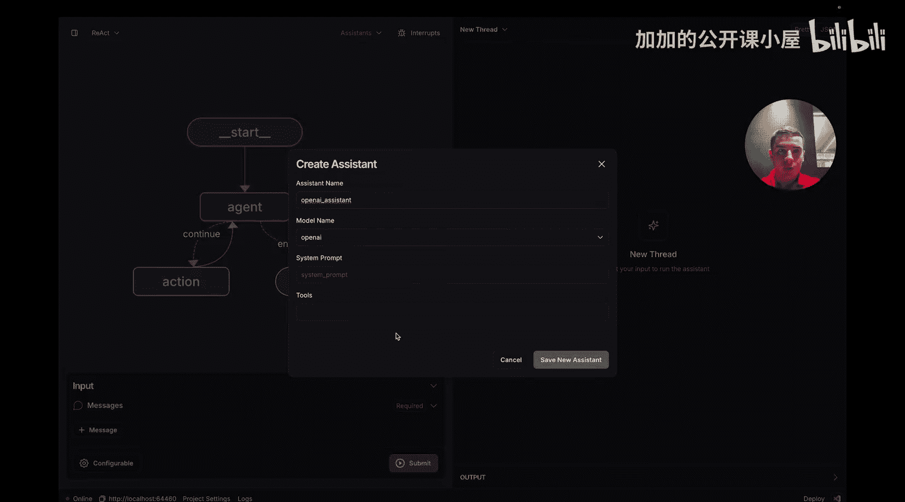

1.  **创建新助手**：
    *   在助手下拉菜单中点击“创建新助手”。
        
        
        
    *   将其命名为“OpenAI 助手”，选择 OpenAI 模型，暂不设置系统提示词或工具，点击“保存新助手”。
        
        
        
    *   此时下拉菜单中会显示“OpenAI 助手 V1”。
2.  **为助手添加新版本**：
    *   点击“编辑助手”按钮。
        
        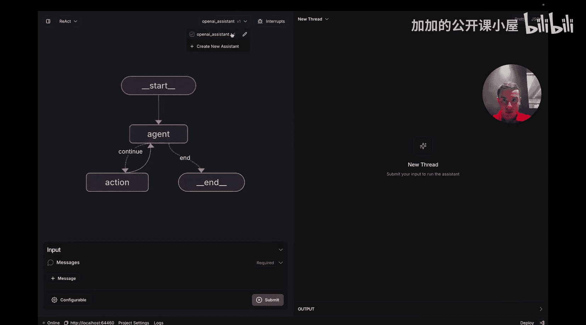
        
    *   输入系统提示词，例如“你是一个乐于助人的助手”。
    *   点击“另存为新版本”。顶部下拉菜单会从 `V1` 变为 `V2`。
        
        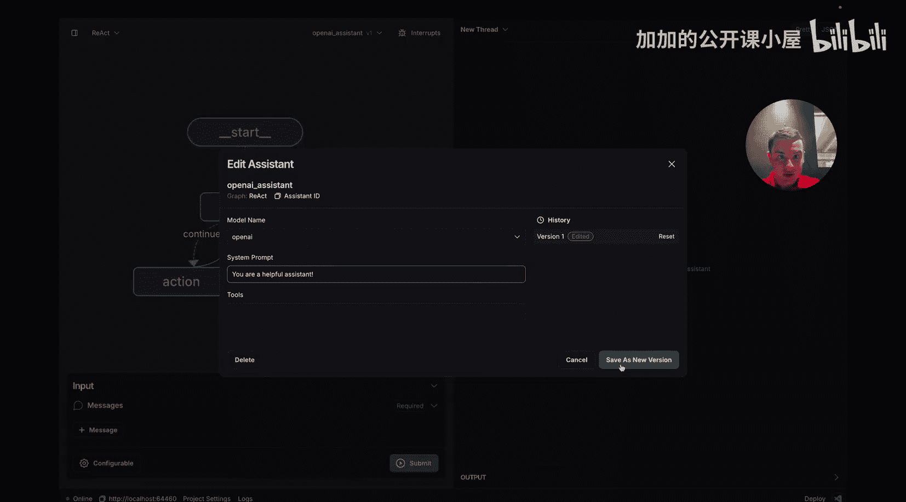
        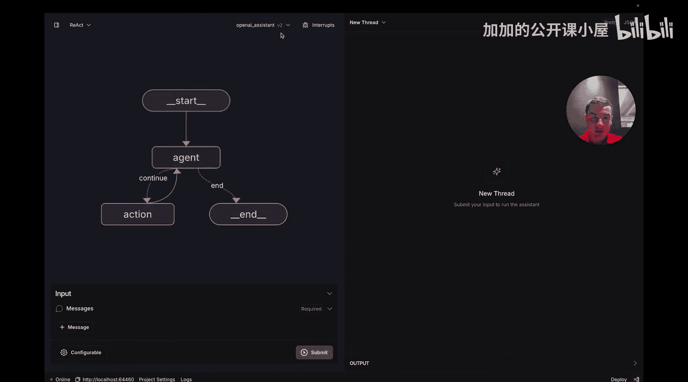
        
    *   在编辑面板中点击不同版本，左侧配置信息会相应更新。
    *   要回退到 `V1`，只需点击 `V1` 然后点击“设为当前版本”。
        
        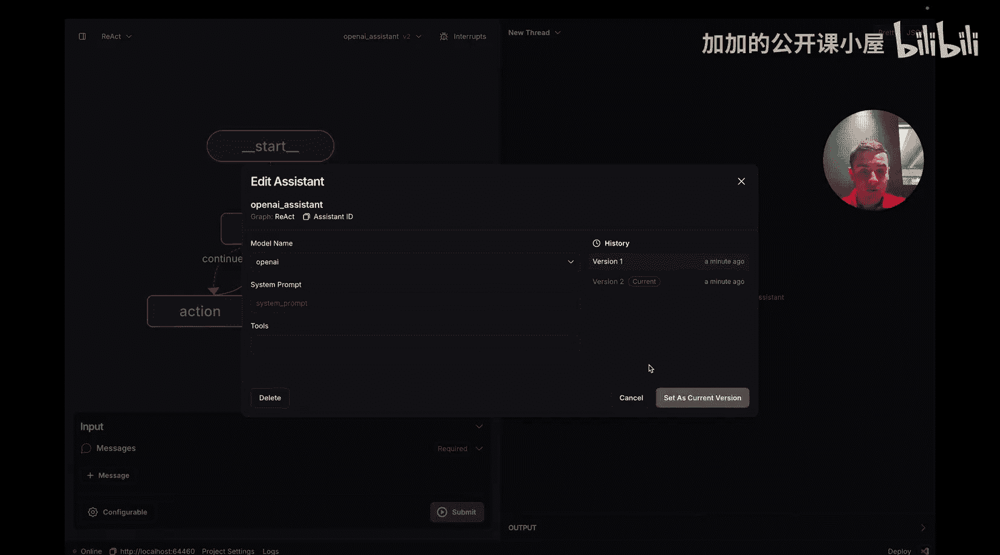
        
3.  **创建第二个助手**：
    *   再次点击“创建新助手”。
        
        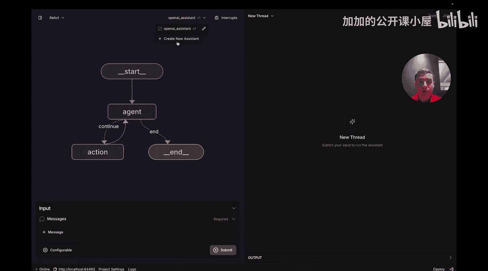
        
    *   命名为“Anthropic 助手”，选择 Anthropic 模型，并为其添加 `Tavily Search` 工具。
    *   保存后，下拉菜单中会选中“Anthropic 助手 V1”。使用旁边的复选框可以快速在 Studio 中切换当前使用的助手。
        
        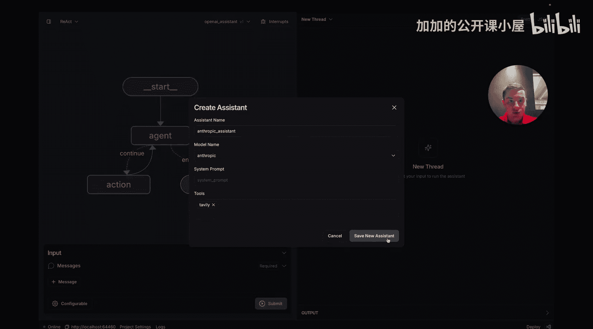
        
4.  **删除助手**：
    *   点击“编辑助手”并选择“删除”。**注意：删除操作会删除该助手的全部版本**，因为所有版本都指向同一个助手 ID。
        
        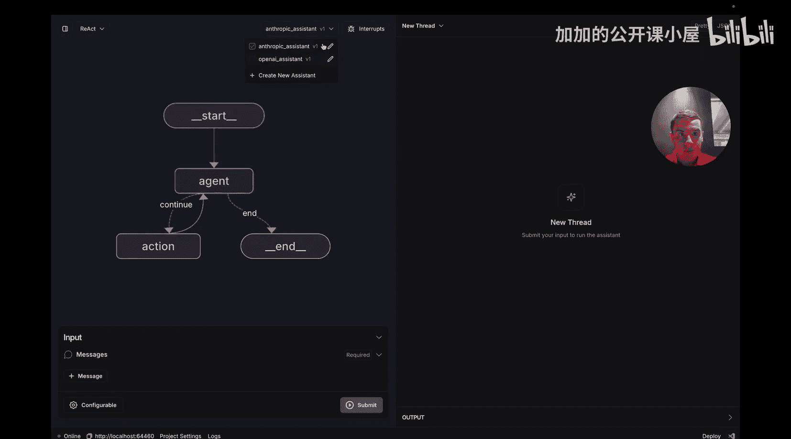
        
    *   删除后，下拉菜单中将不再显示该助手。
        
        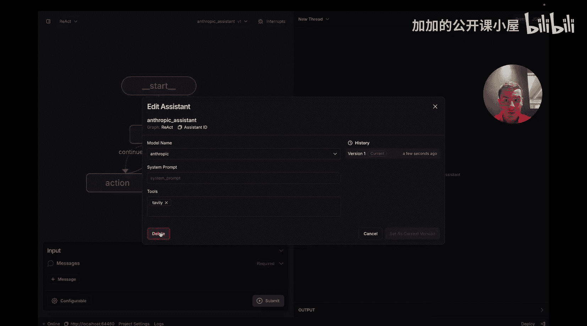
        
5.  **验证配置**：
    *   对“OpenAI 助手”提问：“谁创造了你？”。它会正确回答由 OpenAI 创建，验证了前端配置已生效。


## 通过 SDK 管理助手（可选）


除了 Studio 界面，你也可以通过 SDK 以编程方式管理助手。以下是在 Python SDK 中的示例（JavaScript SDK 功能类似）：


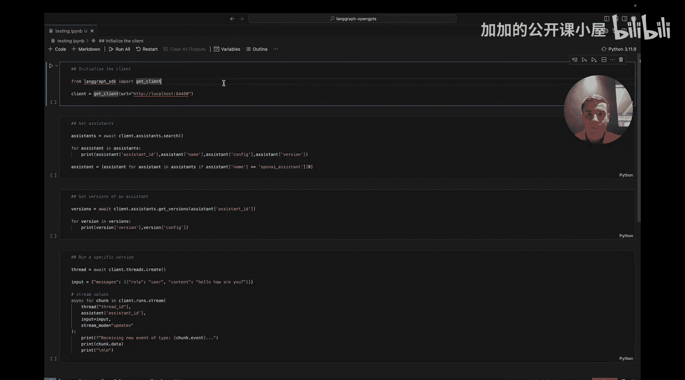


```python
# 示例：使用 Python SDK 创建助手（伪代码示意）
from langgraph_sdk import Client


client = Client()


# 为特定图创建新助手
new_assistant = client.assistants.create(
    graph_id="your_graph_id",
    name="我的 SDK 助手",
    config={
        "llm": "openai:gpt-4",
        "system_prompt": "你是一个有用的助手。",
        "tools": ["tool_a", "tool_b"]
    }
)


# 创建该助手的新版本
new_version = client.assistants.versions.create(
    assistant_id=new_assistant.id,
    config={
        "system_prompt": "你是一个专门回答编程问题的助手。"
    }
)
```

## 总结

本节课中我们一起学习了如何使用 LangGraph Studio 来协作构建 LLM 应用。

*   **图**是底层的信息架构，由代码定义。
*   **助手**是在不修改代码的前提下，对图进行核心配置（如 LLM、工具）的方式。
*   **版本**允许对助手进行微调（如修改提示词），以精确满足特定需求。


LangGraph Studio 使开发者和业务人员能够通过直观界面，快速迭代和测试智能体的核心配置，包括系统提示词、可用工具、底层 LLM 等。这个工具旨在帮助你微调智能体，直至达到可投入生产的状态。它允许你创建针对不同用户的多样化助手，并通过版本控制精确打磨每个助手的行为。所有这些都可以在 Studio 中无需编码完成，同时也支持通过 SDK 进行编程管理。