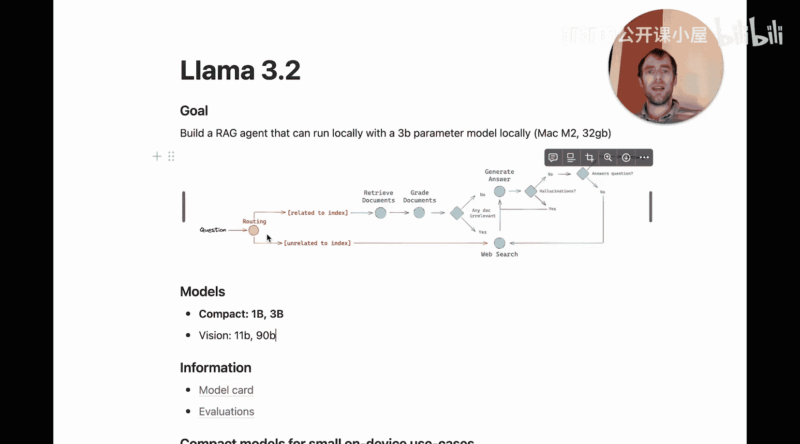
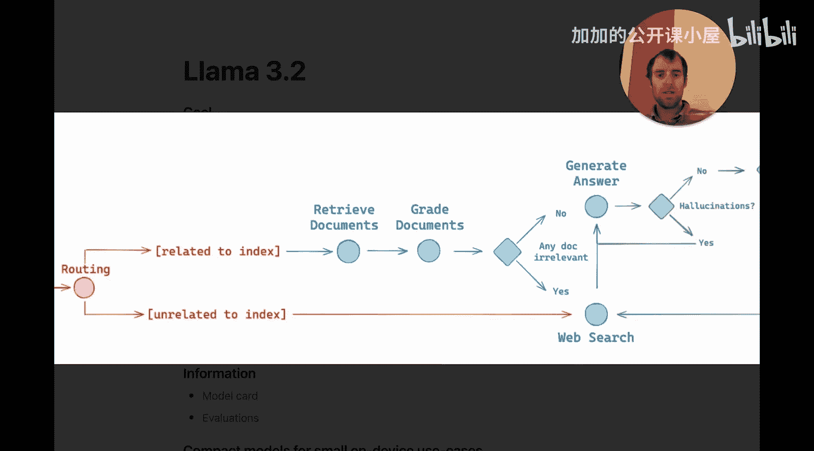
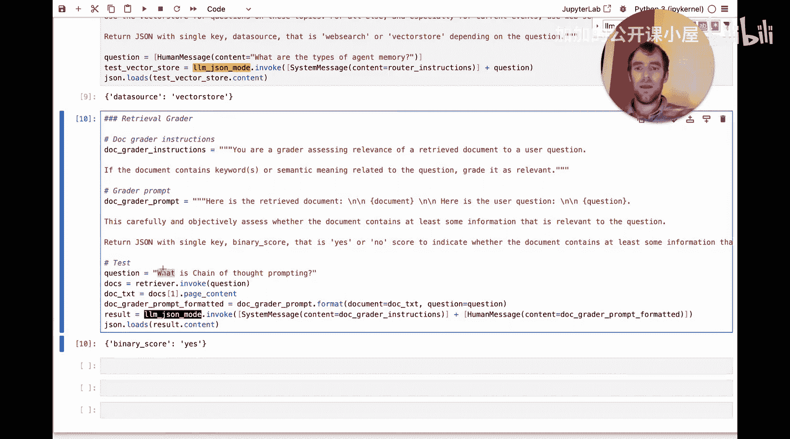

#  038：使用 LLaMA3.2-3b 构建可靠、完全本地的 RAG 代理

## 概述
在本节课中，我们将学习如何从零开始，使用一个仅30亿参数的模型（LLaMA 3.2-3B），在本地笔记本电脑上构建一个相当复杂的检索增强生成（RAG）代理。这个代理能够处理用户问题，根据内容将其路由到向量数据库或网络搜索，并对检索到的文档和生成的答案进行质量评估。

## 模型介绍与准备
Meta 近期发布了 LLaMA 3.2 模型。令人兴奋的是，我们可以使用越来越小的模型在本地设备上完成有趣的任务。我们将使用其30亿参数的紧凑模型版本。数据显示，这个30亿参数模型在某些评估上的表现接近之前的80亿参数模型，这表明小型模型的能力正在快速提升。





为了开始构建，我们需要进行一些环境准备。

以下是需要安装的核心库：
```python
# 安装必要的Python包
pip install langchain langchain-community tiktoken chromadb litsmith
```

我们将使用以下工具：
1.  **Ollama**：用于在本地运行 LLaMA 3.2-3B 模型。访问 Ollama 官网，使用命令 `ollama pull llama3.2:3b` 下载模型。
2.  **Tavily**：用于网络搜索的搜索引擎，为RAG和代理用例优化，提供免费的API额度。
3.  **Litsmith**（可选）：用于追踪和可视化代理的运行过程。

## 第一步：初始化语言模型
首先，我们需要加载本地的语言模型。我们将使用 LangChain 与 Ollama 的集成。

```python
from langchain_community.llms import Ollama

# 指定我们通过Ollama下载的模型名称
model_name = "llama3.2:3b"
# 加载标准模型
llm = Ollama(model=model_name)
# 加载支持JSON输出模式的模型，这在后续构建路由和评估器时会用到
llm_json = Ollama(model=model_name, format="json")
```
我们加载了两个模型实例：一个标准模型 `llm` 和一个强制JSON输出格式的模型 `llm_json`。JSON模式对于让模型返回结构化数据至关重要。

## 第二步：构建向量存储与检索器
RAG系统的核心之一是能够从知识库中检索相关文档。接下来，我们构建一个本地的向量数据库。

```python
from langchain_community.document_loaders import WebBaseLoader
from langchain.text_splitter import RecursiveCharacterTextSplitter
from langchain_community.embeddings import HuggingFaceEmbeddings
from langchain_community.vectorstores import SKLearnVectorStore

# 1. 加载文档（这里以博客文章URL为例）
urls = ["https://example.com/blog1", "https://example.com/blog2", "https://example.com/blog3"]
docs = []
for url in urls:
    loader = WebBaseLoader(url)
    docs.extend(loader.load())

# 2. 分割文档成块
text_splitter = RecursiveCharacterTextSplitter(chunk_size=100, chunk_overlap=20)
doc_splits = text_splitter.split_documents(docs)

# 3. 使用本地嵌入模型
embeddings = HuggingFaceEmbeddings(model_name="nomic-ai/nomic-embed-text-v1")

# 4. 创建向量存储
vectorstore = SKLearnVectorStore.from_documents(doc_splits, embeddings)

# 5. 创建检索器
retriever = vectorstore.as_retriever()
```
现在，我们可以测试检索器。例如，查询“智能体记忆”：
```python
retrieved_docs = retriever.invoke("agent memory")
print(retrieved_docs[0].page_content[:200]) # 打印第一段的前200个字符
```
检索器会将查询语句进行向量化，然后在向量数据库中进行语义相似度搜索，返回最相关的文档片段。

## 第三步：构建查询路由器
我们的代理需要判断一个问题应该使用本地向量数据库回答，还是需要求助网络搜索。这就是路由功能。

上一节我们构建了知识库检索器，本节中我们来看看如何让模型智能地决定使用哪个数据源。

```python
from langchain_core.messages import SystemMessage, HumanMessage

# 定义路由指令
router_instructions = SystemMessage(content="""
你是一个专家路由器。
向量数据库中包含与智能体、提示工程和对抗性测试相关的文档。
对于这些主题的问题，请使用向量数据库。
对于其他所有问题，特别是当前事件，请使用网络搜索。
请返回一个JSON对象，包含一个键“data_source”，其值为“vector_store”或“web_search”。
""")

def route_query(question: str):
    # 构建消息列表
    messages = [
        router_instructions,
        HumanMessage(content=question)
    ]
    # 调用支持JSON模式的模型
    response = llm_json.invoke(messages)
    return response
```
让我们测试一下：
```python
# 测试一个属于知识库范围的问题
result1 = route_query("什么是思维链提示？")
print(result1) # 预期输出: {"data_source": "vector_store"}

# 测试一个需要网络搜索的问题
result2 = route_query("今天纽约的天气怎么样？")
print(result2) # 预期输出: {"data_source": "web_search"}
```
通过结合系统指令和模型的JSON输出模式，我们轻松创建了一个能进行逻辑判断的路由器。

## 第四步：构建文档相关性评估器
即使检索到了文档，也可能存在不相关的结果。我们需要一个“评估器”来过滤掉这些无关信息。

以下是评估文档是否与问题相关的步骤：
1.  我们将问题和检索到的一个文档传递给模型。
2.  模型根据指令判断该文档是否包含与问题相关的关键词或语义含义。
3.  模型返回一个简单的JSON评分。

```python
# 定义评估器指令
grader_instructions = SystemMessage(content="""
你是一个文档相关性评估器。
如果文档包含与问题相关的关键词或语义含义，则评为相关。
请仔细思考，并返回一个JSON对象，包含一个键“score”，其值为“yes”或“no”。
""")

def grade_document(question: str, document: str):
    # 格式化输入内容
    human_message_content = f"问题：{question}\n文档：{document}"
    messages = [
        grader_instructions,
        HumanMessage(content=human_message_content)
    ]
    # 调用支持JSON模式的模型进行评估
    response = llm_json.invoke(messages)
    return response
```
现在，我们可以对检索到的文档进行评分：
```python
# 先检索文档
question = “什么是思维链提示？”
retrieved_docs = retriever.invoke(question)

# 对第一个检索结果进行评估
first_doc = retrieved_docs[0].page_content
grade_result = grade_document(question, first_doc)
print(f"文档评分：{grade_result}") # 预期输出: {"score": "yes"}
```
这个评估步骤为我们的RAG系统增加了一层质量保证，可以过滤掉低相关性的检索结果。

## 第五步：构建答案幻觉评估器
生成式模型有时会产生“幻觉”，即编造看似合理但不真实的信息。我们需要评估生成的答案是否基于给定的文档。

以下是评估答案是否存在幻觉的步骤：
1.  我们将问题、参考文档和生成的答案传递给模型。
2.  模型判断答案中的陈述是否都能从文档中得到支持。
3.  模型返回一个JSON评分，指出答案是否基于给定文档。

```python
# 定义幻觉评估指令
hallucination_grader_instructions = SystemMessage(content="""
你是一个答案真实性评估器。
判断答案中的陈述是否都能从给定的文档中得到支持。
如果答案完全基于文档，没有添加外部信息或编造内容，则评为“yes”。
否则评为“no”。
请返回一个JSON对象，包含一个键“score”，其值为“yes”或“no”。
""")

def grade_for_hallucination(question: str, document: str, answer: str):
    human_message_content = f"问题：{question}\n文档：{document}\n答案：{answer}"
    messages = [
        hallucination_grader_instructions,
        HumanMessage(content=human_message_content)
    ]
    response = llm_json.invoke(messages)
    return response
```

## 第六步：构建答案相关性评估器
最后，我们还需要确保生成的答案确实回答了原始问题，而不是答非所问。

以下是评估答案是否切题的步骤：
1.  我们将问题和答案传递给模型。
2.  模型判断答案是否直接、有效地解决了问题。
3.  模型返回一个JSON评分。

```python
# 定义答案相关性评估指令
answer_grader_instructions = SystemMessage(content="""
你是一个答案相关性评估器。
判断给定的答案是否直接、有效地解决了问题。
如果是，则评为“yes”。
如果答案不相关、不完整或回避问题，则评为“no”。
请返回一个JSON对象，包含一个键“score”，其值为“yes”或“no”。
""")

def grade_answer_relevance(question: str, answer: str):
    human_message_content = f"问题：{question}\n答案：{answer}"
    messages = [
        answer_grader_instructions,
        HumanMessage(content=human_message_content)
    ]
    response = llm_json.invoke(messages)
    return response
```

## 整合：构建完整的RAG代理工作流
现在，我们已经拥有了所有核心组件：检索器、路由器、文档评估器、幻觉评估器和答案相关性评估器。让我们将它们组合成一个完整的工作流。

以下是完整RAG代理的工作流程：
1.  **路由**：接收用户问题，决定使用`vector_store`还是`web_search`。
2.  **检索**：根据路由结果，从相应数据源获取信息（文档或网络摘要）。
3.  **文档评估**：对检索到的内容进行相关性过滤。
4.  **生成**：结合问题和相关文档，生成初步答案。
5.  **幻觉评估**：检查答案是否基于提供的文档。
6.  **答案评估**：检查答案是否切题。
7.  **返回**：如果所有评估通过，则返回答案；否则，返回“无法回答”或触发重试/回退逻辑。

```python
def rag_agent_workflow(question: str):
    print(f"处理问题: {question}")

    # 1. 路由
    route = route_query(question)
    data_source = route.get("data_source")
    print(f"路由决定: 使用 {data_source}")

    # 2. 检索
    if data_source == "vector_store":
        retrieved_items = retriever.invoke(question)
        # 简单处理：取第一个结果
        context = retrieved_items[0].page_content if retrieved_items else ""
        source = "向量数据库"
    else: # web_search
        # 此处应调用Tavily搜索API，这里用模拟结果代替
        context = "（这里是模拟的网络搜索结果：今天纽约晴，气温22度。）"
        source = "网络搜索"
    print(f"从{source}检索到内容。")

    # 3. 文档评估 (如果是向量数据库检索)
    if data_source == "vector_store" and context:
        doc_grade = grade_document(question, context)
        if doc_grade.get("score") == "no":
            print("文档评估未通过，可能无法回答。")
            return "未能找到足够相关的信息来回答此问题。"
        print("文档评估通过。")

    # 4. 生成答案
    prompt = f"""
    基于以下上下文来回答问题。
    如果你不知道答案，就说你不知道。
    上下文：{context}
    问题：{question}
    答案：
    """
    answer = llm.invoke(prompt)
    print(f"生成初步答案: {answer[:100]}...")

    # 5. 幻觉评估 (如果有上下文)
    if context:
        hallucination_grade = grade_for_hallucination(question, context, answer)
        if hallucination_grade.get("score") == "no":
            print("答案可能包含幻觉，进行修正或拒绝。")
            # 可以触发重试逻辑，这里简单返回提示
            answer = "根据现有信息，我无法给出一个完全确定的答案。"
        else:
            print("幻觉评估通过。")

    # 6. 答案相关性评估
    relevance_grade = grade_answer_relevance(question, answer)
    if relevance_grade.get("score") == "no":
        print("答案不切题，拒绝回答。")
        return "生成的答案未能有效解决您的问题。"
    print("答案相关性评估通过。")

    # 7. 返回最终答案
    return f"答案：{answer}\n（来源：{source}）"

# 运行完整的代理
final_answer = rag_agent_workflow("什么是思维链提示？")
print("\n--- 最终输出 ---")
print(final_answer)
```

## 总结
本节课中我们一起学习了如何使用 LLaMA 3.2-3B 模型在本地构建一个功能完整的 RAG 代理。我们逐步实现了：
1.  **模型加载**：使用 Ollama 运行本地大语言模型。
2.  **知识库构建**：创建本地向量存储和检索器。
3.  **智能路由**：让模型判断问题应使用本地知识还是网络搜索。
4.  **多层评估**：
    *   评估检索文档的相关性。
    *   评估生成答案的“幻觉”问题。
    *   评估答案是否切题。
5.  **工作流整合**：将所有组件串联成一个可靠、可解释的问答流程。



这个代理架构展示了如何利用小型但强大的本地模型，通过分解任务和引入多次质量检查，来构建可靠、高效的应用程序。你可以用自己的文档替换示例中的URL，将其改造成个人知识库助手。