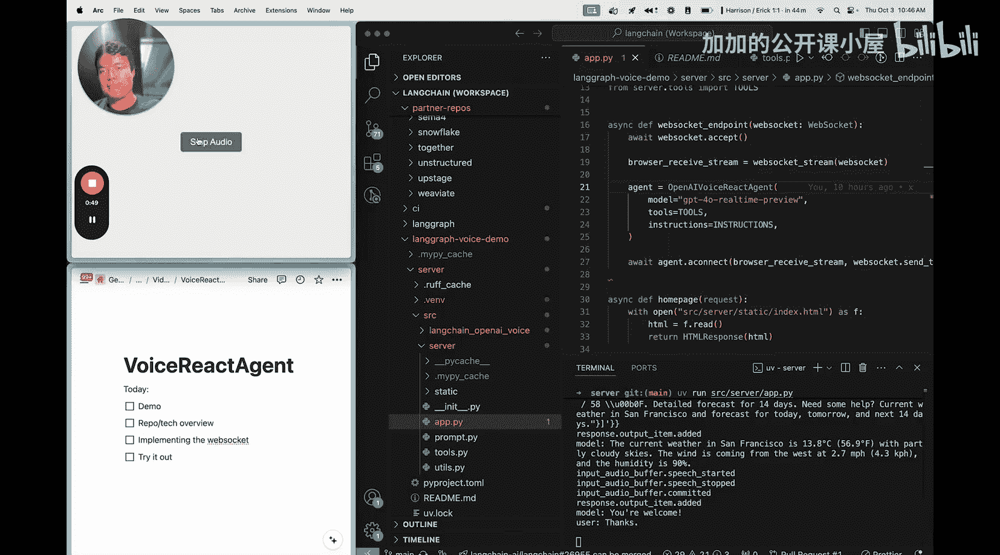
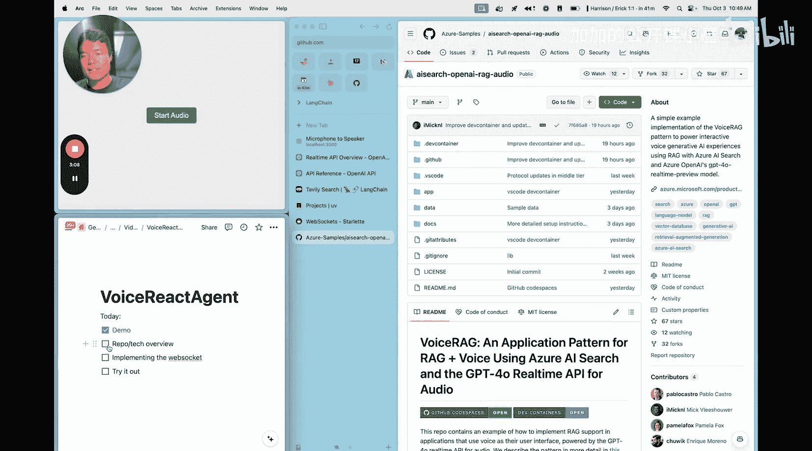
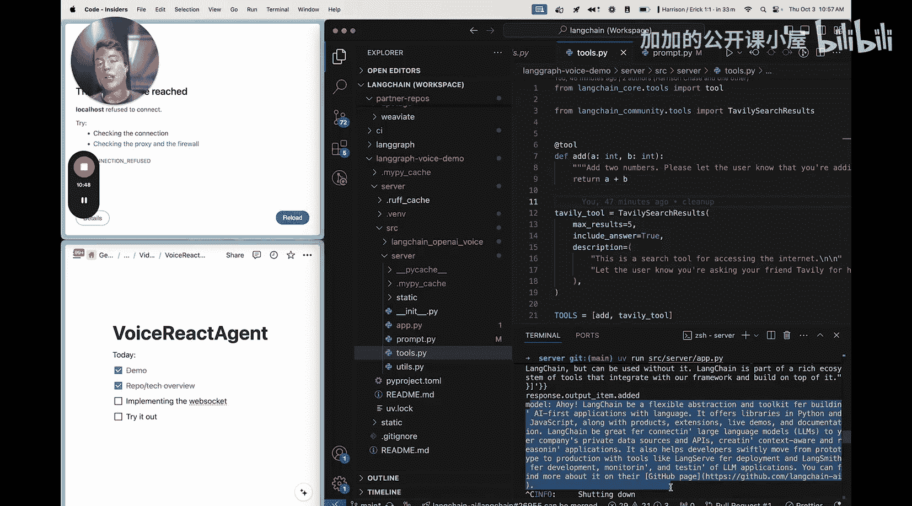

#  039：与 LangChain ReAct 语音代理对话

在本节课中，我们将学习如何构建一个基于 OpenAI 实时 API 的语音 ReAct 代理。我们将从演示开始，逐步解析其背后的代码实现，并了解如何自定义工具和指令。



## 概述

我们将构建一个语音交互代理，它能够理解语音指令、调用工具（如搜索和计算）并生成语音回复。整个系统基于 OpenAI 的实时 API、LangChain 框架以及一个简单的 WebSocket 服务器。

## 演示

首先，让我们看一个简单的演示。代理被询问旧金山的天气，并给出了简洁的回答。

**用户**：旧金山现在的天气怎么样？请简洁回答。
**代理**：旧金山当前天气是13.8摄氏度（56.9华氏度），局部多云，西风风速2.7英里/小时（4.3公里/小时）。
**用户**：谢谢。
**代理**：不客气。

## 技术栈

上一节我们看到了代理的交互效果，本节中我们来看看支撑这个体验的技术组件。

以下是构建此代理所需的核心技术：



*   **OpenAI 实时 API**：语音代理的核心，于最近的开发者日发布。
*   **Tavily 搜索**：作为我们的工具之一，用于互联网检索。你也可以使用任何 LangChain 工具或自定义工具。
*   **UV**：项目依赖管理器。你也可以使用 Poetry 或其他工具。
*   **Starlette WebSockets**：作为我们的代理 Web 服务器。由于我们需要良好地支持 WebSocket，而 FastAPI 在此方面支持有限，因此我们直接使用其底层库 Starlette。
*   **前端代码**：特别感谢 Azure 示例团队提供的 RagAudio 代理示例，我们借鉴了其处理浏览器麦克风和扬声器输出的前端代码。

## 代码解析

现在，让我们深入代码，了解这个体验是如何实现的。建议克隆 YouTube 描述中链接的代码仓库，并按照 README 中的安装说明进行操作。

**调试提示**：如果遇到前端无法连接麦克风或扬声器的问题，请检查浏览器的隐私设置，确保 `localhost:3000` 或你使用的端点被允许访问麦克风。

应用的主要逻辑位于 `server` 文件夹下的 `app.py` 文件中。这里定义了我们的 WebSocket 端点。

```python
# 示例：WebSocket 端点处理音频流
@app.websocket_route("/ws")
async def websocket_endpoint(websocket: WebSocket):
    await websocket.accept()
    # 处理来自浏览器的音频流（麦克风输入）
    async for audio_data in websocket.iter_bytes():
        # 将音频数据传递给代理处理
        processed_audio = await agent.process(audio_data)
        # 将处理后的音频（代理回复）发送回浏览器
        await websocket.send_bytes(processed_audio)
```

WebSocket 在浏览器和服务器之间双向传输事件：浏览器发送麦克风输出，服务器返回扬声器输入。代码将麦克风输入格式化为一个异步迭代器，供我们的端点使用。

## 初始化语音代理

上一节我们介绍了通信层，本节中我们来看看核心代理的初始化。

初始化 LangChain 的 Beta 版 OpenAI 语音 ReAct 代理的接口如下：

```python
from langchain.agents import OpenAIVoiceReActAgent

agent = OpenAIVoiceReActAgent(
    model="gpt-4o-realtime-preview",  # 指定使用的模型
    tools=[search_tool, add_tool],     # 赋予代理的工具列表
    instructions="你是一个乐于助人的助手。请说英语。"  # 系统指令
)
```

*   **model**：指定要访问的 OpenAI 模型。
*   **tools**：代理可以调用的工具列表。
*   **instructions**：初始化指令，类似于在聊天补全端点中使用的系统提示。它可以在实时 API 会话中更新，但为了简单起见，我们在开始时初始化。

最后，我们将代理连接到来自浏览器的麦克风输入流，并提供一个函数将音频块发送回浏览器。由于使用 Starlette WebSockets，这个函数就是 `websocket.send_text`。如果你使用其他协议或直接连接 Python 音频库，则需要调整此函数。

`app.py` 的其他部分定义了一些辅助端点，如提供 Web UI 的主页路由和托管前端静态文件（如 JavaScript 和工作线程）。

## 自定义提示与工具

总结来说，如果你想定制自己的代理，主要需要关注的是 `OpenAIVoiceReActAgent` 的 `tools` 和 `instructions` 参数，它们分别定义在 `prompt.py` 和 `tools.py` 文件中。

首先，查看 `prompt.py`，我们使用一个非常简单的指令：

```python
# prompt.py
instructions = "你是一个乐于助人的助手。请说英语。说话像个海盗。"
```

我们可以添加像“说话像个海盗”这样的指令，让它更有趣。

接下来，查看我们提供给代理的两个工具，定义在 `tools.py` 中：

以下是工具定义示例：

```python
# tools.py
from langchain.tools import tool

@tool
def add_numbers(a: int, b: int) -> int:
    """将两个数字相加。请在调用工具前告知用户你正在相加数字。"""
    return a + b

@tool
def search_web(query: str) -> str:
    """
    使用 Tavily 搜索网络。
    请在调用工具前告知用户你正在请朋友 Tavily 帮忙，因为这有1-2秒的延迟。
    """
    # ... 调用 Tavily 搜索 API 的代码 ...
    return search_results
```

*   **工具描述**：使用 `@tool` 装饰器定义函数。工具描述对于指导语音模型如何处理工具调用非常有用。例如，对于加法工具，我们建议“请在调用工具前告知用户你正在相加数字”。对于搜索工具，我们建议“请在调用工具前告知用户你正在请朋友 Tavily 帮忙”，这是因为获取结果有延迟，避免模型在等待时沉默。
*   **Tavily 搜索工具**：我们将其初始化为每次返回5个结果。建议保持这个数字较低，因为当前实时预览模型版本在输入过多上下文时容易变得冗长。你可以在指令中加入“请保持简洁”来约束它。

最后，我们将这些工具导出为一个列表。

## 功能演示

现在，我们有了一个能访问加法工具和搜索工具的“海盗”代理。

**用户**：587 加 2 等于多少？
**代理**：啊嗬！让我为你把 587 和 2 加起来。惊呆我了，587 加 2 是 589。
**用户**：你能搜索一下 LangChain 是什么吗？
**代理**：哎！我会请我的伙计 Tavily 帮我们找找 LangChain 是啥，稍等。
**代理**：啊嗬！LangChain 是一个用于构建 AI 优先应用的灵活抽象和工具包。它提供 Python 和 JavaScript 库，以及产品、扩展、实时演示和文档。LangChain 非常适合将大语言模型连接到您公司的私有数据源和 API，创建具有上下文感知和推理能力的应用程序。

控制台会显示正在执行的工具调用，例如调用 Tavili 工具，参数为 `query: "langchain"`。你还会看到输出的文本版本以及输入的转录，有时它们可能不完全同步。

## 总结



本节课中，我们一起学习了如何构建一个基于 OpenAI 实时 API 和 LangChain 的语音 ReAct 代理。我们了解了其技术栈构成，解析了 WebSocket 服务器和代理初始化的核心代码，并重点学习了如何通过自定义提示和工具描述来塑造代理的行为和交互风格。你可以在此基础上，集成更多工具，设计更复杂的指令，来创建属于你自己的语音交互应用。