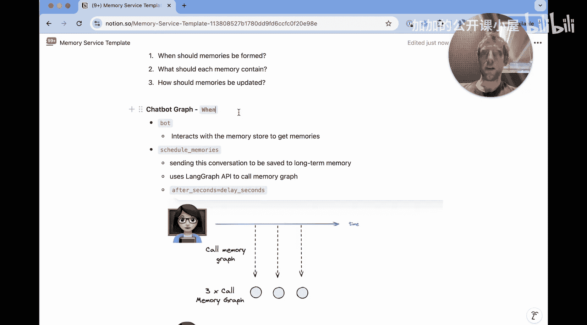
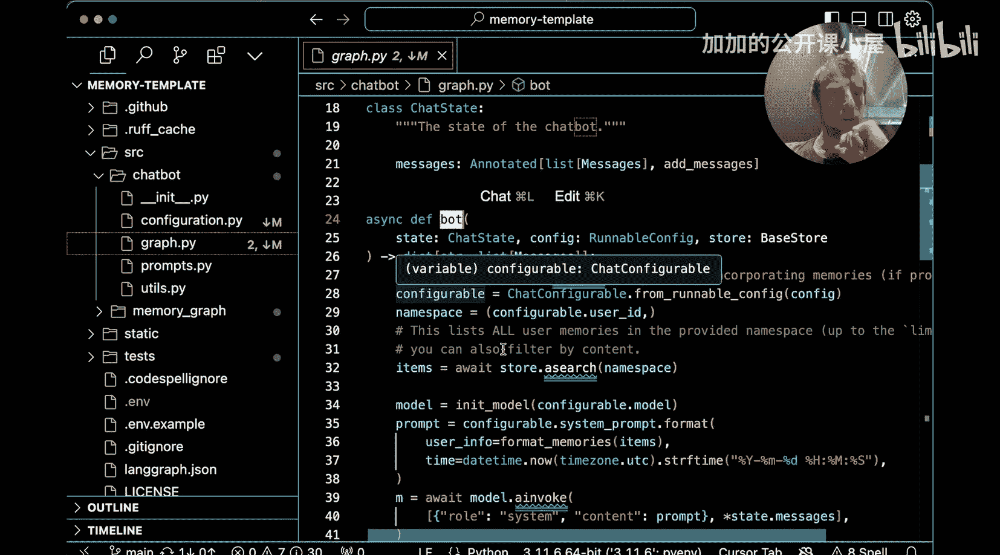
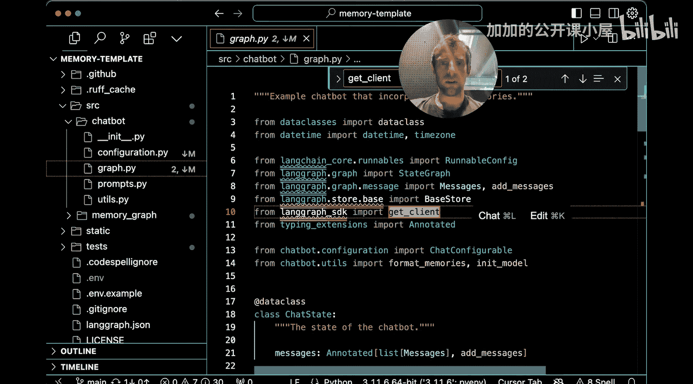
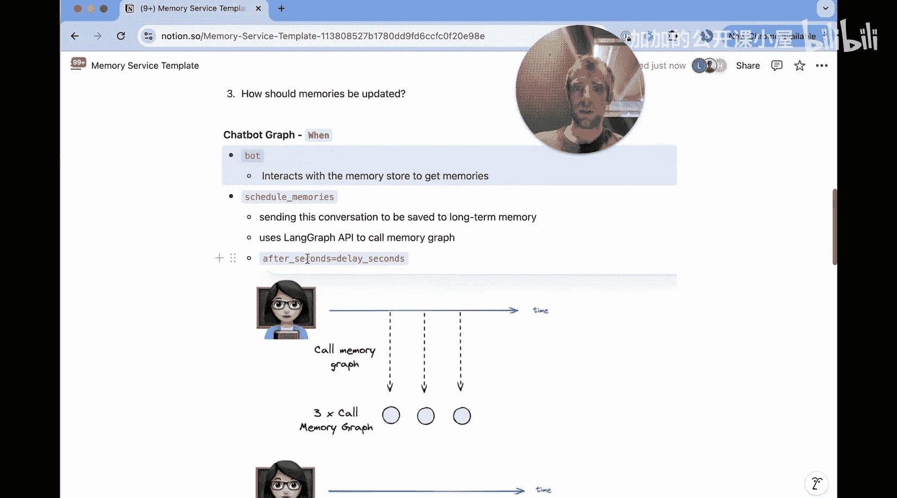
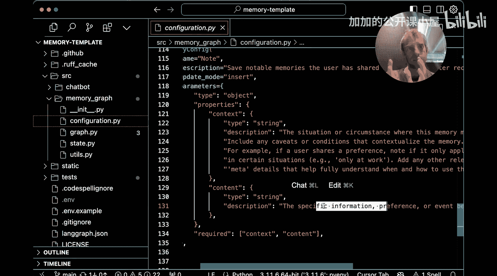
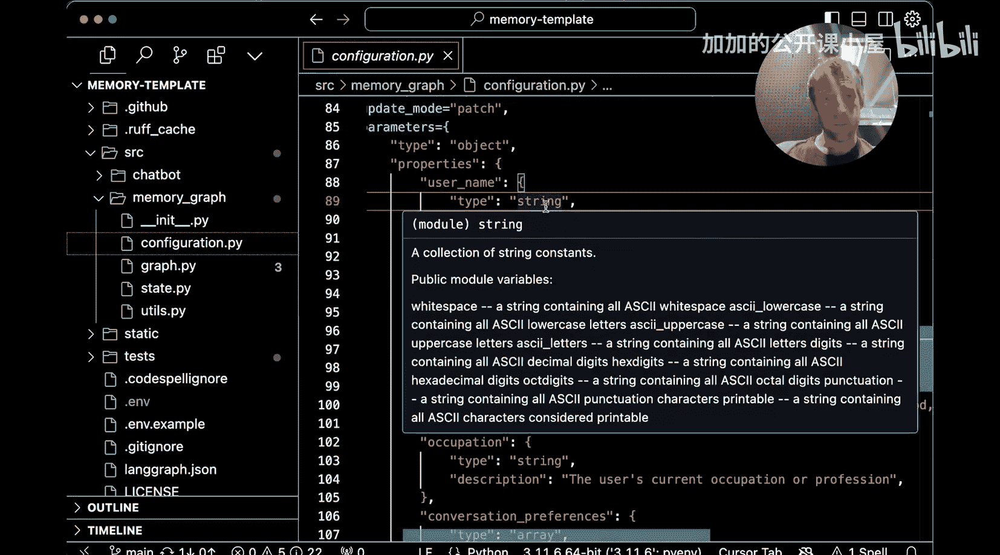
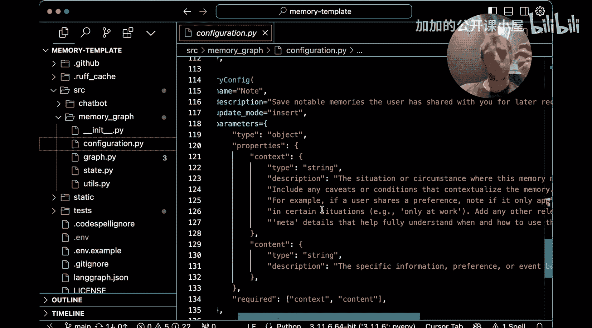
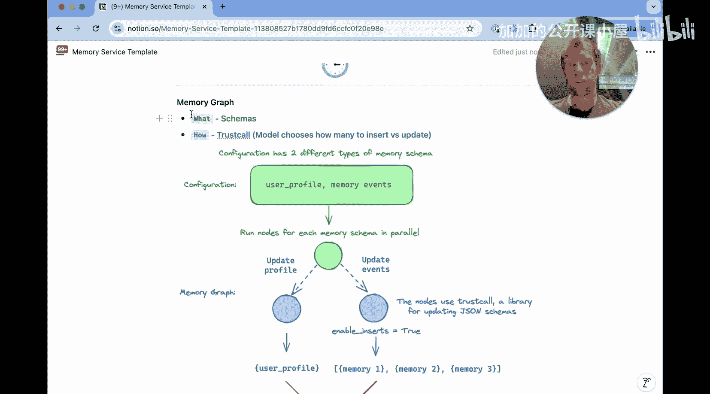

#  041：后台记忆系统 🧠

在本节课中，我们将学习 LangChain 中一个非常有趣的功能：**记忆（Memory）**。记忆使 AI 应用能够记住信息，例如用户的详细信息或开发者希望为未来会话保留的任意信息。我们将通过一个模板，从零开始构建一个后台记忆服务，并探讨其核心概念与实现。

## 概述

记忆是 AI 应用的核心特性之一。它赋予应用“记住”事物的能力。我们刚刚发布了长期记忆模板，这是一个极佳的入门起点。本节将引导你了解该模板，展示如何构建一个后台运行的内存服务。

首先，让我们通过实际操作看看这个记忆服务是如何运行的。

## 记忆服务实战演示

我已经克隆了代码仓库并在 LangGraph Studio 中打开。这里有一个聊天机器人图谱。让我们与这个机器人互动。

我与机器人进行了聊天，其中包含一些我的个人信息。机器人做出了回应。同时，我们可以看到 `Schedule Memories` 节点被触发。在我持续互动的过程中，这个节点在后台被反复调用。在对话的最后，我们还看到 `handle patch memory` 和 `handle insertion memory` 被调用。我们稍后会详细讨论这些。现在，这向你展示了记忆服务如何在聊天的后台工作并保存记忆。

现在，我开启了一个新的对话线程。之前的所有聊天历史都已消失。我提出了一个更个人化的问题，这个问题理想情况下需要依赖之前的记忆才能给出个性化的回答。

我询问了在骑行后推荐面包店。如果没有访问之前线程记忆的能力，它将无法给出任何个性化的回答。然而，我们得到了一个非常酷的答案，它基于我的记忆（知道我在旧金山、喜欢在普雷西迪奥骑行、喜欢在早晨骑行）来调整回答，并推荐了一些确实有非常好牛角面包的面包店。

这展示了记忆服务的实际效果。接下来，我们将探讨其概念基础和代码实现。

## 记忆更新的两种方式

Harrison 几天前发布了一个关于记忆的概念视频，建议你观看以获得完整的概念回顾。简而言之，思考记忆更新至少有两种方式：

1.  **在应用的热路径（Hot Path）中更新**：我们有一个关于此的单独视频和模板。简而言之，这意味着在应用交互过程中更新记忆，用户能实时看到更新。这样做的好处是用户能清晰地看到记忆正在基于他们的输入被创建或写入。但问题在于，这会增加用户体验的延迟和开销。
2.  **在后台更新（本模板采用的方式）**：记忆的更新独立于用户交互，在后台进行。在我们的演示中，聊天互动时，后台就在独立地决定更新记忆。

**后台更新的优点**：
*   对应用本身开销更小。
*   应用逻辑不需要包含某种记忆工具，也无需了解记忆的创建或管理。
*   用户体验（UX）无延迟，用户完全感知不到记忆处理过程，无需经历写入记忆带来的延迟。

**后台更新的缺点**：
*   需要实现一个单独的记忆服务（这正是本节要讨论的）。
*   记忆可能无法实时可用。用户与应用交互和记忆实际写入服务之间可能存在一些延迟，这个延迟可以由开发者定义。

## 构建记忆服务需思考的三个问题

在考虑一个记忆服务时，至少需要思考三个问题：
1.  **何时（When）** 应形成记忆？
2.  **什么（What）** 应包含在记忆中？
3. **如何（How）** 更新记忆？

我们将逐一讨论这些问题，并通过代码来加深理解。

### 1. 何时形成记忆

让我们先查看聊天机器人的代码，了解这是如何工作的。

在模板仓库中，打开 `chatbot` 目录下的 `graph.py` 文件。回忆一下我们在 Studio 中的应用，有两个节点：`bot` 和 `schedule_memories`。我们先看 `bot` 节点，再讨论 `schedule_memories`。

在 `bot` 节点中，我们传入了 `store`。这是 LangGraph API 的新功能，如果你使用 Studio 或 LangGraph Cloud 就可以免费使用。这是一个非常简单的数据存储，图谱中的每个节点都可以访问。我们只需传入它，并通过 `search` 方法（传入一个命名空间）来访问其中的内容。命名空间只是一个元组，在这个例子中就是 `user_id`。这里发生的是，我们从存储中拉取所有属于该 `user_id` 命名空间的内容，这些最终都将被视为我们的记忆。我们将这些内容添加到提示词中，让模型能够据此回应。这就是为什么在我们的聊天互动中，模型能够访问我创建的任何记忆。这展示了聊天机器人节点访问已保存项目（即记忆）的能力。

`schedule_memories` 节点是决定**何时**写入记忆的关键所在。你会看到一些有趣的东西：它调用了 `get_client`。这里使用了 LangGraph SDK，允许我们连接到另一个图谱，即我们的记忆图谱（它在同一个项目中）。我们稍后会讨论那部分代码。好处在于，我们可以直接从聊天机器人中连接并调用记忆图谱。我们可以看到，我们可以传入 `thread_id`，以及最重要的、可配置延迟的 `after_seconds` 参数。

我想详细谈谈这个参数，它是理解整个概念最重要的部分。

想象一下我们正在与机器人进行聊天互动。在用户每次发言后，我们都会进入 `schedule_memories` 节点，并调用记忆图谱或记忆服务。如果每次增量更新都调用，会存在几个问题：效率低下，我们可能会重复写入基本相同的记忆；聊天互动中微小的轮次之间可能没有传达显著不同的信息。

`after_seconds` 参数就是为了解决这个问题而设计的。其动机如下：当我们发出第一次调用时，我们会等待一个可配置参数指定的秒数，然后再实际执行，以查看是否有新的调用进来。这是因为我们实际上并不知道聊天何时结束。当我们看到用户说了什么，就发起创建记忆的调用，然后等待看看是否有其他内容进来。如果进来了值得创建记忆的新信息，我们就取消最初的请求，创建一个新的请求，并继续等待。如此反复，在这个示例中，最终只会对记忆图谱进行一次调用。你可以将其视为一种有原则的信号处理——**防抖（Debouncing）**。它减少了对记忆服务的冗余调用，基本上将整个聊天互动浓缩为一次调用，从而实现更高效的记忆处理和更新。这就是我们进行调度的动机，而 LangGraph API 中简单的 `after_seconds` 参数使我们能够做到这一点。

很好，我们已经讨论了**何时**应形成记忆，这是在聊天机器人图谱的 `schedule_memories` 节点中，利用 LangGraph API 的 `after_seconds` 参数完成的。

### 2. 记忆应包含什么

现在，让我们讨论一下每个记忆**应该包含什么**。

回到代码中，我打开了 `memory_graph` 文件夹下的 `configuration.py` 文件。记得我们刚才在 `chatbot_graph` 的 `graph.py` 中。现在我进入了记忆图谱的 `configuration.py`。向下滚动，你会看到 `default_memory_config`。

这些是用于指定我们想要保存的记忆结构的模式（Schema）。这是一个非常微妙且有趣的点：你可以非常灵活地定义如何保存记忆。

在这个特定案例中，我们保存两种类型的记忆：
1.  **用户档案（User Profile）**：包含 `username`、`age`、`interests`、`home`、`occupation`。这完全是任意的，你可以按任何方式修改这个模式。这只是我们提供的一个默认模式。
2.  **通用记忆（General Memory）**：一种更简单的类型，只包含 `context` 和 `content`。`context` 描述情境或环境，`content` 是我们想要保存的具体信息。这是一种非常灵活的记忆形式，可以捕获任何信息。而前一种形式是基于用户的模式。

再次强调，这极其灵活，可以按你的任何需求进行配置。在创建记忆服务时，思考你想要保存的记忆结构是一件非常有趣的事情。在这个案例中，我们有两种不同的结构：基于用户的结构和可以捕获任何记忆事件的通用形式。

### 3. 如何更新记忆

我们已经看到了在聊天机器人中如何调度记忆，也看到了配置如何设定每个记忆的结构。现在，记忆**应该如何**实际更新呢？让我们稍微讨论一下。

向下滚动，你会看到一个示意图，它概括了整个过程。

记忆的更新逻辑主要封装在记忆图谱中。当 `schedule_memories` 节点延迟调用触发后，请求会到达记忆图谱。图谱会处理整个对话历史，使用 LLM 来提取、总结或判断哪些信息值得作为新的记忆保存，或者是否需要更新现有的记忆（例如，用户更新了年龄）。然后，它会调用相应的处理节点（如 `handle_patch_memory` 用于更新，`handle_insertion_memory` 用于插入新记忆），最终将结构化的记忆数据写入到之前提到的 `store` 中，供聊天机器人节点后续读取。

这个过程将“何时”、“什么”、“如何”三个问题串联起来，形成了一个完整的后台记忆服务闭环。

## 总结

在本节课中，我们一起学习了 LangChain 中后台记忆系统的构建。

*   我们首先**概述**了记忆的重要性，并通过一个演示看到了后台记忆服务的效果。
*   接着，我们区分了**记忆更新的两种方式**：热路径更新和后台更新，并分析了后台更新的优缺点。
*   然后，我们深入探讨了构建记忆服务必须思考的**三个核心问题**：
    1.  **何时（When）形成记忆**：通过聊天机器人图谱中的 `schedule_memories` 节点和 `after_seconds` 参数实现防抖调度，高效决定写入时机。
    2.  **什么（What）包含在记忆中**：通过 `configuration.py` 中的模式（Schema）灵活定义记忆结构，例如用户档案和通用记忆。
    3.  **如何（How）更新记忆**：由独立的记忆图谱处理对话历史，利用 LLM 提取关键信息，并更新到共享的存储（`store`）中。

这个模板提供了一个强大而灵活的起点，你可以基于它定制符合自己应用需求的记忆系统。记住，关键在于根据你的应用场景，合理设计记忆的调度策略、数据结构以及更新逻辑。