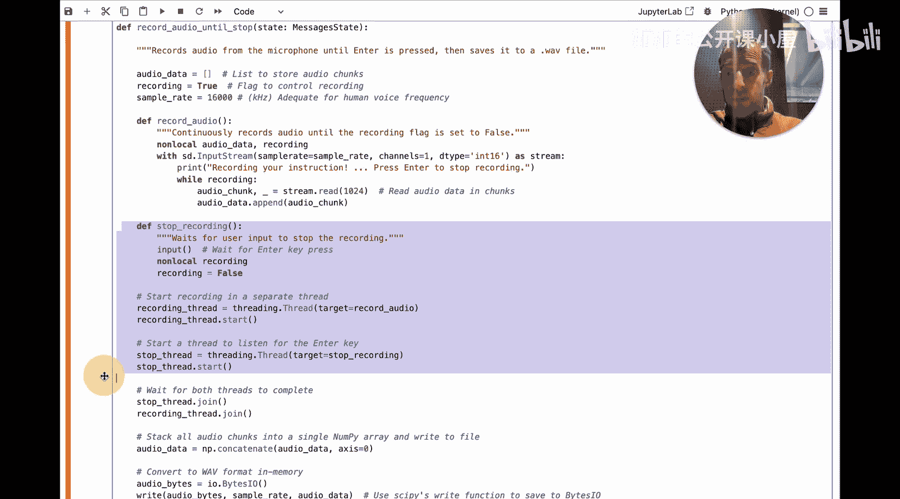
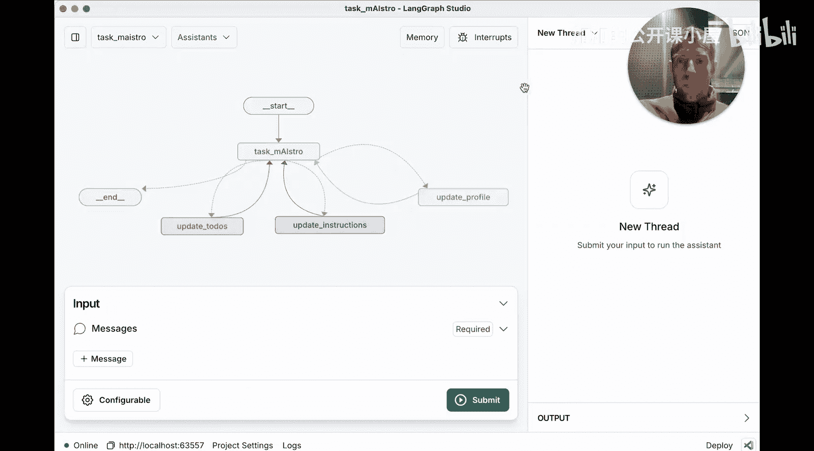
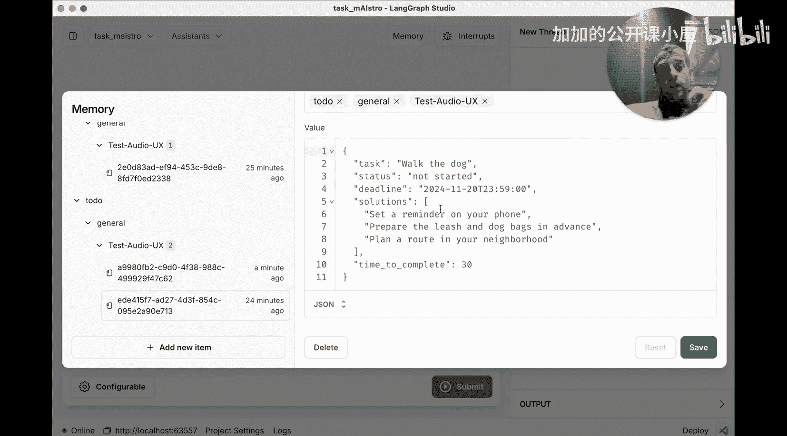
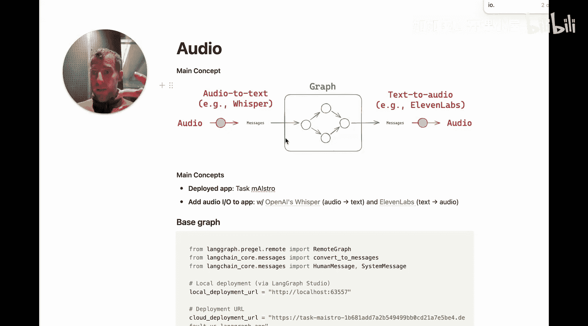

#  043：解锁基于 LangGraph Agents 的语音交互 🎙️

在本节课中，我们将学习如何为一个现有的、基于文本交互的 LangGraph 智能体应用，轻松地添加语音输入和输出功能。我们将通过一个名为“Task Maestro”的个人待办事项管理应用来演示整个过程。

## 概述

语音交互为某些类型的智能体提供了非常友好的交互模式。我们将展示如何将一个原本仅通过聊天（文本）交互的应用，改造为支持语音对话的应用。核心思路非常简单：在现有处理文本消息的图（Graph）结构两端，分别添加一个将语音转换为文本的节点，以及一个将文本转换为语音的节点。

## 第一节：核心应用 Task Maestro 简介

首先，让我们简要了解一下我们将要改造的核心应用本身。

Task Maestro 是一个使用聊天（或语音）来管理任务的应用程序。它允许通过自然对话来更新和读取任务，并能自适应地了解用户信息。

**快速启动方式**：
最简便的部署方式是下载 LangGraph Studio 桌面应用。加载本应用的代码仓库目录后，即可在 Studio 中看到名为“Task Maestro”的图。我们可以通过 Studio 获得该本地部署的访问 URL，这是我们后续连接和改造的关键。

上一节我们介绍了 Task Maestro 应用的基本情况，本节中我们来看看如何部署并与之交互。

## 第二节：部署与连接应用

我们已经展示了如何使用 LangGraph Studio 为我们的应用创建一个本地部署。这个部署（即 Task Maestro 应用）正在本地运行，并且可以通过我们从 LangGraph Studio 获得的 URL 进行访问。

现在，让我们看看如何实际连接这个部署并构建语音输入和输出功能。

在一个新的 Notebook 中，我们需要进行以下初始化设置：
1.  确保已设置 OpenAI API 密钥（用于 Whisper 语音识别）。
2.  确保已设置 ElevenLabs API 密钥（用于语音合成）。

以下是初始化客户端的代码：
```python
# 初始化 OpenAI 客户端（用于 Whisper）
openai_client = OpenAI(api_key=your_openai_api_key)
# 初始化 ElevenLabs 客户端
elevenlabs_client = ElevenLabs(api_key=your_elevenlabs_api_key)
```

接下来，使用从 Studio 获取的 URL 来连接我们已部署的图。LangGraph 提供了 `RemoteGraph` 抽象，允许我们连接到已部署的图（无论是本地部署还是云部署）。

```python
# 连接本地部署的图
remote_graph = RemoteGraph(
    url="你的_LangGraph_Studio_本地部署_URL",
    graph_name="task_maestro"
)
```

除了本地部署，LangGraph 也支持云部署。如果你有一个云部署的 URL，同样可以方便地通过提供该 URL 进行连接。目前我们使用本地部署，因为它免费且易于上手。

## 第三节：为图添加语音处理节点

现在，我们有了一个连接到已部署图的 `remote_graph` 对象。接下来，我们需要为这个图添加两个新节点：一个用于将音频转换为文本（输入），另一个用于将文本转换为音频（输出）。

首先，我们定义一个函数作为“音频转文本”的图节点。这个节点的核心功能是录制音频直到用户停止，然后将其发送给 Whisper 进行转录。

以下是该函数的关键步骤：
1.  持续从麦克风录制音频。
2.  等待用户按下回车键以停止录制。
3.  将录制的音频块堆叠成 NumPy 数组。
4.  转换为内存中的文件格式。
5.  传递给 Whisper API 进行转录。
6.  将得到的文本转录添加到图的状态（state）中。



```python
def record_audio_till_stop(state):
    # ... 音频录制逻辑 ...
    audio_data = record_from_microphone()
    # ... 转换为文件 ...
    transcription = openai_client.audio.transcriptions.create(
        model="whisper-1",
        file=audio_file
    )
    state["messages"].append(transcription.text)
    return state
```

接着，我们定义“播放音频”节点。这个节点从图状态中获取智能体的最终文本响应，使用 ElevenLabs 将其转换为语音并播放。

```python
def play_audio(state):
    # 从图状态获取最终的响应文本
    final_response = state.get("final_response", "")
    # 可选：清理文本
    cleaned_text = clean_text(final_response)
    # 使用 ElevenLabs 生成音频
    audio = elevenlabs_client.generate(text=cleaned_text, voice="预设音色")
    # 播放音频
    play_audio_data(audio)
    return state
```

## 第四节：整合与运行语音交互图

现在，让我们看看如何将所有部分整合在一起。

我们创建一个新的图，它包含三个主要部分：
1.  `record_audio_till_stop` 节点（输入）。
2.  我们之前连接的 `remote_graph`（作为子图嵌入，处理核心逻辑）。
3.  `play_audio` 节点（输出）。

在 LangGraph 中，我们可以轻松地将已部署的远程图作为子图嵌入，无需重新定义其内部复杂的节点和边。这样做的好处是，我们可以直接利用部署时已配置好的功能，例如内置的长期记忆存储（基于 PostgreSQL）。

```python
from langgraph.graph import StateGraph, END

# 创建新图
workflow = StateGraph(YourStateSchema)

# 添加输入节点
workflow.add_node("record_audio", record_audio_till_stop)
# 将远程图作为子图添加为核心处理节点
workflow.add_node("process_with_agent", remote_graph)
# 添加输出节点
workflow.add_node("speak_response", play_audio)

# 定义边：音频输入 -> 智能体处理 -> 音频输出
workflow.add_edge("record_audio", "process_with_agent")
workflow.add_edge("process_with_agent", "speak_response")
workflow.add_edge("speak_response", END)



# 编译图
app = workflow.compile()
```

运行这个图时，它会首先启动音频输入节点，等待用户说话并转录；然后将转录文本传递给嵌入的核心智能体子图进行处理；最后将智能体的文本响应通过音频输出节点转换为语音播放给用户。



## 第五节：验证与总结

运行整合后的应用，我们可以通过语音与之交互，例如添加待办事项：“Add another to do to take out the garbage by Friday.”。智能体会以语音回应，确认任务已添加。

我们还可以回到 LangGraph Studio 中查看本地部署应用的记忆存储。在记忆标签页中，可以看到会话中保存的用户个人信息、偏好设置以及添加的待办事项列表。这证明了我们的改造没有影响应用原有的长期记忆等核心功能。

**本节课总结**：
在本节课中，我们一起学习了如何为一个已有的、基于文本（聊天）输入输出的 LangGraph 智能体图快速添加语音交互功能。整个过程可以概括为三个关键步骤：
1.  **部署核心图**：使用 LangGraph Studio 等方式部署你的智能体应用，并获得其连接 URL。
2.  **创建处理节点**：编写两个简单的函数节点，分别利用 Whisper API 实现“语音转文本”，以及利用 ElevenLabs API 实现“文本转语音”。
3.  **整合新图**：创建一个新的 LangGraph，将上述两个节点与通过 `RemoteGraph` 连接的原有核心应用子图串联起来。



这种方法使得为现有应用添加音频 UX 变得非常简单，无需修改原有核心逻辑，只需在交互层进行包装即可。所有相关代码均可在视频描述中找到。如果你想深入了解 Task Maestro 应用本身或 LangGraph 的更多部署选项，可以参考 LangChain 学院的相关模块。