#  044：多智能体研究与报告撰写 📝

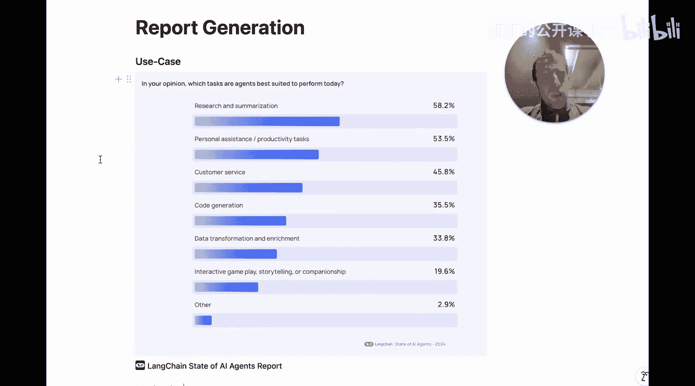

在本节课中，我们将学习如何从零开始构建一个多智能体研究及报告撰写系统。我们将探讨其核心设计理念、实现步骤，并分享在开发此类智能体过程中积累的关键经验。

---

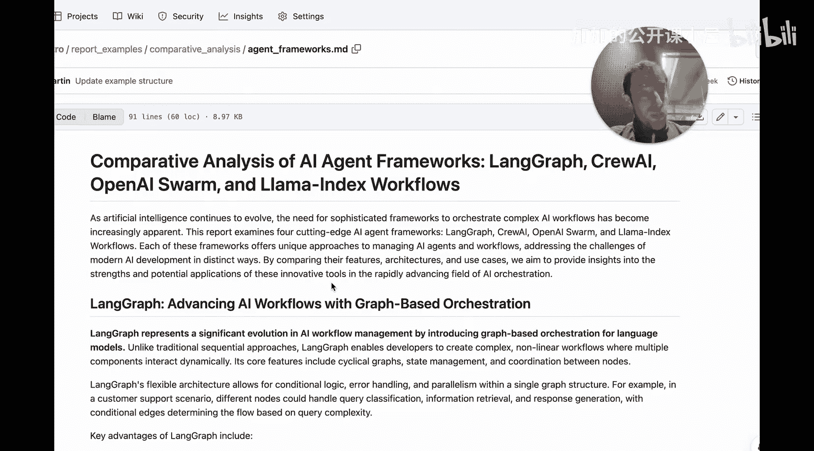

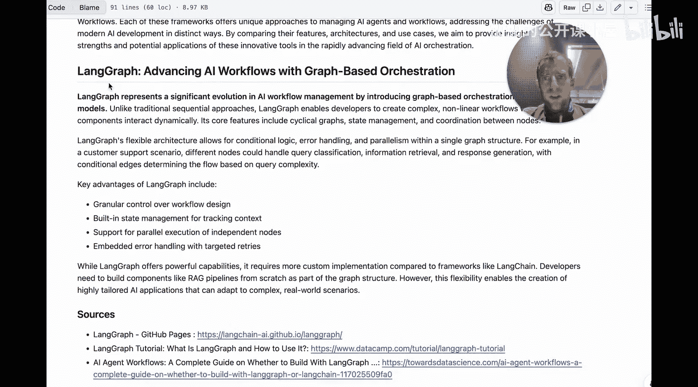

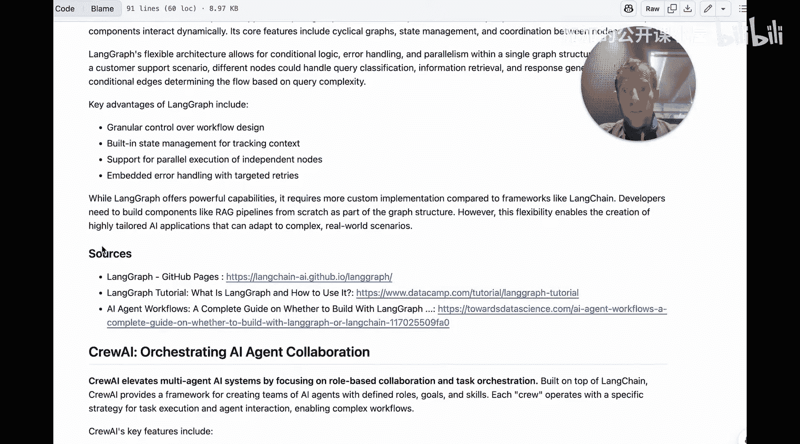

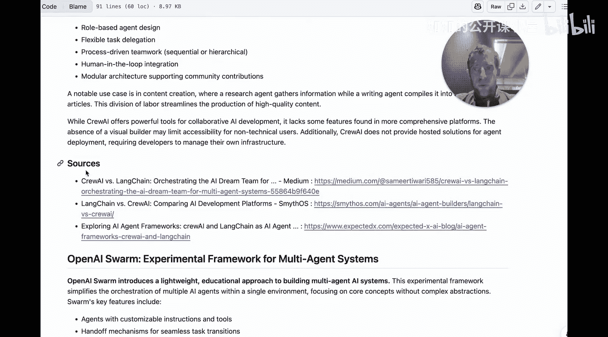

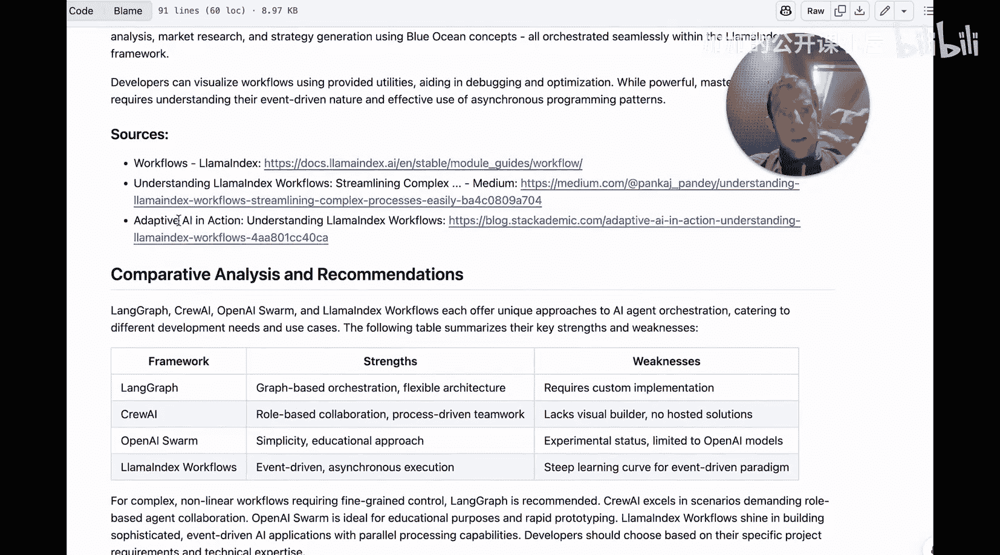

## 概述与动机

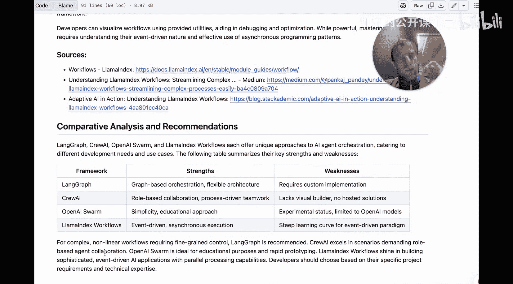

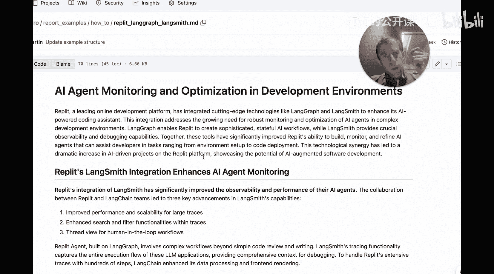

近期一项针对1300名AI行业专业人士的调查显示，他们认为智能体最适合解决的任务是**研究与总结**。基于此，我们将构建一个能够自动进行网络研究并生成高质量报告的智能体。

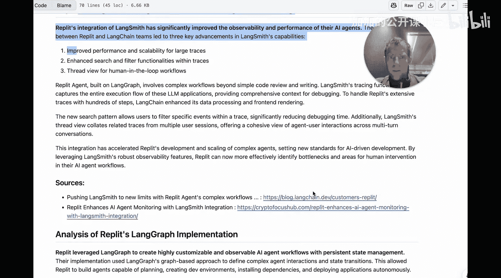

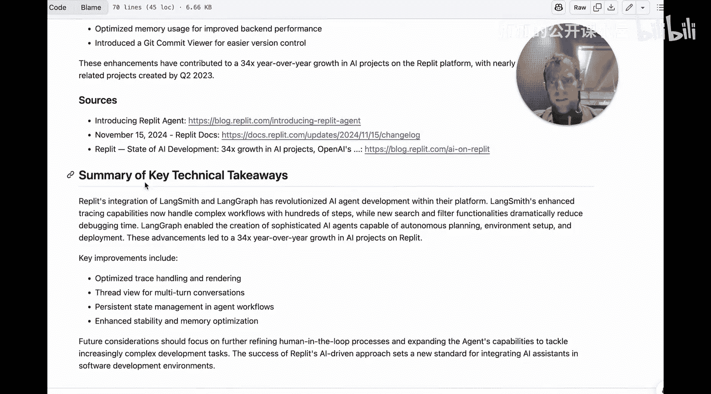

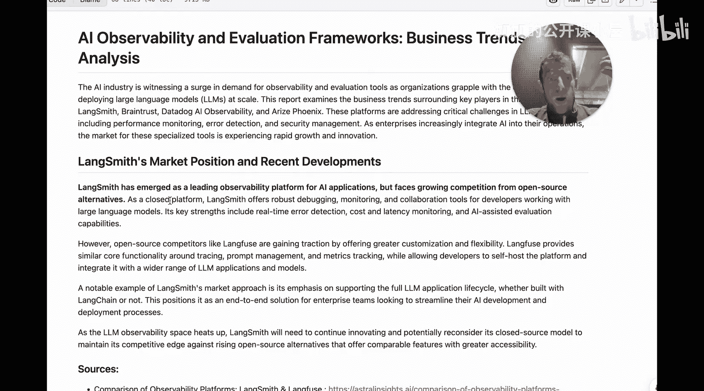

以下是该智能体生成报告的示例。当用户提出请求：“为我撰写一份关于不同智能体框架（LangChain、CrewAI、OpenAI Swarm、LlamaIndex Workflows）的报告”时，智能体能够自动完成以下工作：
*   将每个框架划分到独立的章节。
*   提供格式清晰的要点列表。
*   为每个部分标注信息来源。
*   在报告末尾提供清晰的总结与对比表格。
*   整个过程耗时不到一分钟。

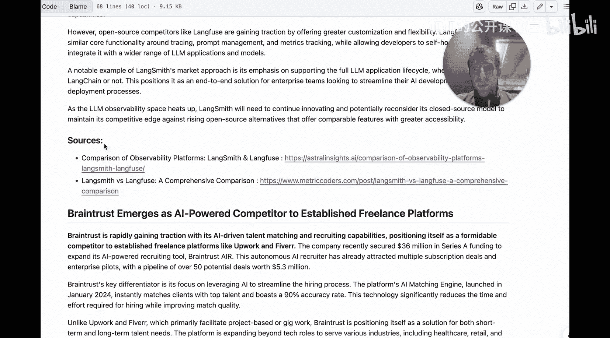

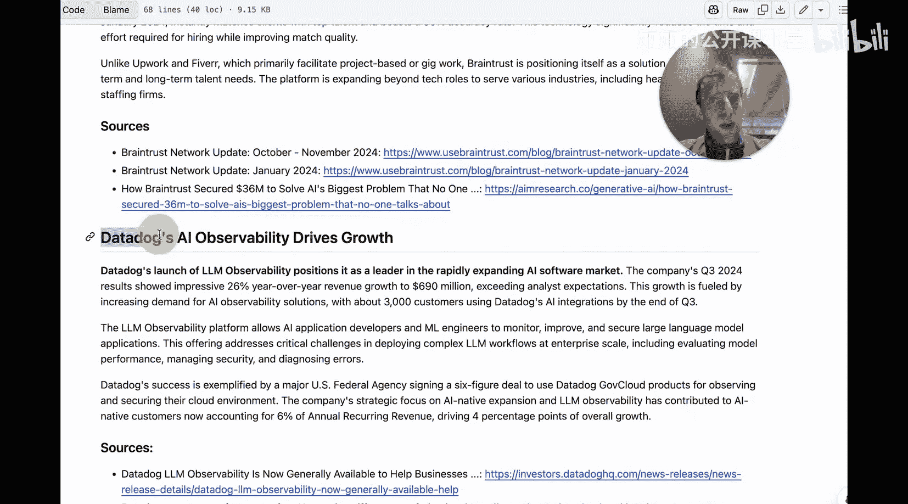

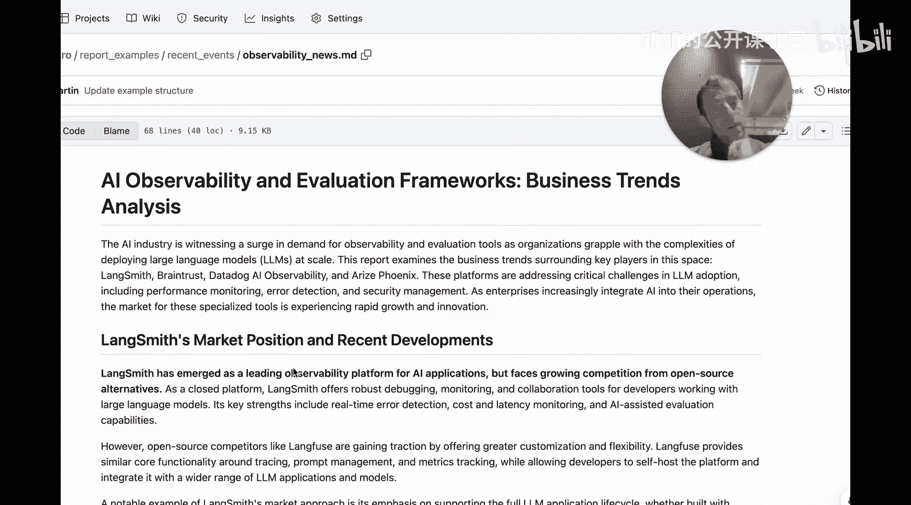

该智能体具备以下优势：
*   **输入灵活**：仅需传入一个主题。
*   **格式多样**：能够生成不同类型和结构的报告（章节数量、结论格式、是否使用表格等均可定制）。
*   **主题广泛**：能够针对多种不同主题生成报告。

## 为何选择报告撰写智能体？

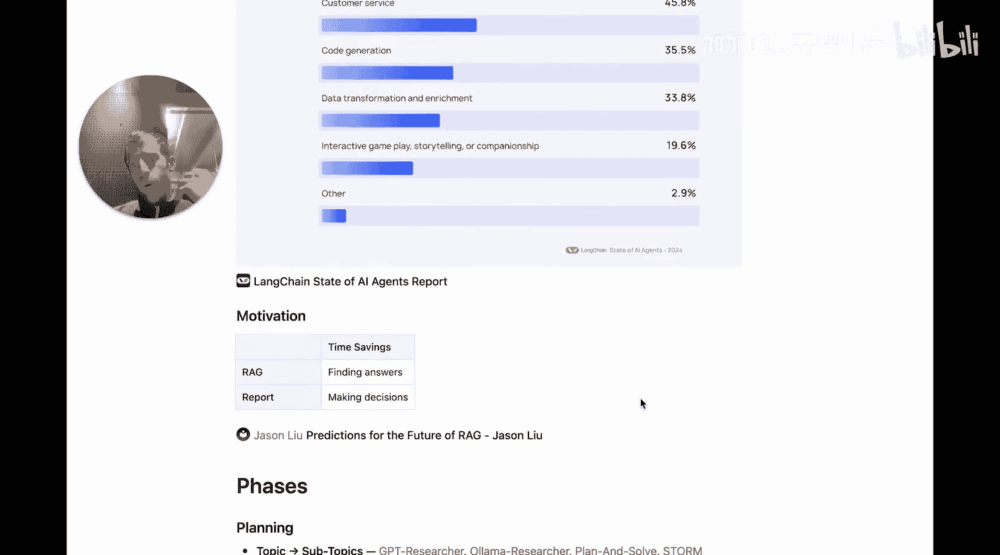

当前，检索增强生成（RAG）系统备受关注，它通常是报告撰写系统的核心组件。然而，RAG系统主要节省的是**寻找答案**的时间。报告则更进一步，它通过结构化、深思熟虑的方式呈现信息，从而更直接地服务于**决策制定**。高质量报告带来的杠杆效应通常远大于简单的问答系统。

## 现有方法分析

报告撰写流程通常可分为三个阶段：**规划**、**研究**和**撰写**。

### 1. 规划阶段
现有方法主要围绕两种思路：
*   **计划与解决**：例如GPT Researcher，它将输入主题分解为一组子主题，然后分别进行研究。
*   **生成大纲**：例如STORM论文，它首先生成最终报告的骨架大纲（例如维基百科风格的结构）。

### 2. 研究阶段
研究策略主要有三种：
*   **并行搜索检索**：为每个子主题创建搜索查询，并行地从网络或知识库中检索信息。
*   **迭代搜索评估**：例如OAM Researcher，它检索信息后进行评估，如果信息不足则重写查询再次搜索。
*   **多轮访谈**：例如STORM，它模拟分析师与“专家”（即搜索服务）之间的多轮问答，直到获得满意信息。

### 3. 撰写阶段
撰写策略也有不同思路：
*   **顺序章节撰写**：逐个章节进行撰写。
*   **并行章节撰写与迭代精炼**：例如STORM，基于大纲并行生成章节，然后迭代填充引言和结论。
*   **单次生成**：汇集所有研究资料，让大语言模型一次性生成整篇报告。

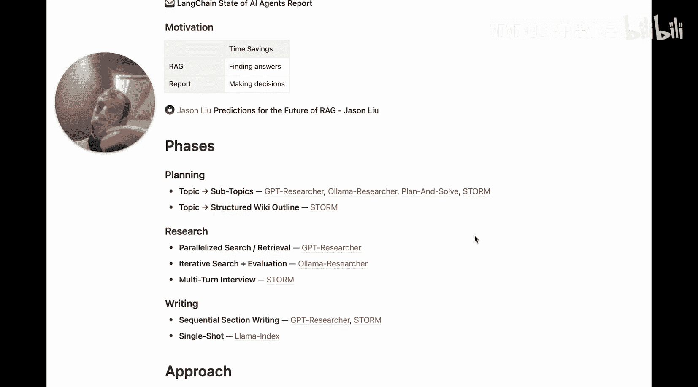

## 我们的设计方案与核心经验

我们将遵循规划、研究、撰写三阶段框架，并融入以下关键设计经验：

### 规划阶段：预先制定报告结构
在规划阶段预先制定报告结构具有多重优势：
*   **灵活性高**：可以轻松生成不同风格的报告（例如，固定五章节带总结表格的报告，或无需引言结论的简短报告）。
*   **支持并行化**：为后续的研究和撰写阶段实现并行处理奠定基础。
*   **易于调试**：可以在研究开始前独立检查和调试报告计划。
*   **精准研究**：可以预先标记哪些章节需要研究（例如，引言和结论可能不需要外部研究），哪些不需要。

### 研究阶段：采用并行搜索检索
实践表明，**简单的并行搜索与检索**是一种非常有效且可靠的方法。它避免了复杂交互可能带来的不稳定性和高延迟，在大多数情况下能提供充足的研究材料。

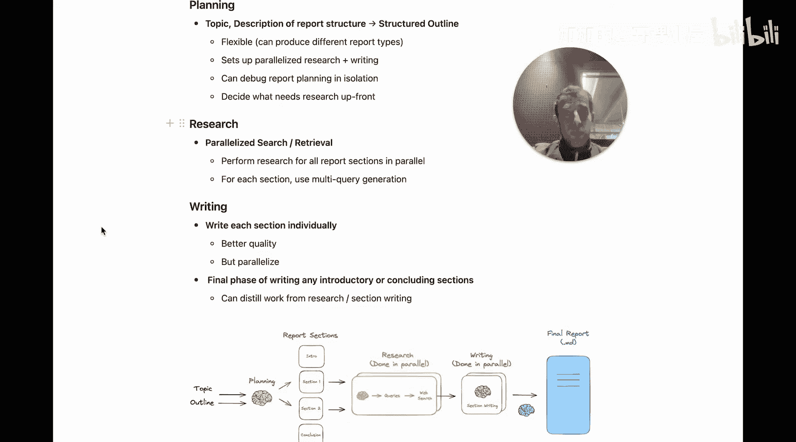

---

## 总结

本节课我们一起探讨了构建多智能体研究与报告撰写系统的动机、现有方法分析以及我们的核心设计方案。关键要点包括：
1.  报告撰写智能体能通过结构化信息呈现，有效辅助决策，其价值超越单纯的问答系统。
2.  报告流程可分为规划、研究、撰写三个阶段，每个阶段都有不同的实现策略。
3.  我们的设计强调**预先规划报告结构**以获得灵活性，并采用**并行搜索检索**作为高效可靠的研究手段。

在接下来的课程中，我们将深入代码层面，逐步实现这个智能体系统。