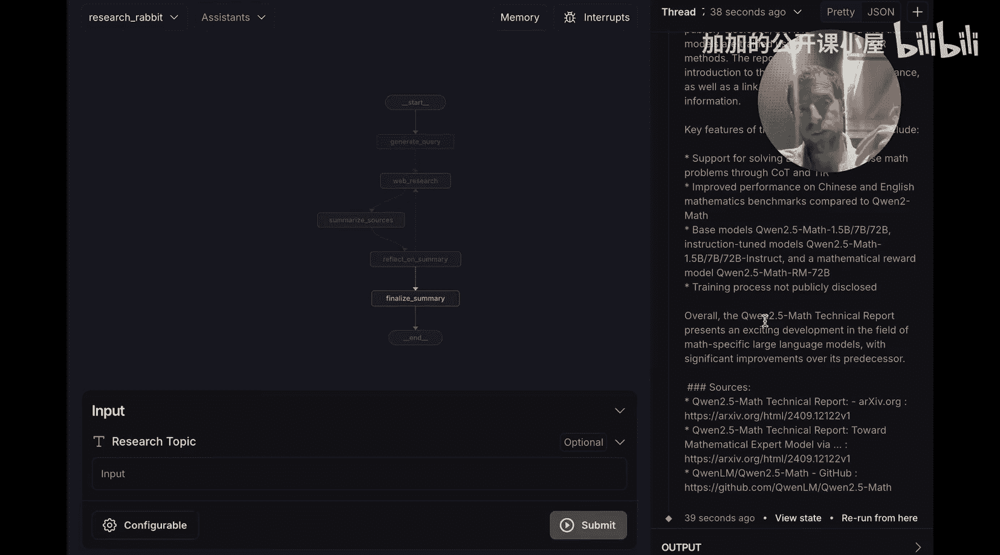
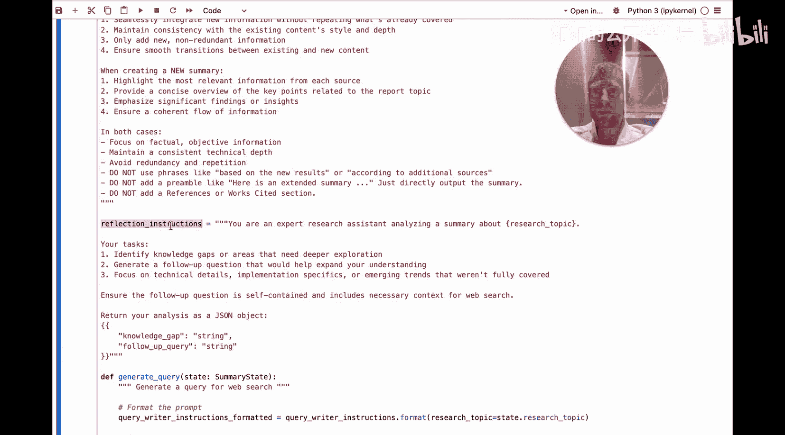

#  045：使用 Ollama 从零构建本地研究助手 🚀

在本节课中，我们将学习如何使用 LangChain 和本地大语言模型（通过 Ollama 运行）来构建一个自动化的网络研究与总结助手。这个助手能够根据你提供的主题，自动生成搜索查询、进行网络研究、总结结果，并通过反思迭代来完善最终的报告。

## 概述

我们首先会看到这个助手的工作演示，了解其核心流程。然后，我们将深入代码，从零开始构建它。整个过程将使用免费的本地模型，确保成本为零。

## 助手演示

现在，我在 LangChain Studio 环境中。这是一个用于测试、调试和开发智能体的环境。按照快速入门指南，只需三步即可启动。

进入配置页面，我可以选择任何已通过 Ollama 拉取的本地模型。例如，我选择 `qwen2:14b`。在这里，你可以设置智能体进行研究的迭代次数。我们先设置为 2 次。

我可以添加一个研究主题。假设我想了解 Qwen 2.5 是如何训练的。点击提交。

它会运行我指定的本地模型，根据主题生成一个搜索查询。接着，它会进行网络研究。然后，Qwen 模型会总结研究结果。之后，它会反思这个总结，找出知识缺口，提出后续问题，进行更多研究，并将新发现添加到总结中。这个过程会按照配置的次数重复进行。

现在，它正在生成最终总结。完成后，我可以向下滚动查看最终报告。你会看到一个格式良好的 Markdown 文档，包含总结、从网络研究中获取的详细笔记、格式清晰的列表以及可供深入研究的来源列表。整个过程大约花费了一分钟，并且完全免费，因为我使用本地的 Ollama 运行。



## 构建动机

在深入代码之前，我们先花一分钟讨论一下构建这个工具的动机。

首先，我们最近进行了一项调查，询问了约 1300 位行业专业人士关于智能体的主要用途，研究与总结高居榜首。这表明这是一个巨大的需求场景。

其次，这里的实现方法受到了相关研究工作的启发。核心思想是：迭代式地检索文档、生成答案，并根据先前循环中的发现来生成新的研究焦点。

为什么特别适合用本地模型来实现这种方法呢？因为本地资源有限。例如，我无法在我的机器上同时运行 5 或 6 个模型调用。因此，我不能采用那种将一个主题分解成 10 个子主题并并行研究的方案。受限于系统资源，我更喜欢这种迭代式的方法：简单地获取主题，生成问题，进行网络研究，获取结果，反思，再重复。我发现这种方法非常简单且效果良好。

## 关于本地模型

在选择运行的模型时，我通常会参考 `localllma`、Twitter 以及 Hugging Face 的本地大语言模型排行榜。你可以在这里设置参数数量，并查看模型在各种挑战中的性能评分。我主要使用 Qwen 2.5 和 Llama 3.2。

根据说明，你只需要运行 `ollama pull <模型名>`，即可将模型拉取到本地。

## 从零开始构建

现在，我们进入一个新的笔记本，从头开始构建。我将展示如何轻松地组装这个助手。

### 第一步：配置模型

首先，指定你想要使用的 Ollama 模型。这里我使用 `qwen2.5:14b`，我已经提前拉取好了。

```python
model_name = "qwen2.5:14b"
```

### 第二步：定义状态

我们将使用 LangChain 来构建这个智能体。LangChain 使用“状态”的概念来保存在智能体生命周期内需要持久化的任何信息。

对于这个用例，我们需要定义几个状态键：
*   `topic`：用户提供的研究主题（字符串）。
*   `summary`：最终输出的总结（字符串）。

我们只希望用户输入`topic`并得到`summary`输出。但智能体内部还需要其他一些状态：
*   `search_query`：网络搜索查询。
*   `web_research_results`：收集的网络搜索结果列表（在运行过程中会不断追加）。
*   `sources_gathered`：收集的来源列表（在运行过程中会不断追加）。这个与`web_research_results`的区别在于，一个包含所有内容，另一个只包含 URL。

我们创建一个特定的输入状态（`my_input_state`）来只暴露`topic`给用户，稍后你会明白为什么这很重要。

### 第三步：构建流程图

我们的助手将包含几个不同的节点：
1.  从用户输入开始。
2.  生成搜索查询。
3.  运行网络搜索。
4.  总结网络搜索结果。
5.  反思总结。
6.  重复此过程若干次。
7.  完成。

让我们详细看看每个节点。

#### 节点一：生成查询

我们使用一个查询编写提示词。其核心是要求本地大语言模型生成一个目标网络搜索查询，并附上生成该查询的理由，以迫使模型思考查询本身。

```python
# 伪代码示例
query_writer_prompt = """
你是一个研究助手。根据以下主题生成一个网络搜索查询。
主题：{topic}
请生成一个查询并解释理由。
"""
# 调用配置好的本地模型（使用 JSON 模式）
response = llm.invoke(query_writer_prompt.format(topic=state[“topic”]))
# 从结构化输出中提取查询
search_query = extract_query(response)
```

#### 节点二：执行网络研究

这里我使用 Tavily Search 进行网络搜索。Tavily 免费提供最多 1000 次请求，并且返回的结果已经附带了抓取好的来源，节省了大量工作。当然，这个节点可以替换成你想要的任何搜索引擎。关键点是它执行搜索，并将结果保存到状态中的`sources_gathered`键。这个键会在智能体运行过程中累积一个来源列表，方便后续检查。

我还运行了一个`deduplicate_and_format_sources`工具函数（在代码库的 `utils` 文件夹中），用于对来源进行去重和清理，并将其转换为字符串。如果你想更换搜索引擎，只需修改这个函数，使其能够将原始搜索结果格式化为字符串即可。

```python
# 伪代码示例
search_results = tavily_search(search_query)
formatted_results, urls = deduplicate_and_format_sources(search_results)
state[“web_research_results”].append(formatted_results)
state[“sources_gathered”].extend(urls)
state[“research_count”] += 1
```

#### 节点三：总结来源

这里，我获取网络搜索的最新结果（它们被保存在一个列表中）。如果已经生成了现有的总结，我会稍微修改提示词，要求模型基于现有总结进行扩展和补充。如果没有现有总结（即研究刚开始），则直接为这些搜索结果生成一个总结。

```python
# 伪代码示例
latest_results = state[“web_research_results”][-1]
if state[“summary”]:
    summary_prompt = f“基于现有总结扩展：{state[‘summary’]}\n新信息：{latest_results}”
else:
    summary_prompt = f“为以下内容生成总结：{latest_results}”
new_summary = llm.invoke(summary_prompt)
state[“summary”] = new_summary
```

#### 节点四：反思总结

在这个节点，我们直接要求大语言模型：基于现有知识，识别知识缺口并生成后续的搜索查询。我在系统提示词（`reflection_instructions`）中提供了一些额外的指导。

```python
# 伪代码示例
reflection_prompt = f“””
当前总结：{state[‘summary’]}
请识别其中的知识缺口，并生成一个用于后续研究的搜索查询。
“””
reflection_output = llm.invoke(reflection_prompt)
# 从输出中解析出新的搜索查询，用于下一轮循环
new_query = parse_new_query(reflection_output)
state[“search_query”] = new_query
```

之后，流程会根据配置的迭代次数，带着新的查询跳回“执行网络研究”节点，开始新一轮的循环。

## 总结



本节课中，我们一起学习了如何使用 LangChain 和本地大语言模型（通过 Ollama）构建一个自动化研究助手。我们了解了其核心的迭代式研究流程：生成查询 -> 网络研究 -> 总结 -> 反思 -> 再研究。我们探讨了定义状态的重要性，并逐步剖析了构建该助手所需的各个节点（生成查询、网络搜索、总结、反思）。通过使用本地模型和免费的搜索 API，你可以零成本地创建属于自己的高效研究工具。