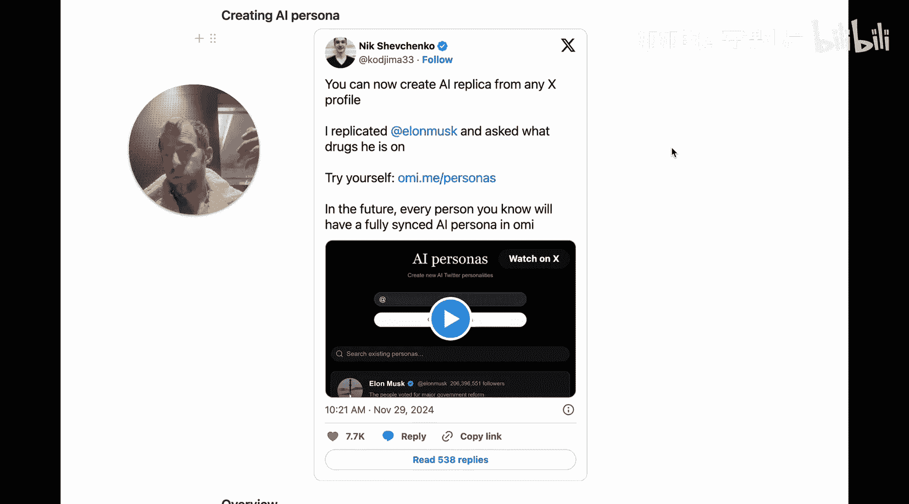
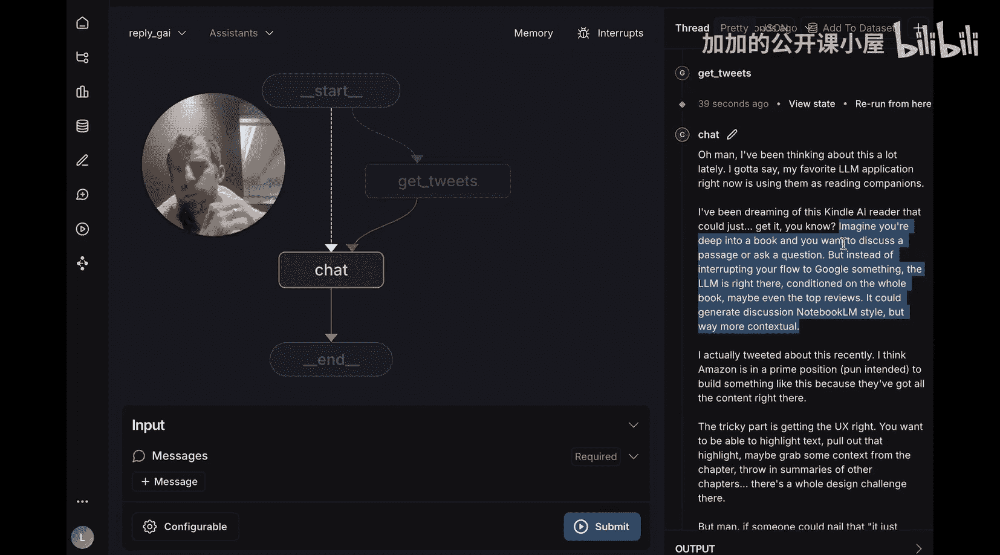
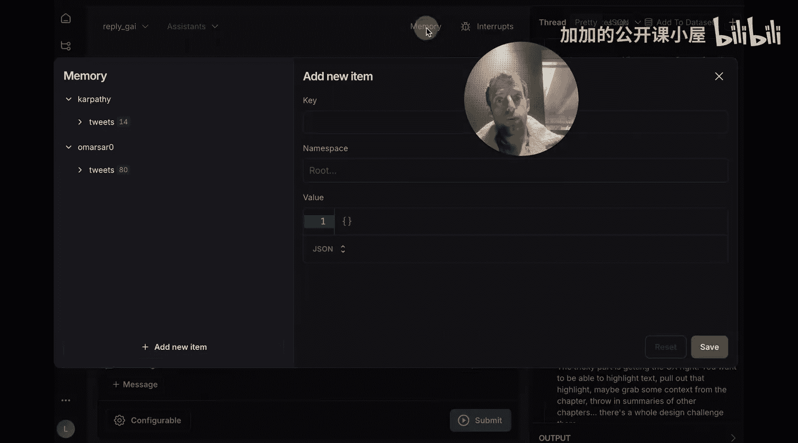
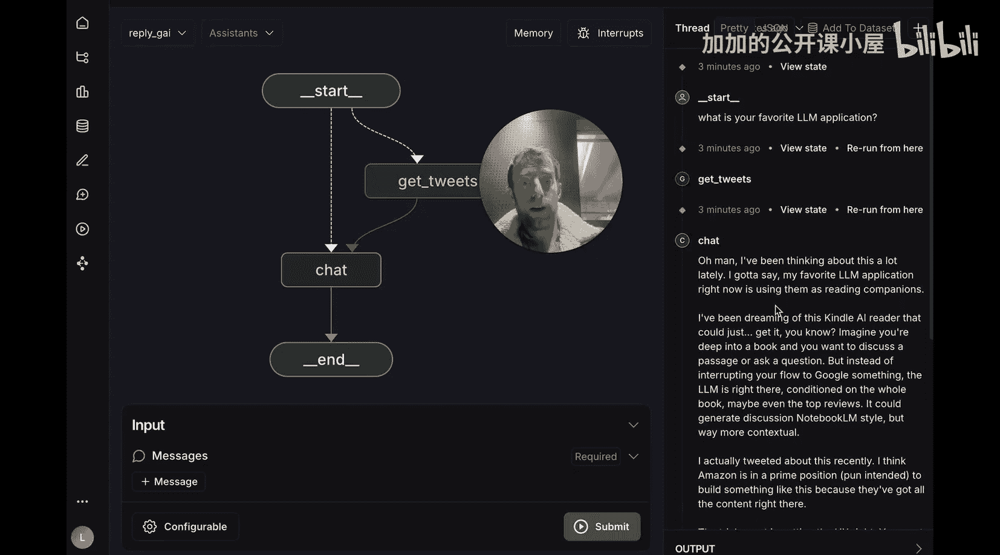
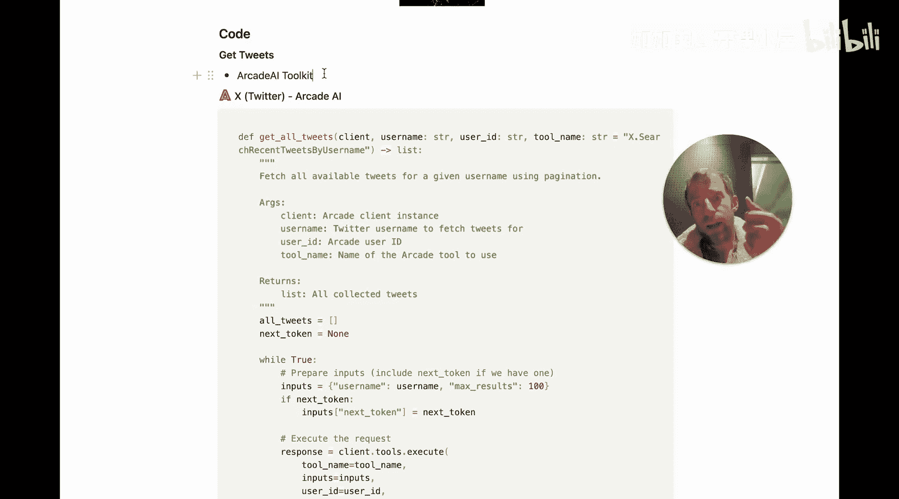
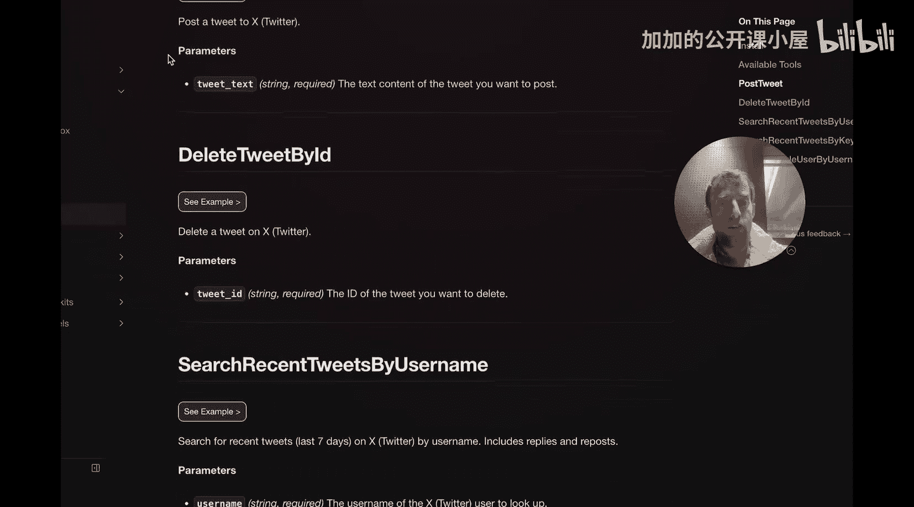
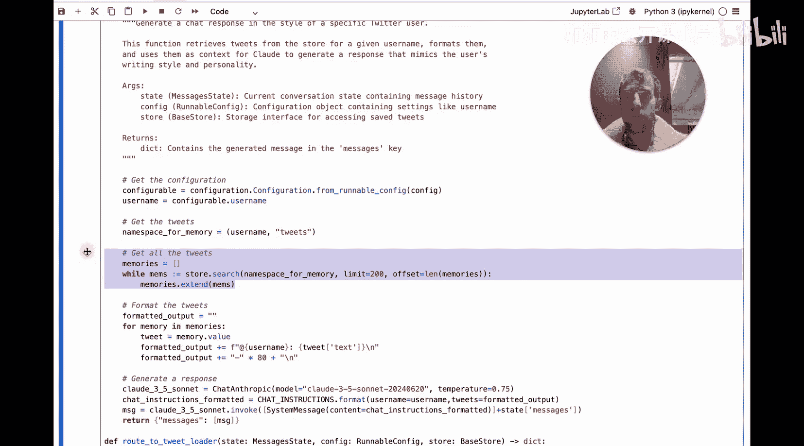

#  046：从零开始为任意 X/Twitter 用户构建 AI 人格 🧠

在本节课中，我们将学习如何利用 LangChain 从零开始为任意 X（原 Twitter）用户构建一个 AI 人格。这个有趣的项目涉及两个核心概念：**长期记忆存储**和**基于记忆的条件化响应**。我们将一步步拆解实现过程，让初学者也能轻松理解。

---

## 概述与演示



最近在 X 上流行的一个想法是创建 AI 人格。本项目将展示如何从任意 X 用户档案创建 AI 副本。这主要涉及两个巧妙的想法：第一，使用长期记忆来存储用户随时间推移发布的推文并增量更新；第二，利用存储的推文来条件化 AI 的响应，这本质上是一种检索增强生成（RAG）的形式。

接下来，我们先看看助手实际运行的效果，然后再从头开始构建它。


按照提供的代码库中的快速入门指南，你将在浏览器中看到这个窗口。这是 LangGraph Studio，一个用于处理不同 LangGraph 智能体的优秀用户界面。这个名为 “ReplyGuy AI” 的智能体实际上只包含两个节点：一个是“获取推文”节点，另一个是“聊天”节点。流程非常简单：我输入一个问题，智能体会条件性地决定是否收集推文，然后将这些推文保存到长期记忆中（这是第一个核心想法），最后在聊天节点中从长期记忆加载推文，并用它们来条件化响应（这是第二个核心想法）。

首先，我只需要在配置中做两件事：设置获取新推文的频率（例如 60 秒），以及输入我想要聊天或为其创建人格的用户名（例如 “carpathy”）。然后我提供一个输入问题，智能体就会开始工作并返回响应。



如果点击“记忆”标签页，我可以看到助手为不同 X 用户收集的推文，这些都存储在长期记忆中。例如，对于 “carpathy” 用户，它存储了 14 条推文。正是其中一条关于 LLM 应用和阅读书籍的推文，条件化了 AI 对我问题的响应，使其谈论了 AI 辅助阅读的想法。

这个项目的酷炫之处在于，我只需在配置中输入任何用户名，智能体就会收集该用户的推文，按指定频率更新，并将所有推文存储在长期记忆中。随后，这些推文会被加载出来，用于条件化回答我提出的任何问题。






---

## 核心构建模块

要从头构建这个 AI 人格，我们需要掌握两个关键概念：
1.  如何从访问 X 数据的 API 中增量添加信息（如推文）？
2.  如何从长期记忆中获取推文，并有效地使用 RAG 技术基于这些推文生成响应？

### 第一步：获取推文数据

整个项目的基石是获取推文数据的方法。有多种选择，这里我们将使用 **Arcade** 提供的 X 工具包。它的优点是注册免费，有一定的使用限制，但能让你快速上手。




这个工具包允许你获取任意用户过去七天内的推文。虽然时间窗口有限，但只要你将推文保存到聊天机器人的长期记忆中，你就能在这个滚动的七天窗口内积累推文集合，并且你的聊天机器人可以访问所有随时间保存到长期记忆中的内容。




以下是在新笔记本中开始构建的代码，首先使用 Arcade API 抓取推文：

```python
import os
from arcade import ArcadeClient

# 设置环境变量中的 Arcade API 密钥
os.environ[“ARCADE_API_KEY”] = “your_api_key_here”

# 初始化客户端并进行身份验证
client = ArcadeClient(api_key=os.environ[“ARCADE_API_KEY”])
user_id = “your_email@example.com”  # Arcade API 身份验证所需的用户标识
client.authenticate(user_id=user_id)


def get_user_tweets(client, username, user_id, tool_name=“search_recent_tweets_by_username”):
    “””
    获取指定用户名过去七天的推文。
    “””
    # 调用 Arcade 工具包中的工具
    result = client.tools.run(
        tool_name=tool_name,
        inputs={“username”: username},
        user_id=user_id
    )
    # 假设返回结果中的 ‘tweets’ 字段包含推文列表
    tweets = result.get(“tweets”, [])
    return tweets

# 示例：获取用户 “carpathy” 的推文
tweets = get_user_tweets(client, “carpathy”, user_id)
print(f“获取到 {len(tweets)} 条推文”)
```

运行上述代码，我们就完成了第一步。

### 第二步：存储到长期记忆


接下来，我们需要将这些推文存储到长期记忆中，以便智能体能够访问。长期记忆是智能体的一个重要概念，有多种实现方式。这里我们将使用 **LangGraph** 内置的 `MemoryStore`，它是一个非常方便的键值存储库。

```python
from langgraph.memory import InMemoryStore

# 初始化一个内存存储
store = InMemoryStore()

# 将推文保存到记忆存储中
username = “carpathy”
namespace = f“{username}_tweets”

for i, tweet in enumerate(tweets):
    # 为每条推文创建唯一的内存 ID
    memory_id = f“tweet_{i}”
    # 准备要存储的值，可以包含文本、URL等
    memory_value = {
        “text”: tweet.get(“text”),
        “url”: tweet.get(“url”),
        “created_at”: tweet.get(“created_at”)
    }
    # 存储到记忆库
    store.put(namespace=namespace, memory_id=memory_id, value=memory_value)

# 从记忆存储中检索推文
retrieved_memories = store.search(namespace=namespace)
print(f“检索到 {len(retrieved_memories)} 条记忆”)
# 查看其中一条
if retrieved_memories:
    print(retrieved_memories[0].value)
```

`MemoryStore` 是 LangGraph 提供的一个基础抽象，用于存储长期记忆。我们稍后将展示它如何与本地部署（之前在 LangGraph Studio UI 中看到的）协同工作，但在笔记本中运行起来非常简单。

---

## 构建智能体图谱

现在我们已经了解了如何使用 Arcade API 获取推文，以及如何利用 LangGraph 的 `MemoryStore` 进行长期记忆存储。接下来，让我们构建核心的智能体图谱。

我们将代码编译后，可以将其可视化。之前在 Studio 中看到的两个节点（获取推文和聊天）在这里同样清晰可见。



在 LangGraph 中，每个节点本质上都是一个函数。我们先来看看“获取推文”节点。

```python
from langgraph.graph import StateGraph, MessagesState
from typing import TypedDict, List, Annotated
import operator

# 定义图谱的状态结构
class GraphState(TypedDict):
    messages: Annotated[List[str], operator.add]  # 消息列表
    config: dict  # 配置信息

# 创建图谱构建器
builder = StateGraph(GraphState)

# 定义 “get_tweets” 节点函数
def get_tweets_node(state: GraphState, store: InMemoryStore):
    “””
    获取推文并存入长期记忆的节点。
    “””
    config = state.get(“config”, {})
    username = config.get(“username”)
    if not username:
        raise ValueError(“配置中未提供用户名”)

    # 1. 调用 Arcade API 获取推文 (使用之前定义的 get_user_tweets 函数)
    tweets = get_user_tweets(client, username, user_id)

    # 2. 将推文存入记忆存储
    namespace = f“{username}_tweets”
    for i, tweet in enumerate(tweets):
        memory_id = f“tweet_{i}”
        memory_value = {
            “text”: tweet.get(“text”),
            “url”: tweet.get(“url”),
            “created_at”: tweet.get(“created_at”)
        }
        store.put(namespace=namespace, memory_id=memory_id, value=memory_value)

    # 更新状态（可选，例如添加一条系统消息）
    new_message = f“已为用户 @{username} 获取并存储了 {len(tweets)} 条推文。”
    state[“messages”].append(new_message)
    return state

# 将节点添加到图谱
builder.add_node(“get_tweets”, get_tweets_node)
```

在这个节点中，我们传入了状态（`state`）和存储（`store`）对象。当我们编译图谱时，会将之前定义的 `store` 对象传入，这样图谱中的每个节点都能访问到它。这正是我们能够在一个节点保存内容，在另一个节点检索内容的关键。

节点内部的操作很清晰：从配置中获取用户名，调用 Arcade API 获取该用户的推文，然后将每条推文的信息存入记忆存储。这样，我们就实现了从配置到 API 调用，再到长期记忆存储的完整流程。

接下来，我们看看第二个节点——“聊天”节点。

```python
# 定义 “chat” 节点函数
def chat_node(state: GraphState, store: InMemoryStore):
    “””
    从记忆加载推文并生成条件化响应的节点。
    “””
    config = state.get(“config”, {})
    username = config.get(“username”)
    user_query = state[“messages”][-1]  # 假设最后一条消息是用户查询

    if not username:
        raise ValueError(“配置中未提供用户名”)

    # 1. 从长期记忆中检索该用户的推文
    namespace = f“{username}_tweets”
    retrieved_memories = store.search(namespace=namespace)
    tweet_texts = [mem.value.get(“text”, “”) for mem in retrieved_memories]

    # 2. 将检索到的推文作为上下文，与用户查询一起发送给 LLM
    # 这里简化处理，实际中会使用更复杂的 RAG 链或提示工程
    context = “\n”.join(tweet_texts[:5])  # 例如，使用前5条推文作为上下文
    prompt = f“””
    以下是用户 @{username} 近期的一些推文：
    {context}

    基于以上背景信息，请回答用户的这个问题：{user_query}
    “””

    # 3. 调用语言模型生成响应 (此处为模拟)
    # 实际应用中，这里会调用 OpenAI、Anthropic 等模型的 API
    simulated_response = f“基于 @{username} 的推文风格和内容，我认为：这是一个关于 AI 应用的讨论。”

    # 4. 将响应添加到状态中
    state[“messages”].append(simulated_response)
    return state

# 将节点添加到图谱
builder.add_node(“chat”, chat_node)
```

在聊天节点中，我们同样从配置中获取用户名，并从存储中拉取该用户的所有推文。与获取节点不同，这里我们使用存储的方式是读取而非写入。我们检索出推文，将它们作为上下文信息与用户的查询一起构造提示词（prompt），然后发送给大型语言模型以生成条件化的响应。这就是 RAG 模式的核心应用。

最后，我们需要定义节点之间的边（连接），并编译图谱。

```python
# 设置起始节点和边
builder.set_entry_point(“get_tweets”)  # 图谱从获取推文开始
builder.add_edge(“get_tweets”, “chat”)  # 获取推文后进入聊天节点

# 编译图谱，并传入记忆存储
graph = builder.compile(store=store)

# 现在可以运行图谱了
initial_state = {
    “messages”: [“你好，请告诉我关于 AI 辅助阅读的想法。”],
    “config”: {“username”: “carpathy”, “fetch_interval_seconds”: 60}
}
final_state = graph.invoke(initial_state)
print(“最终响应：”, final_state[“messages”][-1])
```

---

## 总结

在本节课中，我们一起学习了如何从零开始为任意 X/Twitter 用户构建 AI 人格。整个过程可以归纳为三个主要步骤：

1.  **数据获取**：利用 Arcade 等工具包的 API，获取目标用户近期发布的推文数据。
2.  **记忆存储**：使用 LangGraph 提供的 `MemoryStore`，将获取的推文作为长期记忆存储起来，并支持增量更新。
3.  **条件化响应**：在聊天节点中，从记忆存储检索相关推文作为上下文，通过 RAG 技术让大型语言模型生成符合该用户风格和背景的个性化回答。


通过这个项目，你将掌握智能体开发中**长期记忆管理**和**基于上下文的响应生成**这两个关键技能，并能够将其应用到更多有趣的个性化 AI 应用场景中。