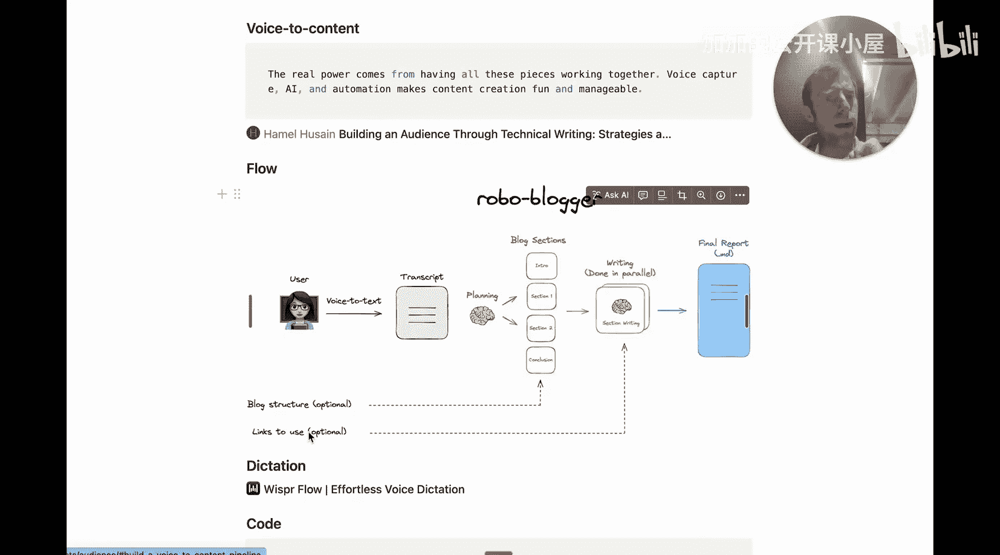
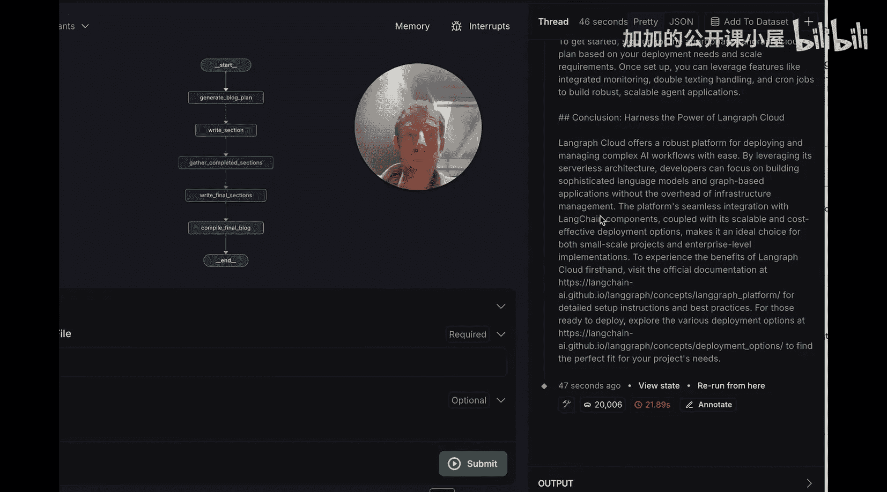
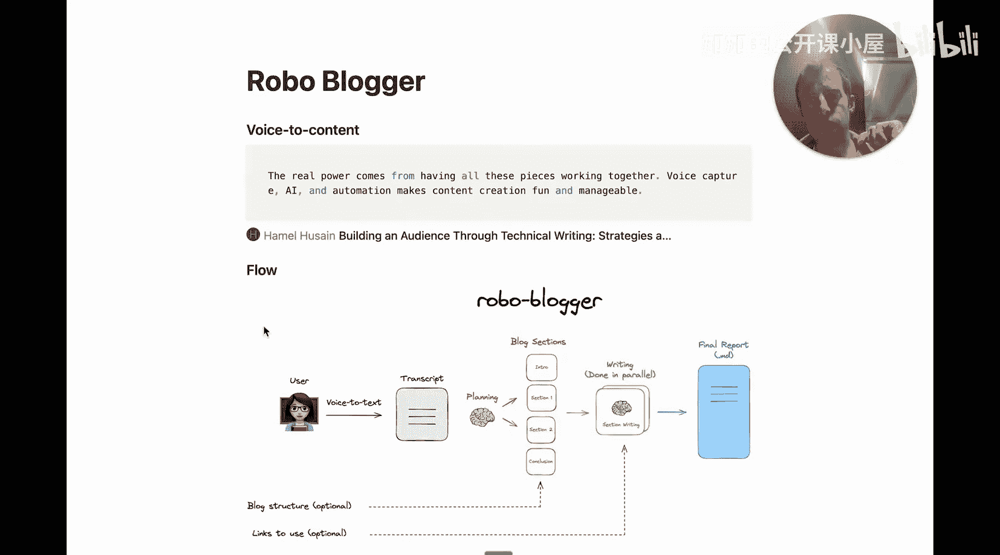
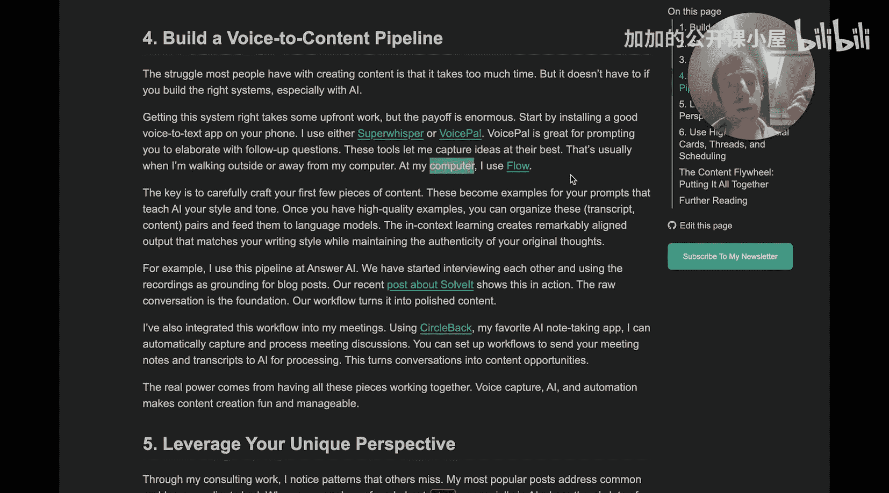
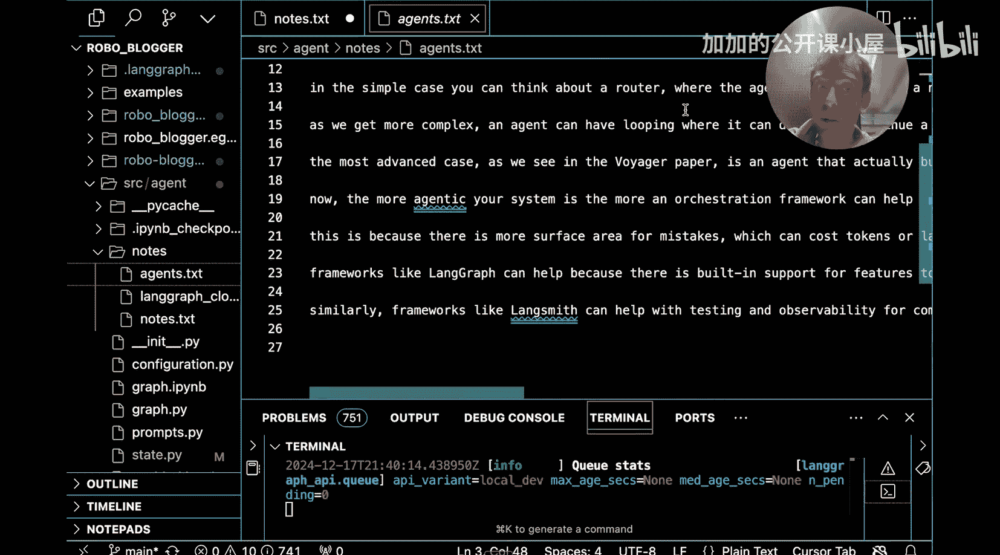
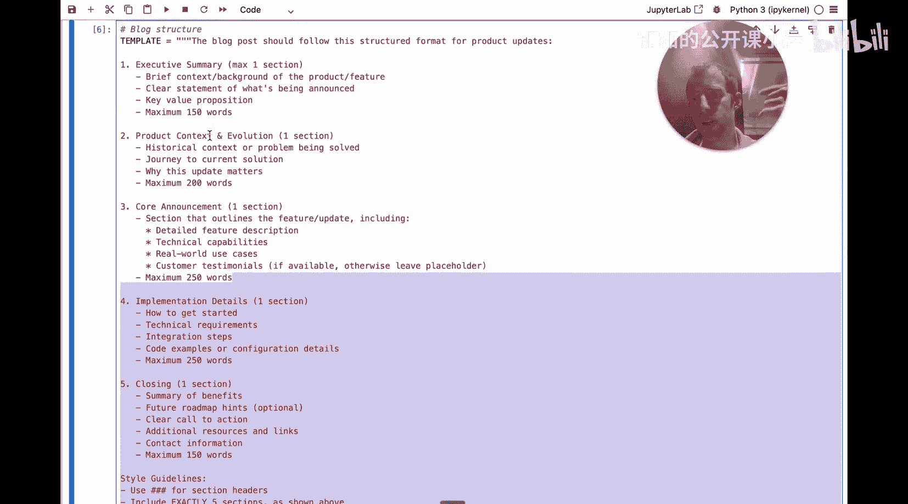

#  047：构建一个由LLM驱动的语音转内容助手 🎙️➡️📝

在本教程中，我们将学习如何从零开始构建一个名为“RobboBger”的语音转内容助手。这个助手能够将你的语音想法转录成文字，并结合你提供的博客结构和参考链接，生成一篇高质量的博客文章初稿。我们将分步解析其核心组件，包括语音转录、内容规划和并行写作。

---

## 概述



在本节课中，我们将要学习如何构建一个完整的“语音转内容”自动化流程。这个流程旨在解决博客写作中的“冷启动”问题，帮助你将脑海中的想法快速转化为结构清晰、内容丰富的博客草稿。我们将使用 LangChain 框架，并重点介绍规划步骤的重要性。

---

## 语音转录 🎤

上一节我们介绍了项目的整体目标，本节中我们来看看流程的第一步：语音转录。

用户首先需要使用一个语音转文本应用，将想要撰写的博客内容以“意识流”的形式口述出来，并生成文字记录（Transcript）。这是整个流程的输入起点。

以下是创建转录文件的步骤：



1.  选择一个语音转文本工具（例如 FlowVoice.AI）。
2.  打开工具，开始口述你的博客想法。
3.  完成口述后，停止录音并生成文字转录。
4.  将生成的文本保存到一个文件中（例如 `notes/` 目录下的 `.txt` 文件）。

**核心代码/操作示例：**
在代码仓库的 `notes/` 目录下创建一个文本文件，并使用语音工具将内容录入该文件。

```plaintext
# 示例：保存转录内容到 notes/my_blog_idea.txt
# 文件内容可能是：
“我想写一篇关于LangGraph Cloud的博客。LangGraph Cloud是一个部署LangGraph智能体的好方法，它有几个优势功能，比如双工通信、支持流式处理、长短期记忆等。可以先介绍LangGraph及其动机，然后谈谈产品化面临的一些挑战...”
```






---

## 内容规划 📋

现在我们已经有了原始的语音转录文本，接下来进入核心的规划阶段。构建一个独立的规划步骤至关重要，它能提升最终内容的质量，并允许后续的章节并行写作，同时也便于单独调试。

我们将使用 LangGraph 来构建这个规划节点。该节点的功能是调用大语言模型（如 GPT-3.5），根据用户提供的转录文本和自定义的博客结构，生成一个结构化的博客大纲。

**核心概念与步骤：**



1.  **定义输出结构**：我们使用 Pydantic 模型来定义博客章节的格式。
    ```python
    from pydantic import BaseModel, Field
    from typing import List

    class Section(BaseModel):
        name: str = Field(description="章节标题")
        description: str = Field(description="章节描述")
        content: str = Field(description="章节的详细内容")
        is_main_body: bool = Field(description="是否是博客主体部分")

    class BlogPlan(BaseModel):
        sections: List[Section]
    ```

2.  **构建系统提示词**：提示词将指导模型如何工作。
    ```python
    blog_planner_instructions = """
    你是一名专业的技术写手，负责帮助规划博客文章。
    你的目标是生成一个简洁的提纲。
    请仔细思考用户的这些笔记（即转录文本）。
    接下来，将这些笔记按照以下提供的结构，精确地组织成一系列章节。
    """
    ```

3.  **执行规划**：将用户转录、博客结构（如“执行摘要、产品背景、核心功能、结论”）和可选的参考链接传递给模型，并请求其输出符合 `BlogPlan` 格式的结构化内容。

**执行示例：**
假设我们有一个关于“LangGraph Cloud”的转录文件和一个产品更新类的博客结构模板，运行规划节点后，我们可能会得到如下章节列表：
- 执行摘要
- LangGraph 简介与背景
- 生产化挑战
- LangGraph Cloud 的核心特性
- 如何开始使用
- 总结

---

## 并行写作与整合 ✍️

在获得详细的博客章节规划后，我们就可以进入写作阶段。由于规划阶段已经定义了独立的章节，这些章节可以被**并行撰写**，从而显著提高效率。

以下是写作流程：

1.  **章节分配**：将规划阶段输出的 `sections` 列表中的每个章节，作为一个独立的写作任务。
2.  **调用写作模型**：为每个章节任务调用大语言模型。除了该章节的标题和描述，我们还可以提供：
    - 完整的用户原始转录，作为核心内容来源。
    - 相关的参考链接（URLs），用于获取准确信息或引用。
    - 统一的写作风格要求。
3.  **内容整合**：所有章节完成写作后，将它们按照规划的顺序组合起来，形成一篇完整的 Markdown 格式的博客文章。

通过这种方式，我们最终能将一段随意的语音记录，转换为一篇结构完整、内容充实的博客草稿。

---

## 总结



本节课中我们一起学习了构建“语音转内容”助手（RobboBger）的全过程。我们从**语音转录**开始，将想法转化为文本输入。然后，我们深入探讨了**内容规划**这一关键步骤，它通过结构化提示词和大语言模型生成了清晰的博客大纲。最后，我们利用规划结果进行**并行写作与整合**，高效地生成了高质量的博客文章初稿。这个流程有效地降低了写作的启动门槛，将创意快速转化为可用的内容草稿。