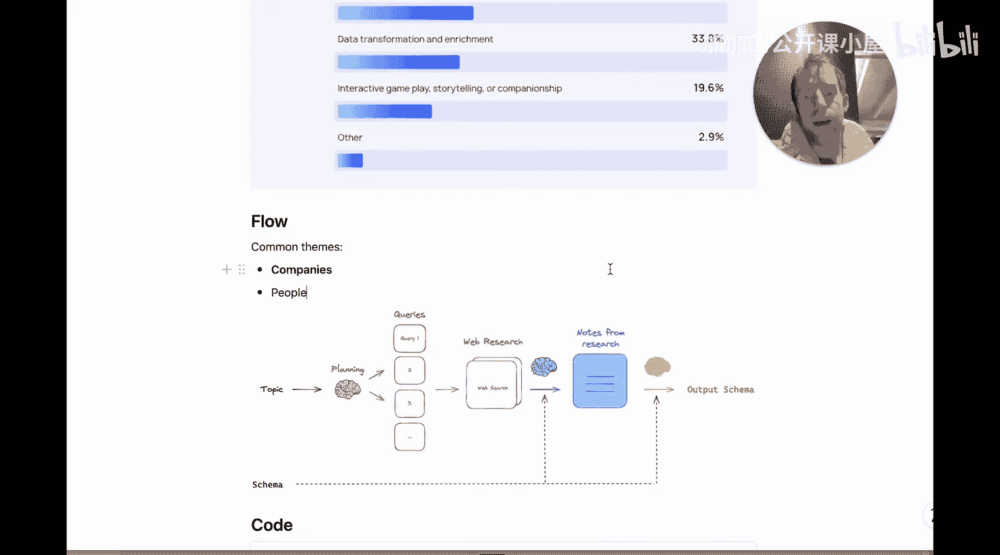
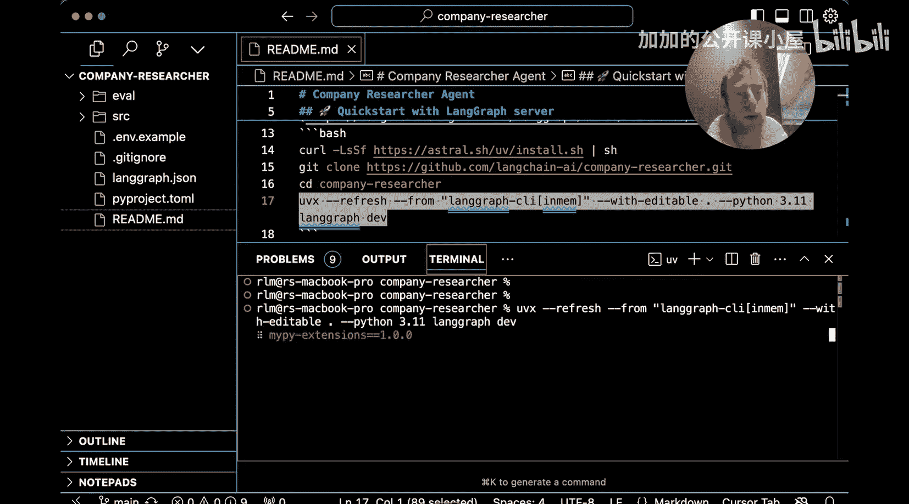
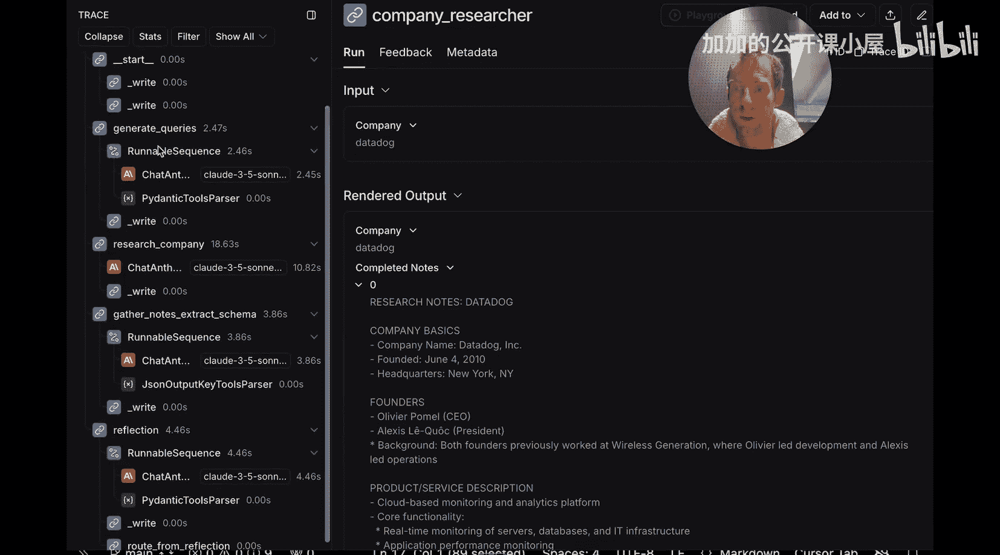
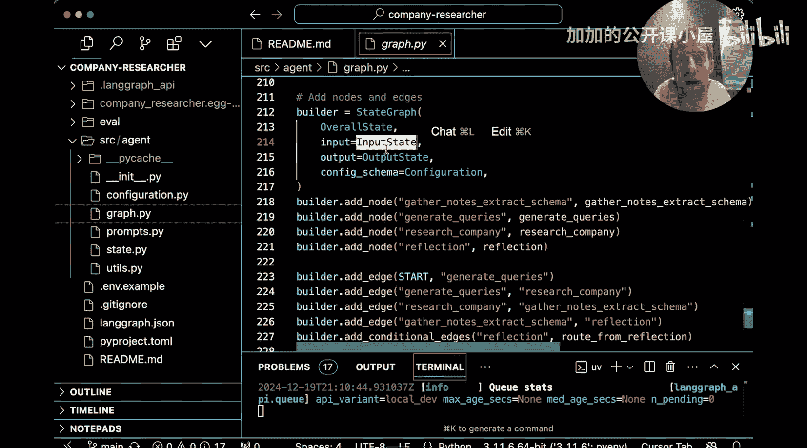
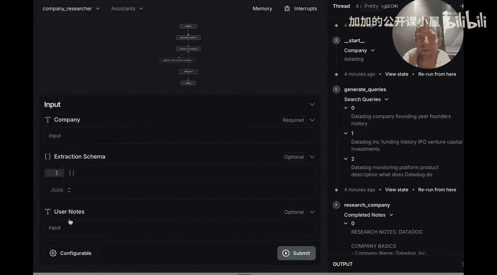
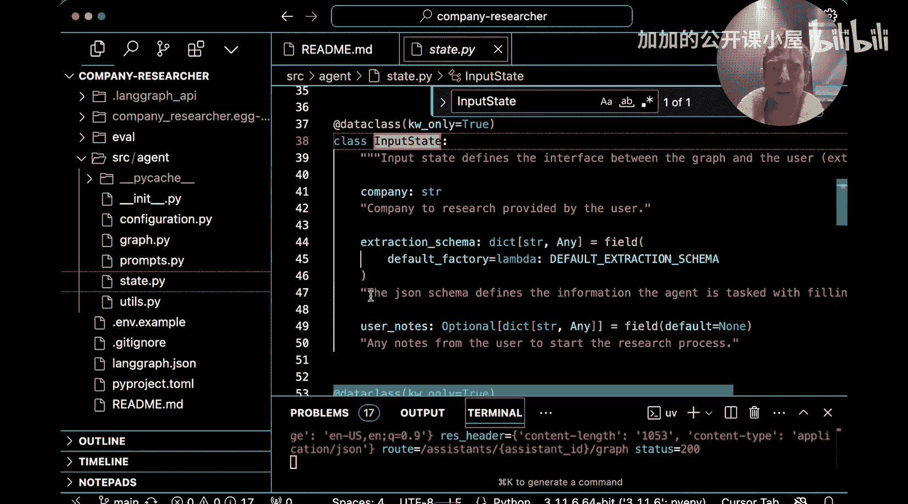
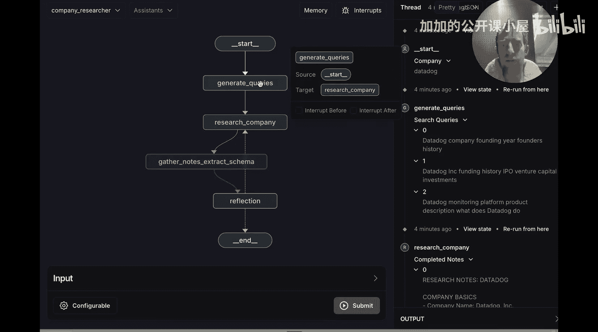
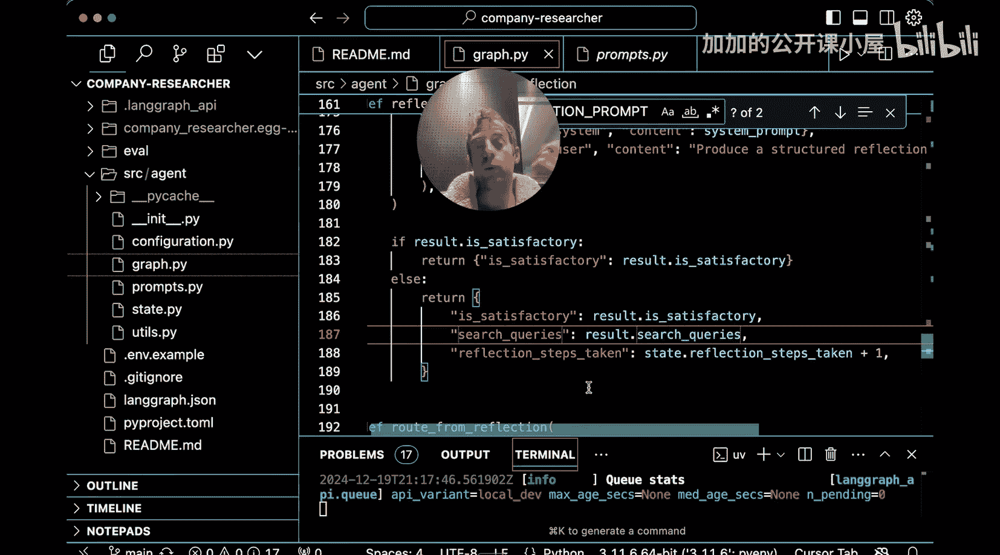

#  048：从零构建公司研究智能体 🏢

在本节课中，我们将学习如何利用 LangChain 构建一个“公司研究智能体”。这个智能体能够将开放式的网络研究，转化为结构化的数据输出，非常适合用于数据丰富和转换任务。

## 概述



我们首先介绍一个适用于“丰富型”智能体的通用工作流程。该流程的核心思想是：从一个开放的研究主题出发，最终输出一个可用于填充数据库的特定模式。这本质上是一个从非结构化、开放式信息到结构化输出的转换过程。

## 通用工作流程 🔄

以下是经过验证、效果良好的通用范式：



1.  **用户提供主题**：用户输入一个想要研究的主题。
2.  **大语言模型进行规划**：大语言模型根据主题，规划并生成一系列搜索查询。
3.  **执行网络研究**：智能体根据这些查询进行网络搜索。
4.  **整合研究笔记**：基于所有搜索结果，生成一份整合后的研究笔记。
5.  **提取为最终模式**：将这些笔记压缩或提取，填入最终的目标数据结构（模式）。

这个流程清晰地展示了从研究到输出模式的完整路径。接下来，我们将通过一个具体的“公司研究员”示例来演示。

## 快速上手 🚀

开始使用非常简单。首先克隆项目仓库，并确保设置好所需模型的 API 密钥。本项目默认配置使用 Anthropic 的模型和 Tavily 搜索引擎。Tavily 是一个优秀的、提供免费额度的搜索引擎，非常适合用于智能体开发。当然，你可以根据需要更换大语言模型和搜索引擎。



克隆仓库后，只需运行以下命令即可启动一个本地的 LangGraph 服务器：

```bash
python app/server.py
```





运行后，你将在浏览器中看到 LangGraph Studio 界面。在这里，你可以打开输入标签页，提供你想要研究的公司名称（例如 `Datadog`），并可选择性地提供目标数据模式或额外的用户备注。只有公司名称是必填项。





点击运行后，你可以实时观察智能体的执行过程：生成搜索查询、执行公司研究、从研究过程中提取笔记，最后完成。整个过程使用了 Tavily 进行网络搜索。

研究完成后，智能体会将所有研究笔记（你可以在此处查看）提取并填充到一个预设的数据模式中。接着，它会进行一次“反思”，检查所有字段是否都已填充。如果满足条件，则任务完成。

你可能会问：我们没有提供模式，它从哪里来？实际上，智能体有一个内置的默认模式。我们稍后会在代码中看到它。这个默认模式包含了 `公司名称`、`创立摘要`、`产品描述` 和 `创始人` 等字段。当然，你可以随时修改它。

## 深入代码 🔍

如果你想了解背后的运行机制，可以在 LangGraph Studio 中点击图标，在 LangSmith 中打开追踪记录。这将展示所有底层步骤：初始查询生成阶段、研究阶段、反思阶段。

要理解代码，请查看仓库中的 `source/agent.py` 文件。通常，查看 LangGraph 代码时，建议直接跳到底部查看图（Graph）是如何编译的。你会看到一个 `builder`，它接收一个 `state`（状态）。状态包含了智能体运行所需的一切，分为输入状态（用户看到的内容）和输出状态（最终提供给用户的内容）。

在 Studio 中看到的输入字段（`company`， `extraction_schema`， `user_notes`）就定义在 `state.py` 中。

回到 Studio 的图视图，我们可以看到多个节点：`generate_queries`（生成查询）、`research_company`（研究公司）、`gather_notes_and_extract_schema`（收集笔记并提取模式）和 `reflect`（反思）。这些节点都在 `agent.py` 中通过 `add_node` 方法添加。每个节点都是一个简单的函数。

*   **`generate_queries` 节点**：接收状态（包含用户输入），利用结构化输出功能生成一个搜索查询列表，并将其返回给状态。
*   **`research_company` 节点**：接收上一步生成的查询，使用 Tavily 执行网络搜索，并根据搜索结果生成初步的笔记。这里的关键点是，笔记生成**不**使用结构化输出，而是让模型根据提供的模式，自由地记录相关信息。我们发现在提取前先进行一个笔记整理阶段，比试图一步到位直接提取能产生更高质量的结果。
*   **`gather_notes_and_extract_schema` 节点**：这是执行提取的步骤。它接收所有整理好的笔记和目标模式，使用支持结构化输出的大语言模型（本例中是 Claude 3.5），生成符合模式的最终结构化输出。
*   **`reflect` 节点**：这是一个可以在图中加入的有趣步骤。它接收模式以及上一步提取的对象，使用一个反思提示词来评估提取信息的质量和完整性（返回“是”或“否”的二元评分）。这实际上是一个条件边（conditional edge）。如果结果令人满意，则返回最终结果。如果不满意，智能体会在此步骤中生成新的查询以填补缺失信息，然后重新执行搜索。路由逻辑由 `route_from_reflection` 函数处理。

## 总结



本节课中，我们一起学习了如何构建一个公司研究智能体。我们首先介绍了一个从开放式研究到结构化输出的通用工作流程，然后通过一个具体示例演示了如何快速启动并运行该智能体。最后，我们深入代码，剖析了智能体图中各个节点（生成查询、研究公司、提取模式、反思）的功能与协作方式。这个智能体框架清晰、模块化，你可以轻松地修改提示词、数据模式或底层工具（如搜索引擎），以适应不同的研究或数据丰富任务。