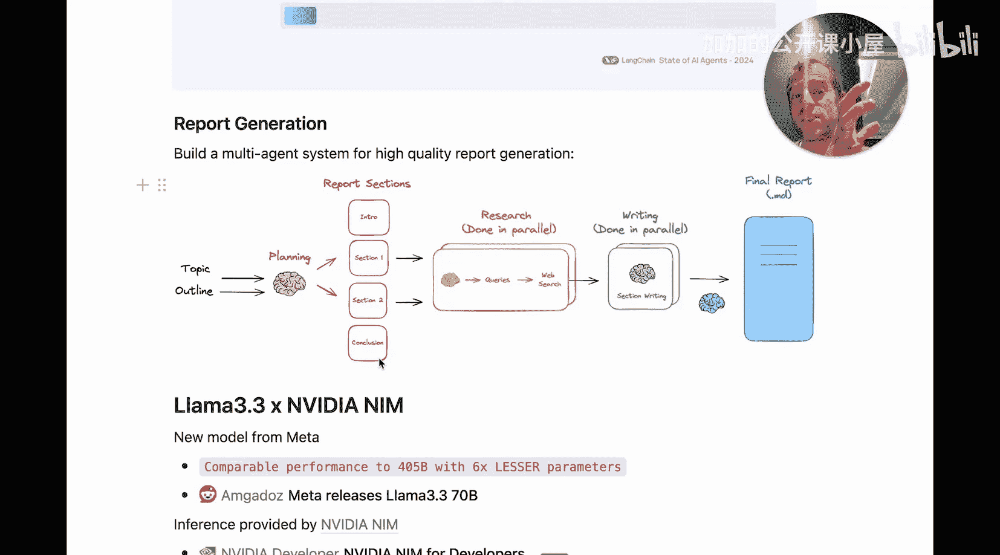
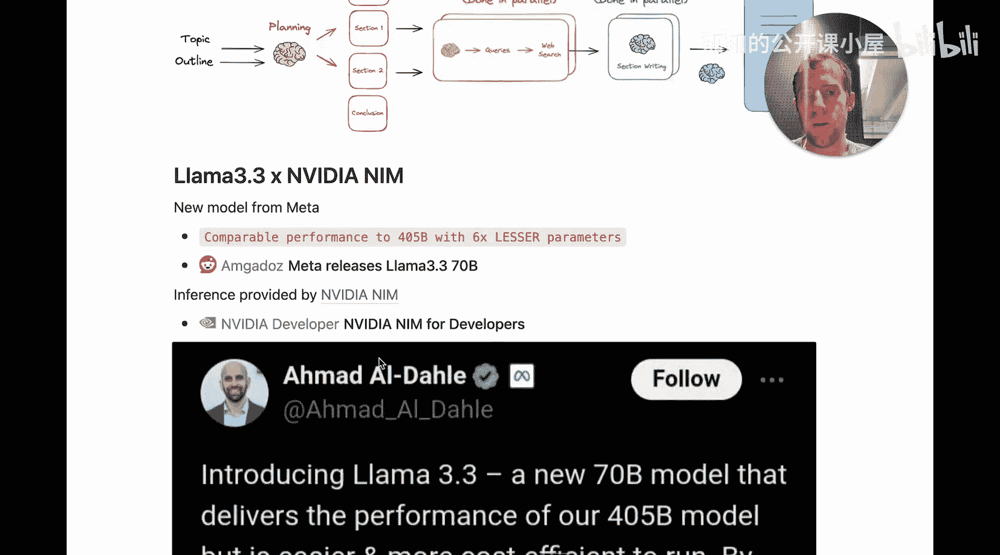
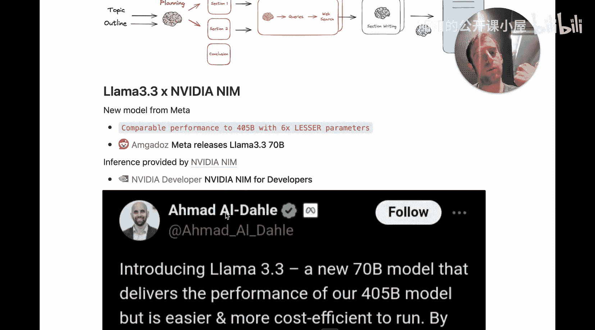
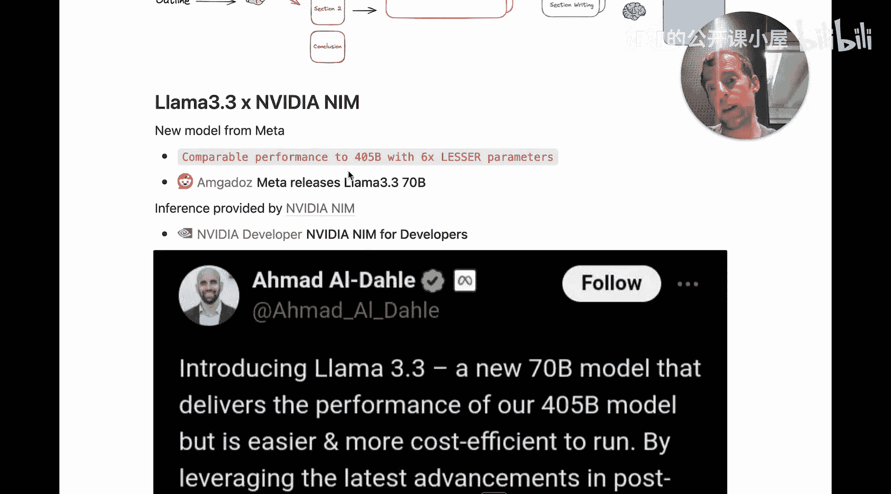
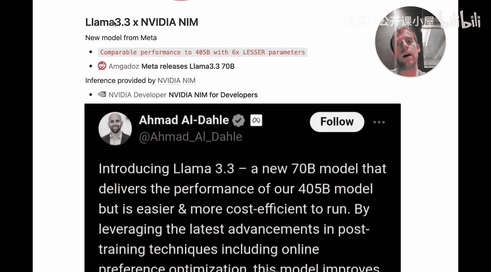
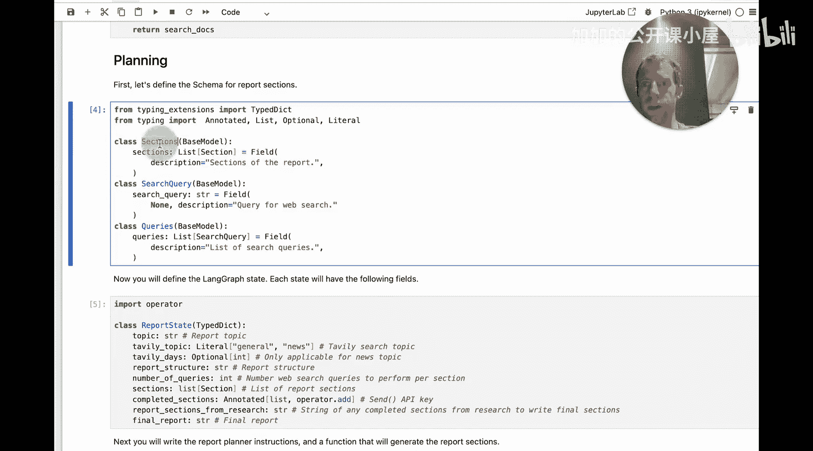

#  050：使用 NVIDIA AI (Llama 3.3) 构建结构化报告生成蓝图

## 概述
在本节课中，我们将学习如何构建一个用于自动化研究和总结的多智能体系统。我们将使用 Meta 新发布的 Llama 3.3 模型和 NVIDIA NIM 推理服务，通过 LangChain 框架实现一个能够生成结构化报告的智能体架构。

## 什么是智能体？
上一节我们介绍了本课程的目标，本节中我们来看看什么是智能体。

简单来说，智能体是一种由大型语言模型（LM）控制整体流程的应用程序。例如，在 RAG（检索增强生成）应用中，控制流程是固定的：先检索，再将结果传递给 LM 生成答案。而在智能体中，应用程序的流程由 LM 自身决定。

在本案例中，流程如下：我输入一个主题和一个大纲，LM 随后会创建一定数量的报告章节。它可以自由决定基于我的输入生成多少个章节，可能是一个，也可能是二十个。这实际上决定了整个下游应用程序的流程，即它选择生成多少个报告章节。

我喜欢这种方式，因为它允许我：
1.  在调试时查看这些章节，判断大纲是否合适。
2.  在构建过程中，可以大量迭代这个规划提示词。

## 多智能体报告生成架构
上一节我们定义了智能体，本节中我们来看看具体的报告生成架构。

我使用的这个用于完整报告生成和研究的架构，我认为是一个多智能体系统。

**核心流程如下：**
1.  **规划阶段**：智能体首先生成一系列报告章节。将所有需要网络研究的主体章节进行标记，而引言和结论等章节则不需要研究。
2.  **并行研究**：对于每个需要研究的主体章节，智能体（或可视为子智能体）会生成一系列搜索查询，并发起网络搜索。然后基于搜索结果进行进一步处理并撰写该章节。所有主体章节的撰写是并行进行的。
3.  **反思与总结**：最后，另一个 LLM 会反思所有通过研究撰写的主体章节，然后撰写最终的章节（如引言和结论）。

**架构优势：**
*   **效率**：首先生成章节规划，可以并行撰写许多章节，从而实现高效的整体写作过程。
*   **质量**：我发现分章节单独撰写，比要求助手或智能体一次性撰写整份报告的质量要好得多。
*   **连贯性**：采用顺序写作流程（先主体，后引言/结论）能产生更好的整体效果。因为引言和结论是基于已撰写的主体内容生成的，比所有章节完全并行生成后再拼接引言和结论要连贯得多。




## 技术选型：Llama 3.3 与 NVIDIA NIM
上一节我们了解了架构，本节中我们来看看实现它的技术工具。

我将展示如何使用 Llama 3.3 和 NVIDIA NIM 来构建这个系统。

Llama 3.3 是 Meta 的新版本模型。它的亮点在于，它以少 6 倍的参数（700 亿参数）实现了与之前更大模型（如 Llama 4 或 5B）相当的性能，因此运行更快，部署更容易。



但问题是，700 亿参数对于我的笔记本电脑（只有 32GB 内存）来说太大，无法本地运行。因此，对于许多人来说，需要找到一个推理服务提供商。这就是 **NVIDIA NIM** 的用武之地。它是一个托管模型的绝佳方式。




这两者结合得很好。我将展示如何在 NVIDIA NIM 上运行 Llama 3.3，这是一个非常简单且优秀的选择。

在深入代码之前，我需要快速提两件事：
1.  本视频将链接到包含所有代码的 Cookbook。
2.  在 Cookbook 中，你会看到一个 **NVIDIA Launcher** 按钮。只需点击一下，就可以将 Notebook 部署到预配置好环境的 GPU 上，这是一个快速入门的绝佳方式。




## 代码实现详解
上一节我们介绍了技术栈，本节中我们开始深入代码实现。


打开 Notebook，你会看到我们要构建的多智能体架构的整体示意图。

首先，我们需要设置一些 API 密钥：
*   确保设置了 NVIDIA API 密钥以访问 NIM。
*   我们将使用 LangSmith 进行追踪。
*   你还需要 **Tavily** 进行网络搜索。Tavily 是一个非常方便的网络搜索引擎，免费额度大约有 1000 次请求，我经常在各种智能体中使用它。

设置好这些，就可以开始了。


### 初始化 Llama 3.3 模型
以下是初始化模型的关键步骤：

```python
# 使用 LangChain 集成调用 NVIDIA NIM 上的 Llama 3.3 70B Instruct 模型
from langchain_nvidia_ai_endpoints import ChatNVIDIA

llm = ChatNVIDIA(model="meta/llama-3.3-70b-instruct")
```

初始化后，我们可以直接调用它：

```python
response = llm.invoke("Hello, world!")
print(response.content)
```

### 使用结构化输出
我们将贯穿整个智能体使用一个非常有用的技巧：**结构化输出**。

LangChain 的许多 LLM（包括 NVIDIA）都提供了 `with_structured_outputs` 方法。你可以直接传入一个模式（例如 Pydantic 模型），然后就可以简单地调用 LLM，并轻松地从输出对象中提取结构化字段。

以下是一个简单示例：

```python
from pydantic import BaseModel, Field
from langchain_core.prompts import ChatPromptTemplate

# 1. 定义输出数据的结构（模式）
class SearchQuery(BaseModel):
    query: str = Field(description="生成的搜索查询")
    category: str = Field(description="查询所属的类别")

# 2. 将 LLM 绑定到结构化输出模式
structured_llm = llm.with_structured_output(SearchQuery)

# 3. 创建提示词
prompt = ChatPromptTemplate.from_messages([
    ("system", "根据主题生成一个结构良好的搜索查询。"),
    ("human", "主题：{topic}")
])

# 4. 创建处理链并调用
chain = prompt | structured_llm
result = chain.invoke({"topic": "人工智能的最新进展"})

# 5. 直接访问结构化字段
print(f"搜索查询：{result.query}")
print(f"类别：{result.category}")
```

结构化输出生成能力对于 LLM 来说非常通用，你会看到我们在这里大量使用它。

### 构建报告生成智能体
现在，让我们逐步讲解这个架构的每个部分。

我们将从用户提供**主题**和**结构**开始。

**第一步：生成报告计划**
我发现在进行大量报告生成时，从报告计划开始很有好处。首先，可以独立调试它；其次，实际上可以并行化撰写所有这些章节，从而使整体过程更快，并且通常比尝试一次性生成报告质量更高。

我们提供给智能体的两个输入是：
1.  **报告结构**：用自然语言描述。例如：“报告应包含引言、结论和一些主体部分。” 这完全可由用户用自然语言配置。
2.  **主题**：例如：“给我一个关于这些处理单元 GPU 与 CPU 的概述。”

为了启动这个过程，我们将调用 `generate_report_plan` 函数。

这里我想指出，我使用 **LangGraph** 来构建这个整体智能体。LangGraph 的一个优点是，当你构建一个 LangGraph 智能体时，每个节点只是一个普通的 Python 函数。这个函数接收一个 `state`（状态）。我们在这里定义的 `ReportState` 是一个包含许多字段的类型字典，这些字段将在智能体的整个生命周期中使用。LangGraph 的巧妙之处在于，随着智能体运行，这个状态在所有节点之间传递，并由智能体逐步填充字段。

**在初始的“生成报告计划”节点中，主要逻辑如下：**
1.  首先生成一些搜索查询。
2.  然后进行网络搜索。
3.  最后，生成结构化输出。该输出接收用户提供的主题、网络搜索结果和期望的报告结构，并生成一个报告章节的结构化输出列表。

那么这些章节从何而来？在 Notebook 中，我们定义了一个 Pydantic 模型 `ReportSection`。它基本上包含名称、描述、该章节是否需要研究以及内容。这就是报告的核心单元。我们定义 `Sections` 作为这些章节对象的列表。然后，我们将这个模式传递给 Llama 3.3 模型。




## 总结
本节课中，我们一起学习了如何构建一个基于 Llama 3.3 和 NVIDIA NIM 的多智能体结构化报告生成系统。我们从智能体的基本概念出发，探讨了分阶段、并行化的报告生成架构的优势，并详细讲解了利用 LangChain 和 LangGraph 实现该架构的关键技术点，特别是结构化输出的应用。这个蓝图展示了如何将强大的大模型与高效的工程实践相结合，来自动化完成高质量的研究和总结任务。