#  051：将 Chat-LangChain 添加到 Slack 🚀

## 概述
在本节课程中，我们将学习如何将 **Chat-LangChain** 问答助手集成到 **Slack** 工作环境中。通过本教程，你将能够在 Slack 中直接向 Chat-LangChain 提问，并获得来自 LangChain 官方文档的结构化答案。

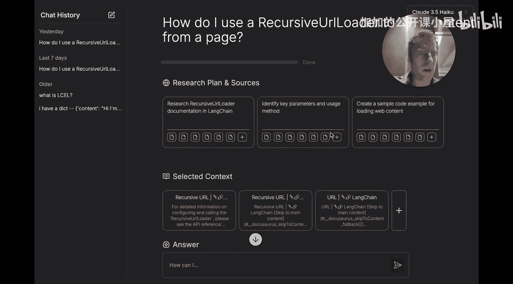

---

## 什么是 Chat-LangChain？🤖
Chat-LangChain 是一个免费的、流行的问答助手，专门用于回答关于 LangChain 官方文档的问题。你可以在 LangChain 文档页面找到它。它接受你的问题，并从 LangChain 文档中检索信息来生成结构清晰的答案。


## 为什么集成到 Slack？💬
我们发现，在 Slack 这样的协作环境中，拥有像 Chat-LangChain 这样的原生助手非常有用。例如，当你在 Slack 的某个讨论线程中突然想到一个问题时，你可以直接 @ 这个应用来获得答案。因此，我们将其设置为一个 Slack 应用，并且可以免费使用。

## 集成效果预览
以下是一个在特定 Slack 频道中设置好的示例。我可以通过 @ 机器人直接在 Slack 中提问，它会在我的问题下方以线程形式回复，并提供详细答案。更棒的是，我可以在这个线程中继续追问，机器人会保留聊天历史记录。

## 工作原理简介
在开始配置之前，让我们先简要了解一下其工作原理。整个流程涉及两个核心组件：
1.  **Slack 应用**：我们将在 Slack 中配置它。
2.  **LangChain 应用部署**：这可以是一个聊天机器人或智能体。

当我在 Slack 中 @ 机器人并提问时，会产生一个原始事件。这个事件需要以特定格式发送给我的聊天机器人或智能体。这就需要引入一个中间层来处理格式转换和路由。在本教程中，我们将使用 **Modal** 作为这个中间层。

## 整体流程概览
让我们梳理一下整个数据流：
1.  用户在 Slack 中 @ 机器人并提问。
2.  Slack 应用将事件路由到一个特定的端点（例如，一个正在运行的 Modal 服务器）。
3.  Modal 服务器接收事件，将其打包成我们部署的应用（如 Chat-LangChain）所期望的格式（例如，一条聊天消息）。
4.  聊天机器人处理消息并生成回复。
5.  回复被传递回 Modal 服务器的一个回调端点。
6.  Modal 服务器使用 Slack SDK 将回复消息发布回 Slack。

**核心代码逻辑（简化）**：
```python
# Modal 服务器处理来自 Slack 的事件
def handle_slack_event(event):
    # 将 Slack 事件转换为聊天消息格式
    chat_message = format_event_to_message(event)
    # 发送给 LangChain 应用
    response = send_to_langchain_app(chat_message)
    # 将回复发回 Slack
    post_to_slack(response)
```

---

## 快速开始配置步骤 🛠️
以下是配置 Chat-LangChain 为 Slack 应用的几个快速步骤。

### 第一步：创建并配置 Slack 应用
首先，你需要创建一个 Slack 应用。

1.  **访问创建链接**：前往 Slack API 页面（假设你已有 Slack 账户和 API 访问权限）。
2.  **创建新应用**：点击“创建新应用”。为了快速开始，选择“**从清单创建**”。

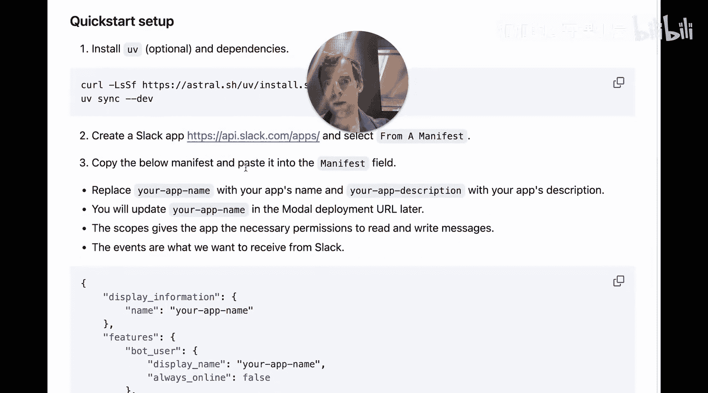

3.  **选择工作区**：连接到你的目标 Slack 工作区（例如，LangChain 的 Slack 账户）。
4.  **使用提供的清单模板**：转到本教程提供的代码仓库，复制我们准备好的清单模板。这个清单会为你的应用设置必要的权限（**作用域**）和**事件订阅**。

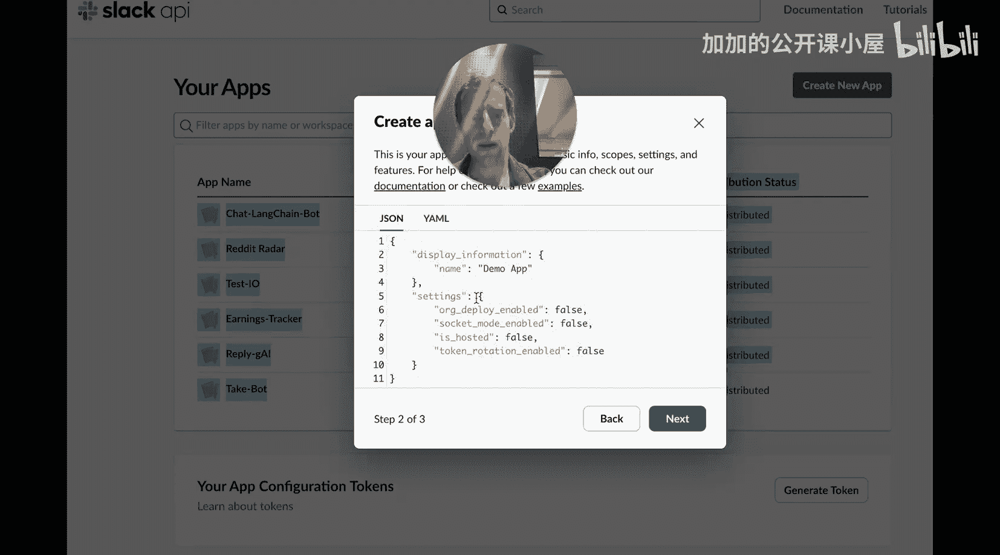

**清单主要配置**：
*   **作用域**：授予应用读取和写入消息的权限。
*   **事件订阅**：定义应用将从 Slack 接收哪些事件。

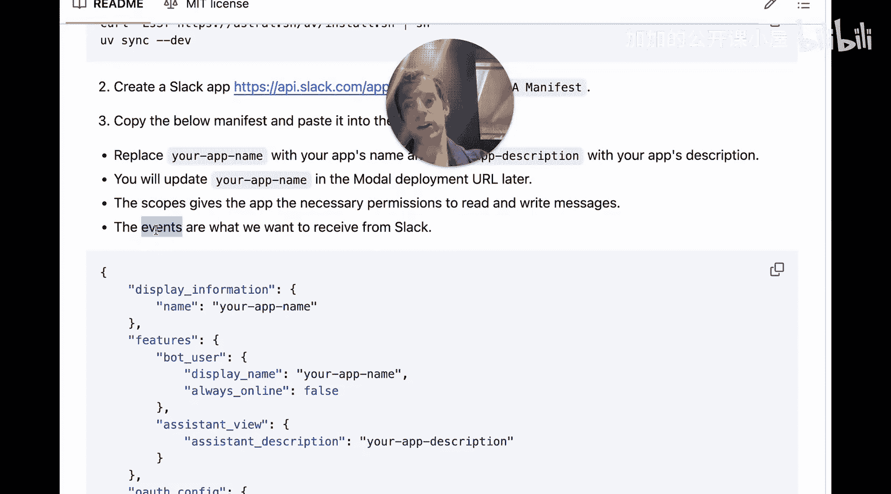


5.  **粘贴并修改清单**：将复制的清单粘贴到 Slack 的配置页面。你需要修改：
    *   应用名称。
    *   应用描述。
    *   **请求 URL**（稍后设置，现在可以先留空）。

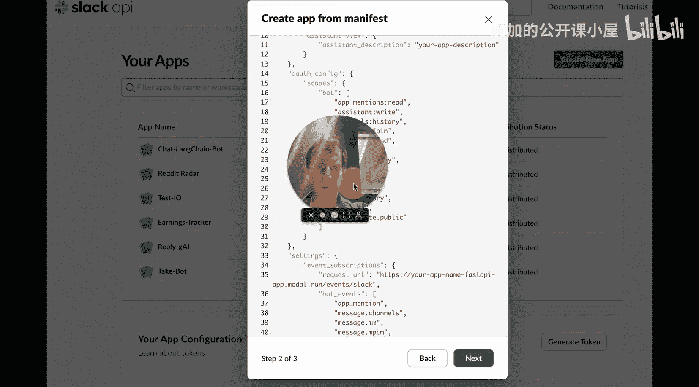


6.  **安装应用到工作区**：完成清单配置后，向下滚动到“OAuth & Permissions”部分，点击“**Install to Workspace**”。安装完成后，你会获得一个 **Bot User OAuth Token**。


7.  **获取签名密钥**：在“Basic Information”页面，找到“**Signing Secret**”并复制它。


至此，你获得了两个关键凭证：
*   **`SLACK_BOT_TOKEN`**：用于你的机器人向 Slack 发起 API 调用的身份验证。
*   **`SLACK_SIGNING_SECRET`**：用于验证从 Slack 发送到你服务器的请求。

### 第二步：配置环境变量
现在，我们需要将这些凭证和 LangChain 部署的信息保存到环境变量文件中。

1.  **查看示例文件**：在代码仓库中，找到 `.env.example` 文件。
2.  **创建并填充 `.env` 文件**：将其复制为 `.env` 文件，并填入你的凭证。

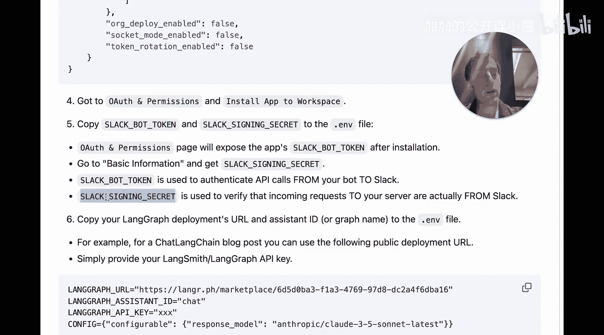

**`.env` 文件内容示例**：
```bash
# 来自 Slack 的配置
SLACK_SIGNING_SECRET=your_signing_secret_here
SLACK_BOT_TOKEN=your_bot_token_here

# 来自 LangGraph/LangSmith 的配置
LANGGRAPH_API_KEY=your_langsmith_api_key_here
LANGGRAPH_URL=https://your-langgraph-deployment-url.here
ASSISTANT_ID=your_assistant_id_here
```
*   `LANGGRAPH_URL` 和 `ASSISTANT_ID` 是你的 LangChain 应用部署的地址和助手 ID。
*   `LANGGRAPH_API_KEY` 是你的 LangSmith 或 LangGraph API 密钥。

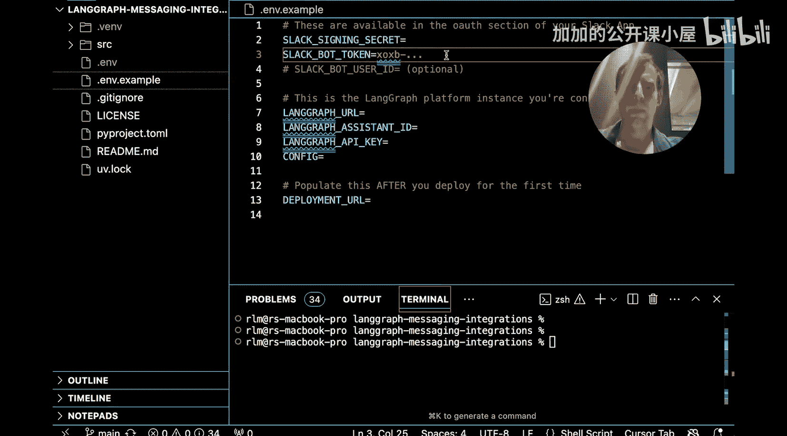

**快捷方式**：本教程的仓库提供了一个公开的 Chat-LangChain 部署链接。你可以直接使用这个链接，只需提供你自己的 LangSmith API 密钥即可与 Chat-LangChain 交互。

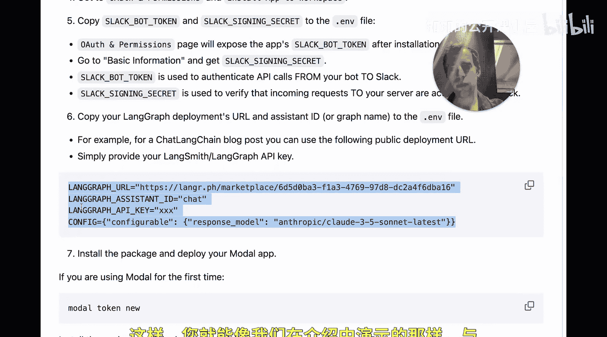

### 第三步：设置 Modal 服务器
Modal 服务器将充当 Slack 和你的 LangChain 应用之间的中间层。

1.  **安装 Modal**：如果你是第一次使用 Modal，请通过 pip 安装：`pip install modal`。
2.  **设置 Modal Token**：运行 `modal token new` 来设置你的 Modal 令牌。
3.  **安装依赖并部署**：在代码仓库目录下，安装所需包，然后部署 Modal 应用。


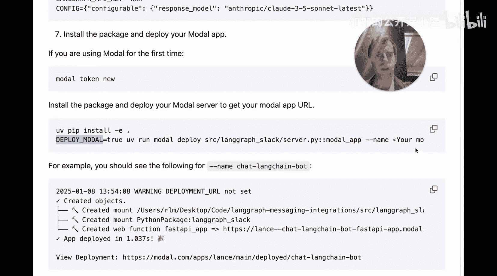

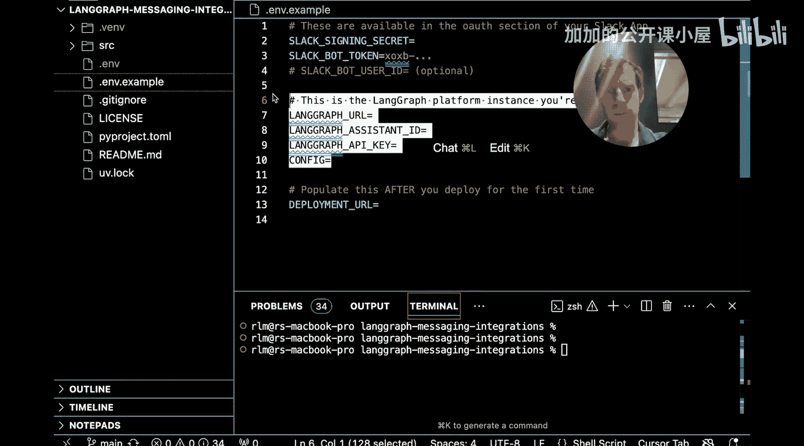

4.  **启动应用**：确保你的 `.env` 文件已正确填充所有密钥和 LangGraph URL。运行部署命令（例如 `modal deploy app.py`）来启动你的 Modal 应用。

如果部署成功，你将获得一个 **Modal 服务器的 URL**。


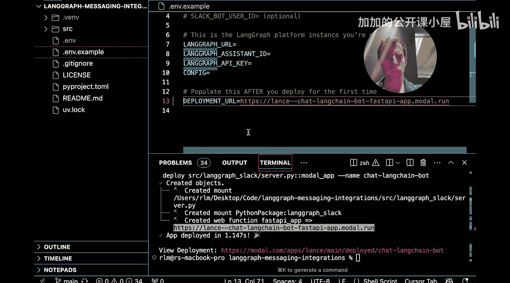

### 第四步：完成 Slack 应用配置
最后一步是告诉 Slack 应用将事件发送到哪里。


1.  **回到 Slack 应用配置页面**：进入“Event Subscriptions”设置。
2.  **设置请求 URL**：将你获得的 **Modal 服务器 URL**（并附加上 `/events` 等特定端点路径）粘贴到“Request URL”字段中。清单已经为你预设了要订阅的事件，所以你只需要提供这个 URL 即可。

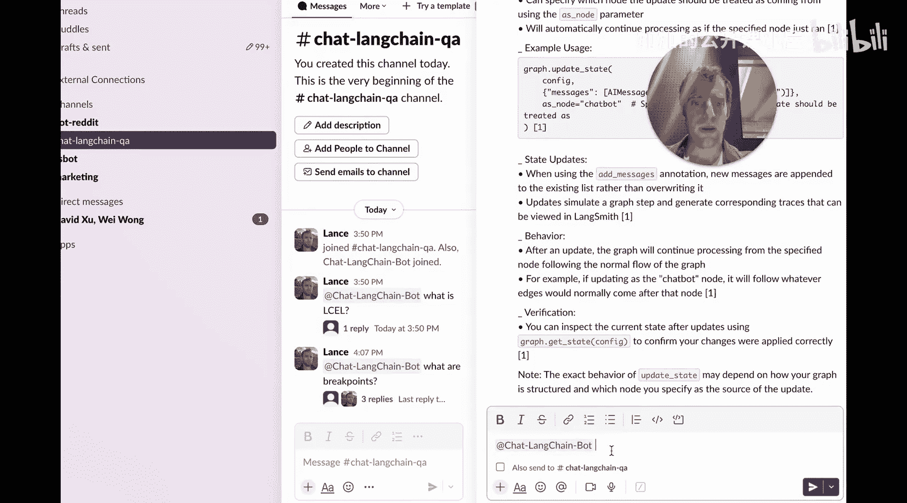

3.  **保存更改**。

## 测试与使用 🎉
现在，所有配置都已完成。回到你的 Slack 工作区，你应该能看到你刚添加的“Chat LangChain Bot”应用。在任意频道或对话中 @ 它并提问，它就会从 LangChain 文档中获取信息并回复你。

---

## 总结
在本节课中，我们一起学习了如何将 Chat-LangChain 集成到 Slack。我们主要完成了以下几步：
1.  **设置 Slack 应用**：通过清单模板快速创建并配置了应用权限和事件订阅。
2.  **准备 LangChain 部署**：配置了环境变量，连接至 Chat-LangChain 服务或你自己的 LangChain 应用。
3.  **部署中间层服务器**：使用 Modal 搭建了连接 Slack 和 LangChain 应用的桥梁。
4.  **连接所有部分**：将 Modal 服务器的 URL 提供给 Slack 应用，完成最终配置。


现在，你就可以在 Slack 中享受便捷的文档问答助手服务了。