#  053：理解并有效使用 AI 推理模型 🧠

在本节课中，我们将要学习 AI 推理模型（如 OpenAI 的 o1 和 o3）的工作原理、它们与以往模型范式的区别，以及如何有效地使用它们。我们将从基础概念开始，逐步深入到实际应用和提示技巧。

## 当前范式：下一个词预测

上一节我们介绍了课程概述，本节中我们来看看当前主流的模型训练范式。多年来，我们一直处于“下一个词预测”的范式之中。Jason Way 对此有精彩的论述，他很好地解释了为什么下一个词预测如此有效。

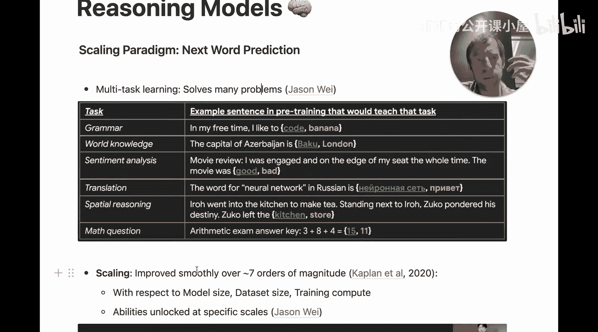

本质上，下一个词预测是一个**多任务学习问题**。当你要求一个语言模型预测句子中的下一个词或下一个标记时，它同时学习了许多东西：语法、世界知识、情感、翻译、空间推理、数学等。这个简单的学习目标极其强大，有许多优秀的论文和演讲都讨论了这一点。

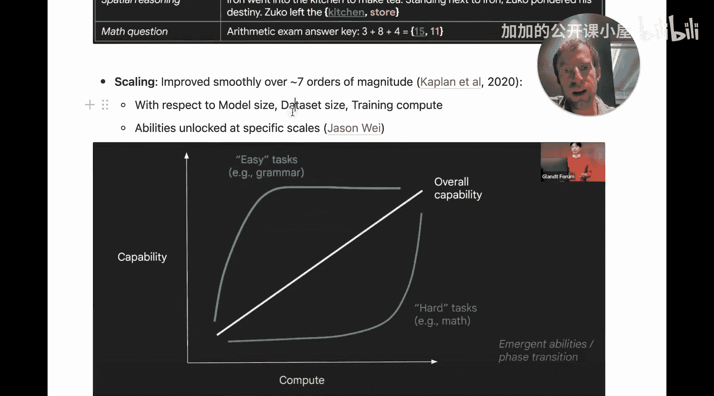

这个范式已经在大约七个数量级的规模上进行了扩展。随着模型大小、数据集大小和训练计算量的增加，仅使用这种简单目标训练的模型的整体能力变得更好。

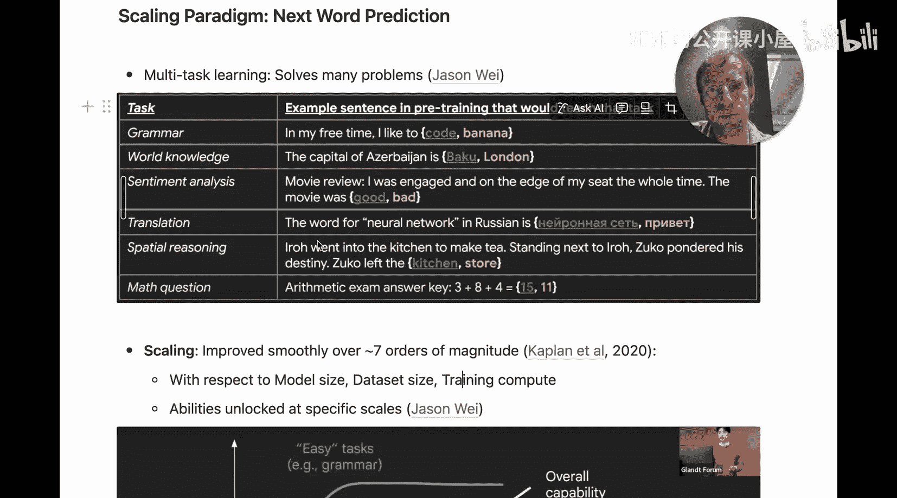

这里有一些与“涌现”概念相关的有趣观点。某些能力似乎在特定规模下被解锁，例如，GPT-2 和 GPT-3 报告了更强的数学能力。但总体而言，你可以认为模型能力随着模型、数据集和训练计算量的增加，以相对可预测的方式增长。这就是我们一直所处的范式。

## 局限性与解决方案：思维链

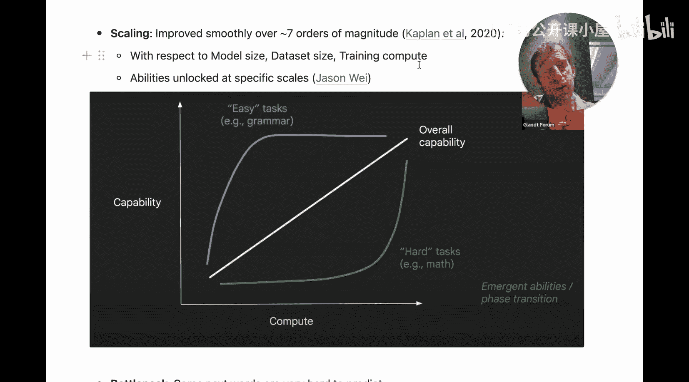

然而，这里存在一个关键问题。下一个词预测类似于**系统1思维**，它是快速且直觉的。但有些“下一个词”真的很难预测，例如一个具有挑战性的数学问题或推理问题。问题在于，这些模型使用相同的计算量来解决简单和困难的问题，这成为了该范式的整体瓶颈。

此时，我们可能都熟悉一个变通方法：**思维链提示**。这个概念大约在 2022 年出现。其核心是提示模型“逐步思考”。但这里真正发生的是，你试图强制执行**系统2思维**，即有意识且深思熟虑的思维。

例如，当你自己解决一个数学问题时，你会执行一系列中间步骤。这些步骤为你自己存储了中间变量，然后你利用它们来生成最终解决方案。思维链提示强制模型在其通往解决方案的轨迹上产生这些中间步骤作为标记。通过告诉它逐步思考，你实际上让它以标记的形式产生“工作”，这些标记存储了模型用来形成最终答案的中间信息。这就像一种“技巧”，迫使模型从系统1思维转向系统2思维。

## 新范式：基于思维链的强化学习缩放

现在，我们来看看这些推理模型所代表的新缩放范式。这基本上是在思维链上进行**强化学习缩放**。

以下是实际发生的过程的总结：
1.  你有一些包含**明确正确答案**的训练数据（例如可验证的编程问题、数学问题）。
2.  你有一个有时能生成正确解决方案的模型。
3.  你有一个可以验证模型输出是否正确的“评分器”。
4.  如果输出正确，你就给模型一个**奖励**。
5.  通过**强化学习**，一个策略会调整模型权重，使其更有可能产生高奖励的输出。

在训练过程中，对于每个问题，你让模型产生大量解决方案轨迹，对它们全部评分，并奖励正确的轨迹。随着时间的推移，通过大量的前向传播，你调整或推动模型倾向于那些能得出可验证正确答案的思维链或轨迹。这就是总体的直觉理解。

## 为何令人兴奋：新的缩放定律与基准饱和

为什么这令人兴奋？首先，它代表了一种**新的缩放定律**。观察 o1 和最近发布的 o3 的结果，它们显然非常强大。

另一种思考方式是，基准测试正以越来越快的速度达到饱和。下图展示了基准测试达到饱和所需的时间：在 2012 年可能需要八年，而现在对于像 GPQA（一个由 David Ra 创建的、不易通过谷歌搜索找到答案的新基准）这样的新基准，可能只需要一年。我们看到，新的最先进的推理模型正在非常快速地使基准测试达到饱和。这表明我们正处于缩放曲线的早期阶段，潜力巨大。

## 如何有效提示：关注“做什么”，而非“怎么做”

现在，事情变得非常有趣。关于 o1 模型实际上存在很多困惑，有些人说它们表现不佳。Ben Hyla 和 Swyx 在 Latent Space 上发表了一篇非常棒的文章，有助于澄清这一点。

**当你使用这些推理模型时，不应将它们视为聊天模型，也不应像提示聊天模型那样提示它们。**

以下是提示这些模型的核心原则：**关注“做什么”，而不是“怎么做”**。不要告诉它如何思考，告诉它你想要什么。你给它一个明确的目标、返回格式的警告，并直接“倾倒”所有你需要它处理的工作内容。许多人都展示了这种提示风格对 o1 非常有效。

与聊天模型（你可能会说“你是一名研究员，请逐步思考”）不同，对于这些模型，你不这样做。你只需告诉它你想要什么，并尽可能提供上下文。这就是提示这些模型的核心理念。

## 实际使用与核心功能

现在让我快速展示一下如何使用。首先，通过 API 可用的模型有 `o1` 和 `o1-mini`。需要注意的是，`o1-mini` 不支持系统消息。

对于 `o1`（不是 `o1-mini`），你可以提供 `reasoning_effort` 参数，值为 `low`、`medium` 或 `high`。这可以调节模型进行推理的程度，相应地影响响应速度和生成的标记数量。

### 高质量报告生成

以下是如何使用 LangChain 调用 `o1` 模型生成高质量报告的示例。注意提示方式：我告诉它我想要什么（一份关于高胆固醇病因与缓解的教育报告），告诉它我希望如何输出，并提供了我感兴趣的内容。

```python
from langchain_openai import ChatOpenAI

llm = ChatOpenAI(model="o1", reasoning_effort="medium")
prompt = "生成一份关于高胆固醇病因与缓解措施的教育报告。报告应结构清晰，包含引言、主要病因、缓解策略和总结部分。以下是一些相关背景信息：[此处填入你的背景信息]"
response = llm.invoke(prompt)
```

运行后，你会得到一份结构良好、内容详尽的报告。但需要注意的是，**延迟会高于聊天模型**（例如可能需要 27 秒），因为模型进行了大量推理。

### 结构化输出

`o1` 模型支持结构化输出，这是一个非常流行的用例。你可以使用 `with_structured_outputs` 辅助方法，并传入一个模式定义（例如 Pydantic 模式）。

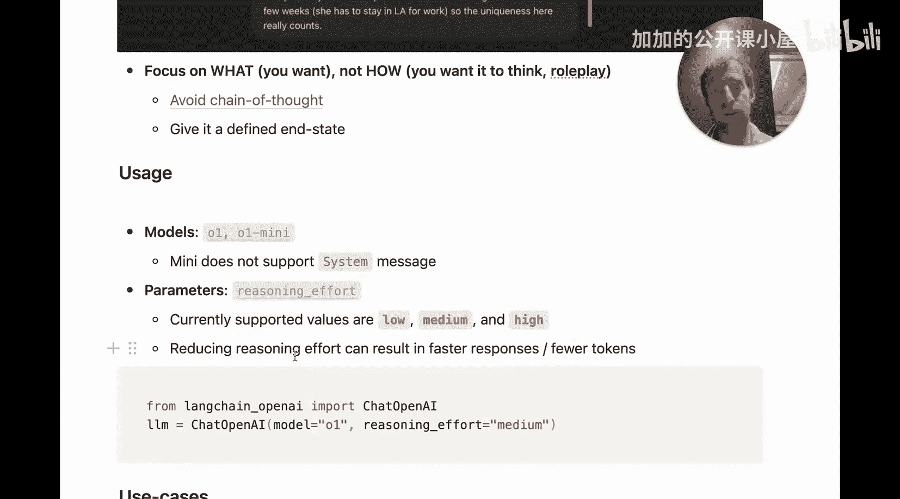

```python
from pydantic import BaseModel
from langchain_core.prompts import ChatPromptTemplate

class ReportSchema(BaseModel):
    title: str
    causes: list[str]
    mitigations: list[str]
    summary: str

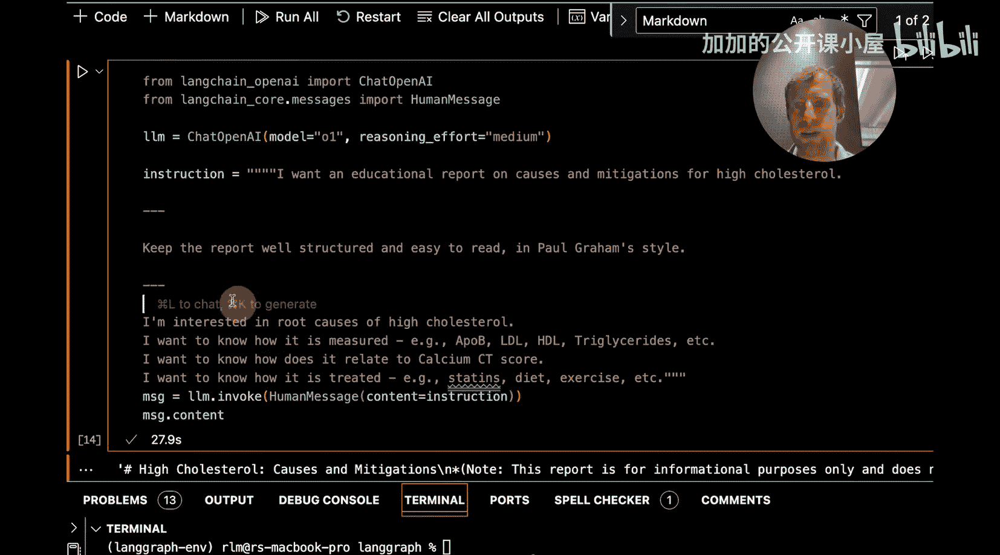

structured_llm = llm.with_structured_outputs(ReportSchema)
result = structured_llm.invoke(prompt)  # result 将是一个 ReportSchema 对象
```

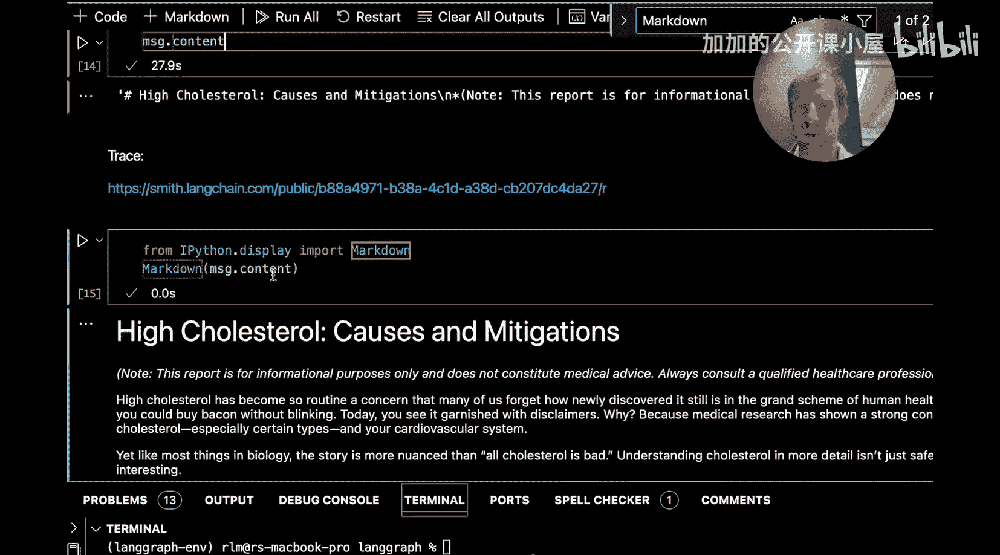

### 工具调用


当然，这些模型也支持工具调用。你可以使用 `bind_tools` 方法绑定工具。

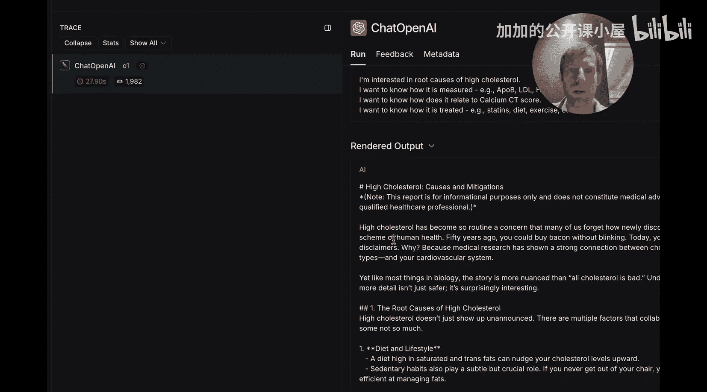

```python
from langchain_core.tools import tool

@tool
def multiply(a: int, b: int) -> int:
    """Multiply two numbers."""
    return a * b

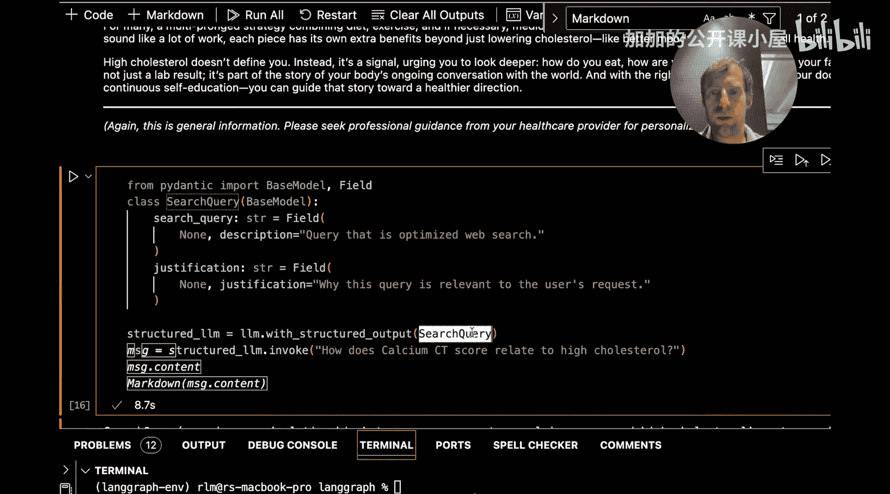

llm_with_tools = llm.bind_tools([multiply])
response = llm_with_tools.invoke("计算 123 乘以 456 是多少？")
# 模型可能会决定调用 multiply 工具
```

## 核心用例

以下是一些适合这些推理模型的用例示例：

1.  **复杂代码生成**：这些模型非常擅长一次性生成整个文件或文件集，解决复杂的编程问题。
2.  **深度分析与报告撰写**：生成详尽、结构严谨的分析报告、研究摘要或教育材料。
3.  **多步骤规划与推理**：处理需要多个逻辑步骤才能解决的任务，如项目规划、复杂决策支持。
4.  **需要可验证输出的任务**：数学问题求解、逻辑谜题、代码调试等，其输出可以被客观验证。

## 总结

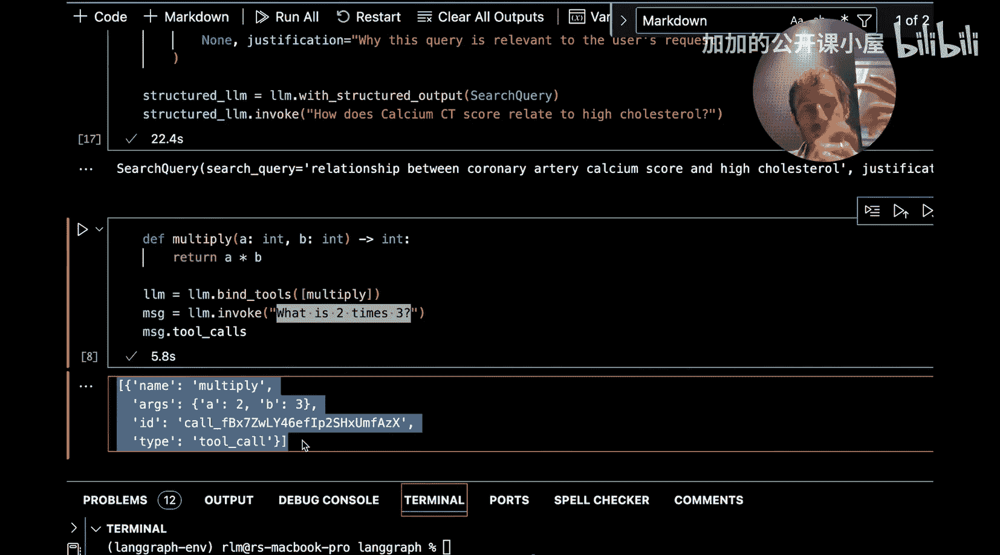

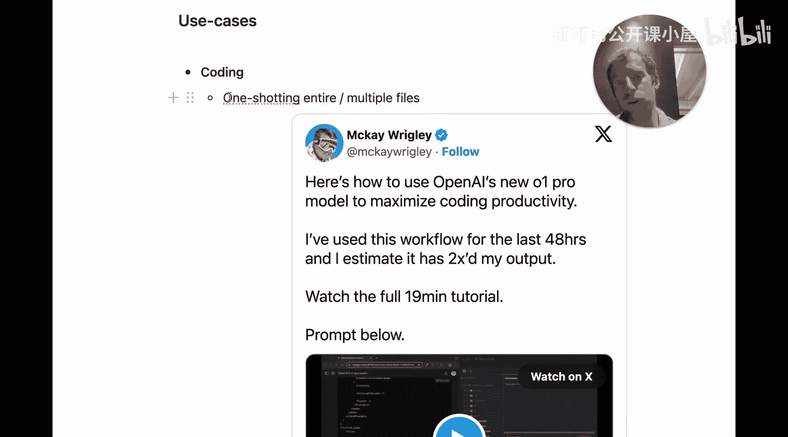

本节课中我们一起学习了 AI 推理模型的核心知识。我们回顾了从“下一个词预测”范式到“基于思维链的强化学习”新范式的演变，理解了思维链如何将模型推向更深思熟虑的“系统2”思维。我们强调了提示这些模型的关键在于**关注“做什么”而非“怎么做”**，并演示了如何使用它们进行高质量报告生成、结构化输出和工具调用。最后，我们探讨了这类模型在复杂代码生成、深度分析等领域的强大应用潜力。理解这些原理和最佳实践，将帮助你更有效地利用像 OpenAI o1/o3 这样的先进推理模型。